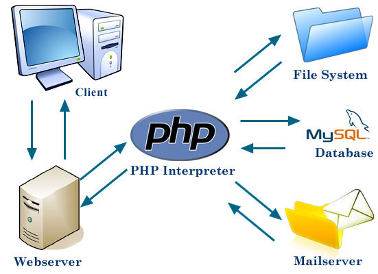
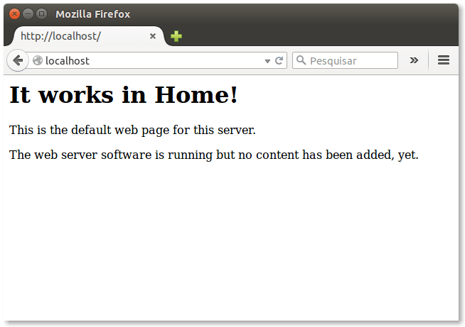
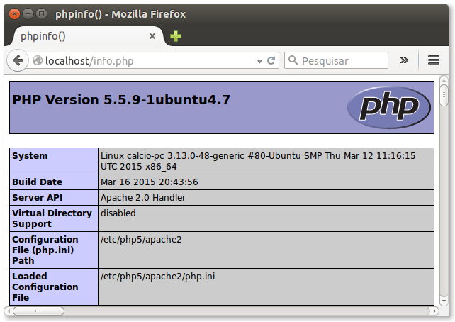

Capítulo 1
==========

O que é o PHP?
--------------

Essa linguagem foi concebida durante o outono de 1994 por Rasmus
Lerdorf. As primeiras versões não foram disponibilizadas, tendo sido
utilizadas em sua home-page apenas para que ele pudesse ter informações
sobre as visitas que estavam sendo feitas. A primeira versão utilizada
por outras pessoas foi disponibilizada em 1995, e ficou conhecida como
“Personal Home Page Tools” (ferramentas para página pessoal). Era
composta por um sistema bastante simples que interpretava algumas macros
e alguns utilitários que rodavam “por trás” das home-pages: um livro de
visitas, um contador e algumas outras coisas.

Diferentemente de algumas linguagens para web, o PHP permite criar sites
web dinâmicos, possibilitando uma interação do usuário com o site,
através de formulários feitos em HTML, parâmetros da URL, links e também
serve para criar aplicações embarcadas, aplicações mobile, de linha de
comando. A diferença entre ela com relação ao JavaScript padrão, por
exemplo, é que o código PHP é executado no servidor, sendo enviado para
o cliente apenas HTML puro e o próprio código JavaScript. Hoje em dia
existe NodeJS rodando JavaScript no servidor. Desta maneira é possível
interagir com bancos de dados e aplicações existentes no servidor, com a
vantagem de não expor o código fonte para o cliente. Outra diferença do
PHP com um script CGI escrito em C ou Perl é que o código PHP fica
embutido no próprio HTML, enquanto no outro caso é necessário que o
script CGI gere todo o código HTML, ou leia de um outro arquivo.

Com o PHP podemos fazer tudo, qualquer coisa feita por algum programa
CGI pode ser feita com PHP, como coletar dados de um formulário, gerar
páginas dinamicamente ou enviar e receber cookies. O PHP também tem como
uma das características mais importantes o suporte a um grande número de
bancos de dados, como dBase, Interbase, Firebird, mSQL, mySQL, Oracle,
Sybase, PostgreSQL e vários outros. Construir uma página baseada em um
banco de dados torna-se uma tarefa extremamente simples com PHP. Além
disso, PHP tem suporte a protocolos como IMAP, SNMP, NNTP, POP3 e,
logicamente, HTTP. Também é possível abrir sockets e interagir com
outros protocolos.

Como funciona o PHP
-------------------

Requisitos do Sistema Operacional
---------------------------------

-   **SO:** Linux, Solaris, MAC OS

-   **Servidores web:** Apache 2, Nginx e o Próprio PHP. Pacotes como
    LAMP, XAMP e alguns outros também podem ser utilizados.

-   **Banco de Dados:** mSQL, SQL Server, MySql/MariaDB, Sybase, Oracle,
    PostgreSQL

**Nota:** Pode-se usar o comando php -S 0.0.0.0:8001 -t caminho/do/site

Instalação e configuração do PHP
--------------------------------

Para instalar o PHP é necessário o PHP, Apache, MySQL e phpMyAdmin. Abra
o terminal (CTRL+T) e rode os comandos abaixo para instalar os pacotes.

**Apache:** \~\$ sudo apt-get install apache2

**MySQL:** \~\$ sudo apt-get install mysql-server e sudo apt-get install
php5-mysqlnd

**PHP:** \~\$ sudo apt-get install php5 php5-curl php5-mcrypt php5-mysql
libapache2-mod-php5

**phpMyAdmin:** \~\$ Apache: sudo apt-get install phpMyAdmin

### Testando o Apache

Abra o browser e digite [http://localhost](http://localhost/).

###  Configurando o Apache

Para podermos criar nossos projetos de uma forma mais fácil e sem
precisar virar root no sistema, vamos cria um diretório em
*/home/seu\_usuario/www.* Todos os seus sites e projetos devem ser
colocados nesse diretório. Finalizando nosso processo, precisamos
modificar o arquivo de configuração do apache apontando para o novo
diretório criado. Abra um terminal (CRTL+T) e rode comando.

\~\$ sudo gedit /etc/apache2/sites-available/000-default.conf

Procure por *DocumentRoot /var/www/html* e comente a linha colocando o
sinal tralha na frente da linha. Adicione *DocumentRoot
/home/seu\_usuario/www/*

### Testando o PHP

Crie um arquivo chamado *info.php.*

1.  &lt;?php phpinfo();

2.  

Salve em */home/seu\_usuario/www/*, no browser digite
[*http://localhost/info.php*](http://localhost/info.php).

**Nota:** É recomendado por questões de segurança que arquivos que sejam
somente PHP, não tenha a tag de fechamento e que contenha a última linha
em branco.

### \
Testando o phpMyAdmin

Abra o browser e digite
[*http://localhost/phpMyAdmin*](http://localhost/phpmyadmin) e acesse-o
com o login e senha definidos na instalação do MySQL.

###  Configurando PHP

Localizar e modificar o arquivo *php.ini*. Esse arquivo pode estar em
local diferente dependendo da distribuição GNU/Linux que está usando. No
Ubuntu e nas distribuições “Debian like”, esse arquivo encontra-se em
*/etc/php5/apache2/php.ini*. Após as modificações é necessário reiniciar
seu servidor PHP como por exemplo o Apache, para reiniciar o Apache pode
se usar o comando *sudo service apache2 restart*.

Para o ambiente de desenvolvimento é altamente recomendado habilitar as
seguintes diretrizes:

-   error\_reporting = E\_ALL

-   display\_errors = On

-   log\_errors = On

-   track\_errors = On

-   html\_errors = On

As diretrizes acima fazem que quais quer tipo de erro seja exibido,
logado, rastreado e exibido de uma forma mais organizada. Essas
configurações devem ser diferentes no ambiente de produção (onde o site
é de fato hospedado), isso por que os usuários devem receber mensagens
de erros amigáveis, e na tentativa de algum craker ou algum script kid
querer explorar alguma falha no site, o erro não de para ele de bandeja
uma mensagem de erro com o nome e campos de alguma tabela do seu banco
de dados.

**Nota:** Se usar uma distribuição diferente do Ubuntu nada que uma
pesquisada na internet para descobrir o comando certo.

Entendendo o PHP
----------------

### Sintaxe

O código do PHP pode ficar embutido no contexto do HTML, porém em muitos
casos perceberá que esses códigos são bem simples e não contém regras de
negócios ou estruturas muito complexas, ou seja, se limita somente a
exibição de dados, estruturas de laços e condições simples.

Para estruturas complexas e longas usa-se *&lt;?php algum código;
?&gt;*, para exibir conteúdo na tela utilizar *&lt;?= \$variavel;
?&gt;*.

**ATENÇÃO:** Em códigos legados e/ou em código cujo a versão do PHP seja
inferior a 5.4.x ou que não seguem as recomendações de padronização é
comum encontrar a sintaxe sendo usada da seguinte forma:

  ---------------------------------------------------------------------------
  &lt;? comandos ?&gt;              Não recomendado
  --------------------------------- -----------------------------------------
  &lt;script language=“php”&gt;     Não recomendado
                                    
  comandos                          
                                    
  &lt;/script&gt;                   

  &lt;% comandos %&gt;              Não recomendado

  &lt;?php echo \$variavel; ?&gt;   Ainda utilizado, mas não é recomendado.
  ---------------------------------------------------------------------------

É altamente recomendado o não fechamento da tag PHP e deixar uma linha
em branco no fim do arquivo sem espaços[^1]

### Finalização de comando

Entre cada instrução em PHP é preciso utilizar o ponto e vírgula, assim
como em Pascal, C, Perl e outras linguagens mais conhecidas.

### Variáveis

Toda variável em PHP tem seu nome composto pelo caracter \$ e o nome da
variável, que deve iniciar sempre por uma letra ou o caracter “\_”. PHP
é case sensitive, ou seja, as variáveis *\$quantidade* e *\$Quantidade*
são diferentes. Por isso é preciso ter muito cuidado ao definir os nomes
das variáveis. É bom evitar os nomes em maiúsculas, pois como veremos
mais adiante, o PHP já possui alguma variável pré-definidas cujos nomes
são formados por letras maiúsculas.

Não há um padrão para nomes de variáveis podemos criar algo como
\$teste\_valor ou \$testeValor desde que a aplicação inteira use o mesmo
padrão. Particurlamente em caso de nome composto eué recomendado o
padrão camelCase. *\$matriculaUsuario*, *\$valorTotal*, etc, pois esse é
o padrão adotado nos argumentos de funções e métodos de classes.

### Tipos de variáveis

-   Inteiro

-   Array

-   Objeto

-   String

-   Ponto flutuante

-   Boolean

### Constantes

Constantes são um tipo especial para armazenar valores fixos, diferentes
de variáveis que podem ter seus valores alterados ao decorrer do script.
No PHP uma constante é definida com caracteres em maiúsculo.

*define('FILE\_READ\_MODE', 0644);*

Primeiros passos com PHP
------------------------

Crie um diretório chamado */home/seu\_usuario/www/cap1*.

1.  &lt;!DOCTYPE html&gt;

2.  &lt;html&gt;

3.  &lt;head&gt;

4.  &lt;meta charset="UTF-8"&gt;

5.  &lt;title&gt;Curso PHP Básico do Jeito Certo&lt;/title&gt;

6.  &lt;/head&gt;

7.  &lt;body&gt;

8.  &lt;?= "Bem-vindo ao PHP"; ?&gt;

9.  &lt;/body&gt;

10. &lt;/html&gt;

Salve em */home/seu\_usuario/www/PHPBasico/Cap1/exemplo1.php*, no
browser digite
[*http://localhost/*](http://localhost/PHPBasico/Cap1/exemplo1.php)[*PHPBasico*](http://localhost/PHPBasico/Cap1/exemplo1.php)[*/*](http://localhost/PHPBasico/Cap1/exemplo1.php)[*Cap1*](http://localhost/PHPBasico/Cap1/exemplo1.php)[*/*](http://localhost/PHPBasico/Cap1/exemplo1.php)[*exemplo1*](http://localhost/PHPBasico/Cap1/exemplo1.php)[*.php*](http://localhost/PHPBasico/Cap1/exemplo1.php).

Vimos agora um exemplo prático de um script PHP rodando no navegador com
TAGs HTML 5. Iremos agora modificar o arquivo criado acima e implementar
os conceitos aprendidos nos tópicos já aprendidos.

**Nota:** Nos arquivos PHP que forem usados para exibição do HTML como
no exemplo acima é recomendado o uso da tag, &lt;?= ?&gt; ao invés da
tag &lt;?php echo ?&gt;

1.  &lt;!DOCTYPE html&gt;

2.  &lt;html&gt;

3.  &lt;head&gt;

4.  &lt;meta charset="UTF-8"&gt;

5.  &lt;title&gt;Curso Básico - PHP do Jeito Certo&lt;/title&gt;

6.  &lt;/head&gt;

7.  &lt;body&gt;

8.  &lt;?= '&lt;h1&gt;Bem-vindo ao PHP&lt;/h1&gt;';

9.  echo '&lt;h2&gt;Variáveis e Constantes&lt;/h2&gt;';

10. //Isso é um comentário de uma linha

11. //vamos estudar agora as variáveis

12. \$nome = 'Anna Clara'; //Variável tipo string

13. \$sobrenome = 'Da Fonseca'; //Variável tipo string

14. \$idade = 33; //Variável tipo integer

15. \$altura = 1.69; //Variável tipo float

16. \$genteFina = true; //Variável tipo boolean

17. 18. /\* Comentário em bloco muito usado para grandes descrições

19. \* Exibindo o resultado no navegador

20. \*/

21. echo \$nome . '&lt;br /&gt;';

22. echo \$sobrenome . '&lt;br /&gt;';

23. echo \$idade . "&lt;br /&gt;";

24. echo \$altura . '&lt;br /&gt;';

25. echo \$genteFina . '&lt;br /&gt;&lt;br /&gt;'; //Esse 1 representa
    um true (verdadeiro)

26. 27. //Agrupando as variáveis em um texto

28. echo 'Olá meu nome é ' . \$nome . ' ' . \$sobrenome . '. &lt;br
    /&gt;';

29. echo 'Tenho ' . \$idade . ' anos e minha altura é ' . \$altura .
    'm&lt;br /&gt;&lt;hr /&gt;';

30. 31. //Constantes

32. define('SO', 'GNU/Linux Ubuntu'); //definindo uma constante

33. define('FERRAMENTAS\_ESCRITORIO', 'LibreOffice');

34. 35. echo 'Eu uso ' . SO . ' com ' . FERRAMENTAS\_ESCRITORIO;

36. echo '&lt;br /&gt; O Valor de PI é: ' . M\_PI //Constante Interna do
    PHP

37. ?&gt;

38. &lt;/body&gt;

39. &lt;/html&gt;

Salve o arquivo e atualize o browser para ver o resultado.

Dando continuidade à sintaxe básica do PHP, veremos agora como trabalhar
com os arrays. Eles são de suma importância para os desenvolvedores de
qualquer linguagem. Com ele podemos agrupar várias informações em uma
única variável. Também muito útil para agrupar valores de um mesmo
contexto.

1.  &lt;!DOCTYPE html&gt;

2.  &lt;html&gt;

3.  &lt;head&gt;

4.  &lt;meta charset="UTF-8"&gt;

5.  &lt;title&gt;Curso Básico - PHP do Jeito Certo&lt;/title&gt;

6.  &lt;/head&gt;

7.  &lt;body&gt;

8.  &lt;?php

9.  echo '&lt;h1&gt;Exemplo 2&lt;/h2&gt;

10. &lt;h2&gt;Arrays Simples&lt;/h2&gt;';

11. 12. //Array simples com indice automático

13. \$frutas = array('Goiaba', 'Jaca', 'Uva', 'Cacau');

14. echo '&lt;pre&gt;';

15. print\_r(\$frutas);

16. echo '&lt;/pre&gt;';

17. //Array simples com indice manual

18. \$frutas = array(3 =&gt; 'Goiaba', 6 =&gt; 'Jaca', 1 =&gt; 'Uva', 4
    =&gt; 'Cacau');

19. echo '&lt;pre&gt;';

20. print\_r(\$frutas);

21. echo '&lt;/pre&gt;';

22. echo 'Exibindo um elemento do array \$frutas ' . \$frutas\[6\] .
    '&lt;br /&gt;';

23. //Outra forma de se montar um array

24. \$marcaCarro\[0\] = 'BMW';

25. \$marcaCarro\[1\] = 'Mercedes';

26. \$marcaCarro\[2\] = 'Porche';

27. echo '&lt;pre&gt;';

28. print\_r(\$marcaCarro);

29. echo '&lt;/pre&gt;';

30. echo 'Exibindo um elemento do array \$marcaCarro ' .
    \$marcaCarro\[0\] . '&lt;br /&gt;';

31. ?&gt;

32. &lt;/body&gt;

33. &lt;/html&gt;

Salve em
*/home/seu\_usuario/www/PHPBasico/Cap1/exemplo2.php*, no browser digite
[*http://localhost/*](http://localhost/PHPBasico/Cap1/exemplo2.php)[*PHPBasico*](http://localhost/PHPBasico/Cap1/exemplo2.php)[*/*](http://localhost/PHPBasico/Cap1/exemplo2.php)[*Cap1*](http://localhost/PHPBasico/Cap1/exemplo2.php)[*/exemplo*](http://localhost/PHPBasico/Cap1/exemplo2.php)[*2*](http://localhost/PHPBasico/Cap1/exemplo2.php)[*.php*](http://localhost/PHPBasico/Cap1/exemplo2.php).

1.  &lt;!DOCTYPE html&gt;

2.  &lt;html&gt;

3.  &lt;head&gt;

4.  &lt;meta charset="UTF-8"&gt;

5.  &lt;title&gt;Curso Básico - PHP do Jeito Certo&lt;/title&gt;

6.  &lt;/head&gt;

7.  &lt;body&gt;

8.  &lt;?php

9.  echo '&lt;h1&gt;Exemplo 3&lt;/h2&gt;

10. &lt;h2&gt;Arrays Matriz&lt;/h2&gt;';

11. 12. \$compras = array(

13. 'semana1' =&gt; array(

14. 'item1' =&gt; array(

15. 'produto' =&gt; 'Maça',

16. 'valor' =&gt; 5.87,

17. 'peso' =&gt; '1kg',

18. ),

19. 'item2' =&gt; array(

20. 'produto' =&gt; 'Feijão',

21. 'valor' =&gt; 3.77,

22. 'peso' =&gt; '1kg',

23. ),

24. ),

25. 'semana2' =&gt; array(

26. 'item1' =&gt; array(

27. 'produto' =&gt; 'Arroz',

28. 'valor' =&gt; 7.27,

29. 'peso' =&gt; '5kg',

30. ),

31. 'item2' =&gt; array(

32. 'produto' =&gt; 'Feijão',

33. 'valor' =&gt; 3.77,

34. 'peso' =&gt; '1kg',

35. ),

36. 'item3' =&gt; array(

37. 'produto' =&gt; 'Farinha',

38. 'valor' =&gt; 2.01,

39. 'peso' =&gt; '1kg',

40. ),

41. ),

42. );

43. 44. //Exibindo todos os elementos do Array

45. echo '&lt;pre&gt;';

46. print\_r(\$compras);

47. echo '&lt;/pre&gt;';

48. 49. //exibindo semana1

50. echo '&lt;pre&gt;';

51. print\_r(\$compras\['semana1'\]);

52. echo '&lt;/pre&gt;';

53. 54. //exibindo semana1 e o item2

55. echo '&lt;pre&gt;';

56. print\_r(\$compras\['semana1'\]\['item2'\]);

57. echo '&lt;/pre&gt;';

58. 59. //exibindo individualmente o produto farinha

60. echo 'Hoje eu comprei ' .
    \$compras\['semana2'\]\['item3'\]\['produto'\];

61. ?&gt;

62. &lt;/body&gt;

63. &lt;/html&gt;

Salve em */home/seu\_usuario/www/PHPBasico/Cap1/exemplo3.php*, no
browser digite
[*http://localhost/*](http://localhost/PHPBasico/Cap1/exemplo3.php)[*PHPBasico*](http://localhost/PHPBasico/Cap1/exemplo3.php)[*/*](http://localhost/PHPBasico/Cap1/exemplo3.php)[*Cap1*](http://localhost/PHPBasico/Cap1/exemplo3.php)[*/exemplo*](http://localhost/PHPBasico/Cap1/exemplo3.php)[*3*](http://localhost/PHPBasico/Cap1/exemplo3.php)[*.php*](http://localhost/PHPBasico/Cap1/exemplo3.php).

1.  &lt;!DOCTYPE html&gt;

2.  &lt;html&gt;

3.  &lt;head&gt;

4.  &lt;meta charset="UTF-8"&gt;

5.  &lt;title&gt;Curso Básico - PHP do Jeito Certo&lt;/title&gt;

6.  &lt;/head&gt;

7.  &lt;body&gt;

8.  &lt;?php

9.  echo '&lt;h1&gt;Exemplo 4&lt;/h2&gt;

10. &lt;h2&gt;Arrays Matriz&lt;/h2&gt;';

11. 12. \$compras = \[

13. 'semana1' =&gt; \[

14. 'item1' =&gt; \[

15. 'produto' =&gt; 'Maça',

16. 'valor' =&gt; 5.87,

17. 'peso' =&gt; '1kg',

18. \],

19. 'item2' =&gt; \[

20. 'produto' =&gt; 'Feijão',

21. 'valor' =&gt; 3.77,

22. 'peso' =&gt; '1kg',

23. \],

24. \],

25. 'semana2' =&gt; \[

26. 'item1' =&gt; \[

27. 'produto' =&gt; 'Arroz',

28. 'valor' =&gt; 7.27,

29. 'peso' =&gt; '5kg',

30. \],

31. 'item2' =&gt; \[

32. 'produto' =&gt; 'Feijão',

33. 'valor' =&gt; 3.77,

34. 'peso' =&gt; '1kg',

35. \],

36. 'item3' =&gt; \[

37. 'produto' =&gt; 'Farinha',

38. 'valor' =&gt; 2.01,

39. 'peso' =&gt; '1kg',

40. \],

41. \],

42. \];

43. 44. //Exibindo todos os elementos do Array

45. echo '&lt;pre&gt;';

46. print\_r(\$compras);

47. echo '&lt;/pre&gt;';

48. 49. //exibindo semana1

50. echo '&lt;pre&gt;';

51. print\_r(\$compras\['semana1'\]);

52. echo '&lt;/pre&gt;';

53. 54. //exibindo semana1 e o item2

55. echo '&lt;pre&gt;';

56. print\_r(\$compras\['semana1'\]\['item2'\]);

57. echo '&lt;/pre&gt;';

58. 59. //exibindo individualmente o produto farinha

60. echo 'Hoje eu comprei ' .
    \$compras\['semana2'\]\['item3'\]\['produto'\];

61. ?&gt;

62. &lt;/body&gt;

63. &lt;/html&gt;

Salve em */home/seu\_usuario/www/PHPBasico/Cap1/exemplo4.php*, no
browser digite
[*http://localhost/*](http://localhost/PHPBasico/Cap1/exemplo4.php)[*PHPBasico*](http://localhost/PHPBasico/Cap1/exemplo4.php)[*/*](http://localhost/PHPBasico/Cap1/exemplo4.php)[*Cap1*](http://localhost/PHPBasico/Cap1/exemplo4.php)[*/exemplo*](http://localhost/PHPBasico/Cap1/exemplo4.php)[*4*](http://localhost/PHPBasico/Cap1/exemplo4.php)[*.php*](http://localhost/PHPBasico/Cap1/exemplo4.php).

**Nota:** Esse último exemplo mostra como os arrays estão sendo
utilizados principalmente nas versões mais novas do PHP e também é um
tipo de notação que vem sendo adotadas em frameworks.

Referências
-----------

Arrays em php é um assunto muito vasto, existem muitas funções internas
do php só para tratamento de arrays. Conheça essas funções do php em:
**http://php.net/manual/pt\_BR/book.array.php**

Resumo do capítulo
------------------

Nesse capítulo aprendemos o básico do básico no PHP. Como criar e
manipular variáveis do tipo string, boolean, integer e arrays, criar e
usar constantes, comentários simples e em blocos, concatenamos o texto
com variáveis com o operador '.' (ponto).

Exercícios
----------

1.  Crie um array simples contendo 7 animais selvagem e exiba na tela
    cada item com seu respectivo índice;

2.  Crie um array simples contendo 5 animais domésticos e exiba na tela
    cada item com seu respectivo índice;

3.  Crie uma matriz chamado animais dividindo em animais domésticos e
    selvagens, para facilitar pode atribuir os dois arrays simples
    criados nos itens anteriores. Exiba na tela um texto contendo, “meu
    animal selvagem favorito é: ” e “meu animal doméstico favorito é: ”
    e escolha um de sua preferência.
