Capítulo 11
===========

Chegamos a etapa final do nosso curso, o projeto final. Nessa fase
criaremos uma aplicação do início ao fim com todos os recursos
aprendidos durante o curso e claro alguns bônus como, organização dos
diretórios e arquivos, HTML5, Twitter Bootstrap com CSS3, JavaScript e
jQuery.

O Sistema
---------

O sistema trata de um registro de atividades onde um usuário estando
logado e autenticado selecionará a pessoa que fez a solicitação
(demandante) o setor dessa empresa, colocará um título, uma pequena
descrição do atendimento, a data da solicitação e quanto tempo levou
para resolver o chamado.

Apesar de parecer simples, há muito código a ser escrito, muitas
validações e refatorações a serem feitas.

Estrutura de diretórios do projeto
----------------------------------

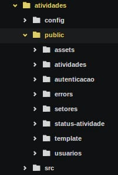
------------------------------------------------------------------------------------

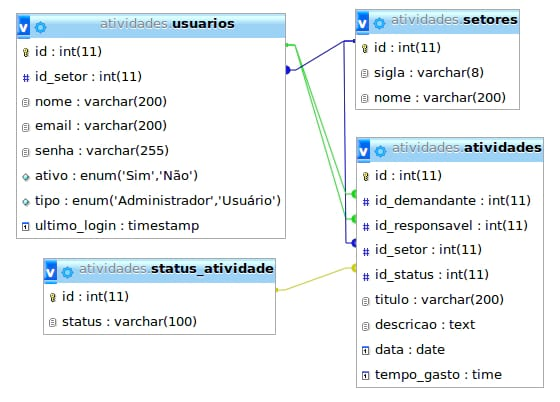Banco de Dados
-------------------------------------------------------------------------------------------------

Baixando Frameworks de JavaScript e CSS
---------------------------------------

Fazendo download do framework de CSS twitter bootstrap, normalize e do
framework de JavaScript jQuery e criando nosso index.php.

**Twitter bootstrap:** http://getbootstrap.com/

Baixe a opção que diz: “*Compiled and minified CSS, JavaScript, and
fonts. No docs or original source files are included.*”. Salve no
diretório '*atividades' (Raiz do projeto).*

Descompacte o zip de acordo com tipo de arquivo. Por exemplo, os
arquivos CSS descompactar em *atividades/public/assets/css*. Após
descompactar os arquivos nos devidos lugares, apague o arquivo .zip.
Pois não vamos mais precisar dele.

**Bootstrap date time piker:**
https://github.com/Eonasdan/bootstrap-datetimepicker/tree/master/build/css,
clique em bootstrap-datetimepicker.min.css, clique no botão **Raw**,
copie todo o conteúdo, crie um arquivo chamado
*bootstrap-datetimepicker.min.css* em *atividades/public/assets/css*,
cole o conteúdo e salve o arquivo.

**Normalize:**
https://github.com/necolas/normalize.css/blob/master/normalize.css,
clique no link normalize.css, clique no botão **Raw**, copie o conteúdo,
crie um arquivo chamado *normalize.css* em
*atividades/public/assets/css* e cole o conteúdo. Salve o arquivo.

**jQuery:** http://jquery.com/download/

Baixe o arquivo “*Download the compressed, production jQuery 2.1.4*“ e
salve no diretório *atividades/public/assets/js*.

**Moment:** https://github.com/moment/moment/tree/develop/min, clique no
arquivo moment.min.js clique no botão **Raw**, copie todo o conteúdo,
crie um arquivo chamado *moment.min.js* em
*atividades/public/assets/js*, cole o conteúdo e salve o arquivo.

**Tradução Moment:**
https://github.com/moment/moment/tree/develop/locale, clique em
pt-br.js, clique no botão **Raw**, copie todo o conteúdo, crie um
arquivo chamado *pt-br.js* em *atividades/public/assets/js*, cole o
conteúdo e salve o arquivo.

**Bootstrap date time piker:**
https://github.com/Eonasdan/bootstrap-datetimepicker/tree/master/build/js,
clique em bootstrap-datetimepicker.min.js, clique no botão **Raw**,
copie todo o conteúdo, crie um arquivo chamado
*bootstrap-datetimepicker.min.js* em *atividades/public/assets/js*, cole
o conteúdo e salve o arquivo.

Criação da estrutura das configurações do sistema
-------------------------------------------------

Agora começaremos a estruturação dos principais arquivos da nossa
aplicação. Fique atento aos locais de salvamento de cada arquivo.

1.  &lt;?php

2.  define('SITE\_TITLE', 'Sistema de gerenciador de atividades');

3.  define('SUBTITLE', 'Gerenciador de atividades');

4.  define('VERSION', 'v.: 1.0');

5.  define('DS', DIRECTORY\_SEPARATOR);

6.  \$dir = explode('/config', dirname(\_\_FILE\_\_));

7.  define('BASE\_PATH', \$dir\[0\] . DS);

8.  9.  if (\$\_SERVER\['SERVER\_ADDR'\] == '127.0.0.1' ||
    \$\_SERVER\['SERVER\_ADDR'\] = 'localhost') {

10. \$server = 'localhost';

11. } else {

12. \$server = \$\_SERVER\['SERVER\_ADDR'\];

13. }

14. define('SITE\_URL', 'http://' . \$server . DS .
    'CursoPHP/PHPBasico/atividades/public/');

15. 16. //errors

17. define('MESSAGE\_TYPE\_ERRO', 'error');

18. define('MESSAGE\_TYPE\_SUCCESS', 'success');

19. define('MESSAGE\_TYPE\_WARNING', 'warning');

20. 

*Salve em
/home/seu\_usuario/www/PHPBasico/atividades/config/constants.php*.

1.  &lt;?php

2.  define('HOST', \$\_SERVER\['SERVER\_ADDR'\]);

3.  4.  if (\$\_SERVER\['SERVER\_ADDR'\] == '127.0.0.1'

5.  || \$\_SERVER\['SERVER\_ADDR'\] == 'localhost'

6.  ) {

7.  //local database

8.  define('USER', 'root');

9.  define('PASSWORD', 'toor');

10. define('DATABASE\_NAME', 'atividades');

11. } else {

12. //remote database

13. define('USER', 'remote\_user');

14. define('PASSWORD', 'remote\_password');

15. define('DATABASE\_NAME', 'remote\_database\_name');

16. }

17. 

*Salve em
/home/seu\_usuario/www/PHPBasico/atividades/config/database.php*.

Criação da estrutura src (source)
---------------------------------

Esse diretório é muito importante pois nele estarão basicamente todos os
scripts de interação do sistema e não terão acesso de forma direta pelo
navegador/usuário. Isso é proposital pois acrescenta um pouco mais de
segurança na aplicação.

1.  &lt;?php

2.  require\_once BASE\_PATH . DS . 'config/database.php';

3.  4.  function dbConnect()

5.  {

6.  \$con = mysqli\_connect(HOST, USER, PASSWORD, DATABASE\_NAME)

7.  or die (mysqli\_connect\_error(\$con));

8.  mysqli\_set\_charset(\$con, 'utf8') or die (mysqli\_error());

9.  10. return \$con;

11. }

12. 13. function dbClose(\$con)

14. {

15. mysqli\_close(\$con);

16. }

17. 18. function antiInjection(\$str)

19. {

20. // Remove palavras suspeitas de injection.

21. \$badString =
    "/(\\n|\\r|%0a|%0d|Content-Type:|bcc:|to:|cc:|Autoreply:|\#|";

22. \$badString .= "from|select|insert|delete|where|drop table|show
    tables|";

23. \$badString .= "FROM|SELECT|INSERT|DELETE|WHERE|DROP TABLE|SHOW
    TABLES|";

24. \$badString .= "\\\*|--|\\\\\\\\)/";

25. 26. \$str = preg\_replace(\$badString, '', \$str);

27. \$str = trim(\$str); // Remove espaços vazios.

28. \$str = strip\_tags(\$str); // Remove tags HTML e PHP.

29. \$str = addslashes(\$str); // Adiciona barras invertidas à
    uma string.

30. 31. return \$str;

32. }

33. 

*Salve em
/home/seu\_usuario/www/PHPBasico/atividades/src/connection.php*.

1.  &lt;?php

2.  function tokenGenerate()

3.  {

4.  return \$\_SESSION\['token'\] =
    base64\_encode(openssl\_random\_pseudo\_bytes(32));

5.  }

6.  7.  function checkTokenIsValid(\$token)

8.  {

9.  if (empty(\$\_SESSION\['token'\]) || \$token
    != \$\_SESSION\['token'\]) {

10. require\_once dirname(\_\_FILE\_\_) . DIRECTORY\_SEPARATOR .
    '../config/constants.php';

11. require\_once BASE\_PATH . 'public/errors/error\_404.php';

12. exit;

13. }

14. }

15. 

*Salve em
/home/seu\_usuario/www/PHPBasico/atividades/src/protectCSRF.php*.

1.  &lt;?php

2.  function getCurrentPage()

3.  {

4.  return isset(\$\_GET\['page'\]) ? trim(\$\_GET\['page'\]) : 1;

5.  }

6.  7.  function returnLimitToQuery(\$params)

8.  {

9.  \$recordsPerPage = isset(\$params\['recordsPerPage'\])
    ? trim(\$params\['recordsPerPage'\]) : 10;

10. // calculate for the query LIMIT clause

11. \$limit = (\$recordsPerPage \* getCurrentPage()) - \$recordsPerPage;

12. return \$limit;

13. }

14. 15. function showPagination(\$params)

16. {

17. if (\$params\['totalRows'\] &gt;= 1) {

18. \$currentPage = getCurrentPage();

19. \$recordsPerPage = isset(\$params\['recordsPerPage'\])
    ? trim(\$params\['recordsPerPage'\]) : 10;

20. \$range = isset(\$params\['range'\]) ? \$params\['range'\] : 5;

21. 22. // count all lines in the database to calculate total pages

23. \$totalPges = ceil(\$params\['totalRows'\] / \$recordsPerPage);

24. 25. // display links to 'range of pages' around 'current page'

26. \$initialNum = \$currentPage - \$range;

27. \$conditionLimitNum = (\$currentPage + \$range) + 1;

28. 29. echo "&lt;nav&gt;&lt;ul class=\\"pagination
    pagination-sm\\"&gt;";

30. 31. // button for first page

32. if (\$currentPage &gt; 1) {

33. echo "&lt;li&gt;&lt;a href=\\"{\$params\['url'\]}\\" title=\\"Ir
    para primeira página.\\"&gt; &lt;&lt; &lt;/a&gt;&lt;/li&gt;";

34. }

35. 36. for (\$x = \$initialNum; \$x &lt; \$conditionLimitNum; \$x++) {

37. // be sure '\$x is greater than 0' AND 'less than or equal to the
    \$totalPges'

38. if ((\$x &gt; 0) && (\$x &lt;= \$totalPges)) {

39. // current page

40. if (\$x == \$currentPage) {

41. echo "&lt;li class=\\"active\\"&gt;&lt;a href=\\"\#\\"&gt;\$x
    &lt;span
    class=\\"sr-only\\"&gt;(current)&lt;/span&gt;&lt;/a&gt;&lt;/li&gt;";

42. } else {

43. // not current page

44. echo "&lt;li&gt;&lt;a
    href=\\"{\$params\['url'\]}?page=\$x\\"&gt;\$x&lt;/a&gt;&lt;/li&gt;";

45. }

46. }

47. }

48. 49. // button for last page

50. if (\$currentPage &lt; \$totalPges) {

51. echo "&lt;li&gt;&lt;a href=\\"" .\$params\['url'\] .
    "?page={\$totalPges}\\" title=\\"Last page is
    {\$totalPges}.\\"&gt; &gt;&gt; &lt;/a&gt;&lt;/li&gt;";

52. }

53. 54. echo "&lt;/ul&gt;&lt;/nav&gt;";

55. }

56. }

57. 58. function showTotalRegisters(\$totalRows)

59. {

60. if (\$totalRows == 1) {

61. echo '&lt;br /&gt;&lt;br /&gt;Foi encontrado
    &lt;strong&gt;1&lt;/strong&gt; registro';

62. } else {

63. echo '&lt;br /&gt;&lt;br /&gt;Foram encontrados &lt;strong&gt;' .
    \$totalRows . '&lt;/strong&gt; registros';

64. }

65. }

66. 

*Salve em
/home/seu\_usuario/www/PHPBasico/atividades/src/pagination.php*.

1.  &lt;?php

2.  header('Content-Type: text/html; charset=utf-8');

3.  4.  /\*

5.  \* Construção da instrução SQL de INSERT

6.  \* @param \$table = nome da tabela

7.  \* @param \$params = Array de dados contendo colunas e valores

8.  \* @return String contendo instrução SQL

9.  \*/

10. function buildInsert(\$table, \$params)

11. {

12. \$insert = createQueryStringInsert(\$params);

13. 14. // Retira vírgula do final da string

15. \$fields = removeFinalComma(\$insert, 'fields', ", ", 2);

16. \$values = removeFinalComma(\$insert, 'values', ", ", 2);

17. 18. // Concatena todas as variáveis e finaliza a instrução

19. \$sql = "INSERT INTO {\$table} (" . \$fields . ") VALUES (" .
    \$values . ")";

20. 21. // Retorna string com instrução SQL

22. return trim(\$sql);

23. }

24. 25. /\*

26. \* Construção da instrução SQL de UPDATE

27. \* @param \$table = nome da tabela

28. \* @param \$params = Array de dados contendo colunas e valores

29. \* @param \$paramsCondicao = Array de dados contendo condições do
    update

30. \* @return String contendo instrução SQL

31. \*/

32. function buildUpdate(\$table, \$params, \$paramConditions)

33. {

34. \$sqlCondition = "";

35. 36. \$update = createQueryStringUpdate(\$params);

37. \$filelds = removeFinalComma(\$update, 'fields', ", ", 2);

38. 39. if (!empty(\$paramConditions) || \$paramConditions != '') {

40. \$conditions = createQueryStringCondition(\$paramConditions);

41. \$conditions = removeFinalComma(\$conditions, 'fields', "AND ", 4);

42. \$sqlCondition = " WHERE " . \$conditions;

43. }

44. 45. // Concatena todas as variáveis e finaliza a instrução

46. \$sql = "UPDATE {\$table} SET " . \$filelds . \$sqlCondition;

47. 48. // Retorna string com instrução SQL

49. return trim(\$sql);

50. }

51. 52. /\*

53. \* Construção da instrução SQL de DELETE

54. \* @param \$table = nome da tabela

55. \* @param \$paramsCondicao = Array de dados contendo condições do
    delete

56. \* @return String contendo instrução SQL

57. \*/

58. function buildDelete(\$table, \$paramConditions)

59. {

60. \$conditions = createQueryStringCondition(\$paramConditions);

61. \$conditions = removeFinalComma(\$conditions, 'fields', "AND ", 4);

62. 63. // Concatena todas as variáveis e finaliza a instrução

64. \$sql = "DELETE FROM {\$table} WHERE " . \$conditions;

65. // Retorna string com instrução SQL

66. return trim(\$sql);

67. }

68. 69. /\*

70. \* Método genérico para executar instruções de consulta

71. \* @param string \$table = nome da tablea

72. \* @param array options = contem as variáveis opções de consulta
    como

73. \* os campos a serem selecionados WHRE, ORDER\_BY, JOINS e parâmtros
    para paginação

74. \* @return string \$sql consulta montada

75. \*/

76. function buildSelect(\$table, array \$options = \['columns'
    =&gt; '\*'\])

77. {

78. \$sql = "SELECT " .

79. \$options\['columns'\] .

80. ' FROM ' . \$table;

81. 82. if (isset(\$options\['join'\])) {

83. foreach (\$options\['join'\] as \$join) {

84. \$sql .= ' ' . \$join\['type'\] . ' ';

85. \$sql .= \$join\['table'\] . ' ON ';

86. \$sql .= \$join\['columns'\];

87. }

88. }

89. 90. if (isset(\$options\['where'\])) {

91. \$conditions = createQueryStringCondition(\$options\['where'\]);

92. \$conditions = removeFinalComma(\$conditions, 'fields', "AND ", 4);

93. 94. \$sql .= ' WHERE ' . \$conditions;

95. }

96. 97. if (isset(\$options\['order\_by'\])) {

98. \$sql .= ' ORDER BY ' . \$options\['order\_by'\];

99. }

100. 101. if (isset(\$options\['limit'\])) {

102. \$sql .= ' LIMIT ' . \$options\['limit'\];

103. }

104. 105. return trim(\$sql);

106. }

107. 108. /\*

109. Monta uma string no formato chave = valor para queries

110. do tipo insert

111. \*/

112. function createQueryStringInsert(\$params)

113. {

114. \$fields = '';

115. \$values = '';

116. 117. foreach (\$params as \$key =&gt; \$value) {

118. \$fields .= \$key . ', ';

119. \$values .= ' ?, ';

120. }

121. return \['fields' =&gt; \$fields, 'values' =&gt; \$values\];

122. }

123. 124. 125. /\*

126. Monta uma string no formato chave = valor para queries

127. do tipo update

128. \*/

129. function createQueryStringUpdate(\$params)

130. {

131. \$fields = '';

132. 133. // Loop para montar a instrução com os campos e valores

134. foreach (\$params as \$key =&gt; \$value) {

135. \$fields .= \$key . ' = ?, ';

136. }

137. 138. return \['fields' =&gt; \$fields\];

139. }

140. 141. /\*

142. Monta uma string no formato chave = valor para queries

143. do tipo insert e update

144. \*/

145. function createQueryStringCondition(\$params)

146. {

147. \$fields = '';

148. 149. foreach (\$params as \$key =&gt; \$value) {

150. \$fields .= \$key . ' = ? AND ';

151. }

152. 153. return \['fields' =&gt; \$fields\];

154. }

155. 156. /\* Remove a última virgula no final da linha \*/

157. function removeFinalComma(\$arrayParams, \$index = 'fields', \$str
    = ",", \$length = 2)

158. {

159. return (substr(\$arrayParams\[\$index\], - \$length) == \$str) ?
    trim(substr(\$arrayParams\[\$index\],
    0, (strlen(\$arrayParams\[\$index\]) - \$length))) :
    \$arrayParams\[\$index\] ;

160. }

161. 

*Salve em
/home/seu\_usuario/www/PHPBasico/atividades/src/prepareCrud.php*.

1.  &lt;?php

2.  function checkUserLogedIn()

3.  {

4.  if (empty(\$\_SESSION\['id'\])) {

5.  \$\_SESSION\['error'\] = 'Você não tem permissão para acessar essa
    área';

6.  7.  header('Location: ' . SITE\_URL . 'index.php');

8.  }

9.  }

10. 11. function checkUserIsAdmin()

12. {

13. if (\$\_SESSION\['tipo'\] == 'Administrador') {

14. return true;

15. } else {

16. return false;

17. }

18. }

19. 

*Salve em
/home/seu\_usuario/www/PHPBasico/atividades/src/sessionVerify.php*.

1.  &lt;?php

2.  function difineTypeMessage(\$messageType =
    MESSAGE\_TYPE\_ERRO, \$message)

3.  {

4.  if (\$messageType == MESSAGE\_TYPE\_ERRO) {

5.  return error(\$message);

6.  } elseif (\$messageType == MESSAGE\_TYPE\_WARNING) {

7.  return warning(\$message);

8.  } else {

9.  return success(\$message);

10. }

11. }

12. 13. function showMessage()

14. {

15. if (isset(\$\_SESSION\['success'\])) :

16. echo difineTypeMessage(\$messageType = MESSAGE\_TYPE\_SUCCESS,
    \$\_SESSION\['success'\]);

17. endif;

18. 19. if (isset(\$\_SESSION\['error'\])) :

20. difineTypeMessage(\$messageType = MESSAGE\_TYPE\_ERRO,
    \$\_SESSION\['error'\]);

21. endif;

22. 23. if (isset(\$\_SESSION\['warning'\])) :

24. difineTypeMessage(\$messageType = MESSAGE\_TYPE\_WARNING,
    \$\_SESSION\['warning'\]);

25. endif;

26. }

27. 28. function error(\$message)

29. {

30. echo '

31. &lt;div class="row"&gt;

32. &lt;div class="col-md-4 col-md-offset-4"&gt;

33. &lt;div class="alert alert-danger alert-dismissible"
    role="alert"&gt;

34. &lt;button type="button" class="close" data-dismiss="alert"
    aria-label="Close"&gt;&lt;span
    aria-hidden="true"&gt;&times;&lt;/span&gt;&lt;/button&gt;

35. &lt;strong&gt;Erro!&lt;/strong&gt; ' . \$message . '

36. &lt;/div&gt;

37. &lt;/div&gt;

38. &lt;/div&gt;

39. ';

40. 41. if (isset(\$\_SESSION\['error'\])) {

42. unset(\$\_SESSION\['error'\]);

43. }

44. }

45. 46. function success(\$message)

47. {

48. echo '

49. &lt;div class="row"&gt;

50. &lt;div class="col-md-4 col-md-offset-4"&gt;

51. &lt;div class="alert alert-success alert-dismissible"
    role="alert"&gt;

52. &lt;button type="button" class="close" data-dismiss="alert"
    aria-label="Close"&gt;&lt;span
    aria-hidden="true"&gt;&times;&lt;/span&gt;&lt;/button&gt;

53. &lt;strong&gt;Sucesso!&lt;/strong&gt; ' . \$message . '

54. &lt;/div&gt;

55. &lt;/div&gt;

56. &lt;/div&gt;

57. ';

58. 59. if (isset(\$\_SESSION\['success'\])) {

60. unset(\$\_SESSION\['success'\]);

61. }

62. }

63. 64. function warning(\$message)

65. {

66. echo '

67. &lt;div class="row"&gt;

68. &lt;div class="col-md-4 col-md-offset-4"&gt;

69. &lt;div class="alert alert-warning alert-dismissible"
    role="alert"&gt;

70. &lt;button type="button" class="close" data-dismiss="alert"
    aria-label="Close"&gt;&lt;span
    aria-hidden="true"&gt;&times;&lt;/span&gt;&lt;/button&gt;

71. &lt;strong&gt;Alerta!&lt;/strong&gt; ' . \$message . '

72. &lt;/div&gt;

73. &lt;/div&gt;

74. &lt;/div&gt;

75. ';

76. 77. if (isset(\$\_SESSION\['warning'\])) {

78. unset(\$\_SESSION\['warning'\]);

79. }

80. }

81. 

*Salve em
/home/seu\_usuario/www/PHPBasico/atividades/src/showMessage.php*.

Template
--------

Até agora só codificamos os arquivos necessários e que vão facilitar
nosso trabalho daqui para frente.

Criaremos agora dois arquivos também principais da nossa aplicação, os
arquivos header, que vai fazer a importação de vários scripts que
criamos anteriormente e também conterá os arquivos de CSS e JavaScript
para formatação e programação de algumas ações do programa. Também
criaremos esse arquivo como um cabeçalho para toda nossa aplicação. Terá
o footer que carregará alguns outros arquivos JavaSctips para ajudar em
outras tarefas do programa, Ele servirá também de template para o rodapé
da aplicação.

**Nota:** É aconselhável que os scripts JavaSctipt fiquem antes do
fechamento da tag &lt;/body&gt;, a razão disso é que carrega mais rápido
os códigos mais leves que são os HTMLs e os CSSs.

Vamos acessar o diretório public/template para criar os arquivos
*header.php* e *footer.php*.

1.  &lt;?php

2.  function showHeader(array \$css=\[\])

3.  {

4.  session\_start();

5.  6.  require\_once dirname(\_\_FILE\_\_) . DIRECTORY\_SEPARATOR .
    '../../config/constants.php';

7.  require\_once BASE\_PATH . 'src/sessionVerify.php';

8.  9.  checkUserLogedIn();

10. 11. require\_once BASE\_PATH . 'src/connection.php';

12. require\_once BASE\_PATH . 'src/showMessage.php';

13. require\_once BASE\_PATH . 'src/prepareCrud.php';

14. ?&gt;

15. &lt;!DOCTYPE html&gt;

16. &lt;html lang="pt-br"&gt;

17. &lt;head&gt;

18. &lt;meta charset="UTF-8"&gt;

19. &lt;link rel="icon" type="image/ico" href="&lt;?= SITE\_URL;
    ?&gt;assets/img/php.ico"&gt;

20. &lt;meta name="viewport" content="width=device-width,
    initial-scale=1.0, maximum-scale=1.0"&gt;

21. &lt;link rel="stylesheet" href="&lt;?= SITE\_URL;
    ?&gt;assets/css/normalize.css"&gt;

22. &lt;link rel="stylesheet" href="&lt;?= SITE\_URL;
    ?&gt;assets/css/bootstrap.min.css"&gt;

23. &lt;link rel="stylesheet" href="&lt;?= SITE\_URL;
    ?&gt;assets/css/bootstrap-theme.min.css"&gt;

24. &lt;link rel="stylesheet" href="&lt;?= SITE\_URL;
    ?&gt;assets/css/styles.css"&gt;

25. &lt;link rel="stylesheet" href="&lt;?= SITE\_URL;
    ?&gt;assets/css/sticky-footer.css"&gt;

26. &lt;?php

27. if (\$css) :

28. foreach (\$css as \$script) :

29. \$src = SITE\_URL . 'assets/css/' . \$script . '.css';

30. if (file\_exists(BASE\_PATH . 'public/assets/css/' . \$script .
    '.css')) :

31. ?&gt;

32. &lt;link rel="stylesheet" href="&lt;?= \$src ?&gt;"&gt;

33. &lt;?php

34. endif;

35. endforeach;

36. endif;

37. ?&gt;

38. 39. &lt;script src="&lt;?= SITE\_URL;
    ?&gt;assets/js/jquery-2.1.4.min.js"&gt;&lt;/script&gt;

40. &lt;title&gt;&lt;?= SITE\_TITLE; ?&gt;&lt;/title&gt;

41. &lt;/head&gt;

42. 43. &lt;body&gt;

44. &lt;head&gt;

45. &lt;nav class="navbar navbar-default navbar-fixed-top"&gt;

46. &lt;div class="container-fluid"&gt;

47. &lt;!-- Brand and toggle get grouped for better mobile display
    --&gt;

48. &lt;div class="navbar-header"&gt;

49. &lt;button type="button" class="navbar-toggle collapsed"
    data-toggle="collapse" data-target="\#bs-example-navbar-collapse-1"
    aria-expanded="false"&gt;

50. &lt;span class="sr-only"&gt;&lt;/span&gt;

51. &lt;span class="icon-bar"&gt;&lt;/span&gt;

52. &lt;span class="icon-bar"&gt;&lt;/span&gt;

53. &lt;span class="icon-bar"&gt;&lt;/span&gt;

54. &lt;/button&gt;

55. &lt;a class="navbar-brand" href="&lt;?= SITE\_URL;
    ?&gt;dashboard.php"&gt;

56. &lt;img src="&lt;?= SITE\_URL; ?&gt;assets/img/php.ico"
    width="30px"&gt;

57. &lt;/a&gt;

58. &lt;/div&gt;

59. 60. &lt;!-- Collect the nav links, forms, and other content for
    toggling --&gt;

61. &lt;div class="collapse navbar-collapse"
    id="bs-example-navbar-collapse-1"&gt;

62. &lt;ul class="nav navbar-nav"&gt;

63. &lt;li class="active"&gt;&lt;a hreh="&lt;?= SITE\_URL;
    ?&gt;dasboard.php"&gt;&lt;span class="glyphicon
    glyphicon-dashboard"&gt;&lt;/span&gt; Dashboard&lt;/a&gt;&lt;/li&gt;

64. &lt;li&gt;&lt;a href="&lt;?= SITE\_URL;
    ?&gt;atividades/index.php"&gt;&lt;span class="glyphicon
    glyphicon-tasks"&gt;&lt;/span&gt; Listar
    atividades&lt;/a&gt;&lt;/li&gt;

65. &lt;li&gt;&lt;a href="&lt;?= SITE\_URL;
    ?&gt;atividades/form.php"&gt;&lt;span class="glyphicon
    glyphicon-pencil"&gt;&lt;/span&gt; Criar nova
    atividade&lt;/a&gt;&lt;/li&gt;

66. &lt;/ul&gt;

67. 68. &lt;ul class="nav navbar-nav navbar-right"&gt;

69. &lt;li class="dropdown"&gt;

70. &lt;a href="\#" class="dropdown-toggle" data-toggle="dropdown"
    role="button"

71. aria-haspopup="true" aria-expanded="false"&gt;

72. &lt;span class="glyphicon glyphicon-cog"&gt;&lt;/span&gt;
    Administração &lt;span class="caret"&gt;&lt;/span&gt;&lt;/a&gt;

73. &lt;ul class="dropdown-menu"&gt;

74. &lt;li&gt;

75. &lt;a href="&lt;?= SITE\_URL; ?&gt;usuarios/form.php?id=&lt;?=
    \$\_SESSION\['id'\]; ?&gt;"&gt;

76. &lt;span class="glyphicon glyphicon-user"&gt;&lt;/span&gt; &lt;?=
    \$\_SESSION\['nome'\]; ?&gt;&lt;/a&gt;

77. &lt;/li&gt;

78. &lt;li role="separator" class="divider"&gt;&lt;/li&gt;

79. 80. &lt;?php if (checkUserIsAdmin()) : ?&gt;

81. &lt;li&gt;&lt;a href="&lt;?= SITE\_URL;
    ?&gt;usuarios/index.php"&gt;&lt;span class="glyphicon
    glyphicon-user"&gt;&lt;/span&gt; Usuários&lt;/a&gt;&lt;/li&gt;

82. &lt;li&gt;&lt;a href="&lt;?= SITE\_URL;
    ?&gt;setores/index.php"&gt;&lt;span class="glyphicon
    glyphicon-map-marker"&gt;&lt;/span&gt; Setores&lt;/a&gt;&lt;/li&gt;

83. &lt;li&gt;&lt;a href="&lt;?= SITE\_URL;
    ?&gt;status-atividade/index.php"&gt;&lt;span class="glyphicon
    glyphicon-check"&gt;&lt;/span&gt; Status
    atividade&lt;/a&gt;&lt;/li&gt;

84. &lt;li role="separator" class="divider"&gt;&lt;/li&gt;

85. &lt;?php endif; ?&gt;

86. &lt;li&gt;&lt;a href="&lt;?= SITE\_URL;
    ?&gt;autenticacao/logout.php"&gt;&lt;span class="glyphicon
    glyphicon-log-out"&gt;&lt;/span&gt; Sair&lt;/a&gt;&lt;/li&gt;

87. &lt;/ul&gt;

88. &lt;/li&gt;

89. &lt;/ul&gt;

90. &lt;/div&gt;&lt;!-- /.navbar-collapse --&gt;

91. &lt;/div&gt;&lt;!-- /.container-fluid --&gt;

92. &lt;/nav&gt;&lt;br /&gt;

93. &lt;div class="page-header text-center"&gt;

94. &lt;h1&gt;Gerenciador de adividades &lt;small&gt;&lt;?= VERSION;
    ?&gt;&lt;/small&gt;&lt;/h1&gt;

95. &lt;/div&gt;

96. &lt;/head&gt;

97. &lt;main&gt;

98. &lt;?php } ?&gt;

99. 

*Salve em
/home/seu\_usuario/www/PHPBasico/atividades/public/template/header.php*.

1.  2.  &lt;?php

3.  function showFooter(array \$js=\[\])

4.  {

5.  ?&gt;

6.  &lt;/main&gt;

7.  &lt;footer class="footer"&gt;

8.  &lt;div class="container"&gt;

9.  &lt;p class="text-muted"&gt;

10. &lt;?= SUBTITLE; ?&gt; - 2015 / &lt;?= date('Y'); ?&gt;

11. &lt;br /&gt;&lt;?= VERSION; ?&gt;

12. &lt;/p&gt;

13. &lt;/div&gt;

14. &lt;/footer&gt;

15. &lt;script src="&lt;?= SITE\_URL;
    ?&gt;assets/js/bootstrap.min.js"&gt;&lt;/script&gt;

16. &lt;script src="&lt;?= SITE\_URL;
    ?&gt;assets/js/moment.min.js"&gt;&lt;/script&gt;

17. &lt;script src="&lt;?= SITE\_URL;
    ?&gt;assets/js/pt-br.js"&gt;&lt;/script&gt;

18. &lt;?php

19. if (\$js) :

20. foreach (\$js as \$script) :

21. \$src = SITE\_URL . 'assets/js/' . \$script . '.js';

22. 23. if (file\_exists(BASE\_PATH . 'public/assets/js/' . \$script .
    '.js')) :

24. ?&gt;

25. &lt;script src="&lt;?= \$src ?&gt;"&gt;&lt;/script&gt;

26. &lt;?php

27. endif;

28. endforeach;

29. endif;

30. ?&gt;

31. &lt;/body&gt;

32. &lt;/html&gt;

33. &lt;?php } ?&gt;

34. 

*Salve em
/home/seu\_usuario/www/PHPBasico/atividades/public/template/footer.php*.

Acesse o diretório raiz da nossa aplicação (atividades) para criarmos o
*index.php* que será nossa tela de login e o *dashboard.php* que será a
tela principal do sistema após a autenticação.

1.  &lt;?php

2.  require\_once dirname(\_\_FILE\_\_) . DIRECTORY\_SEPARATOR .
    'template/header.php';

3.  showHeader();

4.  ?&gt;

5.  &lt;div class="container-fluid"&gt;

6.  &lt;div class="row-fluid"&gt;

7.  &lt;div class="col-sm-12 col-md-4 col-lg-4"&gt;

8.  &lt;div class="panel panel-danger"&gt;

9.  &lt;div class="panel-heading text-center"&gt;

10. &lt;h3 class="text-danger"&gt;

11. &lt;span class="glyphicon glyphicon-flag"&gt;&lt;/span&gt;
    Atividades pendentes

12. &lt;/h3&gt;

13. &lt;/div&gt;

14. &lt;div class="panel-body"&gt;

15. &lt;ul class="list-unstyled"&gt;

16. &lt;li&gt;&lt;a href="\#"&gt;\#1 - Link 1&lt;/a&gt;&lt;/li&gt;

17. &lt;li&gt;&lt;a href="\#"&gt;\#2 - Link 2&lt;/a&gt;&lt;/li&gt;

18. &lt;li&gt;&lt;a href="\#"&gt;\#3 - Link 3&lt;/a&gt;&lt;/li&gt;

19. &lt;li&gt;&lt;a href="\#"&gt;\#4 - Link 4&lt;/a&gt;&lt;/li&gt;

20. &lt;li&gt;&lt;a href="\#"&gt;\#5 - Link 5&lt;/a&gt;&lt;/li&gt;

21. &lt;li&gt;&lt;a href="\#"&gt;\#6 - Link 6&lt;/a&gt;&lt;/li&gt;

22. &lt;li&gt;&lt;a href="\#"&gt;\#7 - Link 7&lt;/a&gt;&lt;/li&gt;

23. &lt;li&gt;&lt;a href="\#"&gt;\#8 - Link 8&lt;/a&gt;&lt;/li&gt;

24. &lt;li&gt;&lt;a href="\#"&gt;\#9 - Link 9&lt;/a&gt;&lt;/li&gt;

25. &lt;li&gt;&lt;a href="\#"&gt;\#10 - Link 10&lt;/a&gt;&lt;/li&gt;

26. &lt;/ul&gt;

27. &lt;/div&gt;

28. &lt;/div&gt;

29. &lt;/div&gt;

30. 31. &lt;div class="col-sm-12 col-md-4 col-lg-4"&gt;

32. &lt;div class="panel panel-warning"&gt;

33. &lt;div class="panel-heading text-center"&gt;

34. &lt;h3 class="text-warning"&gt;

35. &lt;span class="glyphicon
    glyphicon-exclamation-sign"&gt;&lt;/span&gt; Atividades em andamento

36. &lt;/h3&gt;

37. &lt;/div&gt;

38. &lt;div class="panel-body"&gt;

39. &lt;ul class="list-unstyled"&gt;

40. &lt;li&gt;&lt;a href="\#"&gt;\#1 - Link 1&lt;/a&gt;&lt;/li&gt;

41. &lt;li&gt;&lt;a href="\#"&gt;\#2 - Link 2&lt;/a&gt;&lt;/li&gt;

42. &lt;li&gt;&lt;a href="\#"&gt;\#3 - Link 3&lt;/a&gt;&lt;/li&gt;

43. &lt;li&gt;&lt;a href="\#"&gt;\#4 - Link 4&lt;/a&gt;&lt;/li&gt;

44. &lt;li&gt;&lt;a href="\#"&gt;\#5 - Link 5&lt;/a&gt;&lt;/li&gt;

45. &lt;li&gt;&lt;a href="\#"&gt;\#6 - Link 6&lt;/a&gt;&lt;/li&gt;

46. &lt;li&gt;&lt;a href="\#"&gt;\#7 - Link 7&lt;/a&gt;&lt;/li&gt;

47. &lt;li&gt;&lt;a href="\#"&gt;\#8 - Link 8&lt;/a&gt;&lt;/li&gt;

48. &lt;li&gt;&lt;a href="\#"&gt;\#9 - Link 9&lt;/a&gt;&lt;/li&gt;

49. &lt;li&gt;&lt;a href="\#"&gt;\#10 - Link 10&lt;/a&gt;&lt;/li&gt;

50. &lt;/ul&gt;

51. &lt;/div&gt;

52. &lt;/div&gt;

53. &lt;/div&gt;

54. 55. &lt;div class="col-sm-12 col-md-4 col-lg-4"&gt;

56. &lt;div class="panel panel-info"&gt;

57. &lt;div class="panel-heading text-center"&gt;

58. &lt;h3 class="text-primary"&gt;

59. &lt;span class="glyphicon glyphicon-ok"&gt;&lt;/span&gt; Atividades
    resolvidas

60. &lt;/h3&gt;

61. &lt;/div&gt;

62. &lt;div class="panel-body"&gt;

63. &lt;ul class="list-unstyled"&gt;

64. &lt;li&gt;&lt;a href="\#"&gt;\#1 - Link 1&lt;/a&gt;&lt;/li&gt;

65. &lt;li&gt;&lt;a href="\#"&gt;\#2 - Link 2&lt;/a&gt;&lt;/li&gt;

66. &lt;li&gt;&lt;a href="\#"&gt;\#3 - Link 3&lt;/a&gt;&lt;/li&gt;

67. &lt;li&gt;&lt;a href="\#"&gt;\#4 - Link 4&lt;/a&gt;&lt;/li&gt;

68. &lt;li&gt;&lt;a href="\#"&gt;\#5 - Link 5&lt;/a&gt;&lt;/li&gt;

69. &lt;li&gt;&lt;a href="\#"&gt;\#6 - Link 6&lt;/a&gt;&lt;/li&gt;

70. &lt;li&gt;&lt;a href="\#"&gt;\#7 - Link 7&lt;/a&gt;&lt;/li&gt;

71. &lt;li&gt;&lt;a href="\#"&gt;\#8 - Link 8&lt;/a&gt;&lt;/li&gt;

72. &lt;li&gt;&lt;a href="\#"&gt;\#9 - Link 9&lt;/a&gt;&lt;/li&gt;

73. &lt;li&gt;&lt;a href="\#"&gt;\#10 - Link 10&lt;/a&gt;&lt;/li&gt;

74. &lt;/ul&gt;

75. &lt;/div&gt;

76. &lt;/div&gt;

77. &lt;/div&gt;

78. &lt;/div&gt;

79. &lt;/div&gt;

80. &lt;?php

81. require\_once dirname(\_\_FILE\_\_) . DIRECTORY\_SEPARATOR .
    'template/footer.php';

82. showFooter();

83. 

*Salve em
/home/seu\_usuario/www/PHPBasico/atividades/public/dashboard.php*.

1.  &lt;?php

2.  session\_start();

3.  4.  require\_once dirname(\_\_FILE\_\_) . DIRECTORY\_SEPARATOR .
    '../config/constants.php';

5.  require\_once dirname(\_\_FILE\_\_) . DS . '../src/protectCSRF.php';

6.  ?&gt;

7.  &lt;!DOCTYPE html&gt;

8.  &lt;html lang="pt-br"&gt;

9.  &lt;head&gt;

10. &lt;meta charset="utf-8"&gt;

11. &lt;meta name="description" content="Sistema de controle de
    chamados"&gt;

12. &lt;meta name="author" content="seu nome"&gt;

13. &lt;meta name="keywords" content="controle, chamados"&gt;

14. &lt;meta name="viewport" content="width=device-width,
    initial-scale=1.0, maximum-scale=1.0" /&gt;

15. &lt;link rel="icon" type="image/ico" href="&lt;?= SITE\_URL;
    ?&gt;assets/img/php.ico"/&gt;

16. &lt;link rel="stylesheet" href="&lt;?= SITE\_URL;
    ?&gt;assets/css/normalize.css"&gt;

17. &lt;link rel="stylesheet" href="&lt;?= SITE\_URL;
    ?&gt;assets/css/bootstrap.min.css" media="screen"&gt;

18. &lt;link rel="stylesheet" href="&lt;?= SITE\_URL;
    ?&gt;assets/css/bootstrap-theme.min.css" media="screen"&gt;

19. &lt;link rel="stylesheet" href="&lt;?= SITE\_URL;
    ?&gt;assets/css/styles.css"&gt;

20. &lt;link rel="stylesheet" href="&lt;?= SITE\_URL;
    ?&gt;assets/css/sticky-footer.css"&gt;

21. &lt;script src="&lt;?= SITE\_URL;
    ?&gt;assets/js/bootstrap.min.js"&gt;&lt;/script&gt;

22. &lt;title&gt;&lt;?= SITE\_TITLE; ?&gt;&lt;/title&gt;

23. &lt;/head&gt;

24. 25. &lt;body&gt;

26. &lt;div class="container"&gt;

27. &lt;div class="row"&gt;

28. &lt;div class="col-sm-7 col-md-7 col-md-offset-3"&gt;

29. &lt;br /&gt;&lt;br /&gt;&lt;br /&gt;

30. &lt;h1 class="text-center login-title"&gt;Área restrita&lt;/h1&gt;

31. &lt;h2 class="text-center login-title"&gt;Logue-se para acessar o
    sistema&lt;/h2&gt;

32. &lt;br /&gt;&lt;br /&gt;

33. &lt;div class="account-wall"&gt;

34. &lt;img class="profile-img" src="assets/img/profile.png" alt="imagem
    da autenticacao"&gt;

35. &lt;form class="form-signin" method="post" action="&lt;?= SITE\_URL;
    ?&gt;autenticacao/login.php"&gt;

36. &lt;input type="hidden" name="token" value="&lt;?= tokenGenerate()
    ?&gt;" /&gt;

37. &lt;div class="input-group"&gt;

38. &lt;div class="input-group-addon"&gt;&lt;span class="glyphicon
    glyphicon-envelope"&gt;&lt;/span&gt;&lt;/div&gt;

39. &lt;input type="email" name="email" id="email" class="form-control"
    placeholder="E-mail" required autofocus maxlength="200"&gt;

40. &lt;/div&gt;

41. 42. &lt;div class="input-group"&gt;

43. &lt;div class="input-group-addon"&gt;&lt;span class="glyphicon
    glyphicon-lock"&gt;&lt;/span&gt;&lt;/div&gt;

44. &lt;input type="password" name="senha" id="senha"
    class="form-control" placeholder="Senha" required maxlength="32"&gt;

45. &lt;/div&gt;

46. &lt;br /&gt;

47. &lt;button class="btn btn-lg btn-primary btn-block"
    type="submit"&gt;Logar&lt;/button&gt;

48. &lt;br /&gt;

49. &lt;?php if (isset(\$\_SESSION\['error'\])) : ?&gt;

50. &lt;div class="alert alert-danger" role="alert"&gt;

51. &lt;span class="glyphicon glyphicon-exclamation-sign"
    aria-hidden="true"&gt;&lt;/span&gt;

52. &lt;span class="sr-only"&gt;Error:&lt;/span&gt;

53. &lt;?= \$\_SESSION\['error'\]; ?&gt;

54. &lt;/div&gt;

55. &lt;?php endif; ?&gt;

56. &lt;/form&gt;

57. &lt;/div&gt;

58. &lt;/div&gt;

59. &lt;/div&gt;

60. &lt;/div&gt;

61. 62. &lt;footer class="footer"&gt;

63. &lt;div class="container"&gt;

64. &lt;p class="text-muted"&gt;

65. &lt;?= SUBTITLE; ?&gt; - 2015 - &lt;?= date('Y'); ?&gt;

66. &lt;br /&gt;&lt;?= VERSION; ?&gt;

67. &lt;/p&gt;

68. &lt;/div&gt;

69. &lt;/footer&gt;

70. &lt;/body&gt;

71. &lt;/html&gt;

*Salve em /home/seu\_usuario/www/PHPBasico/atividades/public/index.php*.

Folhas de estilos adicionais
----------------------------

Se tentar executar esses arquivos agora, verá alguma coisa bagunçada,
pois precisamos criar agora algumas folhas de estilos (os CSSs) para
poder complementar e formatar o layout do site. Acesse o diretório
*atividades/public/assets/css*.

1.  /\* Sticky footer styles

2.  -------------------------------------------------- \*/

3.  html {

4.  position: relative;

5.  min-height: 100%;

6.  }

7.  body {

8.  /\* Margin bottom by footer height \*/

9.  margin-bottom: 60px;

10. }

11. .footer {

12. position: absolute;

13. bottom: 0;

14. width: 100%;

15. /\* Set the fixed height of the footer here \*/

16. height: 80px;

17. background-color: \#f5f5f5;

18. }

19. 20. 21. /\* Custom page CSS

22. -------------------------------------------------- \*/

23. /\* Not required for template or sticky footer method. \*/

24. 25. .container .text-muted {

26. margin: 20px 0;

27. }

*Salve em
/home/seu\_usuario/www/PHPBasico/atividades/public/assets/css/sticky-footer.css*.

1.  .form-signin

2.  {

3.  max-width: 330px;

4.  padding: 15px;

5.  margin: 0 auto;

6.  }

7.  .form-signin .form-signin-heading, .form-signin .checkbox

8.  {

9.  margin-bottom: 10px;

10. }

11. .form-signin .checkbox

12. {

13. font-weight: normal;

14. }

15. .form-signin .form-control

16. {

17. position: relative;

18. font-size: 16px;

19. height: auto;

20. padding: 10px;

21. -webkit-box-sizing: border-box;

22. -moz-box-sizing: border-box;

23. box-sizing: border-box;

24. }

25. .form-signin .form-control:focus

26. {

27. z-index: 2;

28. }

29. .form-signin input\[type="text"\]

30. {

31. margin-bottom: -1px;

32. border-bottom-left-radius: 0;

33. border-bottom-right-radius: 0;

34. }

35. .form-signin input\[type="password"\]

36. {

37. border-top-left-radius: 0;

38. border-top-right-radius: 0;

39. }

40. .account-wall

41. {

42. margin-top: 20px;

43. padding: 40px 0px 20px 0px;

44. background-color: \#f7f7f7;

45. -moz-box-shadow: 0px 2px 2px rgba(0, 0, 0, 0.3);

46. -webkit-box-shadow: 0px 2px 2px rgba(0, 0, 0, 0.3);

47. box-shadow: 0px 2px 2px rgba(0, 0, 0, 0.3);

48. }

49. .login-title

50. {

51. color: \#555;

52. font-weight: 400;

53. display: block;

54. }

55. .profile-img

56. {

57. width: 110px;

58. height: 110px;

59. margin: 0 auto 10px;

60. display: block;

61. -moz-border-radius: 50%;

62. -webkit-border-radius: 50%;

63. border-radius: 30%;

64. }

*Salve em
/home/seu\_usuario/www/PHPBasico/atividades/public/assets/css/styles.css*.

Com isso já temos a base do sistema, faltando agora, apenas a criação
dos nossos CRUDs e alguns scripts em JavaScript que criaremos mais
adiante. Chegou o momento de testar tudo o que foi codificado. É bem
possível que haja erros o que é normal, vai verificando as linhas e
corrigindo até tudo ficar 100%.

Primeiras telas do sistema 
---------------------------

A tela de login deverá ser apresentada como na figura 4:

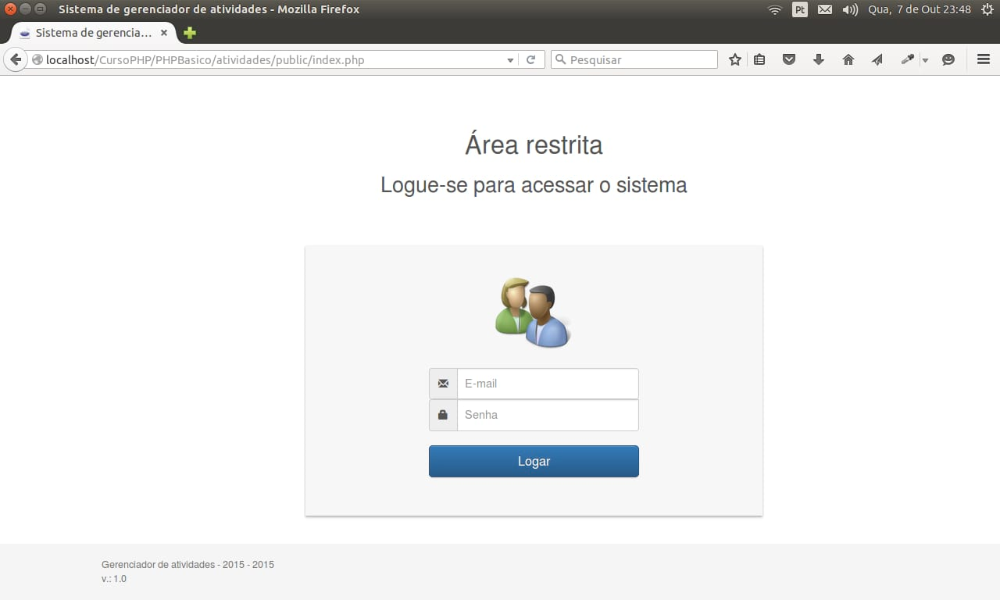

Após a autenticação a tela deve ser parecida com figura 5:

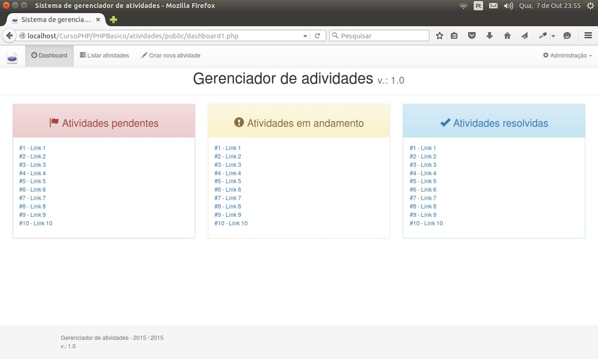

Autenticação
------------

Criando a autenticação do usuário e logout. Acesse o diretório
*atividades/public/auteticacao*, onde criaremos os arquivos *login.php*
e *logout.php*.

1.  &lt;?php

2.  session\_start();

3.  4.  require\_once dirname(\_\_FILE\_\_) . DIRECTORY\_SEPARATOR .
    '../../config/constants.php';

5.  require\_once dirname(\_\_FILE\_\_) . DS .
    '../../src/connection.php';

6.  require\_once dirname(\_\_FILE\_\_) . DS .
    '../../src/protectCSRF.php';

7.  8.  if (\$\_POST) {

9.  extract(\$\_POST);

10. 11. \$token = isset(\$token) ? \$token : null;

12. \$email = isset(\$email) ? \$email : null;

13. \$senha = isset(\$senha) ? \$senha : null;

14. 15. checkTokenIsValid(\$token);

16. 17. \$email = antiInjection(\$email);

18. \$senha = antiInjection(\$senha);

19. 20. //Recupera senha criptografada (HASH)

21. \$hash = getUserHash(\$email);

22. 23. //Verifica se senha digitada é válida no banco

24. //Tem que ser um array

25. \$dataPasswordVerify = \['email' =&gt; \$email, 'senha' =&gt;
    \$senha, 'hash' =&gt; \$hash\];

26. 27. if (passwordCheck(\$dataPasswordVerify) === false) {

28. header('Location: ' . SITE\_URL . 'index.php');

29. } else {

30. header('Location: ' . SITE\_URL . 'dashboard.php');

31. }

32. } else {

33. header('Location: ' . SITE\_URL . 'index.php');

34. }

35. 36. /\*\*

37. \* Função para verificar se a senha digitada é a correta

38. \* e verifica se houve alteração no algoritmo de HASH do PHP

39. \* Caso positívo altera o algoritmo de HASH

40. \* (esse procedimento não impede o acesso do usuário)

41. \*/

42. //function passwordCheck(\$email, \$senha, \$hash)

43. function passwordCheck(\$params)

44. {

45. if (password\_verify(\$params\['senha'\], \$params\['hash'\])) {

46. if (password\_needs\_rehash(\$params\['hash'\], PASSWORD\_DEFAULT,
    \['cost' =&gt; 10\])) {

47. \$hash = password\_hash(\$params\['senha'\], PASSWORD\_DEFAULT,
    \['cost' =&gt; 10\]);

48. 49. defineNewHash(\$params\['hash'\]);

50. }

51. session\_unset(\$\_SESSION\['error'\]);

52. 53. //Chama o método de para recuperaros dados do usuário

54. getUserData(\$params\['email'\]);

55. return true;

56. } else {

57. \$\_SESSION\['error'\] = 'Senha invalida.';

58. return false;

59. }

60. }

61. 62. /\*\*

63. \* Função para recuperar somente a senha do usuário

64. \*/

65. function getUserHash(\$email)

66. {

67. \$conn = dbConnect();

68. \$senha = null;

69. 70. \$sql = "SELECT senha FROM usuarios WHERE email = ? AND ativo =
    'Sim'";

71. \$qry = mysqli\_prepare(\$conn, \$sql);

72. 73. if (\$qry) {

74. mysqli\_stmt\_bind\_param(\$qry, 's', \$email);

75. 76. mysqli\_stmt\_execute(\$qry);

77. mysqli\_stmt\_bind\_result(\$qry, \$senha);

78. 79. if (mysqli\_stmt\_fetch(\$qry)){

80. mysqli\_stmt\_close(\$qry);

81. dbClose(\$conn);

82. return \$senha;

83. } else {

84. mysqli\_stmt\_close(\$qry);

85. \$\_SESSION\['error'\] = 'E-mail invalido.';

86. dbClose(\$conn);

87. header('Location: ' . SITE\_URL . 'index.php');

88. exit;

89. }

90. } else {

91. \$\_SESSION\['error'\] = 'E-mail invalido.';

92. dbClose(\$conn);

93. header('Location: ' . SITE\_URL . 'index.php');

94. }

95. 96. }

97. 98. /\*\*

99. \* Função para recuperar dados do usuário

100. \*/

101. function getUserData(\$email)

102. {

103. \$con = dbConnect();

104. 105. \$sql = "SELECT id, id\_setor, nome, tipo ";

106. \$sql.= "FROM usuarios ";

107. \$sql.= "WHERE email = ? AND ativo = 'Sim'";

108. 109. \$qry = mysqli\_prepare(\$con, \$sql);

110. 111. if (\$qry) {

112. mysqli\_stmt\_bind\_param(\$qry, 's', \$email);

113. mysqli\_stmt\_execute(\$qry);

114. mysqli\_stmt\_bind\_result(\$qry, \$id, \$id\_setor, \$nome,
    \$tipo);

115. 116. if (mysqli\_stmt\_fetch(\$qry)) {

117. \$\_SESSION\['id'\] = \$id;

118. \$\_SESSION\['id\_setor'\] = \$id\_setor;

119. \$\_SESSION\['nome'\] = \$nome;

120. \$\_SESSION\['tipo'\] = \$tipo;

121. } else {

122. \$\_SESSION\['error'\] = 'E-mail ou Senha invalido.';

123. }

124. 125. } else {

126. \$\_SESSION\['error'\] = 'E-mail ou Senha invalido.';

127. }

128. mysqli\_stmt\_close(\$qry);

129. dbClose(\$con);

130. }

131. 132. function defineNewHash(\$email, \$hash)

133. {

134. \$con = dbConnect();

135. 136. \$sql = "UPDATE usuarios SET senha = ? WHERE email = ? ";

137. \$qry = mysqli\_prepare(\$con, \$sql);

138. mysqli\_stmt\_bind\_param(\$qry, 'ss', \$email, \$senha);

139. mysqli\_stmt\_execute(\$qry);

140. 141. if (mysqli\_affected\_rows(\$con)) {

142. \$\_SESSION\['success'\] = 'senha do usuário alterado com
    sucesso.';

143. return true;

144. } else {

145. \$\_SESSION\['error'\] = 'Erro: Não foi possível alterar a senha do
    usuário';

146. return false;

147. }

148. 149. mysqli\_stmt\_close(\$qry);

150. 151. dbClose(\$con);

152. }

153. 

*Salve em
/home/seu\_usuario/www/PHPBasico/atividades/public/autenticacao/login.php*.

1.  &lt;?php

2.  session\_start();

3.  session\_destroy();

4.  5.  require\_once dirname(\_\_FILE\_\_) . DIRECTORY\_SEPARATOR .
    '../../config/constants.php';

6.  7.  header('Location: ' . SITE\_URL . 'index.php');

8.  

*Salve em
/home/seu\_usuario/www/PHPBasico/atividades/public/autenticacao/logout.php*.

Com esses 2 scripts foram feitos as validações necessárias para permitir
somente o usuário logado acessar o sistema.

Páginas de erros
----------------

1.  &lt;!DOCTYPE html&gt;

2.  &lt;html lang="pt-br"&gt;

3.  &lt;head&gt;

4.  &lt;meta charset="utf-8"&gt;

5.  &lt;title&gt;404 Page Not Found&lt;/title&gt;

6.  &lt;style type="text/css"&gt;

7.  8.  ::selection { background-color: \#E13300; color: white; }

9.  ::-moz-selection { background-color: \#E13300; color: white; }

10. 11. body {

12. background-color: \#fff;

13. margin: 40px;

14. font: 13px/20px normal Helvetica, Arial, sans-serif;

15. color: \#4F5155;

16. }

17. 18. a {

19. color: \#003399;

20. background-color: transparent;

21. font-weight: normal;

22. }

23. 24. h1 {

25. color: \#444;

26. background-color: transparent;

27. border-bottom: 1px solid \#D0D0D0;

28. font-size: 19px;

29. font-weight: normal;

30. margin: 0 0 14px 0;

31. padding: 14px 15px 10px 15px;

32. }

33. 34. h2 {

35. color: \#444;

36. background-color: transparent;

37. border-bottom: 1px solid \#D0D0D0;

38. font-size: 17px;

39. font-weight: normal;

40. margin: 0 0 14px 0;

41. padding: 14px 15px 10px 15px;

42. }

43. 44. code {

45. font-family: Consolas, Monaco, Courier New, Courier, monospace;

46. font-size: 12px;

47. background-color: \#f9f9f9;

48. border: 1px solid \#D0D0D0;

49. color: \#002166;

50. display: block;

51. margin: 14px 0 14px 0;

52. padding: 12px 10px 12px 10px;

53. }

54. 55. \#container {

56. margin: 10px;

57. border: 1px solid \#D0D0D0;

58. box-shadow: 0 0 8px \#D0D0D0;

59. }

60. 61. p {

62. margin: 12px 15px 12px 15px;

63. }

64. &lt;/style&gt;

65. &lt;/head&gt;

66. &lt;body&gt;

67. &lt;div id="container"&gt;

68. &lt;h1&gt;Ops alguma coisa deu errada!&lt;/h1&gt;

69. &lt;p&gt;&lt;strong&gt;Erro 404&lt;/strong&gt; - Página não
    encontrada!&lt;/p&gt;

70. &lt;/div&gt;

71. &lt;/body&gt;

72. &lt;/html&gt;

*Salve em
/home/seu\_usuario/www/PHPBasico/atividades/public/erros/error\_404.php*.

1.  &lt;!DOCTYPE html&gt;

2.  &lt;html lang="en"&gt;

3.  &lt;head&gt;

4.  &lt;meta charset="utf-8"&gt;

5.  &lt;title&gt;Database Error&lt;/title&gt;

6.  &lt;style type="text/css"&gt;

7.  8.  ::selection { background-color: \#E13300; color: white; }

9.  ::-moz-selection { background-color: \#E13300; color: white; }

10. 11. body {

12. background-color: \#fff;

13. margin: 40px;

14. font: 13px/20px normal Helvetica, Arial, sans-serif;

15. color: \#4F5155;

16. }

17. 18. a {

19. color: \#003399;

20. background-color: transparent;

21. font-weight: normal;

22. }

23. 24. h1 {

25. color: \#444;

26. background-color: transparent;

27. border-bottom: 1px solid \#D0D0D0;

28. font-size: 19px;

29. font-weight: normal;

30. margin: 0 0 14px 0;

31. padding: 14px 15px 10px 15px;

32. }

33. 34. code {

35. font-family: Consolas, Monaco, Courier New, Courier, monospace;

36. font-size: 12px;

37. background-color: \#f9f9f9;

38. border: 1px solid \#D0D0D0;

39. color: \#002166;

40. display: block;

41. margin: 14px 0 14px 0;

42. padding: 12px 10px 12px 10px;

43. }

44. 45. \#container {

46. margin: 10px;

47. border: 1px solid \#D0D0D0;

48. box-shadow: 0 0 8px \#D0D0D0;

49. }

50. 51. p {

52. margin: 12px 15px 12px 15px;

53. }

54. &lt;/style&gt;

55. &lt;/head&gt;

56. &lt;body&gt;

57. &lt;div id="container"&gt;

58. &lt;h1&gt;Ops alguma coisa deu errada!&lt;/h1&gt;

59. &lt;p&gt;&lt;strong&gt;Erro &lt;/strong&gt; - Tivemos algum problema
    com nosso banco de dados!&lt;/p&gt;

60. &lt;/div&gt;

61. &lt;/body&gt;

62. &lt;/html&gt;

*Salve em
/home/seu\_usuario/www/PHPBasico/atividades/public/erros/error\_db.php*.

1.  &lt;!DOCTYPE html&gt;

2.  &lt;html&gt;

3.  &lt;head&gt;

4.  &lt;title&gt;403 Forbidden&lt;/title&gt;

5.  &lt;style type="text/css"&gt;

6.  7.  ::selection { background-color: \#E13300; color: white; }

8.  ::-moz-selection { background-color: \#E13300; color: white; }

9.  10. body {

11. background-color: \#fff;

12. margin: 40px;

13. font: 13px/20px normal Helvetica, Arial, sans-serif;

14. color: \#4F5155;

15. }

16. 17. a {

18. color: \#003399;

19. background-color: transparent;

20. font-weight: normal;

21. }

22. 23. h1 {

24. color: \#444;

25. background-color: transparent;

26. border-bottom: 1px solid \#D0D0D0;

27. font-size: 19px;

28. font-weight: normal;

29. margin: 0 0 14px 0;

30. padding: 14px 15px 10px 15px;

31. }

32. 33. code {

34. font-family: Consolas, Monaco, Courier New, Courier, monospace;

35. font-size: 12px;

36. background-color: \#f9f9f9;

37. border: 1px solid \#D0D0D0;

38. color: \#002166;

39. display: block;

40. margin: 14px 0 14px 0;

41. padding: 12px 10px 12px 10px;

42. }

43. 44. \#container {

45. margin: 10px;

46. border: 1px solid \#D0D0D0;

47. box-shadow: 0 0 8px \#D0D0D0;

48. }

49. 50. p {

51. margin: 12px 15px 12px 15px;

52. }

53. &lt;/style&gt;

54. &lt;/head&gt;

55. &lt;body&gt;

56. &lt;div id="container"&gt;

57. &lt;h1&gt;Ops alguma coisa deu errada!&lt;/h1&gt;

58. &lt;p&gt;&lt;strong&gt;Erro 403&lt;/strong&gt; - Acesso
    negado!&lt;/p&gt;

59. &lt;/div&gt;

60. 61. &lt;/body&gt;

62. &lt;/html&gt;

*Salve em
/home/seu\_usuario/www/PHPBasico/atividades/public/erros/index.php*.

Setores
-------

1.  &lt;?php

2.  session\_start();

3.  header('Content-Type: text/html; charset=utf-8');

4.  5.  require\_once dirname(\_\_FILE\_\_) . DIRECTORY\_SEPARATOR .
    '../../config/constants.php';

6.  require\_once BASE\_PATH . 'src/sessionVerify.php';

7.  8.  checkUserLogedIn();

9.  10. require\_once BASE\_PATH . 'src/protectCSRF.php';

11. require\_once BASE\_PATH . 'config/database.php';

12. require\_once BASE\_PATH . 'src/connection.php';

13. require\_once BASE\_PATH . 'src/prepareCrud.php';

14. 15. \$post = \$\_POST;

16. unset(\$post\['action'\]);

17. \$token = isset(\$post\['token'\]) ? trim(\$post\['token'\]) : null;

18. \$id = isset(\$post\['id'\]) ? \$post\['id'\] : \$\_GET\['id'\];

19. \$action = isset(\$\_POST\['action'\]) ? trim(\$\_POST\['action'\])
    : trim(\$\_GET\['action'\]);

20. 21. switch (\$action) {

22. case 'insert':

23. checkTokenIsValid(\$token);

24. unset(\$post\['id'\]);

25. unset(\$post\['token'\]);

26. 27. if (\$id = insert('setores', \$post)) {

28. \$\_SESSION\['success'\] = 'Registro gravado com sucesso. ';

29. } else {

30. \$\_SESSION\['error'\] = 'Não foi possível gravar o registro.';

31. }

32. 33. header('location: ' . SITE\_URL . 'setores/view.php?id=' .
    \$id);

34. break;

35. 36. case 'update':

37. checkTokenIsValid(\$token);

38. unset(\$post\['id'\]);

39. unset(\$post\['token'\]);

40. 41. if (update('setores', \$post, \['id' =&gt; \$id\])) {

42. \$\_SESSION\['success'\] = 'Registro alterado com sucesso. ';

43. } else {

44. \$\_SESSION\['error'\] = 'Não foi possível aletrar o registro.';

45. }

46. 47. header('location: ' . SITE\_URL . 'setores/view.php?id=' .
    \$id);

48. break;

49. 50. case 'delete':

51. if (delete('setores', \['id' =&gt; \$id\])) {

52. \$\_SESSION\['success'\] = 'Registro exluido com sucesso. ';

53. } else {

54. \$\_SESSION\['error'\] = 'Não foi possível excluir o registro.';

55. }

56. 57. header('location: ' . SITE\_URL . 'setores/index.php');

58. break;

59. }

60. 61. function insert(\$table, \$params)

62. {

63. // Atribui a instrução SQL construida no método

64. \$sql = buildInsert(\$table, \$params);

65. 66. \$conn = dbConnect();

67. extract(\$params);

68. 69. \$sigla = antiInjection(\$sigla);

70. \$nome = antiInjection(\$nome);

71. 72. \$stmt = mysqli\_prepare(\$conn, \$sql);

73. mysqli\_stmt\_bind\_param(\$stmt, 'ss', \$sigla, \$nome);

74. 75. if (!mysqli\_stmt\_execute(\$stmt)) {

76. \$return = false;

77. } else {

78. \$return = mysqli\_insert\_id(\$conn);

79. }

80. mysqli\_stmt\_close(\$stmt);

81. dbClose(\$conn);

82. 83. return \$return;

84. }

85. 86. function update(\$table, \$params, \$paramConditions)

87. {

88. // Atribui a instrução SQL construida no método

89. \$sql = buildUpdate(\$table, \$params, \$paramConditions);

90. 91. \$conn = dbConnect();

92. extract(\$paramConditions);

93. extract(\$params);

94. 95. \$sigla = antiInjection(\$sigla);

96. \$nome = antiInjection(\$nome);

97. \$id = antiInjection(\$id);

98. 99. \$stmt = mysqli\_prepare(\$conn, \$sql);

100. mysqli\_stmt\_bind\_param(\$stmt, 'ssi', \$sigla, \$nome, \$id);

101. 102. if (!mysqli\_stmt\_execute(\$stmt)) {

103. \$return = false;

104. } else {

105. \$return = true;

106. }

107. mysqli\_stmt\_close(\$stmt);

108. 109. dbClose(\$conn);

110. 111. return \$return;

112. }

113. 114. function delete(\$table, \$paramConditions)

115. {

116. // Atribui a instrução SQL construida no método

117. \$sql = buildDelete(\$table, \$paramConditions);

118. 119. \$conn = dbConnect();

120. extract(\$paramConditions);

121. \$id = antiInjection(\$id);

122. 123. \$stmt = mysqli\_prepare(\$conn, \$sql);

124. mysqli\_stmt\_bind\_param(\$stmt, 'i', \$id);

125. 126. if (!mysqli\_stmt\_execute(\$stmt)) {

127. \$return = false;

128. } else {

129. \$return = true;

130. }

131. mysqli\_stmt\_close(\$stmt);

132. 133. dbClose(\$conn);

134. 135. return \$return;

136. }

137. 

*Salve em
/home/seu\_usuario/www/PHPBasico/atividades/public/setores/actions.php*.

1.  &lt;?php

2.  require\_once dirname(\_\_FILE\_\_) . DIRECTORY\_SEPARATOR .
    '../../config/constants.php';

3.  require\_once BASE\_PATH . 'src/sessionVerify.php';

4.  5.  checkUserLogedIn();

6.  7.  /\*

8.  \* Esse arquivo serve para gerar qualquer tipo de consulta

9.  \* a função buildSelect, monta estruturas complexas de consulta

10. \* verifique a documentação direto da própria função

11. \* o primeiro parametro é o nome da tabela, o segundo é um array

12. \*/

13. function countRowsDepartment()

14. {

15. \$connection = dbConnect();

16. 17. \$options = \[

18. 'columns' =&gt; 'count(id) as totalRows',

19. \];

20. \$sql = buildSelect('setores', \$options);

21. \$qry = mysqli\_query(\$connection, \$sql);

22. \$result = mysqli\_fetch\_array(\$qry, MYSQLI\_ASSOC);

23. mysqli\_free\_result(\$qry);

24. 25. dbClose(\$connection);

26. 27. return \$result\['totalRows'\];

28. }

29. 30. //Recupera todos os dados da tabela

31. function getAllDepartment(\$params){

32. \$connection = dbConnect();

33. 34. \$options = \[

35. 'columns' =&gt; 'id, sigla, nome',

36. 'order\_by' =&gt; 'sigla, nome DESC',

37. 'limit' =&gt; \$params\['limit'\] . ', ' . \$params\['offset'\],

38. \];

39. 40. \$sql = buildSelect('setores', \$options);

41. 42. \$qry = mysqli\_query(\$connection, \$sql);

43. \$result = mysqli\_fetch\_all(\$qry, MYSQLI\_ASSOC);

44. \$numRows = mysqli\_num\_rows(\$qry);

45. mysqli\_free\_result(\$qry);

46. 47. dbClose(\$connection);

48. 49. return \['result' =&gt; \$result, 'numRows' =&gt; \$numRows\];

50. }

51. 52. //Recupera todos os dados da tabela

53. function getListDepartments(){

54. \$connection = dbConnect();

55. 56. \$options = \[

57. 'columns' =&gt; 'id, sigla, nome',

58. \];

59. 60. \$sql = buildSelect('setores', \$options);

61. 62. \$qry = mysqli\_query(\$connection, \$sql);

63. \$result = mysqli\_fetch\_all(\$qry, MYSQLI\_ASSOC);

64. mysqli\_free\_result(\$qry);

65. 66. dbClose(\$connection);

67. 68. array\_unshift(\$result, \['id' =&gt; '', 'sigla' =&gt; '',
    'nome' =&gt; ''\]);

69. 70. return \$result;

71. }

72. 73. function getDepartmentById(\$id)

74. {

75. \$connection = dbConnect();

76. 77. \$options = \[

78. 'columns' =&gt; 'id, sigla, nome',

79. 'where' =&gt; \['id' =&gt; \$id\],

80. \];

81. 82. \$sql = buildSelect('setores', \$options);

83. 84. \$stmt = mysqli\_prepare(\$connection, \$sql);

85. mysqli\_stmt\_bind\_param(\$stmt, 'i', \$id);

86. mysqli\_stmt\_execute(\$stmt);

87. 88. \$resultObject = mysqli\_stmt\_get\_result(\$stmt);

89. \$result = mysqli\_fetch\_all(\$resultObject, MYSQLI\_ASSOC);

90. mysqli\_stmt\_close(\$stmt);

91. 92. dbClose(\$connection);

93. 94. return \$result\[0\];

95. }

96. 

*Salve em
/home/seu\_usuario/www/PHPBasico/atividades/public/setores/queries.php*.

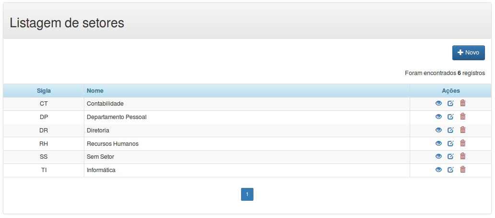{width="6.299212598425197in"
height="2.780708661417323in"}

1.  &lt;?php

2.  require\_once dirname(\_\_FILE\_\_) . DIRECTORY\_SEPARATOR .
    '../template/header.php';

3.  showHeader();

4.  5.  require\_once BASE\_PATH . 'public/setores/queries.php';

6.  require\_once BASE\_PATH . 'src/pagination.php';

7.  8.  9.  //configurções para montar a paginação

10. \$recordsPerPage = 10;

11. \$totalRows = countRowsDepartment();

12. \$limit = returnLimitToQuery(\['recordsPerPage' =&gt;
    \$recordsPerPage\]);

13. 14. \$departments = getAllDepartment(\['limit' =&gt; \$limit,
    'offset' =&gt; \$recordsPerPage\]);

15. \$params = \['recordsPerPage' =&gt; \$recordsPerPage, 'totalRows'
    =&gt; \$totalRows, 'url' =&gt; SITE\_URL .'setores/index.php'\];

16. 17. showMessage();

18. ?&gt;

19. &lt;div class="container"&gt;

20. &lt;div class="panel panel-default"&gt;

21. &lt;!-- Default panel contents --&gt;

22. &lt;div class="panel-heading"&gt;&lt;h2&gt;Listagem de setores
    &lt;/h2&gt;&lt;/div&gt;

23. &lt;div class="panel-body text-right"&gt;

24. &lt;a href="&lt;?= SITE\_URL ?&gt;setores/form.php"

25. class="btn btn-primary" title="Novo registro"&gt;

26. &lt;span class="glyphicon glyphicon-plus"&gt;&lt;/span&gt; Novo

27. &lt;/a&gt;

28. &lt;?php showTotalRegisters(\$totalRows); ?&gt;

29. &lt;/div&gt;

30. 31. &lt;?php if (\$departments\['numRows'\] == 0): ?&gt;

32. &lt;div class="alert alert-warning"&gt;

33. &lt;h3 class="text-center"&gt;

34. &lt;span class="glyphicon glyphicon-warning-sign"&gt;&lt;/span&gt;

35. Nenhum registro encontrado

36. &lt;/h3&gt;

37. &lt;/div&gt;

38. &lt;?php else: ?&gt;

39. &lt;table class="table table-bordered table-striped
    table-condensed"&gt;

40. &lt;thead class="alert-info"&gt;

41. &lt;tr&gt;

42. &lt;th class="col-md-2 text-center"&gt;Sigla&lt;/th&gt;

43. &lt;th&gt;Nome&lt;/th&gt;

44. &lt;th class="col-md-2 text-center"&gt;Ações&lt;/th&gt;

45. &lt;/tr&gt;

46. &lt;/thead&gt;

47. 48. &lt;tfoot&gt;

49. &lt;tr&gt;

50. &lt;td colspan="3" class="text-center"&gt;

51. &lt;?php showPagination(\$params); ?&gt;

52. &lt;/td&gt;

53. &lt;/tr&gt;

54. &lt;/tfoot&gt;

55. 56. &lt;tbody&gt;

57. &lt;?php for (\$i = 0; \$i &lt;=
    \$departments\['numRows'\]-1; \$i++) : ?&gt;

58. &lt;tr&gt;

59. &lt;td class="text-center"&gt;&lt;?=
    \$departments\['result'\]\[\$i\]\['sigla'\] ?&gt;&lt;/td&gt;

60. &lt;td&gt;&lt;?= \$departments\['result'\]\[\$i\]\['nome'\]
    ?&gt;&lt;/td&gt;

61. &lt;td class="col-md-2 text-center"&gt;

62. &lt;a href="&lt;?= SITE\_URL ?&gt;setores/view.php?id=&lt;?=
    \$departments\['result'\]\[\$i\]\['id'\] ?&gt;"
    title="Vizualizar"&gt;

63. &lt;span class="glyphicon glyphicon-eye-open"&gt;&lt;/span&gt;

64. &lt;/a&gt;&nbsp;&nbsp;

65. &lt;a href="&lt;?= SITE\_URL ?&gt;setores/form.php?id=&lt;?=
    \$departments\['result'\]\[\$i\]\['id'\] ?&gt;" title="Editar"&gt;

66. &lt;span class="glyphicon glyphicon-edit"&gt;&lt;/span&gt;

67. &lt;/a&gt;&nbsp;&nbsp;

68. &lt;a href="\#" id="&lt;?= SITE\_URL
    ?&gt;setores/actions.php?action=delete&id=&lt;?=
    \$departments\['result'\]\[\$i\]\['id'\] ?&gt;"

69. title="Excluir"&gt;&lt;span class="text-danger glyphicon
    glyphicon-trash"&gt;&lt;/span&gt;

70. &lt;/a&gt;

71. &lt;/td&gt;

72. &lt;/tr&gt;

73. &lt;?php endfor; ?&gt;

74. &lt;/tbody&gt;

75. &lt;/table&gt;

76. &lt;?php endif; ?&gt;

77. &lt;/div&gt;

78. &lt;/div&gt;

79. &lt;?php

80. require\_once dirname(\_\_FILE\_\_) . DIRECTORY\_SEPARATOR .
    '../template/footer.php';

81. showFooter(\['confirmDelete'\]);

82. 

*Salve em
/home/seu\_usuario/www/PHPBasico/atividades/public/setores/index.php*.

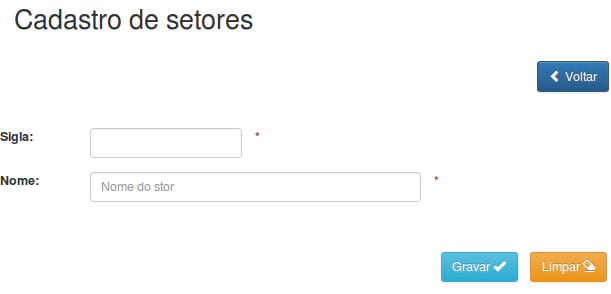{width="6.299212598425197in"
height="3.030708661417323in"}

1.  &lt;?php

2.  require\_once dirname(\_\_FILE\_\_) . DIRECTORY\_SEPARATOR .
    '../template/header.php';

3.  showHeader();

4.  require\_once BASE\_PATH . 'public/setores/queries.php';

5.  require\_once BASE\_PATH . 'src/protectCSRF.php';

6.  7.  if (isset(\$\_REQUEST\['id'\])) :

8.  \$action = 'update';

9.  \$id = trim(\$\_REQUEST\['id'\]);

10. 11. \$department = getDepartmentById(\$id);

12. 13. \$sigla = \$department\['sigla'\];

14. \$nome = \$department\['nome'\];

15. 16. else :

17. \$action = 'insert';

18. \$id = null;

19. \$sigla = null;

20. \$nome = null;

21. endif;

22. 23. ?&gt;

24. &lt;div class="container"&gt;

25. &lt;h2&gt;Cadastro de setores&lt;/h2&gt;&lt;br /&gt;

26. 27. &lt;div class="row"&gt;

28. &lt;div class="col-md-6 col-md-offset-6"&gt;

29. &lt;a href="&lt;?= SITE\_URL ?&gt;setores/index.php"

30. class="btn btn-primary" title="Voltar"&gt;

31. &lt;span class="glyphicon glyphicon-chevron-left"&gt;&lt;/span&gt;
    Voltar&lt;/a&gt;

32. &lt;?php if (\$id) : ?&gt;

33. &lt;a href="\#" id="&lt;?= SITE\_URL
    ?&gt;setores/actions.php?action=delete&id=&lt;?= \$id ?&gt;"

34. title="Excluir" class="btn btn-danger"&gt;

35. &lt;span class="glyphicon glyphicon-trash"&gt;&lt;/span&gt;
    Excluir&lt;/a&gt;

36. &lt;?php endif; ?&gt;

37. &lt;/div&gt;

38. &lt;/div&gt;&lt;br /&gt;&lt;br /&gt;

39. 40. &lt;form class="form-horizontal" action="&lt;?= SITE\_URL
    ?&gt;setores/actions.php" method="post"&gt;

41. &lt;input type="hidden" name="action" value="&lt;?= \$action
    ?&gt;"&gt;

42. &lt;input type="hidden" name="id" value="&lt;?= \$id ?&gt;"&gt;

43. &lt;input type="hidden" name="token" value="&lt;?= tokenGenerate()
    ?&gt;" /&gt;

44. 45. &lt;div class="form-group"&gt;

46. &lt;div class="row"&gt;

47. &lt;label for="sigla" class="col-md-1"&gt;Sigla:&lt;/label&gt;

48. 49. &lt;div class="col-md-2"&gt;

50. &lt;input type="text" class="form-control" name="sigla" id="sigla"
    maxlength="8" value="&lt;?= \$sigla ?&gt;" required&gt;

51. &lt;/div&gt;

52. &lt;span
    class="text-danger"&gt;&lt;strong&gt;\*&lt;/strong&gt;&lt;/span&gt;

53. &lt;/div&gt;

54. &lt;/div&gt;

55. 56. &lt;div class="form-group"&gt;

57. &lt;div class="row"&gt;

58. &lt;label for="nome" class="col-md-1"&gt;Nome:&lt;/label&gt;

59. 60. &lt;div class="col-md-4"&gt;

61. &lt;input type="nome" class="form-control" name="nome" id="nome"
    placeholder="Nome do stor" maxlength="200" value="&lt;?= \$nome
    ?&gt;" required&gt;&lt;br /&gt;

62. &lt;/div&gt;

63. &lt;span
    class="text-danger"&gt;&lt;strong&gt;\*&lt;/strong&gt;&lt;/span&gt;

64. &lt;/div&gt;

65. &lt;/div&gt;

66. 67. &lt;div class="form-group text-center"&gt;

68. &lt;br /&gt;

69. &lt;button type="submit" class="btn btn-info"&gt;Gravar &lt;span
    class="glyphicon
    glyphicon-ok"&gt;&lt;/span&gt;&lt;/button&gt;&nbsp;&nbsp;&nbsp;

70. &lt;button type="reset" name="reset" class="btn
    btn-warning"&gt;Limpar &lt;span class="glyphicon
    glyphicon-erase"&gt;&lt;/span&gt;&lt;/button&gt;

71. &lt;/div&gt;

72. &lt;/form&gt;

73. &lt;/div&gt;

74. &lt;?php

75. require\_once dirname(\_\_FILE\_\_) . DIRECTORY\_SEPARATOR .
    '../template/footer.php';

76. showFooter(\['confirmDelete'\]);

77. 

*Salve em
/home/seu\_usuario/www/PHPBasico/atividades/public/setores/form.php*.

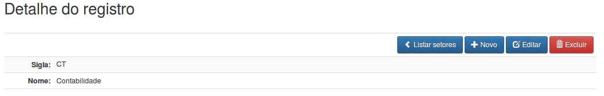{width="6.299212598425197in"
height="1.0110236220472442in"}

1.  &lt;?php

2.  require\_once dirname(\_\_FILE\_\_) . DIRECTORY\_SEPARATOR .
    '../template/header.php';

3.  showHeader();

4.  5.  require\_once BASE\_PATH . 'public/setores/queries.php';

6.  7.  if (isset(\$\_REQUEST\['id'\])) :

8.  \$id = trim(\$\_REQUEST\['id'\]);

9.  10. \$department = getDepartmentById(\$id);

11. 12. \$sigla = \$department\['sigla'\];

13. \$nome = \$department\['nome'\];

14. else :

15. header('location:' . SITE\_URL . 'setores/index.php');

16. endif;

17. 18. showMessage();

19. ?&gt;

20. &lt;div class="container"&gt;

21. &lt;h2&gt;Detalhe do registro&lt;/h2&gt;&lt;br /&gt;

22. 23. &lt;table class="table table-bordered table-striped
    table-condensed"&gt;

24. &lt;thead&gt;

25. &lt;tr&gt;

26. &lt;th colspan="2" class="text-right"&gt;

27. &lt;a href="&lt;?= SITE\_URL ?&gt;setores/index.php"

28. class="btn btn-primary" title="Voltar"&gt;

29. &lt;span class="glyphicon glyphicon-chevron-left"&gt;&lt;/span&gt;
    Listar setores

30. &lt;/a&gt;

31. &lt;a href="&lt;?= SITE\_URL ?&gt;setores/form.php"

32. class="btn btn-primary" title="Novo registro"&gt;

33. &lt;span class="glyphicon glyphicon-plus"&gt;&lt;/span&gt; Novo

34. &lt;/a&gt;

35. &lt;a href="&lt;?= SITE\_URL ?&gt;setores/form.php?id=&lt;?= \$id
    ?&gt;"

36. class="btn btn-primary" title="Editar"&gt;

37. &lt;span class="glyphicon glyphicon-edit"&gt;&lt;/span&gt; Editar

38. &lt;/a&gt;

39. &lt;a href="\#"

40. id = "&lt;?= SITE\_URL
    ?&gt;setores/actions.php?action=delete&id=&lt;?= \$id ?&gt;"

41. title="Excluir" class="btn btn-danger"&gt;

42. &lt;span class="glyphicon glyphicon-trash"&gt;&lt;/span&gt; Excluir

43. &lt;/a&gt;

44. &lt;/th&gt;

45. &lt;/tr&gt;

46. &lt;/thead&gt;

47. 48. &lt;tbody&gt;

49. &lt;tr&gt;

50. &lt;td class="col-md-1
    text-right"&gt;&lt;strong&gt;Sigla:&lt;/strong&gt;&lt;/td&gt;

51. &lt;td&gt;&lt;?= \$sigla ?&gt;&lt;/td&gt;

52. &lt;/tr&gt;

53. &lt;tr&gt;

54. &lt;td
    class="text-right"&gt;&lt;strong&gt;Nome:&lt;/strong&gt;&lt;/td&gt;

55. &lt;td&gt;&lt;?= \$nome ?&gt;&lt;/td&gt;

56. &lt;/tr&gt;

57. &lt;/tbody&gt;

58. &lt;/table&gt;

59. &lt;/div&gt;

60. &lt;?php

61. require\_once dirname(\_\_FILE\_\_) . DIRECTORY\_SEPARATOR .
    '../template/footer.php';

62. showFooter(\['confirmDelete'\]);

63. 

*Salve em
/home/seu\_usuario/www/PHPBasico/atividades/public/setores/view.php*.

Vimos no arquivo acima uma chamada no footer do ***confirmDelete***,
esse arquivo, nada mais é que um script em JavaScript que pergunta se
deseja deletar um registro.

1.  \$(document).ready(function(){

2.  /\*

3.  \* Função genérica para todos os eventos excluir

4.  \* O \[a href\] deverá conter o atributo title com o valor Excluir

5.  \* e o atributo id contento a URL do controller + id como parametro.

6.  \*

7.  \* ex: &lt;a href="\#" title="Excluir" id=""&gt;&lt;span
    class="glyphicon glyphicon-trash"&gt;&lt;/span&gt;Exluir&lt;/a&gt;

8.  \*

9.  \*/

10. \$('a\[title="Excluir"\]').on('click', function(){

11. decisao = confirm('Realmente gostaria de excluir o registro?');

12. 13. if(decisao === true){

14. var url = \$(this).attr('id');

15. window.location.replace(url);

16. }

17. });

18. });

19. 

*Salve em
/home/seu\_usuario/www/PHPBasico/atividades/public/assets/js/confirmDelete
.js*.

Status Atividade
----------------

1.  &lt;?php

2.  session\_start();

3.  header('Content-Type: text/html; charset=utf-8');

4.  5.  require\_once dirname(\_\_FILE\_\_) . DIRECTORY\_SEPARATOR .
    '../../config/constants.php';

6.  require\_once BASE\_PATH . 'src/sessionVerify.php';

7.  8.  checkUserLogedIn();

9.  10. require\_once BASE\_PATH . 'src/protectCSRF.php';

11. require\_once BASE\_PATH . 'config/database.php';

12. require\_once BASE\_PATH . 'src/connection.php';

13. require\_once BASE\_PATH . 'src/prepareCrud.php';

14. 15. \$post = \$\_POST;

16. unset(\$post\['action'\]);

17. \$token = isset(\$post\['token'\]) ? trim(\$post\['token'\]) : null;

18. \$id = isset(\$post\['id'\]) ? \$post\['id'\] : \$\_GET\['id'\];

19. \$action = isset(\$\_POST\['action'\]) ? trim(\$\_POST\['action'\])
    : trim(\$\_GET\['action'\]);

20. 21. switch (\$action) {

22. case 'insert':

23. checkTokenIsValid(\$token);

24. unset(\$post\['id'\]);

25. unset(\$post\['token'\]);

26. 27. if (\$id = insert('status\_atividade', \$post)) {

28. \$\_SESSION\['success'\] = 'Registro gravado com sucesso. ';

29. } else {

30. \$\_SESSION\['error'\] = 'Não foi possível gravar o registro.';

31. }

32. 33. header('location: ' . SITE\_URL .
    'status-atividade/view.php?id=' . \$id);

34. break;

35. 36. case 'update':

37. checkTokenIsValid(\$token);

38. unset(\$post\['id'\]);

39. unset(\$post\['token'\]);

40. 41. if (update('status\_atividade', \$post, \['id' =&gt; \$id\])) {

42. \$\_SESSION\['success'\] = 'Registro alterado com sucesso. ';

43. } else {

44. \$\_SESSION\['error'\] = 'Não foi possível aletrar o registro.';

45. }

46. 47. header('location: ' . SITE\_URL .
    'status-atividade/view.php?id=' . \$id);

48. break;

49. 50. case 'delete':

51. if (delete('status\_atividade', \['id' =&gt; \$id\])) {

52. \$\_SESSION\['success'\] = 'Registro exluido com sucesso. ';

53. } else {

54. \$\_SESSION\['error'\] = 'Não foi possível excluir o registro.';

55. }

56. 57. header('location: ' . SITE\_URL . 'status-atividade/index.php');

58. break;

59. }

60. 61. function insert(\$table, \$params)

62. {

63. // Atribui a instrução SQL construida no método

64. \$sql = buildInsert(\$table, \$params);

65. 66. \$conn = dbConnect();

67. extract(\$params);

68. 69. \$status = antiInjection(\$status);

70. 71. \$stmt = mysqli\_prepare(\$conn, \$sql);

72. mysqli\_stmt\_bind\_param(\$stmt, 's', \$status);

73. 74. if (!mysqli\_stmt\_execute(\$stmt)) {

75. \$return = false;

76. } else {

77. \$return = mysqli\_insert\_id(\$conn);

78. }

79. mysqli\_stmt\_close(\$stmt);

80. dbClose(\$conn);

81. 82. return \$return;

83. }

84. 85. function update(\$table, \$params, \$paramConditions)

86. {

87. // Atribui a instrução SQL construida no método

88. \$sql = buildUpdate(\$table, \$params, \$paramConditions);

89. 90. \$conn = dbConnect();

91. extract(\$paramConditions);

92. extract(\$params);

93. 94. \$status = antiInjection(\$status);

95. \$id = antiInjection(\$id);

96. 97. \$stmt = mysqli\_prepare(\$conn, \$sql);

98. mysqli\_stmt\_bind\_param(\$stmt, 'si', \$status, \$id);

99. 100. if (!mysqli\_stmt\_execute(\$stmt)) {

101. \$return = false;

102. } else {

103. \$return = true;

104. }

105. mysqli\_stmt\_close(\$stmt);

106. 107. dbClose(\$conn);

108. 109. return \$return;

110. }

111. 112. function delete(\$table, \$paramConditions)

113. {

114. // Atribui a instrução SQL construida no método

115. \$sql = buildDelete(\$table, \$paramConditions);

116. 117. \$conn = dbConnect();

118. extract(\$paramConditions);

119. \$id = antiInjection(\$id);

120. 121. \$stmt = mysqli\_prepare(\$conn, \$sql);

122. mysqli\_stmt\_bind\_param(\$stmt, 'i', \$id);

123. 124. if (!mysqli\_stmt\_execute(\$stmt)) {

125. \$return = false;

126. } else {

127. \$return = true;

128. }

129. mysqli\_stmt\_close(\$stmt);

130. 131. dbClose(\$conn);

132. 133. return \$return;

134. }

135. 

*Salve em
/home/seu\_usuario/www/PHPBasico/atividades/public/status-atividade/actions.php*.

1.  &lt;?php

2.  require\_once dirname(\_\_FILE\_\_) . DIRECTORY\_SEPARATOR .
    '../../config/constants.php';

3.  require\_once BASE\_PATH . 'src/sessionVerify.php';

4.  5.  checkUserLogedIn();

6.  7.  /\*

8.  \* Esse arquivo serve para gerar qualquer tipo de consulta

9.  \* a função buildSelect, monta estruturas complexas de consulta

10. \* verifique a documentação direto da própria função

11. \* o primeiro parametro é o nome da tabela, o segundo é um array

12. \*/

13. function countRowsStatus()

14. {

15. \$connection = dbConnect();

16. \$options = \[

17. 'columns' =&gt; 'count(id) as totalRows',

18. \];

19. \$sql = buildSelect('status\_atividade', \$options);

20. \$qry = mysqli\_query(\$connection, \$sql);

21. \$result = mysqli\_fetch\_array(\$qry, MYSQLI\_ASSOC);

22. mysqli\_free\_result(\$qry);

23. 24. dbClose(\$connection);

25. 26. return \$result\['totalRows'\];

27. }

28. 29. //Recupera todos os dados da tabela

30. function getAllStatus(\$params){

31. \$connection = dbConnect();

32. 33. \$options = \[

34. 'columns' =&gt; 'id, status',

35. 'order\_by' =&gt; 'status ASC',

36. 'limit' =&gt; \$params\['limit'\] . ', ' . \$params\['offset'\],

37. \];

38. 39. \$sql = buildSelect('status\_atividade', \$options);

40. 41. \$qry = mysqli\_query(\$connection, \$sql);

42. \$result = mysqli\_fetch\_all(\$qry, MYSQLI\_ASSOC);

43. \$numRows = mysqli\_num\_rows(\$qry);

44. mysqli\_free\_result(\$qry);

45. 46. dbClose(\$connection);

47. 48. return \['result' =&gt; \$result, 'numRows' =&gt; \$numRows\];

49. }

50. 51. //Recupera todos os dados da tabela

52. function getListStatus(){

53. \$connection = dbConnect();

54. 55. \$options = \[

56. 'columns' =&gt; 'id, status',

57. \];

58. 59. \$sql = buildSelect('status\_atividade', \$options);

60. 61. \$qry = mysqli\_query(\$connection, \$sql);

62. \$result = mysqli\_fetch\_all(\$qry, MYSQLI\_ASSOC);

63. mysqli\_free\_result(\$qry);

64. 65. dbClose(\$connection);

66. 67. array\_unshift(\$result, \['id' =&gt; '', 'status' =&gt; ''\]);

68. 69. return \$result;

70. }

71. 72. function getStatusById(\$id)

73. {

74. \$connection = dbConnect();

75. 76. \$options = \[

77. 'columns' =&gt; 'id, status',

78. 'where' =&gt; \['id' =&gt; \$id\],

79. \];

80. 81. \$sql = buildSelect('status\_atividade', \$options);

82. 83. \$stmt = mysqli\_prepare(\$connection, \$sql);

84. mysqli\_stmt\_bind\_param(\$stmt, 'i', \$id);

85. mysqli\_stmt\_execute(\$stmt);

86. 87. \$resultObject = mysqli\_stmt\_get\_result(\$stmt);

88. \$result = mysqli\_fetch\_all(\$resultObject, MYSQLI\_ASSOC);

89. mysqli\_stmt\_close(\$stmt);

90. 91. dbClose(\$connection);

92. 93. return \$result\[0\];

94. }

95. 

*Salve em
/home/seu\_usuario/www/PHPBasico/atividades/public/status-atividade/queries.php*.

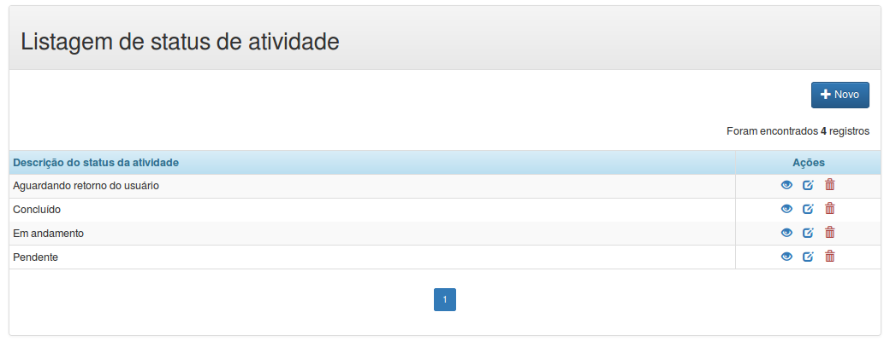{width="6.299212598425197in"
height="2.4220461504811897in"}

1.  &lt;?php

2.  require\_once dirname(\_\_FILE\_\_) . DIRECTORY\_SEPARATOR .
    '../template/header.php';

3.  showHeader();

4.  5.  require\_once BASE\_PATH .
    'public/status-atividade/queries.php';

6.  require\_once BASE\_PATH . 'src/pagination.php';

7.  8.  9.  //configurções para montar a paginação

10. \$recordsPerPage = 10;

11. \$totalRows = countRowsStatus();

12. \$limit = returnLimitToQuery(\['recordsPerPage' =&gt;
    \$recordsPerPage\]);

13. 14. \$status = getAllStatus(\['limit' =&gt; \$limit, 'offset' =&gt;
    \$recordsPerPage\]);

15. \$params = \['recordsPerPage' =&gt; \$recordsPerPage, 'totalRows'
    =&gt; \$totalRows, 'url' =&gt; SITE\_URL
    .'status-atividade/index.php'\];

16. 17. showMessage();

18. ?&gt;

19. &lt;div class="container"&gt;

20. &lt;div class="panel panel-default"&gt;

21. &lt;!-- Default panel contents --&gt;

22. &lt;div class="panel-heading"&gt;&lt;h2&gt;Listagem de status de
    atividade&lt;/h2&gt;&lt;/div&gt;

23. &lt;div class="panel-body text-right"&gt;

24. &lt;a href="&lt;?= SITE\_URL ?&gt;status-atividade/form.php"

25. class="btn btn-primary" title="Novo registro"&gt;

26. &lt;span class="glyphicon glyphicon-plus"&gt;&lt;/span&gt; Novo

27. &lt;/a&gt;

28. &lt;?php showTotalRegisters(\$totalRows); ?&gt;

29. &lt;/div&gt;

30. 31. &lt;?php if (\$status\['numRows'\] == 0): ?&gt;

32. &lt;div class="alert alert-warning"&gt;

33. &lt;h3 class="text-center"&gt;

34. &lt;span class="glyphicon glyphicon-warning-sign"&gt;&lt;/span&gt;

35. Nenhum registro encontrado

36. &lt;/h3&gt;

37. &lt;/div&gt;

38. &lt;?php else: ?&gt;

39. &lt;table class="table table-bordered table-striped
    table-condensed"&gt;

40. &lt;thead class="alert-info"&gt;

41. &lt;tr&gt;

42. &lt;th&gt;Descrição do status da atividade&lt;/th&gt;

43. &lt;th class="col-md-2 text-center"&gt;Ações&lt;/th&gt;

44. &lt;/tr&gt;

45. &lt;/thead&gt;

46. 47. &lt;tfoot&gt;

48. &lt;tr&gt;

49. &lt;td colspan="2" class="text-center"&gt;

50. &lt;?php showPagination(\$params); ?&gt;

51. &lt;/td&gt;

52. &lt;/tr&gt;

53. &lt;/tfoot&gt;

54. 55. &lt;tbody&gt;

56. &lt;?php for (\$i = 0; \$i &lt;= \$status\['numRows'\]-1; \$i++) :
    ?&gt;

57. &lt;tr&gt;

58. &lt;td&gt;&lt;?= \$status\['result'\]\[\$i\]\['status'\]
    ?&gt;&lt;/td&gt;

59. &lt;td class="col-md-2 text-center"&gt;

60. &lt;a href="&lt;?= SITE\_URL
    ?&gt;status-atividade/view.php?id=&lt;?=
    \$status\['result'\]\[\$i\]\['id'\] ?&gt;" title="Vizualizar"&gt;

61. &lt;span class="glyphicon glyphicon-eye-open"&gt;&lt;/span&gt;

62. &lt;/a&gt;&nbsp;&nbsp;

63. &lt;a href="&lt;?= SITE\_URL
    ?&gt;status-atividade/form.php?id=&lt;?=
    \$status\['result'\]\[\$i\]\['id'\] ?&gt;" title="Editar"&gt;

64. &lt;span class="glyphicon glyphicon-edit"&gt;&lt;/span&gt;

65. &lt;/a&gt;&nbsp;&nbsp;

66. &lt;a href="\#" id="&lt;?= SITE\_URL
    ?&gt;status-atividade/actions.php?action=delete&id=&lt;?=
    \$status\['result'\]\[\$i\]\['id'\] ?&gt;"

67. title="Excluir"&gt;&lt;span class="text-danger glyphicon
    glyphicon-trash"&gt;&lt;/span&gt;

68. &lt;/a&gt;

69. &lt;/td&gt;

70. &lt;/tr&gt;

71. &lt;?php endfor; ?&gt;

72. &lt;/tbody&gt;

73. &lt;/table&gt;

74. &lt;?php endif; ?&gt;

75. &lt;/div&gt;

76. &lt;/div&gt;

77. &lt;?php

78. require\_once dirname(\_\_FILE\_\_) . DIRECTORY\_SEPARATOR .
    '../template/footer.php';

79. showFooter(\['confirmDelete'\]);

80. 

*Salve em
/home/seu\_usuario/www/PHPBasico/atividades/public/status-atividade/index.php*.

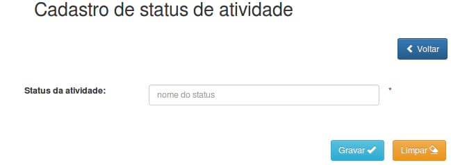{width="6.299212598425197in"
height="2.309841426071741in"}

1.  &lt;?php

2.  require\_once dirname(\_\_FILE\_\_) . DIRECTORY\_SEPARATOR .
    '../template/header.php';

3.  showHeader();

4.  require\_once BASE\_PATH . 'public/status-atividade/queries.php';

5.  require\_once BASE\_PATH . 'src/protectCSRF.php';

6.  7.  if (isset(\$\_REQUEST\['id'\])) :

8.  \$action = 'update';

9.  \$id = trim(\$\_REQUEST\['id'\]);

10. \$status = getStatusById(\$id);

11. 12. \$status = \$status\['status'\];

13. 14. else :

15. \$action = 'insert';

16. \$id = null;

17. \$status = null;

18. endif;

19. 20. ?&gt;

21. &lt;div class="container"&gt;

22. &lt;h2&gt;Cadastro de status de atividade&lt;/h2&gt;&lt;br /&gt;

23. 24. &lt;div class="row"&gt;

25. &lt;div class="col-md-6 col-md-offset-6"&gt;

26. &lt;a href="&lt;?= SITE\_URL ?&gt;status-atividade/index.php"

27. class="btn btn-primary" title="Voltar"&gt;

28. &lt;span class="glyphicon glyphicon-chevron-left"&gt;&lt;/span&gt;
    Voltar&lt;/a&gt;

29. &lt;?php if (\$id) : ?&gt;

30. &lt;a href="\#" id="&lt;?= SITE\_URL
    ?&gt;status-atividade/actions.php?action=delete&id=&lt;?= \$id
    ?&gt;"

31. title="Excluir" class="btn btn-danger"&gt;

32. &lt;span class="glyphicon glyphicon-trash"&gt;&lt;/span&gt;
    Excluir&lt;/a&gt;

33. &lt;?php endif; ?&gt;

34. &lt;/div&gt;

35. &lt;/div&gt;&lt;br /&gt;&lt;br /&gt;

36. 37. &lt;form class="form-horizontal" action="&lt;?= SITE\_URL
    ?&gt;status-atividade/actions.php" method="post"&gt;

38. &lt;input type="hidden" name="action" value="&lt;?= \$action
    ?&gt;"&gt;

39. &lt;input type="hidden" name="id" value="&lt;?= \$id ?&gt;"&gt;

40. &lt;input type="hidden" name="token" value="&lt;?= tokenGenerate()
    ?&gt;" /&gt;

41. 42. &lt;div class="form-group"&gt;

43. &lt;div class="row"&gt;

44. &lt;label for="nome" class="col-md-2"&gt;Status da
    atividade:&lt;/label&gt;

45. 46. &lt;div class="col-md-4"&gt;

47. &lt;input type="nome" class="form-control" name="status" id="status"
    placeholder="nome do status" maxlength="200" value="&lt;?= \$status
    ?&gt;" required&gt;&lt;br /&gt;

48. &lt;/div&gt;

49. &lt;span
    class="text-danger"&gt;&lt;strong&gt;\*&lt;/strong&gt;&lt;/span&gt;

50. &lt;/div&gt;

51. &lt;/div&gt;

52. 53. &lt;div class="form-group text-center"&gt;

54. &lt;br /&gt;

55. &lt;button type="submit" class="btn btn-info"&gt;Gravar &lt;span
    class="glyphicon
    glyphicon-ok"&gt;&lt;/span&gt;&lt;/button&gt;&nbsp;&nbsp;&nbsp;

56. &lt;button type="reset" name="reset" class="btn
    btn-warning"&gt;Limpar &lt;span class="glyphicon
    glyphicon-erase"&gt;&lt;/span&gt;&lt;/button&gt;

57. &lt;/div&gt;

58. &lt;/form&gt;

59. &lt;/div&gt;

60. &lt;?php

61. require\_once dirname(\_\_FILE\_\_) . DIRECTORY\_SEPARATOR .
    '../template/footer.php';

62. showFooter(\['confirmDelete'\]);

63. 

*Salve em
/home/seu\_usuario/www/PHPBasico/atividades/public/status-atividade/form.php*.

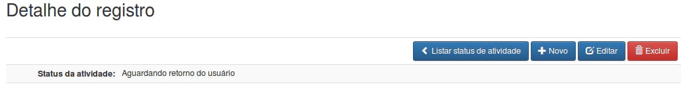{width="6.299212598425197in"
height="0.8456692913385827in"}

1.  &lt;?php

2.  require\_once dirname(\_\_FILE\_\_) . DIRECTORY\_SEPARATOR .
    '../template/header.php';

3.  showHeader();

4.  5.  require\_once BASE\_PATH .
    'public/status-atividade/queries.php';

6.  7.  if (isset(\$\_REQUEST\['id'\])) :

8.  \$id = trim(\$\_REQUEST\['id'\]);

9.  10. \$status = getStatusById(\$id);

11. 12. \$status = \$status\['status'\];

13. else :

14. header('location:' . SITE\_URL . 'status-atividade/index.php');

15. endif;

16. 17. showMessage();

18. ?&gt;

19. &lt;div class="container"&gt;

20. &lt;h2&gt;Detalhe do registro&lt;/h2&gt;&lt;br /&gt;

21. 22. &lt;table class="table table-bordered table-striped
    table-condensed"&gt;

23. &lt;thead&gt;

24. &lt;tr&gt;

25. &lt;th colspan="2" class="text-right"&gt;

26. &lt;a href="&lt;?= SITE\_URL ?&gt;status-atividade/index.php"

27. class="btn btn-primary" title="Voltar"&gt;

28. &lt;span class="glyphicon glyphicon-chevron-left"&gt;&lt;/span&gt;
    Listar status de atividade

29. &lt;/a&gt;

30. &lt;a href="&lt;?= SITE\_URL ?&gt;status-atividade/form.php"

31. class="btn btn-primary" title="Novo registro"&gt;

32. &lt;span class="glyphicon glyphicon-plus"&gt;&lt;/span&gt; Novo

33. &lt;/a&gt;

34. &lt;a href="&lt;?= SITE\_URL
    ?&gt;status-atividade/form.php?id=&lt;?= \$id ?&gt;"

35. class="btn btn-primary" title="Editar"&gt;

36. &lt;span class="glyphicon glyphicon-edit"&gt;&lt;/span&gt; Editar

37. &lt;/a&gt;

38. &lt;a href="\#"

39. id = "&lt;?= SITE\_URL
    ?&gt;status-atividade/actions.php?action=delete&id=&lt;?= \$id
    ?&gt;"

40. title="Excluir" class="btn btn-danger"&gt;

41. &lt;span class="glyphicon glyphicon-trash"&gt;&lt;/span&gt; Excluir

42. &lt;/a&gt;

43. &lt;/th&gt;

44. &lt;/tr&gt;

45. &lt;/thead&gt;

46. 47. &lt;tbody&gt;

48. &lt;tr&gt;

49. &lt;td class="text-right col-md-2"&gt;&lt;strong&gt;Status da
    atividade:&lt;/strong&gt;&lt;/td&gt;

50. &lt;td&gt;&lt;?= \$status ?&gt;&lt;/td&gt;

51. &lt;/tr&gt;

52. &lt;/tbody&gt;

53. &lt;/table&gt;

54. &lt;/div&gt;

55. &lt;?php

56. require\_once dirname(\_\_FILE\_\_) . DIRECTORY\_SEPARATOR .
    '../template/footer.php';

57. showFooter(\['confirmDelete'\]);

58. 

*Salve em
/home/seu\_usuario/www/PHPBasico/atividades/public/status-atividades/view.php*.

Usuários
--------

1.  &lt;?php

2.  session\_start();

3.  header('Content-Type: text/html; charset=utf-8');

4.  5.  require\_once dirname(\_\_FILE\_\_) . DIRECTORY\_SEPARATOR .
    '../../config/constants.php';

6.  require\_once BASE\_PATH . 'src/sessionVerify.php';

7.  8.  checkUserLogedIn();

9.  10. require\_once BASE\_PATH . 'src/protectCSRF.php';

11. require\_once BASE\_PATH . 'config/database.php';

12. require\_once BASE\_PATH . 'src/connection.php';

13. require\_once BASE\_PATH . 'src/prepareCrud.php';

14. 15. \$post = \$\_POST;

16. unset(\$post\['action'\]);

17. \$token = isset(\$post\['token'\]) ? trim(\$post\['token'\]) : null;

18. \$id = isset(\$post\['id'\]) ? \$post\['id'\] : \$\_GET\['id'\];

19. \$action = isset(\$\_POST\['action'\]) ? trim(\$\_POST\['action'\])
    : trim(\$\_GET\['action'\]);

20. 21. switch (\$action) {

22. case 'insert':

23. checkTokenIsValid(\$token);

24. unset(\$post\['id'\]);

25. unset(\$post\['token'\]);

26. 27. if (\$id = insert('usuarios', \$post)) {

28. \$\_SESSION\['success'\] = 'Registro gravado com sucesso. ';

29. } else {

30. \$\_SESSION\['error'\] = 'Não foi possível gravar o registro.';

31. }

32. 33. header('location: ' . SITE\_URL . 'usuarios/view.php?id=' .
    \$id);

34. break;

35. 36. case 'update':

37. checkTokenIsValid(\$token);

38. unset(\$post\['id'\]);

39. unset(\$post\['token'\]);

40. 41. if (update('usuarios', \$post, \['id' =&gt; \$id\])) {

42. \$\_SESSION\['success'\] = 'Registro alterado com sucesso. ';

43. } else {

44. \$\_SESSION\['error'\] = 'Não foi possível aletrar o registro.';

45. }

46. 47. header('location: ' . SITE\_URL . 'usuarios/view.php?id=' .
    \$id);

48. break;

49. 50. case 'delete':

51. if (delete('usuarios', \['id' =&gt; \$id\])) {

52. \$\_SESSION\['success'\] = 'Registro exluido com sucesso. ';

53. } else {

54. \$\_SESSION\['error'\] = 'Não foi possível excluir o registro.';

55. }

56. 57. header('location: ' . SITE\_URL . 'usuarios/index.php');

58. break;

59. }

60. 61. function insert(\$table, \$params)

62. {

63. // Atribui a instrução SQL construida no método

64. \$sql = buildInsert(\$table, \$params);

65. 66. \$conn = dbConnect();

67. \$options = \['cost' =&gt; 10\];

68. 69. extract(\$params);

70. 71. \$nome = antiInjection(\$nome);

72. \$email = antiInjection(\$email);

73. \$senha = password\_hash (antiInjection(\$senha), PASSWORD\_DEFAULT,
    \$options);

74. \$ativo = antiInjection(\$ativo);

75. \$idSetor = antiInjection(\$id\_setor);

76. \$tipo = antiInjection(\$tipo);

77. 78. \$stmt = mysqli\_prepare(\$conn, \$sql);

79. mysqli\_stmt\_bind\_param(\$stmt, 'ssssis', \$nome, \$email,
    \$senha, \$ativo, \$idSetor, \$tipo);

80. 81. if (!mysqli\_stmt\_execute(\$stmt)) {

82. \$return = false;

83. } else {

84. \$return = mysqli\_insert\_id(\$conn);

85. }

86. mysqli\_stmt\_close(\$stmt);

87. dbClose(\$conn);

88. 89. return \$return;

90. }

91. 92. function update(\$table, \$params, \$paramConditions)

93. {

94. // Atribui a instrução SQL construida no método

95. \$sql = buildUpdate(\$table, \$params, \$paramConditions);

96. 97. \$conn = dbConnect();

98. extract(\$paramConditions);

99. extract(\$params);

100. 101. \$nome = antiInjection(\$nome);

102. \$email = antiInjection(\$email);

103. \$ativo = antiInjection(\$ativo);

104. \$idSetor = antiInjection(\$id\_setor);

105. \$tipo = antiInjection(\$tipo);

106. \$id = antiInjection(\$id);

107. 108. \$stmt = mysqli\_prepare(\$conn, \$sql);

109. mysqli\_stmt\_bind\_param(\$stmt, 'sssisi', \$nome, \$email,
    \$ativo, \$idSetor, \$tipo, \$id);

110. 111. if (!mysqli\_stmt\_execute(\$stmt)) {

112. \$return = false;

113. } else {

114. \$return = true;

115. }

116. mysqli\_stmt\_close(\$stmt);

117. 118. dbClose(\$conn);

119. 120. return \$return;

121. }

122. 123. function delete(\$table, \$paramConditions)

124. {

125. // Atribui a instrução SQL construida no método

126. \$sql = buildDelete(\$table, \$paramConditions);

127. 128. \$conn = dbConnect();

129. extract(\$paramConditions);

130. \$id = antiInjection(\$id);

131. 132. \$stmt = mysqli\_prepare(\$conn, \$sql);

133. mysqli\_stmt\_bind\_param(\$stmt, 'i', \$id);

134. 135. if (!mysqli\_stmt\_execute(\$stmt)) {

136. \$return = false;

137. } else {

138. \$return = true;

139. }

140. mysqli\_stmt\_close(\$stmt);

141. 142. dbClose(\$conn);

143. 144. return \$return;

145. }

146. 

*Salve em
/home/seu\_usuario/www/PHPBasico/atividades/public/usuarios/actions.php*.

1.  &lt;?php

2.  require\_once dirname(\_\_FILE\_\_) . DIRECTORY\_SEPARATOR .
    '../../config/constants.php';

3.  require\_once BASE\_PATH . 'src/sessionVerify.php';

4.  5.  checkUserLogedIn();

6.  7.  /\*

8.  \* Esse arquivo serve para gerar qualquer tipo de consulta

9.  \* a função buildSelect, monta estruturas complexas de consulta

10. \* verifique a documentação direto da própria função

11. \* o primeiro parametro é o nome da tabela, o segundo é um array

12. \*/

13. function countRowsUsers()

14. {

15. \$connection = dbConnect();

16. \$options = \[

17. 'columns' =&gt; 'count(id) as totalRows',

18. \];

19. \$sql = buildSelect('usuarios', \$options);

20. \$qry = mysqli\_query(\$connection, \$sql);

21. \$result = mysqli\_fetch\_array(\$qry, MYSQLI\_ASSOC);

22. mysqli\_free\_result(\$qry);

23. 24. dbClose(\$connection);

25. 26. return \$result\['totalRows'\];

27. }

28. 29. //Recupera todos os dados da tabela

30. function getAllUsers(\$params){

31. \$connection = dbConnect();

32. 33. \$options = \[

34. 'columns' =&gt; 'u.id, u.nome, u.ativo, u.tipo, u.ultimo\_login,
    s.sigla',

35. 'order\_by' =&gt; 'u.nome, u.ultimo\_login ASC',

36. 'join' =&gt; \[\['type' =&gt; 'INNER JOIN', 'table' =&gt; 'setores
    s', 'columns' =&gt; 's.id = u.id\_setor'\]\],

37. 'limit' =&gt; \$params\['limit'\] . ', ' . \$params\['offset'\],

38. \];

39. 40. \$sql = buildSelect('usuarios u', \$options);

41. 42. \$qry = mysqli\_query(\$connection, \$sql);

43. \$result = mysqli\_fetch\_all(\$qry, MYSQLI\_ASSOC);

44. \$numRows = mysqli\_num\_rows(\$qry);

45. mysqli\_free\_result(\$qry);

46. 47. dbClose(\$connection);

48. 49. return \['result' =&gt; \$result, 'numRows' =&gt; \$numRows\];

50. }

51. 52. 53. //Recupera todos os dados da tabela

54. function getListUsers(){

55. \$connection = dbConnect();

56. 57. \$options = \[

58. 'columns' =&gt; 'id, nome',

59. \];

60. 61. \$sql = buildSelect('usuarios', \$options);

62. 63. \$qry = mysqli\_query(\$connection, \$sql);

64. \$result = mysqli\_fetch\_all(\$qry, MYSQLI\_ASSOC);

65. mysqli\_free\_result(\$qry);

66. 67. dbClose(\$connection);

68. 69. array\_unshift(\$result, \['id' =&gt; '', 'nome' =&gt; ''\]);

70. 71. return \$result;

72. }

73. 74. function getUserById(\$id)

75. {

76. \$connection = dbConnect();

77. 78. \$options = \[

79. 'columns' =&gt; 'u.id\_setor, u.nome, u.email, u.ativo, u.tipo,
    s.sigla, s.nome as setor',

80. 'join' =&gt; \[\['type' =&gt; 'INNER JOIN', 'table' =&gt; 'setores
    s', 'columns' =&gt; 's.id = u.id\_setor'\]\],

81. 'where' =&gt; \['u.id' =&gt; \$id\],

82. \];

83. 84. \$sql = buildSelect('usuarios u', \$options);

85. 86. \$stmt = mysqli\_prepare(\$connection, \$sql);

87. mysqli\_stmt\_bind\_param(\$stmt, 'i', \$id);

88. mysqli\_stmt\_execute(\$stmt);

89. 90. \$resultObject = mysqli\_stmt\_get\_result(\$stmt);

91. \$result = mysqli\_fetch\_all(\$resultObject, MYSQLI\_ASSOC);

92. mysqli\_stmt\_close(\$stmt);

93. 94. dbClose(\$connection);

95. 96. return \$result\[0\];

97. }

98. 

*Salve em
/home/seu\_usuario/www/PHPBasico/atividades/public/usuarios/queries.php*.

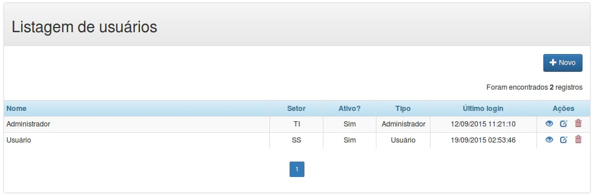{width="6.299212598425197in"
height="2.0811023622047244in"}

1.  &lt;?php

2.  require\_once dirname(\_\_FILE\_\_) . DIRECTORY\_SEPARATOR .
    '../template/header.php';

3.  showHeader();

4.  5.  require\_once BASE\_PATH . 'public/usuarios/queries.php';

6.  require\_once BASE\_PATH . 'src/pagination.php';

7.  8.  //configurções para montar a paginação

9.  \$recordsPerPage = 10;

10. \$totalRows = countRowsUsers();

11. \$limit = returnLimitToQuery(\['recordsPerPage' =&gt;
    \$recordsPerPage\]);

12. 13. \$users = getAllUsers(\['limit' =&gt; \$limit, 'offset' =&gt;
    \$recordsPerPage\]);

14. \$params = \['recordsPerPage' =&gt; \$recordsPerPage, 'totalRows'
    =&gt; \$totalRows, 'url' =&gt; SITE\_URL .'usuarios/index.php'\];

15. 16. showMessage();

17. ?&gt;

18. &lt;div class="container"&gt;

19. &lt;div class="panel panel-default"&gt;

20. &lt;!-- Default panel contents --&gt;

21. &lt;div class="panel-heading"&gt;&lt;h2&gt;Listagem de
    usuários&lt;/h2&gt;&lt;/div&gt;

22. &lt;div class="panel-body text-right"&gt;

23. &lt;a href="&lt;?= SITE\_URL ?&gt;usuarios/form.php"

24. class="btn btn-primary" title="Novo registro"&gt;

25. &lt;span class="glyphicon glyphicon-plus"&gt;&lt;/span&gt; Novo

26. &lt;/a&gt;

27. &lt;?php showTotalRegisters(\$totalRows); ?&gt;

28. &lt;/div&gt;

29. 30. &lt;?php if (\$users\['numRows'\] == 0): ?&gt;

31. &lt;div class="alert alert-warning"&gt;

32. &lt;h3 class="text-center"&gt;

33. &lt;span class="glyphicon glyphicon-warning-sign"&gt;&lt;/span&gt;

34. Nenhum registro encontrado

35. &lt;/h3&gt;

36. &lt;/div&gt;

37. &lt;?php else: ?&gt;

38. &lt;table class="table table-bordered table-striped
    table-condensed"&gt;

39. &lt;thead class="alert-info"&gt;

40. &lt;tr&gt;

41. &lt;th class="col-md-5" &gt;Nome&lt;/th&gt;

42. &lt;th class="col-md-1 text-center"&gt;Setor&lt;/th&gt;

43. &lt;th class="col-md-1 text-center"&gt;Ativo?&lt;/th&gt;

44. &lt;th class="col-md-1 text-center"&gt;Tipo&lt;/th&gt;

45. &lt;th class="col-md-2 text-center"&gt;Último login&lt;/th&gt;

46. &lt;th class="col-md-1 text-center"&gt;Ações&lt;/th&gt;

47. &lt;/tr&gt;

48. &lt;/thead&gt;

49. 50. &lt;tfoot&gt;

51. &lt;tr&gt;

52. &lt;td colspan="6" class="text-center"&gt;

53. &lt;?php showPagination(\$params); ?&gt;

54. &lt;/td&gt;

55. &lt;/tr&gt;

56. &lt;/tfoot&gt;

57. 58. &lt;tbody&gt;

59. &lt;?php for (\$i = 0; \$i &lt;= \$users\['numRows'\]-1; \$i++) :
    ?&gt;

60. &lt;tr&gt;

61. &lt;td&gt;&lt;?= \$users\['result'\]\[\$i\]\['nome'\]
    ?&gt;&lt;/td&gt;

62. &lt;td class="text-center"&gt;&lt;?=
    \$users\['result'\]\[\$i\]\['sigla'\] ?&gt;&lt;/td&gt;

63. &lt;td class="text-center"&gt;&lt;?=
    \$users\['result'\]\[\$i\]\['ativo'\] ?&gt;&lt;/td&gt;

64. &lt;td class="text-center"&gt;&lt;?=
    \$users\['result'\]\[\$i\]\['tipo'\] ?&gt;&lt;/td&gt;

65. &lt;td class="text-center"&gt;&lt;?= date('d/m/Y
    h:i:s', strtotime(\$users\['result'\]\[\$i\]\['ultimo\_login'\]))
    ?&gt;&lt;/td&gt;

66. &lt;td class="text-center"&gt;

67. &lt;a href="&lt;?= SITE\_URL ?&gt;usuarios/view.php?id=&lt;?=
    \$users\['result'\]\[\$i\]\['id'\] ?&gt;" title="Vizualizar"&gt;

68. &lt;span class="glyphicon glyphicon-eye-open"&gt;&lt;/span&gt;

69. &lt;/a&gt;&nbsp;&nbsp;

70. &lt;a href="&lt;?= SITE\_URL ?&gt;usuarios/form.php?id=&lt;?=
    \$users\['result'\]\[\$i\]\['id'\] ?&gt;" title="Editar"&gt;

71. &lt;span class="glyphicon glyphicon-edit"&gt;&lt;/span&gt;

72. &lt;/a&gt;&nbsp;&nbsp;

73. &lt;a href="\#" id="&lt;?= SITE\_URL
    ?&gt;usuarios/actions.php?action=delete&id=&lt;?=
    \$users\['result'\]\[\$i\]\['id'\] ?&gt;"

74. title="Excluir"&gt;&lt;span class="text-danger glyphicon
    glyphicon-trash"&gt;&lt;/span&gt;

75. &lt;/a&gt;

76. &lt;/td&gt;

77. &lt;/tr&gt;

78. &lt;?php endfor; ?&gt;

79. &lt;/tbody&gt;

80. &lt;/table&gt;

81. &lt;?php endif; ?&gt;

82. &lt;/div&gt;

83. &lt;/div&gt;

84. &lt;?php

85. require\_once dirname(\_\_FILE\_\_) . DIRECTORY\_SEPARATOR .
    '../template/footer.php';

86. showFooter(\['confirmDelete'\]);

87. 

*Salve em
/home/seu\_usuario/www/PHPBasico/atividades/public/usuarios/index.php*.

1.  &lt;?php

2.  header('Content-Type: text/html;
    charset=utf-8');header('Content-Type: text/html; charset=utf-8');

3.  /\*

4.  \* PHP PCRE - How to validate complex passwords using regular
    expressions

5.  \* Script base:
    https://gist.github.com/danielpereirabp/4b37984360e6dae5ec6a

6.  \* From: danielpereirabp on github

7.  \*/

8.  9.  function passwordIsStrong(\$string) {

10. if
    (!preg\_match\_all('\$\\S\*(?=\\S{8,})(?=\\S\*\[a-z\])(?=\\S\*\[A-Z\])(?=\\S\*\[\\d\])(?=\\S\*\[\\W\])\\S\*\$', \$string))

11. return false;

12. 13. return true;

14. }

15. 16. \$password = isset(\$\_POST\['senha'\])
    ? trim(\$\_POST\['senha'\]) : '';

17. 18. echo json\_encode(passwordIsStrong(\$password));

19. /\*

20. Explaining
    \$\\S\*(?=\\S{8,})(?=\\S\*\[a-z\])(?=\\S\*\[A-Z\])(?=\\S\*\[\\d\])(?=\\S\*\[\\W\])\\S\*\$

21. \$ = beginning of string

22. \\S\* = any set of characters

23. (?=\\S{8,}) = of at least length 8

24. (?=\\S\*\[a-z\]) = containing at least one lowercase letter

25. (?=\\S\*\[A-Z\]) = and at least one uppercase letter

26. (?=\\S\*\[\\d\]) = and at least one number

27. (?=\\S\*\[\\W\]) = and at least a special character
    (non-word characters)

28. \$ = end of the string

29. \*/

30. 

*Salve em
/home/seu\_usuario/www/PHPBasico/atividades/public/usuarios/passwordIsStrong.php*.

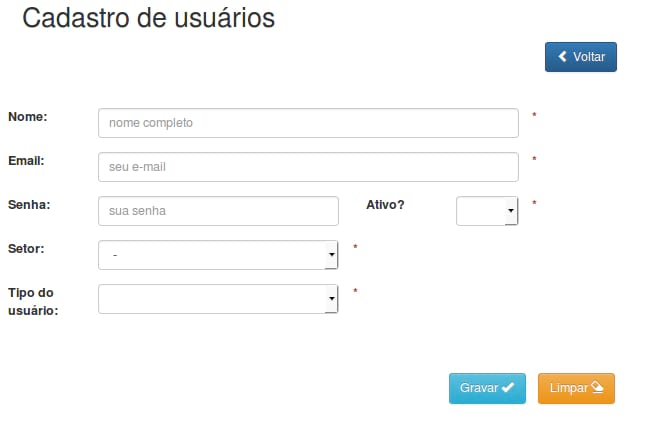{width="6.299212598425197in"
height="4.130708661417323in"}

1.  &lt;?php

2.  require\_once dirname(\_\_FILE\_\_) . DIRECTORY\_SEPARATOR .
    '../template/header.php';

3.  showHeader();

4.  5.  require\_once BASE\_PATH . 'public/usuarios/queries.php';

6.  require\_once BASE\_PATH . 'public/setores/queries.php';

7.  require\_once BASE\_PATH . 'src/protectCSRF.php';

8.  9.  \$activeList = \['' =&gt; '', 'Sim' =&gt; 'Sim', 'Não' =&gt;
    'Não'\];

10. \$departmentList = getListDepartments(); //Popula a selectbox
    Setores;

11. \$typeList = \['' =&gt; '', 'Administrador' =&gt; 'Administrador',
    'Usuário' =&gt; 'Usuário'\];

12. \$disabled = null;

13. 14. if (isset(\$\_REQUEST\['id'\])) :

15. \$action = 'update';

16. \$id = trim(\$\_REQUEST\['id'\]);

17. 18. \$user = getUserById(\$id);

19. 20. \$nome = \$user\['nome'\];

21. \$email = \$user\['email'\];

22. \$senha = null;

23. \$ativo = \$user\['ativo'\];

24. \$id\_setor = \$user\['id\_setor'\];

25. \$tipo = \$user\['tipo'\];

26. \$disabled = 'disabled';

27. else :

28. \$action = 'insert';

29. \$id = null;

30. \$nome = null;

31. \$email = null;

32. \$senha = null;

33. endif;

34. 35. ?&gt;

36. &lt;div class="container"&gt;

37. &lt;h2&gt;Cadastro de usuários&lt;/h2&gt;

38. 39. &lt;div class="row"&gt;

40. &lt;div class="col-md-6 col-md-offset-6"&gt;

41. &lt;a href="&lt;?= SITE\_URL ?&gt;usuarios/index.php"

42. class="btn btn-primary" title="Voltar"&gt;

43. &lt;span class="glyphicon glyphicon-chevron-left"&gt;&lt;/span&gt;
    Voltar&lt;/a&gt;

44. &lt;?php if (\$id) : ?&gt;

45. &lt;a href="\#" id="&lt;?= SITE\_URL
    ?&gt;usuarios/actions.php?action=delete&id=&lt;?= \$id ?&gt;"

46. title="Excluir" class="btn btn-danger"&gt;

47. &lt;span class="glyphicon glyphicon-trash"&gt;&lt;/span&gt;
    Excluir&lt;/a&gt;

48. &lt;?php endif; ?&gt;

49. &lt;/div&gt;

50. &lt;/div&gt;&lt;br /&gt;&lt;br /&gt;

51. 52. &lt;form class="form-horizontal" action="&lt;?= SITE\_URL
    ?&gt;usuarios/actions.php" method="post"&gt;

53. &lt;input type="hidden" name="action" value="&lt;?= \$action
    ?&gt;"&gt;

54. &lt;input type="hidden" name="id" value="&lt;?= \$id ?&gt;"&gt;

55. &lt;input type="hidden" name="token" value="&lt;?= tokenGenerate()
    ?&gt;" /&gt;

56. 57. &lt;div class="form-group"&gt;

58. &lt;div class="row"&gt;

59. &lt;label for="nome" class="col-md-1"&gt;Nome: &lt;/label&gt;

60. &lt;div class="col-md-5"&gt;

61. &lt;input type="text" class="form-control" name="nome"

62. id="nome" value="&lt;?= \$nome ?&gt;" placeholder="nome completo"

63. maxlength="200" required&gt;

64. &lt;/div&gt;

65. &lt;span
    class="text-danger"&gt;&lt;strong&gt;\*&lt;/strong&gt;&lt;/span&gt;

66. &lt;/div&gt;

67. &lt;/div&gt;

68. 69. &lt;div class="form-group"&gt;

70. &lt;div class="row"&gt;

71. &lt;label for="email" class="col-md-1"&gt;Email: &lt;/label&gt;

72. &lt;div class="col-md-5"&gt;

73. &lt;input type="email" class="form-control" name="email"

74. id="email" value="&lt;?= \$email ?&gt;" placeholder="seu e-mail"

75. maxlength="200" required&gt;

76. &lt;/div&gt;

77. &lt;span
    class="text-danger"&gt;&lt;strong&gt;\*&lt;/strong&gt;&lt;/span&gt;

78. &lt;/div&gt;

79. &lt;/div&gt;

80. 81. &lt;div class="form-group"&gt;

82. &lt;div class="row"&gt;

83. &lt;label for="senha" class="col-md-1"&gt;Senha: &lt;/label&gt;

84. &lt;div class="col-md-3"&gt;

85. &lt;input type="password" class="form-control" name="senha"

86. id="senha" placeholder="sua senha" maxlength="20"

87. &lt;?= \$disabled ?&gt;&gt;

88. &lt;/div&gt;

89. &lt;span
    class="text-danger"&gt;&lt;strong&gt;\*&lt;/strong&gt;&lt;/span&gt;

90. 91. &lt;label for="ativo" class="col-md-1"&gt;Ativo?&lt;/label&gt;

92. &lt;div class="col-md-1"&gt;

93. &lt;select class="form-control" name="ativo" id="ativo" required&gt;

94. &lt;?php

95. foreach (\$activeList as \$id =&gt; \$value) :

96. if (\$id == \$ativo) {

97. \$selected = "selected";

98. } else {

99. \$selected = '';

100. }

101. ?&gt;

102. &lt;option value="&lt;?= \$id ?&gt;" &lt;?=
    \$selected?&gt;&gt;&lt;?= \$value ?&gt;&lt;/option&gt;

103. &lt;?php endforeach; ?&gt;

104. &lt;/select&gt;

105. &lt;/div&gt;

106. &lt;/div&gt;

107. &lt;/div&gt;

108. 109. &lt;div class="form-group"&gt;

110. &lt;div class="row"&gt;

111. &lt;label for="setor" class="col-md-1"&gt;Setor: &lt;/label&gt;

112. &lt;div class="col-md-3"&gt;

113. &lt;select class="form-control" name="id\_setor" id="id\_setor"
    required&gt;

114. &lt;?php

115. foreach (\$departmentList as \$lista) :

116. if (\$id\_setor == \$lista\['id'\]) {

117. \$selected = "selected";

118. } else {

119. \$selected = '';

120. }

121. ?&gt;

122. &lt;option value="&lt;?= \$lista\['id'\] ?&gt;" &lt;?=
    \$selected?&gt;&gt;

123. &lt;?= \$lista\['sigla'\] ?&gt; - &lt;?= \$lista\['nome'\] ?&gt;

124. &lt;/option&gt;

125. &lt;?php endforeach; ?&gt;

126. &lt;/select&gt;

127. &lt;/div&gt;

128. &lt;span
    class="text-danger"&gt;&lt;strong&gt;\*&lt;/strong&gt;&lt;/span&gt;

129. &lt;/div&gt;

130. &lt;/div&gt;

131. 132. &lt;div class="form-group"&gt;

133. &lt;div class="row"&gt;

134. &lt;label for="tipo" class="col-md-1"&gt;Tipo do
    usuário:&lt;/label&gt;

135. 136. &lt;div class="col-md-3"&gt;

137. &lt;select class="form-control" name="tipo" id="tipo" required&gt;

138. &lt;?php foreach (\$typeList as \$id =&gt; \$value) :

139. if (\$id == \$tipo) {

140. \$selected = "selected";

141. } else {

142. \$selected = '';

143. }

144. ?&gt;

145. &lt;option value="&lt;?= \$id ?&gt;" &lt;?=
    \$selected?&gt;&gt;&lt;?= \$value ?&gt;&lt;/option&gt;

146. &lt;?php endforeach; ?&gt;

147. &lt;/select&gt;

148. &lt;/div&gt;

149. &lt;span
    class="text-danger"&gt;&lt;strong&gt;\*&lt;/strong&gt;&lt;/span&gt;

150. &lt;/div&gt;

151. &lt;/div&gt;

152. 153. &lt;div class="form-group text-center"&gt;

154. &lt;br /&gt;&lt;br /&gt;

155. &lt;button type="submit" class="btn btn-info"&gt;Gravar &lt;span
    class="glyphicon
    glyphicon-ok"&gt;&lt;/span&gt;&lt;/button&gt;&nbsp;&nbsp;&nbsp;

156. &lt;button type="reset" name="reset" class="btn
    btn-warning"&gt;Limpar &lt;span class="glyphicon
    glyphicon-erase"&gt;&lt;/span&gt;&lt;/button&gt;

157. &lt;/div&gt;

158. &lt;/form&gt;

159. &lt;/div&gt;

160. &lt;?php

161. require\_once dirname(\_\_FILE\_\_) . DIRECTORY\_SEPARATOR .
    '../template/footer.php';

162. showFooter(\['confirmDelete', 'ajaxFormUsers'\]);

163. 

*Salve em
/home/seu\_usuario/www/PHPBasico/atividades/public/usuarios/form.php*.

Vimos no arquivo acima uma chamada no footer do ***ajaxFormUsers***,
esse arquivo, nada mais e que um script em JavaScript que utiliza o
jQuey com AJAX para verificar a força da senha, chamando o script
**passwordIsStrong.php**.

\$(document).ready(function(){

\$('\#senha').blur(function(){

passwordValidate();

});

\$(':submit').click(function(){

passwordValidate();

});

function passwordValidate() {

var url =

window.location.protocol + "//" +

window.location.host + "/" +

'CursoPHP/PHPBasico/atividades/public/usuarios/passwordIsStrong.php';

\$.ajax({

type: 'POST',

url: url,

data: {

senha: \$('\#senha').val()

},

dataType: 'json',

success: function(dataJson) {

if (dataJson === false) {

alert('Sua senha é muito fraca! \\nUtilize pelo menos: \\n\\nOito
caracteres; \\nUm número; \\nUm caracter especial; \\nUma letra
maíuscula; \\nUma letra minúscula.');

}

}

});

}

});

*Salve em
/home/seu\_usuario/www/PHPBasico/atividades/public/assets/js/ajaxFormUsers.js*.

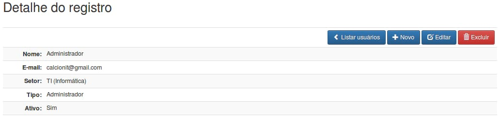{width="6.299212598425197in"
height="1.5102351268591425in"}

1.  &lt;?php

2.  require\_once dirname(\_\_FILE\_\_) . DIRECTORY\_SEPARATOR .
    '../template/header.php';

3.  showHeader();

4.  5.  require\_once BASE\_PATH . 'public/usuarios/queries.php';

6.  7.  if (isset(\$\_REQUEST\['id'\])) :

8.  \$id = trim(\$\_REQUEST\['id'\]);

9.  10. \$user = getUserById(\$id);

11. 12. \$nome = \$user\['nome'\];

13. \$email = \$user\['email'\];

14. \$ativo = \$user\['ativo'\];

15. \$tipo = \$user\['tipo'\];

16. \$sigla = \$user\['sigla'\];

17. \$setor = \$user\['setor'\];

18. 19. else :

20. header('location:' . SITE\_URL . 'usuarios/index.php');

21. endif;

22. 23. showMessage();

24. ?&gt;

25. &lt;div class="container"&gt;

26. &lt;h2&gt;Detalhe do registro&lt;/h2&gt;&lt;br /&gt;

27. 28. &lt;table class="table table-bordered table-striped
    table-condensed"&gt;

29. &lt;thead&gt;

30. &lt;tr&gt;

31. &lt;th colspan="2" class="text-right"&gt;

32. &lt;a href="&lt;?= SITE\_URL ?&gt;usuarios/index.php"

33. class="btn btn-primary" title="Voltar"&gt;

34. &lt;span class="glyphicon glyphicon-chevron-left"&gt;&lt;/span&gt;
    Listar usuários

35. &lt;/a&gt;

36. &lt;a href="&lt;?= SITE\_URL ?&gt;usuarios/form.php"

37. class="btn btn-primary" title="Novo registro"&gt;

38. &lt;span class="glyphicon glyphicon-plus"&gt;&lt;/span&gt; Novo

39. &lt;/a&gt;

40. &lt;a href="&lt;?= SITE\_URL ?&gt;usuarios/form.php?id=&lt;?= \$id
    ?&gt;"

41. class="btn btn-primary" title="Editar"&gt;

42. &lt;span class="glyphicon glyphicon-edit"&gt;&lt;/span&gt; Editar

43. &lt;/a&gt;

44. &lt;a href="\#"

45. id = "&lt;?= SITE\_URL
    ?&gt;usuarios/actions.php?action=delete&id=&lt;?= \$id ?&gt;"

46. title="Excluir" class="btn btn-danger"&gt;

47. &lt;span class="glyphicon glyphicon-trash"&gt;&lt;/span&gt; Excluir

48. &lt;/a&gt;

49. &lt;/th&gt;

50. &lt;/tr&gt;

51. &lt;/thead&gt;

52. 53. &lt;tbody&gt;

54. &lt;tr&gt;

55. &lt;td
    class="text-right"&gt;&lt;strong&gt;Nome:&lt;/strong&gt;&lt;/td&gt;

56. &lt;td&gt;&lt;?= \$nome ?&gt;&lt;/td&gt;

57. &lt;/tr&gt;

58. &lt;tr&gt;

59. &lt;td class="col-md-1
    text-right"&gt;&lt;strong&gt;E-mail:&lt;/strong&gt;&lt;/td&gt;

60. &lt;td&gt;&lt;?= \$email ?&gt;&lt;/td&gt;

61. &lt;/tr&gt;

62. &lt;tr&gt;

63. &lt;td class="col-md-1
    text-right"&gt;&lt;strong&gt;Setor:&lt;/strong&gt;&lt;/td&gt;

64. &lt;td&gt;&lt;?= \$sigla ?&gt; (&lt;?= \$setor ?&gt;)&lt;/td&gt;

65. &lt;/tr&gt;

66. &lt;tr&gt;

67. &lt;td class="col-md-1
    text-right"&gt;&lt;strong&gt;Tipo:&lt;/strong&gt;&lt;/td&gt;

68. &lt;td&gt;&lt;?= \$tipo ?&gt;&lt;/td&gt;

69. &lt;/tr&gt;

70. &lt;tr&gt;

71. &lt;td class="col-md-1
    text-right"&gt;&lt;strong&gt;Ativo:&lt;/strong&gt;&lt;/td&gt;

72. &lt;td&gt;&lt;?= \$ativo ?&gt;&lt;/td&gt;

73. &lt;/tr&gt;

74. &lt;/tbody&gt;

75. &lt;/table&gt;

76. &lt;/div&gt;

77. &lt;?php

78. require\_once dirname(\_\_FILE\_\_) . DIRECTORY\_SEPARATOR .
    '../template/footer.php';

79. showFooter(\['confirmDelete'\]);

80. 

*Salve em
/home/seu\_usuario/www/PHPBasico/atividades/public/usuarios/view.php*.

### 

### Atividades

1.  &lt;?php

2.  session\_start();

3.  header('Content-Type: text/html; charset=utf-8');

4.  5.  require\_once dirname(\_\_FILE\_\_) . DIRECTORY\_SEPARATOR .
    '../../config/constants.php';

6.  require\_once BASE\_PATH . 'src/sessionVerify.php';

7.  checkUserLogedIn();

8.  9.  require\_once BASE\_PATH . 'src/protectCSRF.php';

10. require\_once BASE\_PATH . 'config/database.php';

11. require\_once BASE\_PATH . 'src/connection.php';

12. require\_once BASE\_PATH . 'src/prepareCrud.php';

13. 14. \$post = \$\_POST;

15. unset(\$post\['action'\]);

16. \$token = isset(\$post\['token'\]) ? trim(\$post\['token'\]) : null;

17. \$id = isset(\$post\['id'\]) ? \$post\['id'\] : \$\_GET\['id'\];

18. \$action = isset(\$\_POST\['action'\]) ? trim(\$\_POST\['action'\])
    : trim(\$\_GET\['action'\]);

19. 20. switch (\$action) {

21. case 'insert':

22. checkTokenIsValid(\$token);

23. unset(\$post\['id'\]);

24. unset(\$post\['token'\]);

25. unset(\$post\['setor'\]);

26. 27. if (\$id = insert('atividades', \$post)) {

28. \$\_SESSION\['success'\] = 'Registro gravado com sucesso. ';

29. } else {

30. \$\_SESSION\['error'\] = 'Não foi possível gravar o registro.';

31. }

32. 33. header('location: ' . SITE\_URL . 'atividades/view.php?id=' .
    \$id);

34. break;

35. 36. case 'update':

37. checkTokenIsValid(\$token);

38. unset(\$post\['id'\]);

39. unset(\$post\['token'\]);

40. 41. if (update('atividades', \$post, \['id' =&gt; \$id\])) {

42. \$\_SESSION\['success'\] = 'Registro alterado com sucesso. ';

43. } else {

44. \$\_SESSION\['error'\] = 'Não foi possível aletrar o registro.';

45. }

46. 47. header('location: ' . SITE\_URL . 'atividades/view.php?id=' .
    \$id);

48. break;

49. 50. case 'delete':

51. if (delete('atividades', \['id' =&gt; \$id\])) {

52. \$\_SESSION\['success'\] = 'Registro exluido com sucesso. ';

53. } else {

54. \$\_SESSION\['error'\] = 'Não foi possível excluir o registro.';

55. }

56. 57. header('location: ' . SITE\_URL . 'atividades/index.php');

58. break;

59. 60. case 'ajaxPopulateDepartment':

61. checkTokenIsValid(\$token);

62. echo json\_encode(getDepartments(\$id));

63. 64. break;

65. }

66. 67. function insert(\$table, \$params)

68. {

69. // Atribui a instrução SQL construida no método

70. \$sql = buildInsert(\$table, \$params);

71. 72. \$conn = dbConnect();

73. extract(\$params);

74. 75. \$idDemandante = antiInjection(\$id\_demandante);

76. \$idSetor = antiInjection(\$id\_setor);

77. \$idStatus = antiInjection(\$id\_status);

78. \$idResponsavel = antiInjection(\$id\_responsavel);

79. \$titulo = antiInjection(\$titulo);

80. \$descricao = antiInjection(\$descricao);

81. \$data = str\_replace('/', '-', antiInjection(\$data));

82. \$data = date('Y-m-d', strtotime(\$data));

83. \$tempoGasto = str\_replace(\['AM', 'PM'\], '',
    antiInjection(\$tempo\_gasto));

84. 85. \$stmt = mysqli\_prepare(\$conn, \$sql);

86. mysqli\_stmt\_bind\_param(\$stmt, 'iiisisss', \$idResponsavel,
    \$idSetor,

87. \$idDemandante, \$titulo, \$idStatus, \$descricao, \$data,
    \$tempoGasto);

88. 89. if (!mysqli\_stmt\_execute(\$stmt)) {

90. \$return = false;

91. } else {

92. \$return = mysqli\_insert\_id(\$conn);

93. }

94. mysqli\_stmt\_close(\$stmt);

95. dbClose(\$conn);

96. 97. return \$return;

98. }

99. 100. function update(\$table, \$params, \$paramConditions)

101. {

102. // Atribui a instrução SQL construida no método

103. \$sql = buildUpdate(\$table, \$params, \$paramConditions);

104. 105. \$conn = dbConnect();

106. extract(\$paramConditions);

107. extract(\$params);

108. 109. \$idAtividade = antiInjection(\$id);

110. \$idDemandante = antiInjection(\$id\_demandante);

111. \$idSetor = antiInjection(\$id\_setor);

112. \$idStatus = antiInjection(\$id\_status);

113. \$idResponsavel = antiInjection(\$id\_responsavel);

114. \$titulo = antiInjection(\$titulo);

115. \$descricao = antiInjection(\$descricao);

116. \$data = str\_replace('/', '-', antiInjection(\$data));

117. \$data = date('Y-m-d', strtotime(\$data));

118. \$tempoGasto = antiInjection(\$tempo\_gasto);

119. 120. \$stmt = mysqli\_prepare(\$conn, \$sql);

121. mysqli\_stmt\_bind\_param(\$stmt, 'iiisisssi', \$idResponsavel,
    \$idSetor,

122. \$idDemandante, \$titulo, \$idStatus, \$descricao, \$data,
    \$tempoGasto, \$idAtividade);

123. 124. if (!mysqli\_stmt\_execute(\$stmt)) {

125. \$return = false;

126. } else {

127. \$return = true;

128. }

129. mysqli\_stmt\_close(\$stmt);

130. 131. dbClose(\$conn);

132. 133. return \$return;

134. }

135. 136. function delete(\$table, \$paramConditions)

137. {

138. // Atribui a instrução SQL construida no método

139. \$sql = buildDelete(\$table, \$paramConditions);

140. 141. \$conn = dbConnect();

142. extract(\$paramConditions);

143. \$id = antiInjection(\$id);

144. 145. \$stmt = mysqli\_prepare(\$conn, \$sql);

146. mysqli\_stmt\_bind\_param(\$stmt, 'i', \$id);

147. 148. if (!mysqli\_stmt\_execute(\$stmt)) {

149. \$return = false;

150. } else {

151. \$return = true;

152. }

153. mysqli\_stmt\_close(\$stmt);

154. 155. dbClose(\$conn);

156. 157. return \$return;

158. }

159. 160. function getDepartments(\$idUser)

161. {

162. require\_once BASE\_PATH . 'public/setores/queries.php';

163. 164. \$idDepartment = getIdDepartmentByIdUser(\$idUser);

165. 166. return getDepartmentById(\$idDepartment);

167. }

168. 169. function getIdDepartmentByIdUser(\$idUser)

170. {

171. require\_once BASE\_PATH . 'public/usuarios/queries.php';

172. 173. \$user = getUserById(\$idUser);

174. 175. return \$user\['id\_setor'\];

176. }

177. 

*Salve em
/home/seu\_usuario/www/PHPBasico/atividades/public/atividades/actions.php*.

1.  &lt;?php

2.  require\_once dirname(\_\_FILE\_\_) . DIRECTORY\_SEPARATOR .
    '../../config/constants.php';

3.  require\_once BASE\_PATH . 'src/sessionVerify.php';

4.  5.  checkUserLogedIn();

6.  7.  /\*

8.  \* Esse arquivo serve para gerar qualquer tipo de consulta

9.  \* a função buildSelect, monta estruturas complexas de consulta

10. \* verifique a documentação direto da própria função

11. \* o primeiro parametro é o nome da tabela, o segundo é um array

12. \*/

13. function countRowsActivities()

14. {

15. \$connection = dbConnect();

16. 17. \$options = \[

18. 'columns' =&gt; 'count(id) as totalRows',

19. 'where' =&gt; \['id\_responsavel' =&gt; \$\_SESSION\['id'\]\],

20. \];

21. 22. \$sql = buildSelect('atividades a', \$options);

23. 24. \$stmt = mysqli\_prepare(\$connection, \$sql);

25. mysqli\_stmt\_bind\_param(\$stmt, 'i', \$\_SESSION\['id'\]);

26. mysqli\_stmt\_execute(\$stmt);

27. 28. \$resultObject = mysqli\_stmt\_get\_result(\$stmt);

29. \$result = mysqli\_fetch\_all(\$resultObject, MYSQLI\_ASSOC);

30. mysqli\_stmt\_close(\$stmt);

31. 32. dbClose(\$connection);

33. 34. return \$result\[0\]\['totalRows'\];

35. }

36. 37. //Recupera todos os dados da tabela

38. function getAllActivitiesByUser(\$params){

39. \$connection = dbConnect();

40. 41. \$options = \[

42. 'columns' =&gt; 'a.id, ud.nome as demandante, s.sigla,

43. sa.status, a.titulo, a.data, a.tempo\_gasto, a.id\_status',

44. 'join' =&gt; \[

45. \['type' =&gt; 'INNER JOIN', 'table' =&gt; 'setores s', 'columns'
    =&gt; 's.id = a.id\_setor'\],

46. \['type' =&gt; 'INNER JOIN', 'table' =&gt; 'status\_atividade sa',
    'columns' =&gt; 'sa.id = a.id\_status'\],

47. \['type' =&gt; 'INNER JOIN', 'table' =&gt; 'usuarios ud', 'columns'
    =&gt; 'ud.id = a.id\_demandante'\],

48. \],

49. 'where' =&gt; \['a.id\_responsavel' =&gt; \$\_SESSION\['id'\]\],

50. 'order\_by' =&gt; 'a.data DESC',

51. 'limit' =&gt; \$params\['limit'\] . ', ' . \$params\['offset'\],

52. \];

53. 54. \$sql = buildSelect('atividades a', \$options);

55. 56. \$stmt = mysqli\_prepare(\$connection, \$sql);

57. mysqli\_stmt\_bind\_param(\$stmt, 'i', \$\_SESSION\['id'\]);

58. mysqli\_stmt\_execute(\$stmt);

59. mysqli\_stmt\_store\_result(\$stmt);

60. mysqli\_stmt\_bind\_result(\$stmt, \$id, \$demandante, \$sigla,
    \$status, \$titulo, \$data, \$tempo\_gasto, \$id\_status);

61. 62. \$result = \[\];

63. 64. while (mysqli\_stmt\_fetch(\$stmt)) {

65. array\_push(\$result, \[

66. "id" =&gt; \$id,

67. "demandante" =&gt; \$demandante,

68. "sigla" =&gt; \$sigla,

69. "status" =&gt; \$status,

70. "titulo" =&gt; \$titulo,

71. "data" =&gt; \$data,

72. "tempo\_gasto" =&gt; \$tempo\_gasto,

73. "id\_status" =&gt; \$id\_status,

74. \]);

75. }

76. 77. \$numRows = mysqli\_stmt\_num\_rows(\$stmt);

78. mysqli\_stmt\_close(\$stmt);

79. 80. dbClose(\$connection);

81. 82. return \['result' =&gt; \$result, 'numRows' =&gt; \$numRows\];

83. }

84. 85. function getLastActivitiesByUserAndStatus(\$params)

86. {

87. \$connection = dbConnect();

88. 89. \$options = \[

90. 'columns' =&gt; 'id, titulo',

91. 'where' =&gt; \['id\_status' =&gt;
    antiInjection(\$params\['status'\]), 'id\_responsavel' =&gt;
    \$\_SESSION\['id'\]\],

92. 'order\_by' =&gt; 'data DESC',

93. 'limit' =&gt; antiInjection(\$params\['limit'\]),

94. \];

95. 96. \$sql = buildSelect('atividades', \$options);

97. 98. \$stmt = mysqli\_prepare(\$connection, \$sql);

99. mysqli\_stmt\_bind\_param(\$stmt, 'ii', \$params\['status'\],
    \$\_SESSION\['id'\]);

100. mysqli\_stmt\_execute(\$stmt);

101. 102. \$resultObject = mysqli\_stmt\_get\_result(\$stmt);

103. \$result = mysqli\_fetch\_all(\$resultObject, MYSQLI\_ASSOC);

104. mysqli\_stmt\_close(\$stmt);

105. 106. dbClose(\$connection);

107. 108. return \$result;

109. }

110. 111. //Recupera todos os dados da tabela

112. function getListActivities(){

113. \$connection = dbConnect();

114. 115. \$options = \[

116. 'columns' =&gt; 'id, Atividades',

117. \];

118. 119. \$sql = buildSelect('atividades', \$options);

120. 121. \$qry = mysqli\_query(\$connection, \$sql);

122. \$result = mysqli\_fetch\_all(\$qry, MYSQLI\_ASSOC);

123. mysqli\_free\_result(\$qry);

124. 125. dbClose(\$connection);

126. 127. array\_unshift(\$result, \['id' =&gt; '', 'nome' =&gt; ''\]);

128. 129. return \$result;

130. }

131. 132. function getActivitiesById(\$id)

133. {

134. \$connection = dbConnect();

135. 136. \$options = \[

137. 'columns' =&gt; 'a.id, a.id\_demandante, a.id\_responsavel,
    a.id\_setor, a.id\_status, a.descricao,

138. ud.nome as demandante, s.sigla, sa.status, a.titulo, a.data,
    a.tempo\_gasto',

139. 'join' =&gt; \[

140. \['type' =&gt; 'INNER JOIN', 'table' =&gt; 'setores s', 'columns'
    =&gt; 's.id = a.id\_setor'\],

141. \['type' =&gt; 'INNER JOIN', 'table' =&gt; 'status\_atividade sa',
    'columns' =&gt; 'sa.id = a.id\_status'\],

142. \['type' =&gt; 'INNER JOIN', 'table' =&gt; 'usuarios ud', 'columns'
    =&gt; 'ud.id = a.id\_demandante'\],

143. \],

144. 'where' =&gt; \['a.id' =&gt; \$id\],

145. \];

146. 147. \$sql = buildSelect('atividades a', \$options);

148. 149. \$stmt = mysqli\_prepare(\$connection, \$sql);

150. mysqli\_stmt\_bind\_param(\$stmt, 'i', \$id);

151. mysqli\_stmt\_execute(\$stmt);

152. 153. \$resultObject = mysqli\_stmt\_get\_result(\$stmt);

154. \$result = mysqli\_fetch\_all(\$resultObject, MYSQLI\_ASSOC);

155. mysqli\_stmt\_close(\$stmt);

156. 157. dbClose(\$connection);

158. return \$result\[0\];

159. }

160. 

*Salve em
/home/seu\_usuario/www/PHPBasico/atividades/public/atividades/queries.php*.

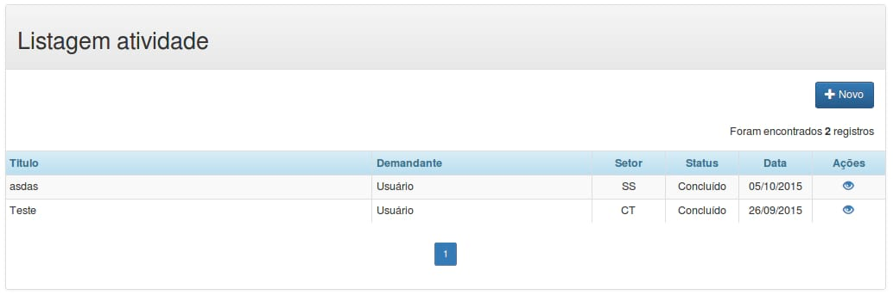{width="6.299212598425197in"
height="2.089763779527559in"}

1.  &lt;?php

2.  require\_once dirname(\_\_FILE\_\_) . DIRECTORY\_SEPARATOR .
    '../template/header.php';

3.  showHeader();

4.  5.  require\_once BASE\_PATH . 'public/atividades/queries.php';

6.  require\_once BASE\_PATH . 'src/pagination.php';

7.  8.  //configurções para montar a paginação

9.  \$recordsPerPage = 10;

10. \$totalRows = countRowsActivities();

11. \$limit = returnLimitToQuery(\['recordsPerPage' =&gt;
    \$recordsPerPage\]);

12. 13. \$activities = getAllActivitiesByUser(\['limit' =&gt; \$limit,
    'offset' =&gt; \$recordsPerPage\]);

14. 15. \$params = \['recordsPerPage' =&gt; \$recordsPerPage,
    'totalRows' =&gt; \$totalRows, 'url' =&gt; SITE\_URL
    .'atividades/index.php'\];

16. 17. showMessage();

18. ?&gt;

19. &lt;div class="container"&gt;

20. &lt;div class="panel panel-default"&gt;

21. &lt;!-- Default panel contents --&gt;

22. &lt;div class="panel-heading"&gt;&lt;h2&gt;Listagem
    atividade&lt;/h2&gt;&lt;/div&gt;

23. &lt;div class="panel-body text-right"&gt;

24. &lt;a href="&lt;?= SITE\_URL ?&gt;atividades/form.php"

25. class="btn btn-primary" title="Novo registro"&gt;

26. &lt;span class="glyphicon glyphicon-plus"&gt;&lt;/span&gt; Novo

27. &lt;/a&gt;

28. &lt;?php showTotalRegisters(\$totalRows); ?&gt;

29. &lt;/div&gt;

30. 31. &lt;?php if (\$totalRows == 0): ?&gt;

32. &lt;div class="alert alert-warning"&gt;

33. &lt;h3 class="text-center"&gt;

34. &lt;span class="glyphicon glyphicon-warning-sign"&gt;&lt;/span&gt;

35. Nenhum registro encontrado

36. &lt;/h3&gt;

37. &lt;/div&gt;

38. &lt;?php else: ?&gt;

39. &lt;table class="table table-bordered table-striped
    table-condensed"&gt;

40. &lt;thead class="alert-info"&gt;

41. &lt;tr&gt;

42. &lt;th class="col-md-5"&gt;Titulo&lt;/th&gt;

43. &lt;th class="col-md-3"&gt;Demandante&lt;/th&gt;

44. &lt;th class="col-md-1 text-center"&gt;Setor&lt;/th&gt;

45. &lt;th class="col-md-1 text-center"&gt;Status&lt;/th&gt;

46. &lt;th class="col-md-1 text-center"&gt;Data&lt;/th&gt;

47. &lt;th class="col-md-1 text-center"&gt;Ações&lt;/th&gt;

48. &lt;/tr&gt;

49. &lt;/thead&gt;

50. 51. &lt;tfoot&gt;

52. &lt;tr&gt;

53. &lt;td colspan="6" class="text-center"&gt;

54. &lt;?php showPagination(\$params); ?&gt;

55. &lt;/td&gt;

56. &lt;/tr&gt;

57. &lt;/tfoot&gt;

58. 59. &lt;tbody&gt;

60. &lt;?php for (\$i = 0; \$i &lt;= \$activities\['numRows'\]-1; \$i++)
    : ?&gt;

61. &lt;tr&gt;

62. &lt;td&gt;&lt;?= \$activities\['result'\]\[\$i\]\['titulo'\]
    ?&gt;&lt;/td&gt;

63. &lt;td&gt;&lt;?= \$activities\['result'\]\[\$i\]\['demandante'\]
    ?&gt;&lt;/td&gt;

64. &lt;td class="text-center"&gt;&lt;?=
    \$activities\['result'\]\[\$i\]\['sigla'\] ?&gt;&lt;/td&gt;

65. &lt;td class="text-center"&gt;&lt;?=
    \$activities\['result'\]\[\$i\]\['status'\] ?&gt;&lt;/td&gt;

66. &lt;td class="text-center"&gt;&lt;?=
    date('d/m/Y', strtotime(\$activities\['result'\]\[\$i\]\['data'\]))
    ?&gt;&lt;/td&gt;

67. &lt;td class="col-md-2 text-center"&gt;

68. &lt;a href="&lt;?= SITE\_URL ?&gt;atividades/view.php?id=&lt;?=
    \$activities\['result'\]\[\$i\]\['id'\] ?&gt;"
    title="Vizualizar"&gt;

69. &lt;span class="glyphicon glyphicon-eye-open"&gt;&lt;/span&gt;

70. &lt;/a&gt;

71. 72. &lt;?php if (\$activities\['result'\]\[\$i\]\['id\_status'\]
    != 2) : ?&gt;&nbsp;&nbsp;

73. &lt;a href="&lt;?= SITE\_URL ?&gt;atividades/form.php?id=&lt;?=
    \$activities\['result'\]\[\$i\]\['id'\] ?&gt;" title="Editar"&gt;

74. &lt;span class="glyphicon glyphicon-edit"&gt;&lt;/span&gt;

75. &lt;/a&gt;&nbsp;&nbsp;

76. &lt;a href="\#" id="&lt;?= SITE\_URL
    ?&gt;atividades/actions.php?action=delete&id=&lt;?=
    \$activities\['result'\]\[\$i\]\['id'\] ?&gt;"

77. title="Excluir"&gt;&lt;span class="text-danger glyphicon
    glyphicon-trash"&gt;&lt;/span&gt;

78. &lt;/a&gt;

79. &lt;?php endif; ?&gt;

80. &lt;/td&gt;

81. &lt;/tr&gt;

82. &lt;?php endfor; ?&gt;

83. &lt;/tbody&gt;

84. &lt;/table&gt;

85. &lt;?php endif; ?&gt;

86. &lt;/div&gt;

87. &lt;/div&gt;

88. &lt;?php

89. require\_once dirname(\_\_FILE\_\_) . DIRECTORY\_SEPARATOR .
    '../template/footer.php';

90. showFooter(\['confirmDelete'\]);

91. 

*Salve em
/home/seu\_usuario/www/PHPBasico/atividades/public/atividades/index.php*.

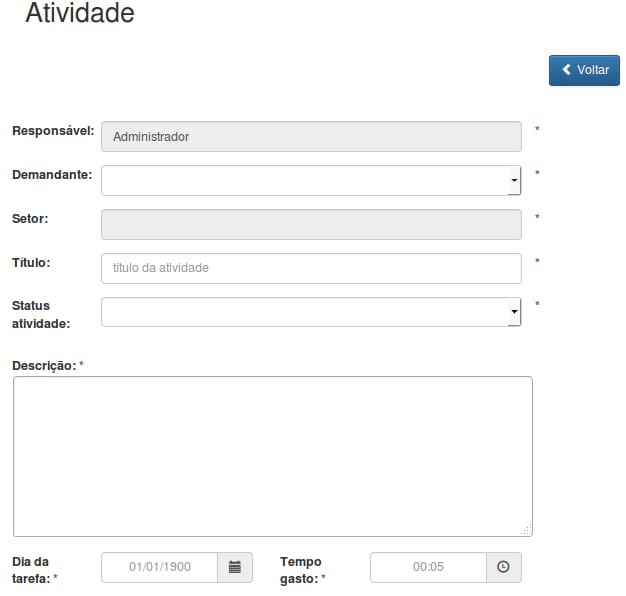{width="6.299212598425197in"
height="5.997244094488189in"}

1.  &lt;?php

2.  require\_once dirname(\_\_FILE\_\_) . DIRECTORY\_SEPARATOR .
    '../template/header.php';

3.  showHeader(\['bootstrap-datetimepicker.min'\]);

4.  5.  require\_once BASE\_PATH . 'public/atividades/queries.php';

6.  require\_once BASE\_PATH . 'public/setores/queries.php';

7.  require\_once BASE\_PATH . 'public/usuarios/queries.php';

8.  require\_once BASE\_PATH . 'public/status-atividade/queries.php';

9.  require\_once BASE\_PATH . 'src/protectCSRF.php';

10. 11. \$plaintiffsList = getListUsers(); //Popula a selectbox
    Demandante;

12. \$statusList = getListStatus(); //Popula a selectbox Staus
    Atividade;

13. 14. if (isset(\$\_REQUEST\['id'\])) :

15. \$action = 'update';

16. \$id = trim(\$\_REQUEST\['id'\]);

17. 18. \$activity = getActivitiesById(\$id);

19. \$setor = getDepartmentById(\$activity\['id\_setor'\]);

20. 21. \$idSetor = \$activity\['id\_setor'\];

22. \$setorName = \$setor\['nome'\];

23. \$idDemandante = \$activity\['id\_demandante'\];

24. \$idResponsavel = \$activity\['id\_responsavel'\];

25. \$idStatus = \$activity\['id\_status'\];

26. \$titulo = \$activity\['titulo'\];

27. \$descricao = nl2br(\$activity\['descricao'\]);

28. \$data = date('d/m/Y', strtotime(\$activity\['data'\]));

29. \$tempoGasto = \$activity\['tempo\_gasto'\];

30. 31. else :

32. \$action = 'insert';

33. \$id = null;

34. \$idDemandante = null;

35. \$idSetor = null;

36. \$setorName = null;

37. \$idResponsavel = \$\_SESSION\['id'\];

38. \$idStatus = null;

39. \$titulo = null;

40. \$descricao = null;

41. \$data = null;

42. \$tempoGasto = null;

43. endif;

44. ?&gt;

45. &lt;div class="container"&gt;

46. &lt;h2&gt;Atividade&lt;/h2&gt;&lt;br /&gt;

47. 48. &lt;div class="row"&gt;

49. &lt;div class="col-md-6 col-md-offset-6"&gt;

50. &lt;a href="&lt;?= SITE\_URL ?&gt;atividades/index.php"

51. class="btn btn-primary" title="Voltar"&gt;

52. &lt;span class="glyphicon glyphicon-chevron-left"&gt;&lt;/span&gt;
    Voltar&lt;/a&gt;

53. &lt;?php if (\$id) : ?&gt;

54. &lt;a href="\#"

55. id="&lt;?= SITE\_URL
    ?&gt;atividades/actions.php?action=delete&id=&lt;?= \$id ?&gt;"

56. title="Excluir" class="btn btn-danger"&gt;

57. &lt;span class="glyphicon glyphicon-trash"&gt;&lt;/span&gt;
    Excluir&lt;/a&gt;

58. &lt;?php endif; ?&gt;

59. &lt;/div&gt;

60. &lt;/div&gt;&lt;br /&gt;&lt;br /&gt;

61. 62. &lt;form class="form-horizontal" action="&lt;?= SITE\_URL
    ?&gt;atividades/actions.php" method="post"&gt;

63. &lt;input type="hidden" name="action" value="&lt;?= \$action
    ?&gt;"&gt;

64. &lt;input type="hidden" name="id" id="id" value="&lt;?= \$id
    ?&gt;"&gt;

65. &lt;input type="hidden" name="id\_responsavel" id="id\_responsavel"
    value="&lt;?= \$idResponsavel ?&gt;"&gt;

66. &lt;input type="hidden" name="token" id="token"
    value="&lt;?= tokenGenerate() ?&gt;" /&gt;

67. &lt;input type="hidden" name="id\_setor" id="id\_setor"
    value="&lt;?= \$idSetor ?&gt;" /&gt;

68. 69. &lt;div class="form-group"&gt;

70. &lt;div class="row"&gt;

71. &lt;label for="responsavel"
    class="col-md-1"&gt;Responsável:&lt;/label&gt;

72. &lt;div class="col-md-5"&gt;

73. &lt;input type="text" class="form-control" name="responsavel"
    id="responsavel"

74. value="&lt;?= \$\_SESSION\['nome'\] ?&gt;" maxlength="200"
    disabled&gt;

75. &lt;/div&gt;

76. &lt;span
    class="text-danger"&gt;&lt;strong&gt;\*&lt;/strong&gt;&lt;/span&gt;

77. &lt;/div&gt;

78. &lt;/div&gt;

79. 80. &lt;div class="form-group"&gt;

81. &lt;div class="row"&gt;

82. &lt;label for="demandante"
    class="col-md-1"&gt;Demandante:&lt;/label&gt;

83. &lt;div class="col-md-5"&gt;

84. &lt;select class="form-control" name="id\_demandante"
    id="id\_demandante" required&gt;

85. &lt;?php

86. foreach (\$plaintiffsList as \$list) :

87. if (\$idDemandante == \$list\['id'\]) {

88. \$selected = "selected";

89. } else {

90. \$selected = '';

91. }

92. ?&gt;

93. &lt;option value="&lt;?= \$list\['id'\] ?&gt;" &lt;?=
    \$selected?&gt;&gt;&lt;?= \$list\['nome'\] ?&gt;&lt;/option&gt;

94. &lt;?php endforeach; ?&gt;

95. &lt;/select&gt;

96. &lt;/div&gt;

97. &lt;span
    class="text-danger"&gt;&lt;strong&gt;\*&lt;/strong&gt;&lt;/span&gt;

98. &lt;/div&gt;

99. &lt;/div&gt;

100. 101. &lt;div class="form-group"&gt;

102. &lt;div class="row"&gt;

103. &lt;label for="setor" class="col-md-1"&gt;Setor:&lt;/label&gt;

104. &lt;div class="col-md-5"&gt;

105. &lt;input type="text" class="form-control" name="setor"

106. id="setor" value="&lt;?= \$setorName ?&gt;" disabled&gt;

107. &lt;/div&gt;

108. &lt;span
    class="text-danger"&gt;&lt;strong&gt;\*&lt;/strong&gt;&lt;/span&gt;

109. &lt;/div&gt;

110. &lt;/div&gt;

111. 112. &lt;div class="form-group"&gt;

113. &lt;div class="row"&gt;

114. &lt;label for="titulo" class="col-md-1"&gt;Título:&lt;/label&gt;

115. &lt;div class="col-md-5"&gt;

116. &lt;input type="text" class="form-control" name="titulo"
    id="titulo"

117. placeholder="título da atividade" maxlength="200" value="&lt;?=
    \$titulo ?&gt;"

118. required&gt;

119. &lt;/div&gt;

120. &lt;span
    class="text-danger"&gt;&lt;strong&gt;\*&lt;/strong&gt;&lt;/span&gt;

121. &lt;/div&gt;

122. &lt;/div&gt;

123. 124. &lt;div class="form-group"&gt;

125. &lt;div class="row"&gt;

126. &lt;label for="satus-atividade" class="col-md-1"&gt;Status
    atividade:&lt;/label&gt;

127. &lt;div class="col-md-5"&gt;

128. &lt;select class="form-control" name="id\_status" id="id\_status"
    required&gt;

129. &lt;?php

130. foreach (\$statusList as \$list) :

131. if (\$idStatus == \$list\['id'\]) {

132. \$selected = "selected";

133. } else {

134. \$selected = '';

135. }

136. ?&gt;

137. &lt;option value="&lt;?= \$list\['id'\] ?&gt;" &lt;?=
    \$selected?&gt;&gt;&lt;?= \$list\['status'\] ?&gt;&lt;/option&gt;

138. &lt;?php endforeach; ?&gt;

139. &lt;/select&gt;

140. &lt;/div&gt;

141. &lt;span
    class="text-danger"&gt;&lt;strong&gt;\*&lt;/strong&gt;&lt;/span&gt;

142. &lt;/div&gt;

143. &lt;/div&gt;

144. 145. &lt;div class="form-group"&gt;

146. &lt;label for="descricao" class="control-label"&gt;

147. Descrição:

148. &lt;span
    class="text-danger"&gt;&lt;strong&gt;\*&lt;/strong&gt;&lt;/span&gt;

149. &lt;/label&gt;&lt;br/&gt;

150. &lt;textarea name="descricao" id="descricao" rows="8" cols="70"
    required&gt;&lt;?= \$descricao ?&gt;&lt;/textarea&gt;

151. &lt;/div&gt;

152. 153. &lt;div class="form-group"&gt;

154. &lt;div class="row"&gt;

155. &lt;label for="senha" class="col-md-1"&gt;

156. Dia da tarefa:

157. &lt;span
    class="text-danger"&gt;&lt;strong&gt;\*&lt;/strong&gt;&lt;/span&gt;

158. &lt;/label&gt;

159. &lt;div class="col-md-2"&gt;

160. &lt;div class="input-group date" id="date-timepicker"&gt;

161. &lt;input type="date" class="form-control text-center"

162. name="data" id="data" value="&lt;?= \$data ?&gt;"

163. placeholder="01/01/1900" maxlength="10" required&gt;

164. &lt;span class="input-group-addon"&gt;

165. &lt;span class="glyphicon glyphicon-calendar"&gt;&lt;/span&gt;

166. &lt;/span&gt;

167. &lt;/div&gt;

168. &lt;/div&gt;

169. 170. &lt;label for="ativo" class="col-md-1"&gt;

171. Tempo gasto:

172. &lt;span
    class="text-danger"&gt;&lt;strong&gt;\*&lt;/strong&gt;&lt;/span&gt;

173. &lt;/label&gt;

174. &lt;div class="col-md-2"&gt;

175. &lt;div class="input-group date" id="time-timepicker"&gt;

176. &lt;input type="time" class="form-control text-center"

177. name="tempo\_gasto" id="tempo\_gasto" value="&lt;?= \$tempoGasto
    ?&gt;"

178. placeholder="00:05" maxlength="10" required&gt;

179. &lt;span class="input-group-addon"&gt;

180. &lt;span class="glyphicon glyphicon-time"&gt;&lt;/span&gt;

181. &lt;/span&gt;

182. &lt;/div&gt;

183. &lt;/div&gt;

184. &lt;/div&gt;

185. &lt;/div&gt;

186. 187. &lt;div class="form-group text-center"&gt;

188. &lt;br /&gt;

189. &lt;button type="submit" class="btn btn-info"&gt;Gravar

190. &lt;span class="glyphicon
    glyphicon-ok"&gt;&lt;/span&gt;&lt;/button&gt;&nbsp;&nbsp;&nbsp;

191. &lt;button type="reset" name="reset" class="btn
    btn-warning"&gt;Limpar

192. &lt;span class="glyphicon glyphicon-erase"&gt;&lt;/span&gt;

193. &lt;/button&gt;

194. &lt;/div&gt;

195. &lt;/form&gt;

196. &lt;/div&gt;

197. &lt;br /&gt;

198. &lt;?php

199. require\_once dirname(\_\_FILE\_\_) . DIRECTORY\_SEPARATOR .
    '../template/footer.php';

200. showFooter(\['confirmDelete', 'bootstrap-datetimepicker.min',
    'ajaxFormActivities'\]);

201. 

*Salve em
/home/seu\_usuario/www/PHPBasico/atividades/public/atividades/form.php*.

Vimos no arquivo acima uma chamada no footer do ***ajaxFormActivities***
e ***bootstrap-datetimepicker.min***, esses arquivos, nada mais são que
scripts em JavaScript que utilizam o jQuery com AJAX para o
preenchimento de um valor no formulário, baseado em outro campo
selecionado/modificado anteriormente e ativação de um calendário através
de um clique de um ícone.

\$(document).ready(function(){

\$('\#id\_demandante').change(function(){

var url =

window.location.protocol + "//" +

window.location.host + "/" +

'CursoPHP/PHPBasico/atividades/public/atividades/actions.php';

\$.ajax({

type: 'POST',

url: url,

data: {

id: \$('\#id\_demandante').val(),

action: 'ajaxPopulateDepartment',

token: \$('\#token').val()

},

dataType: 'json',

success: function(dataJson) {

\$('\#setor').val(dataJson.nome);

\$('\#id\_setor').val(dataJson.id);

}

});

});

\$('\#date-timepicker').datetimepicker({

format: 'DD/MM/YYYY',

locale: 'pt-br'

});

\$('\#time-timepicker').datetimepicker({

format: 'LT',

locale: 'pt-br'

});

});

*/home/seu\_usuario/www/PHPBasico/atividades/public/assets/js/*ajaxFormActivities.js.

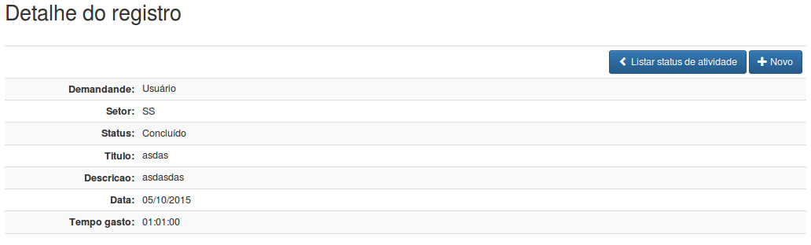{width="6.299212598425197in"
height="1.9043307086614174in"}

1.  &lt;?php

2.  require\_once dirname(\_\_FILE\_\_) . DIRECTORY\_SEPARATOR .
    '../template/header.php';

3.  showHeader();

4.  5.  require\_once BASE\_PATH . 'public/atividades/queries.php';

6.  7.  if (isset(\$\_REQUEST\['id'\])) :

8.  \$id = trim(\$\_REQUEST\['id'\]);

9.  10. \$activity = getActivitiesById(\$id);

11. 12. \$demandante = \$activity\['demandante'\];

13. \$setor = \$activity\['sigla'\];

14. \$status = \$activity\['status'\];

15. \$idStatus = \$activity\['id\_status'\];

16. \$titulo = \$activity\['titulo'\];

17. \$descricao = nl2br(\$activity\['descricao'\]);

18. \$data = date('d/m/Y', strtotime(\$activity\['data'\]));

19. \$tempoGasto = \$activity\['tempo\_gasto'\];

20. 21. else :

22. header('location:' . SITE\_URL . 'atividades/index.php');

23. endif;

24. 25. showMessage();

26. ?&gt;

27. &lt;div class="container"&gt;

28. &lt;h2&gt;Detalhe do registro&lt;/h2&gt;&lt;br /&gt;

29. 30. &lt;table class="table table-bordered table-striped
    table-condensed"&gt;

31. &lt;thead&gt;

32. &lt;tr&gt;

33. &lt;th colspan="2" class="text-right"&gt;

34. &lt;a href="&lt;?= SITE\_URL ?&gt;atividades/index.php"

35. class="btn btn-primary" title="Voltar"&gt;

36. &lt;span class="glyphicon glyphicon-chevron-left"&gt;&lt;/span&gt;
    Listar status de atividade

37. &lt;/a&gt;

38. &lt;a href="&lt;?= SITE\_URL ?&gt;atividades/form.php"

39. class="btn btn-primary" title="Novo registro"&gt;

40. &lt;span class="glyphicon glyphicon-plus"&gt;&lt;/span&gt; Novo

41. &lt;/a&gt;

42. 43. &lt;?php if (\$idStatus != 2) : ?&gt;

44. &lt;a href="&lt;?= SITE\_URL ?&gt;atividades/form.php?id=&lt;?= \$id
    ?&gt;"

45. class="btn btn-primary" title="Editar"&gt;

46. &lt;span class="glyphicon glyphicon-edit"&gt;&lt;/span&gt; Editar

47. &lt;/a&gt;

48. &lt;a href="\#"

49. id = "&lt;?= SITE\_URL
    ?&gt;atividades/actions.php?action=delete&id=&lt;?= \$id ?&gt;"

50. title="Excluir" class="btn btn-danger"&gt;

51. &lt;span class="glyphicon glyphicon-trash"&gt;&lt;/span&gt; Excluir

52. &lt;/a&gt;

53. &lt;?php endif; ?&gt;

54. &lt;/th&gt;

55. &lt;/tr&gt;

56. &lt;/thead&gt;

57. 58. &lt;tbody&gt;

59. &lt;tr&gt;

60. &lt;td class="text-right
    col-md-2"&gt;&lt;strong&gt;Demandande:&lt;/strong&gt;&lt;/td&gt;

61. &lt;td&gt;&lt;?= \$demandante ?&gt;&lt;/td&gt;

62. &lt;/tr&gt;

63. &lt;tr&gt;

64. &lt;td class="text-right
    col-md-2"&gt;&lt;strong&gt;Setor:&lt;/strong&gt;&lt;/td&gt;

65. &lt;td&gt;&lt;?= \$setor ?&gt;&lt;/td&gt;

66. &lt;/tr&gt;

67. &lt;tr&gt;

68. &lt;td class="text-right
    col-md-2"&gt;&lt;strong&gt;Status:&lt;/strong&gt;&lt;/td&gt;

69. &lt;td&gt;&lt;?= \$status ?&gt;&lt;/td&gt;

70. &lt;/tr&gt;

71. &lt;tr&gt;

72. &lt;td class="text-right
    col-md-2"&gt;&lt;strong&gt;Titulo:&lt;/strong&gt;&lt;/td&gt;

73. &lt;td&gt;&lt;?= \$titulo ?&gt;&lt;/td&gt;

74. &lt;/tr&gt;

75. &lt;tr&gt;

76. &lt;td class="text-right
    col-md-2"&gt;&lt;strong&gt;Descricao:&lt;/strong&gt;&lt;/td&gt;

77. &lt;td&gt;&lt;?= \$descricao ?&gt;&lt;/td&gt;

78. &lt;/tr&gt;

79. &lt;tr&gt;

80. &lt;td class="text-right
    col-md-2"&gt;&lt;strong&gt;Data:&lt;/strong&gt;&lt;/td&gt;

81. &lt;td&gt;&lt;?= \$data ?&gt;&lt;/td&gt;

82. &lt;/tr&gt;

83. &lt;tr&gt;

84. &lt;td class="text-right col-md-2"&gt;&lt;strong&gt;Tempo
    gasto:&lt;/strong&gt;&lt;/td&gt;

85. &lt;td&gt;&lt;?= \$tempoGasto ?&gt;&lt;/td&gt;

86. &lt;/tr&gt;

87. &lt;/tbody&gt;

88. &lt;/table&gt;

89. &lt;/div&gt;

90. &lt;?php

91. require\_once dirname(\_\_FILE\_\_) . DIRECTORY\_SEPARATOR .
    '../template/footer.php';

92. showFooter(\['confirmDelete'\]);

93. 

*Salve em
/home/seu\_usuario/www/PHPBasico/atividades/public/atividades/atividades/view.php*.

### Adicionando as listas de atividades no dasboard

Alteraremos o arquivo *dasboard.php*, para listamos as 10 últimas
atividades pelo seu status (Pendente, Em andamento e Resolvidas) e
filtrando pelo usuário autenticado na aplicação. Abra o arquivo
*/home/seu\_usuario/www/PHPBasico/atividades/public/dasboard.php* e o
**showHeader()** e adicione os códigos abaixo:

1.  &lt;?php

2.  ...

3.  4.  require\_once BASE\_PATH . 'public/atividades/queries.php';

5.  6.  \$atividadesPendentes =
    > getLastActivitiesByUserAndStatus(\['limit' =&gt; 10, 'status'
    > =&gt; 3\]);

7.  \$atividadesEmAndamento = getLastActivitiesByUserAndStatus(\['limit'
    > =&gt; 10, 'status' =&gt; 1\]);

8.  \$atividadesResolvidas = getLastActivitiesByUserAndStatus(\['limit'
    > =&gt; 10, 'status' =&gt; 2\]);

9.  ?&gt;

Localize o título **Atividades pendentes** e adicione o código abaixo:

1.  &lt;?php

2.  ...

3.  &lt;ul class="list-unstyled"&gt;

4.  &lt;?php

5.  if (count(\$atividadesPendentes) &gt; 0) :

6.  foreach (\$atividadesPendentes as \$pendente) :

7.  ?&gt;

8.  &lt;li&gt;&lt;span class="glyphicon glyphicon-flag"&gt;&lt;/span&gt;
    > &lt;a href="&lt;?= SITE\_URL ?&gt;atividades/view.php?id=&lt;?=
    > \$pendente\['id'\] ?&gt;"&gt;&lt;?= \$pendente\['titulo'\]
    > ?&gt;&lt;/a&gt;&lt;/li&gt;

9.  &lt;?php

10. endforeach;

11. else:

12. echo "Nenhuma atividade pendente.";

13. endif;

14. ?&gt;

15. &lt;/ul&gt;

16. ...

17. ?&gt;

Localize o título **Atividades em andamento** e adicione o código
abaixo:

1.  &lt;?php

2.  ...

3.  &lt;ul class="list-unstyled"&gt;

4.  &lt;?php

5.  if (count(\$atividadesEmAndamento) &gt; 0) :

6.  foreach (\$atividadesEmAndamento as \$emAndamento) :

7.  ?&gt;

8.  &lt;li&gt;&lt;span class="glyphicon glyphicon-flag"&gt;&lt;/span&gt;
    &lt;a href="&lt;?= SITE\_URL ?&gt;atividades/view.php?id=&lt;?=
    \$emAndamento\['id'\] ?&gt;"&gt;&lt;?= \$emAndamento\['titulo'\]
    ?&gt;&lt;/a&gt;&lt;/li&gt;

9.  &lt;?php

10. endforeach;

11. else:

12. echo "Nenhuma atividade em andamento.";

13. endif;

14. ?&gt;

15. &lt;/ul&gt;

16. ...

17. ?&gt;

Localize o título **Atividades resolvidas** e adicione o código abaixo:

1.  &lt;?php

2.  ...

3.  &lt;ul class="list-unstyled"&gt;

4.  &lt;?php

5.  if (count(\$atividadesResolvidas) &gt; 0) :

6.  foreach (\$atividadesResolvidas as \$resolvida) :

7.  ?&gt;

8.  &lt;li&gt;&lt;span class="glyphicon glyphicon-flag"&gt;&lt;/span&gt;
    &lt;a href="&lt;?= SITE\_URL ?&gt;atividades/view.php?id=&lt;?=
    \$resolvida\['id'\] ?&gt;"&gt;&lt;?= \$resolvida\['titulo'\]
    ?&gt;&lt;/a&gt;&lt;/li&gt;

9.  &lt;?php

10. endforeach;

11. else:

12. echo "Nenhuma atividade concluída.";

13. endif;

14. ?&gt;

15. &lt;/ul&gt;

16. ...

17. ?&gt;

Resumo do capítulo
------------------

Chegamos ao fim da nossa jornada. Ao longo dos meses aprendemos diversos
recursos, funções, lógica, segurança e outras cosias mais. Finalizamos
com um sistema completo de registro de atividades, com login, senha,
sessões e praticamente tudo que uma aplicação do mundo real utiliza.

Não se limite a apenas ao conteúdo da apostila. Pesquise mais, leia
mais. Procure códigos de outros desenvolvedores para aprender e/ou
evitar fazer uma coisa que te parece errada. Explore seus conhecimentos
e ultrapasse seus limites.

Espero sinceramente que tenha gostado e aproveitado o curso. Espero
também que se inscreva no curso **PHP do Jeito Certo com Orientação a
Objetos**.

[^1]: Consultar a PRS-1 - http://www.php-fig.org/psr/psr-1/pt-br/

[^2]: Consultar a PRS-2 - http://www.php-fig.org/psr/psr-2/pt-br/ - Item
    5.1.

[^3]: Consultar a PRS-2 - http://www.php-fig.org/psr/psr-2/pt-br/ - Item
    5.2.

[^4]: Consultar a PRS-2 - http://www.php-fig.org/psr/psr-2/pt-br/ - Item
    5.3.

[^5]: Consultar a PRS-2 - http://www.php-fig.org/psr/psr-2/pt-br/ - Item
    5.3.

[^6]: Consultar a PRS-2 - http://www.php-fig.org/psr/psr-2/pt-br/ - Item
    5.4 e 5.5.
