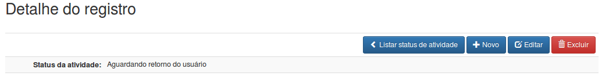

Curso PHP Básico
================

Aprenda do jeito certo
----------------------

{width="3.1251968503937007in"
height="3.1251968503937007in"}

Bem-vindo ao curso PHP Básico do Jeito Certo. Nessa apostila você não
aprenderá somente o PHP, as sintaxes dos *if*, *while*, *for* etc. A
proposta desse curso vai muito além da programação. Nosso objetivo é
capacitar o novo profissional de PHP com as recentes atualizações do
PHP, padronizações de codificação, utilização de alguns recursos
externos ao PHP como: HTML 5, CSS 3, framework de CSS 3 Twitter
bootstrap e o framework de JavaScrpt jQuery.

Agradecimentos
--------------

Agradecimento especial a minha esposa Keylla Cristhiane Corrêa de
Almeida por me ajudar a corrigir a apostila e agradecimentos aos meus
colegas desenvolvedores Vitor e Raphael que me ajudaram com a correção e
verificação técnica do conteúdo da apostila.

Capítulo 1
==========

O que é o PHP?
--------------

Essa linguagem foi concebida durante o outono de 1994 por Rasmus
Lerdorf. As primeiras versões não foram disponibilizadas, tendo sido
utilizadas em sua home-page apenas para que ele pudesse ter informações
sobre as visitas que estavam sendo feitas. A primeira versão utilizada
por outras pessoas foi disponibilizada em 1995, e ficou conhecida como
“Personal Home Page Tools” (ferramentas para página pessoal). Era
composta por um sistema bastante simples que interpretava algumas macros
e alguns utilitários que rodavam “por trás” das home-pages: um livro de
visitas, um contador e algumas outras coisas.

Diferentemente de algumas linguagens para web, o PHP permite criar sites
web dinâmicos, possibilitando uma interação do usuário com o site,
através de formulários feitos em HTML, parâmetros da URL, links e também
serve para criar aplicações embarcadas, aplicações mobile, de linha de
comando. A diferença entre ela com relação ao JavaScript padrão, por
exemplo, é que o código PHP é executado no servidor, sendo enviado para
o cliente apenas HTML puro e o próprio código JavaScript. Hoje em dia
existe NodeJS rodando JavaScript no servidor. Desta maneira é possível
interagir com bancos de dados e aplicações existentes no servidor, com a
vantagem de não expor o código fonte para o cliente. Outra diferença do
PHP com um script CGI escrito em C ou Perl é que o código PHP fica
embutido no próprio HTML, enquanto no outro caso é necessário que o
script CGI gere todo o código HTML, ou leia de um outro arquivo.

Com o PHP podemos fazer tudo, qualquer coisa feita por algum programa
CGI pode ser feita com PHP, como coletar dados de um formulário, gerar
páginas dinamicamente ou enviar e receber cookies. O PHP também tem como
uma das características mais importantes o suporte a um grande número de
bancos de dados, como dBase, Interbase, Firebird, mSQL, mySQL, Oracle,
Sybase, PostgreSQL e vários outros. Construir uma página baseada em um
banco de dados torna-se uma tarefa extremamente simples com PHP. Além
disso, PHP tem suporte a protocolos como IMAP, SNMP, NNTP, POP3 e,
logicamente, HTTP. Também é possível abrir sockets e interagir com
outros protocolos.

Como funciona o PHP
-------------------

Requisitos do Sistema Operacional
---------------------------------

-   **SO:** Linux, Solaris, MAC OS

-   **Servidores web:** Apache 2, Nginx e o Próprio PHP. Pacotes como
    LAMP, XAMP e alguns outros também podem ser utilizados.

-   **Banco de Dados:** mSQL, SQL Server, MySql/MariaDB, Sybase, Oracle,
    PostgreSQL

**Nota:** Pode-se usar o comando php -S 0.0.0.0:8001 -t caminho/do/site

Instalação e configuração do PHP
--------------------------------

Para instalar o PHP é necessário o PHP, Apache, MySQL e phpMyAdmin. Abra
o terminal (CTRL+T) e rode os comandos abaixo para instalar os pacotes.

**Apache:** \~\$ sudo apt-get install apache2

**MySQL:** \~\$ sudo apt-get install mysql-server e sudo apt-get install
php5-mysqlnd

**PHP:** \~\$ sudo apt-get install php5 php5-curl php5-mcrypt php5-mysql
libapache2-mod-php5

**phpMyAdmin:** \~\$ Apache: sudo apt-get install phpMyAdmin

### Testando o Apache

Abra o browser e digite [http://localhost](http://localhost/).

###  Configurando o Apache

Para podermos criar nossos projetos de uma forma mais fácil e sem
precisar virar root no sistema, vamos cria um diretório em
*/home/seu\_usuario/www.* Todos os seus sites e projetos devem ser
colocados nesse diretório. Finalizando nosso processo, precisamos
modificar o arquivo de configuração do apache apontando para o novo
diretório criado. Abra um terminal (CRTL+T) e rode comando.

\~\$ sudo gedit /etc/apache2/sites-available/000-default.conf

Procure por *DocumentRoot /var/www/html* e comente a linha colocando o
sinal tralha na frente da linha. Adicione *DocumentRoot
/home/seu\_usuario/www/*

### Testando o PHP

Crie um arquivo chamado *info.php.*

1.  &lt;?php phpinfo();

2.  

Salve em */home/seu\_usuario/www/*, no browser digite
[*http://localhost/info.php*](http://localhost/info.php).

**Nota:** É recomendado por questões de segurança que arquivos que sejam
somente PHP, não tenha a tag de fechamento e que contenha a última linha
em branco.

### \
Testando o phpMyAdmin

Abra o browser e digite
[*http://localhost/phpMyAdmin*](http://localhost/phpmyadmin) e acesse-o
com o login e senha definidos na instalação do MySQL.

###  Configurando PHP

Localizar e modificar o arquivo *php.ini*. Esse arquivo pode estar em
local diferente dependendo da distribuição GNU/Linux que está usando. No
Ubuntu e nas distribuições “Debian like”, esse arquivo encontra-se em
*/etc/php5/apache2/php.ini*. Após as modificações é necessário reiniciar
seu servidor PHP como por exemplo o Apache, para reiniciar o Apache pode
se usar o comando *sudo service apache2 restart*.

Para o ambiente de desenvolvimento é altamente recomendado habilitar as
seguintes diretrizes:

-   error\_reporting = E\_ALL

-   display\_errors = On

-   log\_errors = On

-   track\_errors = On

-   html\_errors = On

As diretrizes acima fazem que quais quer tipo de erro seja exibido,
logado, rastreado e exibido de uma forma mais organizada. Essas
configurações devem ser diferentes no ambiente de produção (onde o site
é de fato hospedado), isso por que os usuários devem receber mensagens
de erros amigáveis, e na tentativa de algum craker ou algum script kid
querer explorar alguma falha no site, o erro não de para ele de bandeja
uma mensagem de erro com o nome e campos de alguma tabela do seu banco
de dados.

**Nota:** Se usar uma distribuição diferente do Ubuntu nada que uma
pesquisada na internet para descobrir o comando certo.

Entendendo o PHP
----------------

### Sintaxe

O código do PHP pode ficar embutido no contexto do HTML, porém em muitos
casos perceberá que esses códigos são bem simples e não contém regras de
negócios ou estruturas muito complexas, ou seja, se limita somente a
exibição de dados, estruturas de laços e condições simples.

Para estruturas complexas e longas usa-se *&lt;?php algum código;
?&gt;*, para exibir conteúdo na tela utilizar *&lt;?= \$variavel;
?&gt;*.

**ATENÇÃO:** Em códigos legados e/ou em código cujo a versão do PHP seja
inferior a 5.4.x ou que não seguem as recomendações de padronização é
comum encontrar a sintaxe sendo usada da seguinte forma:

  ---------------------------------------------------------------------------
  &lt;? comandos ?&gt;              Não recomendado
  --------------------------------- -----------------------------------------
  &lt;script language=“php”&gt;     Não recomendado
                                    
  comandos                          
                                    
  &lt;/script&gt;                   

  &lt;% comandos %&gt;              Não recomendado

  &lt;?php echo \$variavel; ?&gt;   Ainda utilizado, mas não é recomendado.
  ---------------------------------------------------------------------------

É altamente recomendado o não fechamento da tag PHP e deixar uma linha
em branco no fim do arquivo sem espaços[^1]

### Finalização de comando

Entre cada instrução em PHP é preciso utilizar o ponto e vírgula, assim
como em Pascal, C, Perl e outras linguagens mais conhecidas.

### Variáveis

Toda variável em PHP tem seu nome composto pelo caracter \$ e o nome da
variável, que deve iniciar sempre por uma letra ou o caracter “\_”. PHP
é case sensitive, ou seja, as variáveis *\$quantidade* e *\$Quantidade*
são diferentes. Por isso é preciso ter muito cuidado ao definir os nomes
das variáveis. É bom evitar os nomes em maiúsculas, pois como veremos
mais adiante, o PHP já possui alguma variável pré-definidas cujos nomes
são formados por letras maiúsculas.

Não há um padrão para nomes de variáveis podemos criar algo como
\$teste\_valor ou \$testeValor desde que a aplicação inteira use o mesmo
padrão. Particurlamente em caso de nome composto eué recomendado o
padrão camelCase. *\$matriculaUsuario*, *\$valorTotal*, etc, pois esse é
o padrão adotado nos argumentos de funções e métodos de classes.

### Tipos de variáveis

-   Inteiro

-   Array

-   Objeto

-   String

-   Ponto flutuante

-   Boolean

### Constantes

Constantes são um tipo especial para armazenar valores fixos, diferentes
de variáveis que podem ter seus valores alterados ao decorrer do script.
No PHP uma constante é definida com caracteres em maiúsculo.

*define('FILE\_READ\_MODE', 0644);*

Primeiros passos com PHP
------------------------

Crie um diretório chamado */home/seu\_usuario/www/cap1*.

1.  &lt;!DOCTYPE html&gt;

2.  &lt;html&gt;

3.  &lt;head&gt;

4.  &lt;meta charset="UTF-8"&gt;

5.  &lt;title&gt;Curso PHP Básico do Jeito Certo&lt;/title&gt;

6.  &lt;/head&gt;

7.  &lt;body&gt;

8.  &lt;?= "Bem-vindo ao PHP"; ?&gt;

9.  &lt;/body&gt;

10. &lt;/html&gt;

Salve em */home/seu\_usuario/www/PHPBasico/Cap1/exemplo1.php*, no
browser digite
[*http://localhost/*](http://localhost/PHPBasico/Cap1/exemplo1.php)[*PHPBasico*](http://localhost/PHPBasico/Cap1/exemplo1.php)[*/*](http://localhost/PHPBasico/Cap1/exemplo1.php)[*Cap1*](http://localhost/PHPBasico/Cap1/exemplo1.php)[*/*](http://localhost/PHPBasico/Cap1/exemplo1.php)[*exemplo1*](http://localhost/PHPBasico/Cap1/exemplo1.php)[*.php*](http://localhost/PHPBasico/Cap1/exemplo1.php).

Vimos agora um exemplo prático de um script PHP rodando no navegador com
TAGs HTML 5. Iremos agora modificar o arquivo criado acima e implementar
os conceitos aprendidos nos tópicos já aprendidos.

**Nota:** Nos arquivos PHP que forem usados para exibição do HTML como
no exemplo acima é recomendado o uso da tag, &lt;?= ?&gt; ao invés da
tag &lt;?php echo ?&gt;

1.  &lt;!DOCTYPE html&gt;

2.  &lt;html&gt;

3.  &lt;head&gt;

4.  &lt;meta charset="UTF-8"&gt;

5.  &lt;title&gt;Curso Básico - PHP do Jeito Certo&lt;/title&gt;

6.  &lt;/head&gt;

7.  &lt;body&gt;

8.  &lt;?= '&lt;h1&gt;Bem-vindo ao PHP&lt;/h1&gt;';

9.  echo '&lt;h2&gt;Variáveis e Constantes&lt;/h2&gt;';

10. //Isso é um comentário de uma linha

11. //vamos estudar agora as variáveis

12. \$nome = 'Anna Clara'; //Variável tipo string

13. \$sobrenome = 'Da Fonseca'; //Variável tipo string

14. \$idade = 33; //Variável tipo integer

15. \$altura = 1.69; //Variável tipo float

16. \$genteFina = true; //Variável tipo boolean

17. 18. /\* Comentário em bloco muito usado para grandes descrições

19. \* Exibindo o resultado no navegador

20. \*/

21. echo \$nome . '&lt;br /&gt;';

22. echo \$sobrenome . '&lt;br /&gt;';

23. echo \$idade . "&lt;br /&gt;";

24. echo \$altura . '&lt;br /&gt;';

25. echo \$genteFina . '&lt;br /&gt;&lt;br /&gt;'; //Esse 1 representa
    um true (verdadeiro)

26. 27. //Agrupando as variáveis em um texto

28. echo 'Olá meu nome é ' . \$nome . ' ' . \$sobrenome . '. &lt;br
    /&gt;';

29. echo 'Tenho ' . \$idade . ' anos e minha altura é ' . \$altura .
    'm&lt;br /&gt;&lt;hr /&gt;';

30. 31. //Constantes

32. define('SO', 'GNU/Linux Ubuntu'); //definindo uma constante

33. define('FERRAMENTAS\_ESCRITORIO', 'LibreOffice');

34. 35. echo 'Eu uso ' . SO . ' com ' . FERRAMENTAS\_ESCRITORIO;

36. echo '&lt;br /&gt; O Valor de PI é: ' . M\_PI //Constante Interna do
    PHP

37. ?&gt;

38. &lt;/body&gt;

39. &lt;/html&gt;

Salve o arquivo e atualize o browser para ver o resultado.

Dando continuidade à sintaxe básica do PHP, veremos agora como trabalhar
com os arrays. Eles são de suma importância para os desenvolvedores de
qualquer linguagem. Com ele podemos agrupar várias informações em uma
única variável. Também muito útil para agrupar valores de um mesmo
contexto.

1.  &lt;!DOCTYPE html&gt;

2.  &lt;html&gt;

3.  &lt;head&gt;

4.  &lt;meta charset="UTF-8"&gt;

5.  &lt;title&gt;Curso Básico - PHP do Jeito Certo&lt;/title&gt;

6.  &lt;/head&gt;

7.  &lt;body&gt;

8.  &lt;?php

9.  echo '&lt;h1&gt;Exemplo 2&lt;/h2&gt;

10. &lt;h2&gt;Arrays Simples&lt;/h2&gt;';

11. 12. //Array simples com indice automático

13. \$frutas = array('Goiaba', 'Jaca', 'Uva', 'Cacau');

14. echo '&lt;pre&gt;';

15. print\_r(\$frutas);

16. echo '&lt;/pre&gt;';

17. //Array simples com indice manual

18. \$frutas = array(3 =&gt; 'Goiaba', 6 =&gt; 'Jaca', 1 =&gt; 'Uva', 4
    =&gt; 'Cacau');

19. echo '&lt;pre&gt;';

20. print\_r(\$frutas);

21. echo '&lt;/pre&gt;';

22. echo 'Exibindo um elemento do array \$frutas ' . \$frutas\[6\] .
    '&lt;br /&gt;';

23. //Outra forma de se montar um array

24. \$marcaCarro\[0\] = 'BMW';

25. \$marcaCarro\[1\] = 'Mercedes';

26. \$marcaCarro\[2\] = 'Porche';

27. echo '&lt;pre&gt;';

28. print\_r(\$marcaCarro);

29. echo '&lt;/pre&gt;';

30. echo 'Exibindo um elemento do array \$marcaCarro ' .
    \$marcaCarro\[0\] . '&lt;br /&gt;';

31. ?&gt;

32. &lt;/body&gt;

33. &lt;/html&gt;

Salve em
*/home/seu\_usuario/www/PHPBasico/Cap1/exemplo2.php*, no browser digite
[*http://localhost/*](http://localhost/PHPBasico/Cap1/exemplo2.php)[*PHPBasico*](http://localhost/PHPBasico/Cap1/exemplo2.php)[*/*](http://localhost/PHPBasico/Cap1/exemplo2.php)[*Cap1*](http://localhost/PHPBasico/Cap1/exemplo2.php)[*/exemplo*](http://localhost/PHPBasico/Cap1/exemplo2.php)[*2*](http://localhost/PHPBasico/Cap1/exemplo2.php)[*.php*](http://localhost/PHPBasico/Cap1/exemplo2.php).

1.  &lt;!DOCTYPE html&gt;

2.  &lt;html&gt;

3.  &lt;head&gt;

4.  &lt;meta charset="UTF-8"&gt;

5.  &lt;title&gt;Curso Básico - PHP do Jeito Certo&lt;/title&gt;

6.  &lt;/head&gt;

7.  &lt;body&gt;

8.  &lt;?php

9.  echo '&lt;h1&gt;Exemplo 3&lt;/h2&gt;

10. &lt;h2&gt;Arrays Matriz&lt;/h2&gt;';

11. 12. \$compras = array(

13. 'semana1' =&gt; array(

14. 'item1' =&gt; array(

15. 'produto' =&gt; 'Maça',

16. 'valor' =&gt; 5.87,

17. 'peso' =&gt; '1kg',

18. ),

19. 'item2' =&gt; array(

20. 'produto' =&gt; 'Feijão',

21. 'valor' =&gt; 3.77,

22. 'peso' =&gt; '1kg',

23. ),

24. ),

25. 'semana2' =&gt; array(

26. 'item1' =&gt; array(

27. 'produto' =&gt; 'Arroz',

28. 'valor' =&gt; 7.27,

29. 'peso' =&gt; '5kg',

30. ),

31. 'item2' =&gt; array(

32. 'produto' =&gt; 'Feijão',

33. 'valor' =&gt; 3.77,

34. 'peso' =&gt; '1kg',

35. ),

36. 'item3' =&gt; array(

37. 'produto' =&gt; 'Farinha',

38. 'valor' =&gt; 2.01,

39. 'peso' =&gt; '1kg',

40. ),

41. ),

42. );

43. 44. //Exibindo todos os elementos do Array

45. echo '&lt;pre&gt;';

46. print\_r(\$compras);

47. echo '&lt;/pre&gt;';

48. 49. //exibindo semana1

50. echo '&lt;pre&gt;';

51. print\_r(\$compras\['semana1'\]);

52. echo '&lt;/pre&gt;';

53. 54. //exibindo semana1 e o item2

55. echo '&lt;pre&gt;';

56. print\_r(\$compras\['semana1'\]\['item2'\]);

57. echo '&lt;/pre&gt;';

58. 59. //exibindo individualmente o produto farinha

60. echo 'Hoje eu comprei ' .
    \$compras\['semana2'\]\['item3'\]\['produto'\];

61. ?&gt;

62. &lt;/body&gt;

63. &lt;/html&gt;

Salve em */home/seu\_usuario/www/PHPBasico/Cap1/exemplo3.php*, no
browser digite
[*http://localhost/*](http://localhost/PHPBasico/Cap1/exemplo3.php)[*PHPBasico*](http://localhost/PHPBasico/Cap1/exemplo3.php)[*/*](http://localhost/PHPBasico/Cap1/exemplo3.php)[*Cap1*](http://localhost/PHPBasico/Cap1/exemplo3.php)[*/exemplo*](http://localhost/PHPBasico/Cap1/exemplo3.php)[*3*](http://localhost/PHPBasico/Cap1/exemplo3.php)[*.php*](http://localhost/PHPBasico/Cap1/exemplo3.php).

1.  &lt;!DOCTYPE html&gt;

2.  &lt;html&gt;

3.  &lt;head&gt;

4.  &lt;meta charset="UTF-8"&gt;

5.  &lt;title&gt;Curso Básico - PHP do Jeito Certo&lt;/title&gt;

6.  &lt;/head&gt;

7.  &lt;body&gt;

8.  &lt;?php

9.  echo '&lt;h1&gt;Exemplo 4&lt;/h2&gt;

10. &lt;h2&gt;Arrays Matriz&lt;/h2&gt;';

11. 12. \$compras = \[

13. 'semana1' =&gt; \[

14. 'item1' =&gt; \[

15. 'produto' =&gt; 'Maça',

16. 'valor' =&gt; 5.87,

17. 'peso' =&gt; '1kg',

18. \],

19. 'item2' =&gt; \[

20. 'produto' =&gt; 'Feijão',

21. 'valor' =&gt; 3.77,

22. 'peso' =&gt; '1kg',

23. \],

24. \],

25. 'semana2' =&gt; \[

26. 'item1' =&gt; \[

27. 'produto' =&gt; 'Arroz',

28. 'valor' =&gt; 7.27,

29. 'peso' =&gt; '5kg',

30. \],

31. 'item2' =&gt; \[

32. 'produto' =&gt; 'Feijão',

33. 'valor' =&gt; 3.77,

34. 'peso' =&gt; '1kg',

35. \],

36. 'item3' =&gt; \[

37. 'produto' =&gt; 'Farinha',

38. 'valor' =&gt; 2.01,

39. 'peso' =&gt; '1kg',

40. \],

41. \],

42. \];

43. 44. //Exibindo todos os elementos do Array

45. echo '&lt;pre&gt;';

46. print\_r(\$compras);

47. echo '&lt;/pre&gt;';

48. 49. //exibindo semana1

50. echo '&lt;pre&gt;';

51. print\_r(\$compras\['semana1'\]);

52. echo '&lt;/pre&gt;';

53. 54. //exibindo semana1 e o item2

55. echo '&lt;pre&gt;';

56. print\_r(\$compras\['semana1'\]\['item2'\]);

57. echo '&lt;/pre&gt;';

58. 59. //exibindo individualmente o produto farinha

60. echo 'Hoje eu comprei ' .
    \$compras\['semana2'\]\['item3'\]\['produto'\];

61. ?&gt;

62. &lt;/body&gt;

63. &lt;/html&gt;

Salve em */home/seu\_usuario/www/PHPBasico/Cap1/exemplo4.php*, no
browser digite
[*http://localhost/*](http://localhost/PHPBasico/Cap1/exemplo4.php)[*PHPBasico*](http://localhost/PHPBasico/Cap1/exemplo4.php)[*/*](http://localhost/PHPBasico/Cap1/exemplo4.php)[*Cap1*](http://localhost/PHPBasico/Cap1/exemplo4.php)[*/exemplo*](http://localhost/PHPBasico/Cap1/exemplo4.php)[*4*](http://localhost/PHPBasico/Cap1/exemplo4.php)[*.php*](http://localhost/PHPBasico/Cap1/exemplo4.php).

**Nota:** Esse último exemplo mostra como os arrays estão sendo
utilizados principalmente nas versões mais novas do PHP e também é um
tipo de notação que vem sendo adotadas em frameworks.

Referências
-----------

Arrays em php é um assunto muito vasto, existem muitas funções internas
do php só para tratamento de arrays. Conheça essas funções do php em:
**http://php.net/manual/pt\_BR/book.array.php**

Resumo do capítulo
------------------

Nesse capítulo aprendemos o básico do básico no PHP. Como criar e
manipular variáveis do tipo string, boolean, integer e arrays, criar e
usar constantes, comentários simples e em blocos, concatenamos o texto
com variáveis com o operador '.' (ponto).

Exercícios
----------

1.  Crie um array simples contendo 7 animais selvagem e exiba na tela
    cada item com seu respectivo índice;

2.  Crie um array simples contendo 5 animais domésticos e exiba na tela
    cada item com seu respectivo índice;

3.  Crie uma matriz chamado animais dividindo em animais domésticos e
    selvagens, para facilitar pode atribuir os dois arrays simples
    criados nos itens anteriores. Exiba na tela um texto contendo, “meu
    animal selvagem favorito é: ” e “meu animal doméstico favorito é: ”
    e escolha um de sua preferência.

Capítulo 2
==========

Nesse capítulo aprenderemos sobre os operadores suportados pelo PHP.
Quais seus tipos precedências e seus tipos.

Operadores
----------

Um operador é utilizado para realizar operações entre um ou mais valores
(ou expressões, no jargão de programação) e retornar apenas um valor
final. Vamos agora aos operadores.

### Aritméticos

Só podem ser utilizados quando os operandos são números (integer ou
float). Se forem de outro tipo, terão seus valores convertidos antes da
realização da operação.

  +    Adição
  ---- ---------------------------
  -    Subtração
  \*   Multiplicação
  /    Divisão
  %    Módulo (resto da divisão)

### De strings

Só há um operador exclusivo para strings (ponto):

  .   Concatenação
  --- --------------

### De atribuição

Existe um operador básico de atribuição e diversos derivados. Sempre
retornam o valor atribuído. No caso dos operadores derivados de
atribuição, a operação é feita entre os dois operandos, sendo atribuído
o resultado para o primeiro. A atribuição é sempre por valor, e não por
referência.

  =     Atribuição simples
  ----- ------------------------------
  +=    Atribuição com adição
  -=    Atribuição com subtração
  \*=   Atribuição com multiplicação
  /=    Atribuição com divisão
  %=    Atribuição com módulo
  .=    Atribuição com concatenação

### 

### Bit a bit

Comparam dois números bit a bit.

  &          “e” lógico
  ---------- --------------------
  |          “ou” lógico (pipe)
  \^         “ou” exclusivo
  \~         Não (inversão)
  &lt;&lt;   shift left
  &gt;&gt;   shift right

### Lógico

Utilizados para inteiros representando valores booleanos.

  and   “e” lógico
  ----- -------------------------
  or    “ou” lógico (pipe)
  xor   “ou” exclusivo
  !     Não (inversão)
  &&    “e” lógico
  ||    “ou” lógico (pipe pipe)

### Comparação

As comparações são feitas entre os valores contidos nas variáveis, e não
as referências. Sempre retornam um valor booleano.

  ==      Igual a
  ------- ------------------
  !       Diferente
  &lt;    Menor que
  &gt;    Maior que
  &lt;=   Menor ou igual a
  &gt;=   Maior ou igual a

### Expressão condicional ou ternária

Existe um operador de seleção que é ternário. O interpretador PHP avalia
a primeira expressão. Se ela for verdadeira, a expressão retorna o valor
de expressão2. Senão, retorna o valor de expressão3.

1.  &lt;?php ( expressao1 ) ? ( expressao2 ) : ( expressao3 );

### 

### De incremento ou Decremento

Podem ser utilizados de duas formas: antes ou depois da variável. Quando
utilizado antes, retorna o valor da variável antes de incrementá-la ou
decrementá-la. Quando utilizado depois, retorna o valor da variável já
incrementado ou decrementado.

  ++   Incremento
  ---- ------------
  --   Decremento

### Ordem de precedências dos operadores

  Precedência   Associatividade   Operadores
  ------------- ----------------- -----------------------------------------------------------------
  1             Esquerda          ,
  2             Esquerda          or
  3             Esquerda          xor
  4             Esquerda          and
  5             Direita           print
  6             Esquerda          =, +=, -=, \*=, /=, .=, %=, &=, !=, \~=, &lt;&lt;= e &gt;&gt;=
  7             Esquerda          ? e :
  8             Esquerda          ||
  9             Esquerda          &&
  10            Esquerda          |
  11            Esquerda          &
  12            Esquerda          \^
  13            Não associa       == e !=
  14            Não associa       &lt;, &lt;=, &gt; e &gt;=
  15            Esquerda          &lt;&lt; e &gt;&gt;
  16            Esquerda          +, - e .
  17            Esquerda          \*, / e %
  18            Direita           !, \~, ++, --, (int), (double), (string), (array), (object) e @
  19            Direita           @
  20            Não associa       new

Resumo do Capítulo
------------------

Nesse capítulo aprendemos sobre os operadores lógicos e matemáticos que
o PHP trabalha. Eles são muito importante pois usará eles praticamente
em todo seu site ou, pelo menos, uma vez em cada script.

Capítulo 3
==========

Nesse capítulo aprendemos sobre as estruturas de controle. Como o nome
sugere elas servem para controlar como seu código vai funcionar, são as
famosas tomadas de decisão. Faremos também uso dos operadores visto no
Capítulo 2.

Estrutura de controle
---------------------

O PHP divide a estrutura de controle em duas partes. As condicionais que
fazem testes no seu código como o *if* e *switch*, e as repetições que
fazem iterações no seu código como o *while*, *do*, *for* e *foreach*.

### Condicionais

Crie um diretório chamado */home/seu\_usuario/www/Cap3/*.

#### If

1.  ...

2.  &lt;h1&gt;If&lt;/h1&gt;

3.  &lt;?php

4.  \$idade = 18;

5.  6.  //Testa se usuário tem 18 anos ou mais

7.  if (\$idade &gt;= 18) {

8.  echo 'Opa, já posso dirigir e beber';

9.  }

10. ?&gt;

11. ...

Salve em */home/seu\_usuario/www/PHPBasico/Cap3/condicional1.php*, no
browser digite
[*http://localhost/*](http://localhost/PHPBasico/Cap3/condicional1.php)[*PHPBasico*](http://localhost/PHPBasico/Cap3/condicional1.php)[*/*](http://localhost/PHPBasico/Cap3/condicional1.php)[*Cap*](http://localhost/PHPBasico/Cap3/condicional1.php)[*3*](http://localhost/PHPBasico/Cap3/condicional1.php)[*/*](http://localhost/PHPBasico/Cap3/condicional1.php)[*condicional1*](http://localhost/PHPBasico/Cap3/condicional1.php)[*.php*](http://localhost/PHPBasico/Cap3/condicional1.php).

Nota: Repare que entre o “**if**” e o parênteses “**(**“, existe um
espaço, o mesmo ocorre entre o fechamento do parênteses “**)**” e a
abertura da chaves “**{**“. Não há espaço depois da abertura nem
fechamento das chaves.[^2]

#### else

1.  ...

2.  &lt;h1&gt;If&lt;/h1&gt;

3.  &lt;?php

4.  \$idade = 18;

5.  6.  //Testa se usuário tem 18 anos ou mais

7.  if (\$idade &gt;= 18) {

8.  //retorna true

9.  echo 'Opa, já posso dirigir e beber';

10. } else {

11. //retorna false

12. echo 'Não posso dirigir nem beber';

13. }

14. ?&gt;

15. ?&gt;

16. ...

Salve em */home/seu\_usuario/www/PHPBasico/Cap3/condicional2.php*, no
browser digite
[*http://localhost/*](http://localhost/PHPBasico/Cap3/condicional2.php)[*PHPBasico*](http://localhost/PHPBasico/Cap3/condicional2.php)[*/*](http://localhost/PHPBasico/Cap3/condicional2.php)[*Cap*](http://localhost/PHPBasico/Cap3/condicional2.php)[*3*](http://localhost/PHPBasico/Cap3/condicional2.php)[*/*](http://localhost/PHPBasico/Cap3/condicional2.php)[*condicional*](http://localhost/PHPBasico/Cap3/condicional2.php)[*2*](http://localhost/PHPBasico/Cap3/condicional2.php)[*.php*](http://localhost/PHPBasico/Cap3/condicional2.php).

#### If, elseif e else

1.  ...

2.  &lt;h1&gt;If, Elseif e Else&lt;/h1&gt;

3.  &lt;?php

4.  \$idade = 18;

5.  6.  //Testa se usuário tem 18 anos ou mais

7.  if (\$idade &gt;= 18) {

8.  //retorna true

9.  echo 'Opa, já posso dirigir e beber';

10. } elseif (\$idade &gt;= 12 && \$idade &lt;= 17) {

11. //retorna true se idade for maior e

12. //igual a 17 e menor e igual a 10

13. echo 'Não posso dirigir nem beber';

14. } else {

15. //retorna false

16. echo 'Muito criança, não vai nem para escola sozinho';

17. }

18. ?&gt;

19. ...

Salve em */home/seu\_usuario/www/PHPBasico/Cap3/condicional3.php*, no
browser digite
[*http://localhost/*](http://localhost/PHPBasico/Cap3/condicional3.php)[*PHPBasico*](http://localhost/PHPBasico/Cap3/condicional3.php)[*/*](http://localhost/PHPBasico/Cap3/condicional3.php)[*Cap*](http://localhost/PHPBasico/Cap3/condicional3.php)[*3*](http://localhost/PHPBasico/Cap3/condicional3.php)[*/*](http://localhost/PHPBasico/Cap3/condicional3.php)[*condicional*](http://localhost/PHPBasico/Cap3/condicional3.php)[*3*](http://localhost/PHPBasico/Cap3/condicional3.php)[*.php*](http://localhost/PHPBasico/Cap3/condicional3.php).

#### Outro exemplo if e eles

1.  ...

2.  &lt;h1&gt;If e Else&lt;/h1&gt;

3.  &lt;?php

4.  \$cpf = '00000000000001';

5.  6.  if (\$cpf == "00000000000000" ||

7.  \$cpf == "11111111111111" ||

8.  \$cpf == "22222222222222" ||

9.  \$cpf == "33333333333333" ||

10. \$cpf == "44444444444444" ||

11. \$cpf == "55555555555555" ||

12. \$cpf == "66666666666666" ||

13. \$cpf == "77777777777777" ||

14. \$cpf == "88888888888888" ||

15. \$cpf == "99999999999999") {

16. echo "CPF inválido!";

17. } else {

18. echo "CPF informado: " . \$cpf;

19. }

20. ?&gt;

21. ...

Salve em */home/seu\_usuario/www/PHPBasico/Cap3/condicional4.php*, no
browser digite
[*http://localhost/*](http://localhost/PHPBasico/Cap3/condicional4.php)[*PHPBasico*](http://localhost/PHPBasico/Cap3/condicional4.php)[*/*](http://localhost/PHPBasico/Cap3/condicional4.php)[*Cap*](http://localhost/PHPBasico/Cap3/condicional4.php)[*3*](http://localhost/PHPBasico/Cap3/condicional4.php)[*/*](http://localhost/PHPBasico/Cap3/condicional4.php)[*condicional*](http://localhost/PHPBasico/Cap3/condicional4.php)[*4*](http://localhost/PHPBasico/Cap3/condicional4.php)[*.php*](http://localhost/PHPBasico/Cap3/condicional4.php).

Veremos agora outra forma de condicional o switch (\$var) … case.

#### Switch

Assim como no if, esse comando fará comparações, e caso o valor seja
verdadeiro, entrará na condição. Vamos a um exemplo bem simples.

1.  …

2.  &lt;h1&gt;switch e case&lt;/h1&gt;

3.  &lt;?php

4.  \$cor = 'azul';

5.  6.  switch (\$cor) {

7.  case 'azul':

8.  echo 'A variável \$cor é azul';

9.  break;

10. 11. case 'verde':

12. echo 'A variável \\\$cor é verde';

13. break;

14. }

15. ?&gt;

16. ...

Salve em */home/seu\_usuario/www/PHPBasico/Cap3/condicional5.php*, no
browser digite
[*http://localhost/*](http://localhost/PHPBasico/Cap3/condicional4.php)[*PHPBasico*](http://localhost/PHPBasico/Cap3/condicional4.php)[*/*](http://localhost/PHPBasico/Cap3/condicional4.php)[*Cap*](http://localhost/PHPBasico/Cap3/condicional4.php)[*3*](http://localhost/PHPBasico/Cap3/condicional4.php)[*/*](http://localhost/PHPBasico/Cap3/condicional4.php)[*condicional*](http://localhost/PHPBasico/Cap3/condicional4.php)[*5*](http://localhost/PHPBasico/Cap3/condicional4.php)[*.php*](http://localhost/PHPBasico/Cap3/condicional4.php).

Note que no final de cada case exite o comando break, esse comando é
obrigatório, e será explicado em outro exercício.

1.  ...

2.  &lt;h1&gt;switch e case&lt;/h1&gt;

3.  &lt;?php

4.  \$cor = 'verde1';

5.  6.  switch (\$cor) {

7.  case 'azul':

8.  echo 'A variável \$cor é ' . \$cor;

9.  break;

10. 11. case 'verde':

12. echo 'A variável \$cor é ' . \$cor;

13. break;

14. 15. default:

16. echo 'A variável \$cor é preto';

17. break;

18. }

19. ?&gt;

20. ...

Salve em */home/seu\_usuario/www/PHPBasico/Cap3/condicional6.php*, no
browser digite
[*http://localhost/*](http://localhost/PHPBasico/Cap3/condicional6.php)[*PHPBasico*](http://localhost/PHPBasico/Cap3/condicional6.php)[*/*](http://localhost/PHPBasico/Cap3/condicional6.php)[*Cap*](http://localhost/PHPBasico/Cap3/condicional6.php)[*3*](http://localhost/PHPBasico/Cap3/condicional6.php)[*/*](http://localhost/PHPBasico/Cap3/condicional6.php)[*condicional*](http://localhost/PHPBasico/Cap3/condicional6.php)[*6*](http://localhost/PHPBasico/Cap3/condicional6.php)[*.php*](http://localhost/PHPBasico/Cap3/condicional6.php).

O comando **default**:, serve como um “**else**”, ou seja, no caso de
false em todos os “**case**” ele assume um valor padrão.

1.  ...

2.  &lt;h1&gt;switch e case&lt;/h1&gt;

3.  &lt;?php

4.  \$beer = 'Colarinho';

5.  6.  switch (\$beer) {

7.  case 'Coruja':

8.  case 'ERDINGER':

9.  case 'Colarinho':

10. case 'Paulaner':

11. echo 'Ótimas cervejas!';

12. break;

13. case 'Colorado':

14. case 'Rogue':

15. case 'Perigosa':

16. echo 'Cerveja muito amarga e parece caldo de cana!';

17. break;

18. default:

19. echo 'Prefiro cervejas de trigo!';

20. break;

21. }

22. ?&gt;

23. ...

Salve em */home/seu\_usuario/www/PHPBasico/Cap3/condicional7.php*, no
browser digite
[*http://localhost/*](http://localhost/PHPBasico/Cap3/condicional7.php)[*PHPBasico*](http://localhost/PHPBasico/Cap3/condicional7.php)[*/*](http://localhost/PHPBasico/Cap3/condicional7.php)[*Cap*](http://localhost/PHPBasico/Cap3/condicional7.php)[*3*](http://localhost/PHPBasico/Cap3/condicional7.php)[*/*](http://localhost/PHPBasico/Cap3/condicional7.php)[*condicional*](http://localhost/PHPBasico/Cap3/condicional7.php)[*7*](http://localhost/PHPBasico/Cap3/condicional7.php)[*.php*](http://localhost/PHPBasico/Cap3/condicional7.php).

Nota: Repare que entre o “**switch**” e o parênteses “**(**“, existe um
espaço, o mesmo ocorre entre o fechamento do parênteses “**)**” e a
abertura da chaves “**{**“. Não há espaço depois da abertura nem
fechamento das chaves.[^3]

### Repetição

As estruturas de repetições ou laços, servem para que uma determinada
situação seja repetida enquanto ela seja verdadeira. Fazem parte dessa
lista o while, do, for e foreach.

#### While

1.  ...

2.  &lt;h1&gt;While&lt;/h1&gt;

3.  &lt;?php

4.  \$contador = 1;

5.  6.  while (\$contador &lt;= 10) {

7.  echo \$contador++;

8.  echo '&lt;br /&gt;';

9.  }

10. ?&gt;

11. ...

Salve em */home/seu\_usuario/www/PHPBasico/Cap3/repeticao1.php*, no
browser digite <http://localhost/PHPBasico/Cap3/repeticao1.php>.

Nota: Assim como no **if** e no **switch**, observe o espaço entre o
comando “**while**” e o parênteses “**(**“ e o espaço entre o fechamento
do parênteses “**)**” com a abertura da chave “**{**“.[^4]

#### Do while

1.  ...

2.  &lt;h1&gt;Do While&lt;/h1&gt;

3.  &lt;?php

4.  \$contador = 11;

5.  6.  do {

7.  echo \$contador++;

8.  echo '&lt;br /&gt;';

9.  } while (\$contador &lt;= 10);

10. ?&gt;

11. ...

Salve em */home/seu\_usuario/www/PHPBasico/Cap3/repeticao2.php*, no
browser digite
[http://localhost/PHPBasico/Cap3/repeticao](http://localhost/PHPBasico/Cap3/repeticao1.php)[2](http://localhost/PHPBasico/Cap3/repeticao1.php)[.php](http://localhost/PHPBasico/Cap3/repeticao1.php).

Nota: A diferença entre o **while** e o **do while** é que o **while**
testa se é verdadeiro e executa enquanto o **do while** executa pelo
menos uma vez antes de testar. Veja a forma como foi codificado o **do
while**, segue o mesmo padrão do FIG[^5]

#### For

1.  ...

2.  &lt;h1&gt;For&lt;/h1&gt;

3.  &lt;?php

4.  for (\$i = 1; \$i &lt;= 10; \$i++) {

5.  echo \$i . '&lt;br /&gt;';

6.  }

7.  ?&gt;

8.  ...

Salve em */home/seu\_usuario/www/PHPBasico/Cap3/repeticao3.php*, no
browser digite
[http://localhost/PHPBasico/Cap3/repeticao](http://localhost/PHPBasico/Cap3/repeticao1.php)[3](http://localhost/PHPBasico/Cap3/repeticao1.php)[.php](http://localhost/PHPBasico/Cap3/repeticao1.php).

#### For com array

1.  ...

2.  &lt;h1&gt;For com array&lt;/h1&gt;

3.  &lt;?php

4.  \$vetor = array(1, 2, 3, 4, 5);

5.  6.  for (\$i = 0; \$i &lt; 5; \$i++) {

7.  \$item = \$vetor\[\$i\];

8.  echo \$item . '&lt;br /&gt;';

9.  }

10. ?&gt;

11. ...

Salve em */home/seu\_usuario/www/PHPBasico/Cap3/repeticao4.php*, no
browser digite
[http://localhost/PHPBasico/Cap3/repeticao](http://localhost/PHPBasico/Cap3/repeticao4.php)[4](http://localhost/PHPBasico/Cap3/repeticao4.php)[.php](http://localhost/PHPBasico/Cap3/repeticao4.php).

#### Foreach simples

1.  ...

2.  &lt;h1&gt;Foreach Simples&lt;/h1&gt;

3.  &lt;?php

4.  \$vetor = array(1, 2, 3, 4, 5);

5.  6.  foreach (\$vetor as \$item) {

7.  echo \$item . '&lt;br /&gt;';

8.  }

9.  ?&gt;

10. ...

Salve em */home/seu\_usuario/www/PHPBasico/Cap3/repeticao5.php*, no
browser digite
[http://localhost/PHPBasico/Cap3/repeticao](http://localhost/PHPBasico/Cap3/repeticao5.php)[5](http://localhost/PHPBasico/Cap3/repeticao5.php)[.php](http://localhost/PHPBasico/Cap3/repeticao5.php).

#### Foreach chave (key) e valor (value)

1.  ...

2.  &lt;h1&gt;Foreach chave valor&lt;/h1&gt;

3.  &lt;?php

4.  \$motos = \[

5.  1 =&gt; 'Suzuki',

6.  2 =&gt; 'Yamaha',

7.  3 =&gt; 'Honda',

8.  4 =&gt; 'Triumph',

9.  5 =&gt; 'Ducati'

10. \];

11. 12. foreach (\$motos as \$key =&gt; \$value) {

13. echo \$key . ' - ' . \$value . '&lt;br /&gt;';

14. }

15. ?&gt;

16. ...

Salve em */home/seu\_usuario/www/PHPBasico/Cap3/repeticao6.php*, no
browser digite
[http://localhost/PHPBasico/Cap3/repeticao](http://localhost/PHPBasico/Cap3/repeticao5.php)[6](http://localhost/PHPBasico/Cap3/repeticao5.php)[.php](http://localhost/PHPBasico/Cap3/repeticao5.php).

Nota: o **for** e o **foreach** também seguem a padronização do FIG[^6]

Resumo do capítulo
------------------

Nesse capítulo aprendemos um pouco mais do básico do PHP. Vimos como é
possível tomar decisões no código com os comandos ***if***, ***else*** e
***elseif***, e com o comando ***switch*** ***case***, uma outra maneira
de tomar decisões. Com os comandos ***while***, ***do while***,
***for*** e ***foreach*** descobrimos como repetir informações de uma
coleção de dados ou lista.

Exercícios
----------

1.  Crie um script que informe se o aluno foi “Aprovado”, “Reprovado” ou
    está em “Recuperação”. Com os seguintes critérios, maior ou igual a
    7, aluno está aprovado, menor ou igual a 5, aluno reprovado.

2.  Crie uma estrutura de controle com o “switch case” para exibir se um
    modelo de carro é do ano atual ou não.

3.  Crie um contador cujo exiba o valor de 4 até 100 contando de 2 em 2,
    ou seja, 4, 6, 8 etc.

4.  Aproveite o arquivo exemplo4.php do Capítulo 1 para listar todos os
    itens e subitens do array “\$compras” criado no arquivo.

5.  Crie um script que conte de 0 até 1000 e quando chegar no número da
    sua idade, escreva na tela “Eu tenho X anos” e quando chegar ao
    número 169 interromper o script.

Capítulo 4
==========

Nesse capítulo aprenderemos sobre as funções do PHP, e como elas são
muito úteis e evitam a repetição de código. A partir de agora, sairemos
do basicão e entraremos um pouco mais a fundo na linguagem e estamos
dando um passo para o nível intermediário.

Funções
-------

O principal objetivo das funções é simplificar a vida do desenvolvedor.
Aprendendo e usando as ***functions***, você será capaz de implementar o
**DRY** (***Don't Repeat Yourself***). Algumas caraterísticas de uma
função, ela pode ou não esperar um argumento ou mais, e sempre returna
um valor mesmo que nulo. Vamos aos exemplos.

### Função sem argumentos

1.  ...

2.  &lt;h1&gt;Função sem argumento&lt;/h1&gt;

3.  &lt;?php

4.  //declaração da função

5.  function soma()

6.  {

7.  \$valor1 = 20;

8.  \$valor2 = 30;

9.  echo \$valor1 + \$valor2;

10. }

11. 12. //chamando a função a ser executada

13. soma();

14. ?&gt;

15. ...

Salve em */home/seu\_usuario/www/PHPBasico/Cap4/funcao1.php*, no browser
digite
[http://localhost/PHPBasico/Cap](http://localhost/PHPBasico/Cap4/funcao1.php)[4](http://localhost/PHPBasico/Cap4/funcao1.php)[/](http://localhost/PHPBasico/Cap4/funcao1.php)[funcao1](http://localhost/PHPBasico/Cap4/funcao1.php)[.php](http://localhost/PHPBasico/Cap4/funcao1.php).

**Nota:** Em uma função as variáveis criadas dentro dela, só é válida
dentro da própria função. Variáveis criadas fora da função também não
são acessadas pela função somente se utilizar o escopo GLOBALS dentro da
função.

### Função sem argumentos com variável fora do escopo

1.  ...

2.  &lt;h1&gt;Função sem argumento com variável fora do
    escopo&lt;/h1&gt;

3.  &lt;?php

4.  \$valor1 = 100;

5.  //declaração da função

6.  function soma()

7.  {

8.  \$valor1 = 20;

9.  \$valor2 = 30;

10. echo \$valor1 + \$valor2;

11. }

12. 13. //chamando a função a ser executada

14. soma();

15. //valor fora do escopo da função

16. echo '&lt;br /&gt;' . \$valor1;

17. ?&gt;

18. ...

Salve em */home/seu\_usuario/www/PHPBasico/Cap4/funcao2.php*, no browser
digite
[http://localhost/PHPBasico/Cap](http://localhost/PHPBasico/Cap4/funcao1.php)[4](http://localhost/PHPBasico/Cap4/funcao1.php)[/](http://localhost/PHPBasico/Cap4/funcao1.php)[funcao](http://localhost/PHPBasico/Cap4/funcao1.php)[2](http://localhost/PHPBasico/Cap4/funcao1.php)[.php](http://localhost/PHPBasico/Cap4/funcao1.php).

**Nota:** Repare que o valor da soma continuou o mesmo. Isso porque a
variável \$valor1 só é utilizada fora da função.

### Função sem argumento com variável global

1.  ...

2.  &lt;h1&gt;Função sem argumento com variável global&lt;/h1&gt;

3.  &lt;?php

4.  \$valor1 = 100;

5.  //declaração da função

6.  function soma()

7.  {

8.  global \$valor1;

9.  \$valor2 = 30;

10. echo \$valor1 + \$valor2;

11. }

12. 13. //chamando a função a ser executada

14. soma();

15. 16. //valor fora do escopo da função

17. echo '&lt;br /&gt;' . \$valor1;

18. ?&gt;

19. ...

Salve em */home/seu\_usuario/www/PHPBasico/Cap4/funcao3.php*, no browser
digite
[http://localhost/PHPBasico/Cap](http://localhost/PHPBasico/Cap4/funcao1.php)[4](http://localhost/PHPBasico/Cap4/funcao1.php)[/](http://localhost/PHPBasico/Cap4/funcao1.php)[funcao](http://localhost/PHPBasico/Cap4/funcao1.php)[3](http://localhost/PHPBasico/Cap4/funcao1.php)[.php](http://localhost/PHPBasico/Cap4/funcao1.php).

**Nota:** Repare que o valor da soma modificou. Isso porque a variável
\$valor1 foi precedida da palavra-chave “global” dentro da função.

### Função com argumento

1.  ...

2.  &lt;h1&gt;Função com argumento&lt;/h1&gt;

3.  &lt;?php

4.  //declaração da função

5.  function exibeNome(\$nome)

6.  {

7.  \$texto = 'O nome escolhido foi: ' . \$nome;

8.  return \$texto;

9.  }

10. 11. \$nome = 'Juraci José';

12. //chamando a função a ser executada

13. echo exibeNome(\$nome);

14. ?&gt;

15. ...

Salve em */home/seu\_usuario/www/PHPBasico/Cap4/funcao4.php*, no browser
digite
[http://localhost/PHPBasico/Cap](http://localhost/PHPBasico/Cap4/funcao4.php)[4](http://localhost/PHPBasico/Cap4/funcao4.php)[/](http://localhost/PHPBasico/Cap4/funcao4.php)[funcao](http://localhost/PHPBasico/Cap4/funcao4.php)[4](http://localhost/PHPBasico/Cap4/funcao4.php)[.php](http://localhost/PHPBasico/Cap4/funcao4.php).

**Nota:** Observe que nesse exemplo eu passei um argumento para a função
chamada \$nome, com isso posso alterar livremente a variável nome sem
ter que mudar a função.

### Função com dois argumentos ou mais

1.  ...

2.  &lt;h1&gt;Função com dos argumentos ou mais&lt;/h1&gt;

3.  &lt;?php

4.  //declaração da função

5.  function exibeNomeIdade(\$nome, \$idade = 100)

6.  {

7.  \$texto = 'O nome escolhido foi: ' . \$nome . ' tenho ' . \$idade .
    ' anos.';

8.  return \$texto;

9.  }

10. 11. \$nome = 'Juraci José';

12. \$idade = 27;

13. //chamando a função a ser executada

14. echo exibeNomeIdade(\$nome, \$idade);

15. ?&gt;

16. ...

Salve em */home/seu\_usuario/www/PHPBasico/Cap4/funcao5.php*, no browser
digite
[http://localhost/PHPBasico/Cap](http://localhost/PHPBasico/Cap4/funcao5.php)[4](http://localhost/PHPBasico/Cap4/funcao5.php)[/](http://localhost/PHPBasico/Cap4/funcao5.php)[funcao](http://localhost/PHPBasico/Cap4/funcao5.php)[5.](http://localhost/PHPBasico/Cap4/funcao5.php)[php](http://localhost/PHPBasico/Cap4/funcao5.php).

**Nota:** Nesse exemplo passamos 2 parâmetros, note que **\$idade** está
declarado com o valor 100, isso indica que o parâmetro tem um valor
padrão e também quer dizer que pode ser omitido na chamada da função.

Resumo do capítulo
------------------

Nesse capítulo aprendemos como criar e chamar funções. Elas são muito
úteis para evitar reescrita do código. Com as funções você começará a
criar suas próprias bibliotecas e reutilizá-las em outros projetos.

Exercícios
----------

1.  Crie uma função que passe um parâmetro em forma de array contendo
    nome, nota1, nota2, nota3 e nota4, Calcule a média do aluno e exiba
    no final o nome do aluno e a situação se está aprovado, reprovado ou
    em recuperação e a sua média. O critério é o mesmo do exercício 1 do
    Capítulo 3.

2.  Crie uma função que retorne os elementos pares de um loop de
    forma automática.

Capítulo 5
==========

Nesse capítulo abordaremos como disparar e-mail com o PHP usando a
função mail.

Função Mail
-----------

Essa função é responsável por disparar e-mails usando o PHP. Ela suporta
todas as configurações que são usadas normalmente em um webmail.
Configurações como, anexo, mime-type entre outras.

Abaixo um breve descritivo dos parâmetros da função.

-   **\$to (*string*)** – Destinatário (para quem vai a mensagem);

-   **\$subject (*string*)** – Assunto;

-   **\$message (*string*)** – Mensagem;

-   **\$adtional\_headers (*string*)** – Informações do Cabeçalho do
    e-mail (opcional);

-   **\$adition\_parameters (*string*)** – Usado para definição
    de sendmail\_paht() (opcional);

### Envio de e-mail simples

1.  ...

2.  &lt;h1&gt;Envio de e-mail simples&lt;/h1&gt;

3.  &lt;?php

4.  \$to = "calcionit@gmail.com";

5.  \$subject = "Testando";

6.  \$message = "Isso é um teste de envio";

7.  8.  mail(\$to, \$subject, \$message);

9.  ?&gt;

10. ...

Salve em */home/seu\_usuario/www/PHPBasico/Cap5/email1.php*, no browser
digite
[http://localhost/PHPBasico/Cap](http://localhost/PHPBasico/Cap5/email1.php)[5](http://localhost/PHPBasico/Cap5/email1.php)[/](http://localhost/PHPBasico/Cap5/email1.php)[email1](http://localhost/PHPBasico/Cap5/email1.php)[.](http://localhost/PHPBasico/Cap5/email1.php)[php](http://localhost/PHPBasico/Cap5/email1.php).

### Envio de e-mail usando o header

1.  ...

2.  &lt;h1&gt;Envio de e-mail usando o header&lt;/h1&gt;

3.  &lt;?php

4.  \$to = "calcionit@gmail.com";

5.  \$subject = "Testando";

6.  \$message = "Isso é um teste de envio";

7.  \$headers = 'From: webmaster@site.com.br' . "\\r\\n" .

8.  'Reply-To: webmaster@site.com.br' . "\\r\\n" .

9.  'X-Mailer: PHP/' . phpversion();

10. 11. mail(\$to, \$subject, \$message, \$headers);

12. ?&gt;

13. ...

Salve em */home/seu\_usuario/www/PHPBasico/Cap5/email2.php*, no browser
digite
[http://localhost/PHPBasico/Cap](http://localhost/PHPBasico/Cap5/email2.php)[5](http://localhost/PHPBasico/Cap5/email2.php)[/](http://localhost/PHPBasico/Cap5/email2.php)[email2](http://localhost/PHPBasico/Cap5/email2.php)[.](http://localhost/PHPBasico/Cap5/email2.php)[php](http://localhost/PHPBasico/Cap5/email2.php).

### Envio de e-mail em HTML

1.  ...

2.  &lt;h1&gt;Envio de e-mail em HTML&lt;/h1&gt;

3.  &lt;?php

4.  \$to = "calcionit@gmail.com";

5.  \$subject = "Testando";

6.  7.  \$message = "

8.  &lt;h1&gt;Isso é um teste de envio&lt;/h1&gt;

9.  &lt;p&gt;Aqui pode ir um texto longo, imagens e listas&lt;/p&gt;

10. &lt;hr /&gt;

11. &lt;p&gt;Pode incluir qualquer tag HTML e CSS também&lt;/p&gt;

12. ";

13. 14. \$headers = 'MIME-Version: 1.0' . "\\r\\n";

15. \$headers .= 'Content-type:text/html;charset=UTF-8' . "\\r\\n";

16. \$headers .= 'From: webmaster &lt;webmaster@site.com.br&gt;, alguém
    &lt;alguem@site.com.br' . "\\r\\n";

17. \$headers .= 'Reply-To: webmaster &lt;webmaster@site.com.br&gt;' .
    "\\r\\n";

18. \$headers .= 'Cc: outromail@site.com.br, maisum@site.com.br' .
    "\\r\\n";

19. \$headers .= 'Bcc: outromail@site.com.br, maisum@site.com.br' .
    "\\r\\n";

20. \$headers .= 'X-Mailer: PHP/' . phpversion();

21. 22. mail(\$to, \$subject, \$message, \$headers);

23. ?&gt;

24. ...

Salve em */home/seu\_usuario/www/PHPBasico/Cap5/email3.php*, no browser
digite
[http://localhost/PHPBasico/Cap](http://localhost/PHPBasico/Cap5/email3.php)[5](http://localhost/PHPBasico/Cap5/email3.php)[/](http://localhost/PHPBasico/Cap5/email3.php)[email](http://localhost/PHPBasico/Cap5/email3.php)[3](http://localhost/PHPBasico/Cap5/email3.php)[.](http://localhost/PHPBasico/Cap5/email3.php)[php](http://localhost/PHPBasico/Cap5/email3.php).

### Testando se o e-mail foi enviado

1.  ...

2.  &lt;h1&gt;Testando se o e-mail foi enviado&lt;/h1&gt;

3.  &lt;?php

4.  \$to = "calcionit@gmail.com";

5.  \$subject = "Testando";

6.  7.  \$message = "

8.  &lt;h1&gt;Isso é um teste de envio&lt;/h1&gt;

9.  &lt;p&gt;Aqui pode ir um texto longo, imagens e listas&lt;/p&gt;

10. &lt;hr /&gt;

11. &lt;p&gt;Pode incluir qualquer tag HTML e CSS também&lt;/p&gt;

12. ";

13. 14. \$headers = 'MIME-Version: 1.0' . "\\r\\n";

15. \$headers .= 'Content-type:text/html;charset=UTF-8' . "\\r\\n";

16. \$headers .= 'From: webmaster &lt;webmaster@site.com.br&gt;, alguém
    &lt;alguem@site.com.br' . "\\r\\n";

17. \$headers .= 'Reply-To: webmaster &lt;webmaster@site.com.br&gt;' .
    "\\r\\n";

18. \$headers .= 'Cc: outromail@site.com.br, maisum@site.com.br' .
    "\\r\\n";

19. \$headers .= 'Bcc: outromail@site.com.br, maisum@site.com.br' .
    "\\r\\n";

20. \$headers .= 'X-Mailer: PHP/' . phpversion();

21. 22. if (mail(\$to, \$subject, \$message, \$headers)) {

23. echo '&lt;strong&gt;E-mail enviado com sucesso!&lt;/strong&gt;';

24. } else {

25. echo '&lt;strong&gt;Erro: Não foi possível enviar o
    e-mail!&lt;/strong&gt;';

26. }

27. ?&gt;

28. ...

Salve em */home/seu\_usuario/www/PHPBasico/Cap5/email4.php*, no browser
digite
[http://localhost/PHPBasico/Cap](http://localhost/PHPBasico/Cap5/email4.php)[5](http://localhost/PHPBasico/Cap5/email4.php)[/](http://localhost/PHPBasico/Cap5/email4.php)[email](http://localhost/PHPBasico/Cap5/email4.php)[4](http://localhost/PHPBasico/Cap5/email4.php)[.](http://localhost/PHPBasico/Cap5/email4.php)[php](http://localhost/PHPBasico/Cap5/email4.php).

Resumo do capítulo
------------------

Nesse capítulo aprendemos como fazer envio de e-mail diretamente com o
PHP. No entanto, para elas funcionarem o seu servidor de hospedagem
precisa estar com as configurações feitas, caso contrário o envio
falhará.

Capítulo 6
==========

Nesse capítulo você aprenderá como recuperar dados de formulários, seus
tipos (POST, GET e REQUEST) e formulários que suportam envio de
arquivos.

Recuperando dados de Formulários
--------------------------------

Para recuperar dados vindo de um fomulário é preciso saber qual tipo de
protocolo foi informado no formulário. Para formulário do tipo
***post*** as informações devem ser recebidas pela variável global de
PHP do tipo **\$\_POST\[\]** e formulário do tipo ***get*** devem ser
recebidos pela variável global **\$\_GET\[\]**. Existe um tipo especial
que é o \$\_REQUEST\[\], que recebe tanto o tipo *get* quanto o tipo
*post*, porém seu uso deve ser muito restrito (evitado).

**Nota:** Todas as vezes que sua aplicação receber dados de um
formulário ou tiver interação com o usuário esses dados **DEVEM** ser
tratados por meio de algumas funções do PHP.

### Recuperando campos de texto via \$\_POST\[\].

1.  ..

2.  &lt;h1&gt;Formulário simples 1 (POST)&lt;/h1&gt;

3.  4.  &lt;form action="&lt;?= \$\_SERVER\['PHP\_SELF'\] ?&gt;"

5.  name="frmSimples1" id="frmSimples1" method="post"&gt;

6.  &lt;input type="hidden" name="opc" value="1"&gt;

7.  8.  &lt;label&gt;Nome:&lt;/label&gt;

9.  &lt;input type="text" name="nome" id="nome" maxlength="150"
    size="50"&gt;

10. 11. &lt;br /&gt;

12. &lt;label&gt;E-mail:&lt;/label&gt;

13. &lt;input type="text" name="email" id="email" maxlength="150"
    size="50"&gt;

14. 15. &lt;br /&gt;&lt;br /&gt;

16. &lt;input type="submit" name="enviar"&gt;

17. &lt;/form&gt;

18. 19. &lt;?php

20. if (isset(\$\_POST\['opc'\]) == '1') :

21. echo '&lt;h2&gt;Recuperando campos de texto do tipo
    post&lt;/h2&gt;';

22. 23. echo 'Nome: ' . \$\_POST\['nome'\];

24. echo '&lt;br /&gt;E-mail: ' . \$\_POST\['email'\];

25. endif;

26. ?&gt;

27. ...

Salve em */home/seu\_usuario/www/PHPBasico/Cap6/formSimples1.php*, no
browser digite <http://localhost/PHPBasico/Cap6/formSimples1.php>.

**Nota:** Todos os campos são recuperados da mesma forma, porém campos
do tipo checkbox tem um comportamento um pouco diferente dos outros.

### Recuperando campos de texto via \$\_GET\[\].

Salve o arquivo anterior como *formSimples2.php* e altere o ***method***
do formulário para o tipo **get** e substitua ***\$\_POST*** por
***\$\_GET***. Digite no browser
[http://localhost/PHPBasico/Cap6/formSimples](http://localhost/PHPBasico/Cap6/formSimples1.php)[2](http://localhost/PHPBasico/Cap6/formSimples1.php)[.php](http://localhost/PHPBasico/Cap6/formSimples1.php).

**Nota:** Uma atenção especial deve ser dada ao se recuperar pelo método
get, esse protocolo só aceita 255 caracteres.

**Obs:** links em modo geral são recuperados também com o
**\$\_GET\[\]**.

### Recuperando campos do tipo checkbox e radiobutton.

1.  ...

2.  &lt;h1&gt;Formulário simples 3&lt;/h1&gt;

3.  4.  &lt;form action="&lt;?= \$\_SERVER\['PHP\_SELF'\] ?&gt;"

5.  name="frmSimples3" id="frmSimples3" method="post"&gt;

6.  &lt;input type="hidden" name="opc" value="1"&gt;

7.  8.  &lt;label&gt;Qual seu nível de conhecimento em PHP?&lt;br
    /&gt;&lt;/label&gt;

9.  &lt;input type="radio" name='conhecimento' value='Não sei PHP'&gt;
    Não sei PHP &lt;br /&gt;

10. &lt;input type="radio" name='conhecimento' value='PHP Básico'&gt;
    PHP Básico &lt;br /&gt;

11. &lt;input type="radio" name='conhecimento' value='PHP
    Intermediário'&gt; PHP Intermediário &lt;br /&gt;

12. &lt;input type="radio" name='conhecimento' value='PHP Avançado'&gt;
    PHP Avançado &lt;br /&gt;

13. &lt;input type="radio" name='conhecimento' value='Jedi'&gt; Jedi
    &lt;br /&gt;

14. 15. &lt;br /&gt;

16. &lt;label&gt;Quais versão do PHP já utilizou?&lt;br
    /&gt;&lt;/label&gt;

17. &lt;input type="checkbox" name='versao\[\]' value='3.x'&gt; 3.x
    &lt;br /&gt;

18. &lt;input type="checkbox" name='versao\[\]' value='4.x'&gt; 4.x
    &lt;br /&gt;

19. &lt;input type="checkbox" name='versao\[\]' value='5.0'&gt; 5.0
    &lt;br /&gt;

20. &lt;input type="checkbox" name='versao\[\]' value='5.3'&gt; 5.3
    &lt;br /&gt;

21. &lt;input type="checkbox" name='versao\[\]' value='5.5'&gt; 5.5
    &lt;br /&gt;

22. 23. &lt;br /&gt;&lt;br /&gt;

24. &lt;input type="submit" name="enviar"&gt;

25. &lt;/form&gt;

26. 27. &lt;?php

28. if (isset(\$\_POST\['opc'\]) == '1') :

29. echo '&lt;h2&gt;Recuperando campos Checkbox e
    Radiobutton&lt;/h2&gt;';

30. 31. echo 'Qual seu nível de conhecimento em PHP?&lt;br /&gt;';

32. echo 'R: ' . \$\_POST\['conhecimento'\] . '&lt;br /&gt;&lt;br
    /&gt;';

33. 34. echo 'Quais versão do PHP já utilizou?&lt;br /&gt;';

35. echo 'R: ' . \$\_POST\['versao'\]\[0\] . '&lt;br /&gt;'; //recupera
    o primeiro item selecionado

36. var\_dump(\$\_POST\['versao'\]); //Recupera todos os itens marcados

37. endif;

38. ?&gt;

39. ...

*Salve em /home/seu\_usuario/www/PHPBasico/Cap6/formSimples3.php, no
browser digite*
[*http://localhost/PHPBasico/Cap6/formSimples*](http://localhost/PHPBasico/Cap6/formSimples3.php)[*3*](http://localhost/PHPBasico/Cap6/formSimples3.php)[*.php*](http://localhost/PHPBasico/Cap6/formSimples3.php)*.*

Tratamento de dados recuperados de formulário
---------------------------------------------

É altamente recomendado tratar e validar quais quer dado que venha de um
formulário, isso vai garantir um pouco mais de segurança em seu site.
Abordarei aqui as principais e mais comuns funções de tratamento e
validação. O Exercício a seguir mostrará como aplicar essas validações.

### Tratamento de formulário com trim(), addslashes(), htmlspecialchars() e htmlentities()

1.  ...

2.  &lt;h1&gt;Tratando form 1&lt;/h1&gt;

3.  4.  &lt;form action="&lt;?= \$\_SERVER\['PHP\_SELF'\] ?&gt;"

5.  name="frmTrata1" id="frmTrata1" method="post"&gt;

6.  &lt;input type="hidden" name="opc" value="1"&gt;

7.  8.  &lt;label&gt;Nome:&lt;/label&gt;

9.  &lt;input type="text" name="nome" id="nome" maxlength="150"
    size="50"&gt;

10. 11. &lt;br /&gt;

12. &lt;label&gt;E-mail:&lt;/label&gt;

13. &lt;input type="text" name="email" id="email" maxlength="150"
    size="50"&gt;

14. 15. &lt;br /&gt;&lt;br /&gt;

16. &lt;input type="submit" name="enviar"&gt;

17. &lt;/form&gt;

18. 19. &lt;?php

20. if (isset(\$\_POST\['opc'\]) == '1') :

21. echo '&lt;h2&gt;Recuperando e tratando campos de texto do tipo
    post&lt;/h2&gt;';

22. echo 'Nome: ' . addslashes(\$\_POST\['nome'\]);

23. echo '&lt;br /&gt;&lt;br /&gt;Nome: ' .
    htmlspecialchars(trim(\$\_POST\['nome'\]), ENT\_COMPAT); //padrão

24. echo '&lt;br /&gt;E-mail: ' .
    htmlspecialchars(trim(\$\_POST\['email'\]), ENT\_QUOTES);

25. echo '&lt;br /&gt;&lt;br /&gt;Nome: ' .
    htmlentities(trim(\$\_POST\['nome'\]));

26. echo '&lt;br /&gt;E-mail: ' .
    htmlentities(trim(\$\_POST\['email'\]));

27. echo '&lt;br /&gt;&lt;br /&gt;Nome: ' .
    htmlspecialchars(addslashes(trim(\$\_POST\['nome'\])));

28. echo '&lt;br /&gt;E-mail: ' .
    htmlentities(addslashes(trim(\$\_POST\['email'\])));

29. endif;

30. ?&gt;

31. ...

*Salve em /home/seu\_usuario/www/PHPBasico/Cap6/tratandoForm1.php, no
browser digite*
[*http://localhost/PHPBasico/Cap6/*](http://localhost/PHPBasico/Cap6/tratandoForm1.php)[*tratandoForm1.php*](http://localhost/PHPBasico/Cap6/tratandoForm1.php)*.*

### *Tratamento de formulário com nl2br()*

1.  ...

2.  &lt;h1&gt;Tratando form 2&lt;/h1&gt;

3.  4.  &lt;form action="&lt;?= \$\_SERVER\['PHP\_SELF'\] ?&gt;"

5.  name="frmTrata2" id="frmTrata2" method="post"&gt;

6.  7.  &lt;label&gt;Nome:&lt;/label&gt;

8.  &lt;input type="text" name="nome" id="nome" maxlength="150"
    size="50"&gt;

9.  10. &lt;br /&gt;

11. &lt;label&gt;E-mail:&lt;/label&gt;

12. &lt;input type="text" name="email" id="email" maxlength="150"
    size="50"&gt;

13. 14. &lt;br /&gt;

15. &lt;label&gt;Comentário:&lt;/label&gt;

16. &lt;textarea name="comentario" id="comentario" cols="63"
    rows="10"&gt;&lt;/textarea&gt;

17. 18. &lt;br /&gt;&lt;br /&gt;

19. &lt;input type="submit" name="enviar"&gt;

20. &lt;/form&gt;

21. 22. &lt;?php

23. if (\$\_POST) :

24. echo '&lt;br /&gt;&lt;br /&gt;Nome: ' .
    htmlspecialchars(addslashes(trim(\$\_POST\['nome'\])));

25. echo '&lt;br /&gt;E-mail: ' .
    htmlentities(addslashes(trim(\$\_POST\['email'\])));

26. echo '&lt;br /&gt;&lt;br /&gt;Nome: ' .
    addslashes(nl2br(trim(\$\_POST\['comentario'\])));

27. endif;

28. ?&gt;

29. ...

*Salve em /home/seu\_usuario/www/PHPBasico/Cap6/tratandoForm2.php, no
browser digite*
[*http://localhost/PHPBasico/Cap6/*](http://localhost/PHPBasico/Cap6/tratandoForm2.php)[*tratandoForm*](http://localhost/PHPBasico/Cap6/tratandoForm2.php)[*2*](http://localhost/PHPBasico/Cap6/tratandoForm2.php)[*.php*](http://localhost/PHPBasico/Cap6/tratandoForm2.php)*.*

Envio (upload) de arquivo
-------------------------

O upload de arquivos é muito comum em um site. Mas para que ele funcione
seu formulário precisa informar ao HTML que ele será ser usado com a
finalidade de upload, para isso basta utilizar o atributo
*enctype="multipart/form-data"* na tag form.

### Envio de dados com PHP e validação

1.  ...

2.  &lt;h1&gt;Upload de arquivo e validação&lt;/h1&gt;

3.  4.  &lt;form action="&lt;?= \$\_SERVER\['PHP\_SELF'\] ?&gt;"

5.  name="frmUpload" id="frmUpload" method="post"
    enctype="multipart/form-data"&gt;

6.  7.  &lt;label&gt;Selecione uma magem:&lt;br /&gt;&lt;/label&gt;

8.  &lt;input type="file" name="img" id="img" accept="image/\*"&gt;

9.  10. &lt;br /&gt;&lt;br /&gt;

11. &lt;label&gt;Selecione um Documento:&lt;br /&gt;&lt;/label&gt;

12. &lt;input type="file" name="doc" id="doc"&gt;

13. 14. &lt;br /&gt;&lt;br /&gt;

15. &lt;input type="submit" name="enviar"&gt;

16. &lt;/form&gt;

17. 18. &lt;?php

19. 20. if (\$\_POST) :

21. var\_dump(\$\_FILES\['img'\]);

22. var\_dump(\$\_FILES\['doc'\]);

23. 24. function validaNomeCampo(\$nomeCampo = null)

25. {

26. if (\$nomeCampo) {

27. return true;

28. } else {

29. echo '&lt;strong&gt;Erro: O nome do campo deve ser
    informado!&lt;/strong&gt;';

30. exit;

31. }

32. 33. }

34. 35. function verificaCampoVazio(\$nomeCampo = nul, array \$campo
    = null)

36. {

37. if (\$\_FILES\[\$nomeCampo\]\['size'\] !== 0) {

38. return true;

39. } else {

40. echo '&lt;strong&gt; - Nenhum arquivo &lt;em&gt;'. \$nomeCampo
    .'&lt;/em&gt; para ser enviado!&lt;br /&gt;&lt;/strong&gt;';

41. }

42. 43. }

44. 45. function validaCampo(array \$campo = null)

46. {

47. if (is\_array(\$campo)) {

48. return true;

49. } else {

50. echo '&lt;strong&gt;Erro: O Campo deve ser um
    array!&lt;/strong&gt;';

51. exit;

52. }

53. 54. if (\$campo) {

55. return true;

56. } else {

57. echo '&lt;strong&gt;Erro: O Campo deve ser
    informado!&lt;/strong&gt;';

58. exit;

59. }

60. }

61. 62. function upload(\$nomeCampo = null, array \$campo = null)

63. {

64. \$dir = \_\_DIR\_\_ . '/upload/';

65. 66. if (validaNomeCampo(\$nomeCampo)) {

67. if (validaCampo(\$campo)) {

68. \$arquivo = \$uploadfile = \$dir .
    basename(\$\_FILES\[\$nomeCampo\]\['name'\]);

69. 70. if
    (move\_uploaded\_file(\$\_FILES\[\$nomeCampo\]\['tmp\_name'\], \$uploadfile))
    {

71. echo "Arquivo válido e enviado com sucesso.&lt;br /&gt;\\n";

72. } else {

73. echo "Não foi possível gravar oarquivo&lt;br /&gt;\\n";

74. }

75. }

76. }

77. }

78. 79. if (verificaCampoVazio('img', \$\_FILES\['img'\])) {

80. //verificando se upload é uma imagem

81. if (!empty(\$\_FILES\['img'\]) && (\$\_FILES\['img'\]\['type'\] ==
    'image/jpeg' ||

82. \$\_FILES\['img'\]\['type'\] == 'image/jpg' ||

83. \$\_FILES\['img'\]\['type'\] == 'image/png' ||

84. \$\_FILES\['img'\]\['type'\] == 'image/gif')) :

85. echo 'Grava a imagem no servidor ou banco. Para isso é necessário

86. utilizar \$\_FILES\["img"\]\["tmp\_name"\] e ter permissão de
    escrita no

87. servidor.&lt;br /&gt;&lt;br /&gt;';

88. 89. upload('img', \$\_FILES\['img'\]);

90. 91. else :

92. echo 'Erro: Arquivo enviado não é uma imagem.&lt;br /&gt;&lt;br
    /&gt;';

93. endif;

94. }

95. 96. if (verificaCampoVazio('doc', \$\_FILES\['doc'\])) {

97. //verificando se upload é um documento ou planílha ODF ou PDF

98. if (\$\_FILES\['doc'\]\['type'\] ==
    'application/vnd.oasis.opendocument.spreadsheet' ||

99. \$\_FILES\['doc'\]\['type'\] ==
    'application/vnd.oasis.opendocument.text' ||

100. \$\_FILES\['doc'\]\['type'\] == 'application/pdf') :

101. echo 'Grava a imagem no servidor ou banco. Para isso é necessário

102. utilizar \$\_FILES\["doc"\]\["tmp\_name"\] e ter permissão de
    escrita no

103. servidor.&lt;br /&gt;&lt;br /&gt;';

104. 105. upload('doc', \$\_FILES\['doc'\]);

106. 107. else :

108. echo 'Erro: Arquivo enviado não documento ou planílha ODF ou
    PDF.&lt;br /&gt;&lt;br /&gt;';

109. endif;

110. }

111. 112. endif;

113. ?&gt;

114. ...

*Salve em /home/seu\_usuario/www/PHPBasico/Cap6/formUpload.php, no
browser digite*
[*http://localhost/PHPBasico/Cap6/*](http://localhost/PHPBasico/Cap6/formUpload.php)[*formUpload*](http://localhost/PHPBasico/Cap6/formUpload.php)[*.php*](http://localhost/PHPBasico/Cap6/formUpload.php)*.*

Evitando o CSRF (Cross Site Request Forgery)
--------------------------------------------

Como já foi falado várias vezes durante o curso, segurança é um ponto
que devemos sempre estar atento. Nesse tópico abordaremos mais ponto de
segurança, o **CSRF**, popularmente conhecido como token de formulário.
Para facilitar o entendimento e testes, faremos os exercícios em várias
etapas e dividiremos em 2 arquivos.

1.  ...

2.  &lt;h1&gt;Evitando o CSRF (Cross Site Request Forgery)&lt;/h1&gt;

3.  4.  &lt;form action="recebeDados.php"

5.  name="frmCSRF" id="frmCSRF" method="post"&gt;

6.  7.  &lt;label&gt;Nome:&lt;/label&gt;

8.  &lt;input type="text" name="nome" id="nome" maxlength="150"
    size="50"&gt;

9.  10. &lt;br /&gt;

11. &lt;label&gt;E-mail:&lt;/label&gt;

12. &lt;input type="email" name="email" id="email" maxlength="150"
    size="50"&gt;

13. 14. &lt;br /&gt;

15. &lt;label&gt;Comentário:&lt;/label&gt;

16. &lt;textarea name="comentario" id="comentario" cols="63"
    rows="10"&gt;&lt;/textarea&gt;

17. 18. &lt;br /&gt;&lt;br /&gt;

19. &lt;input type="submit" name="enviar"&gt;

20. &lt;/form&gt;

21. ...

*Salve em /home/seu\_usuario/www/PHPBasico/Cap6/formEvitandoCSRF.php, no
browser digite*
[http://localhost/PHPBasico/Cap6/](http://localhost/PHPBasico/Cap6/formEvitandoCSRF.php)[*formEvitandoCSRF*](http://localhost/PHPBasico/Cap6/formEvitandoCSRF.php)[*.php*](http://localhost/PHPBasico/Cap6/formEvitandoCSRF.php)*.*

Continuando a edição do arquivo criado anteriormente. Nesse momento
faremos as principais validações e recuperação dos dados enviados pelo
formulário no PHP. Abra o arquivo
*home/seu\_usuario/www/PHPBasico/Cap6/formEvitandoCSRF.php* e edite logo
abaixo da tag **&lt;body&gt;**.

1.  ...

2.  &lt;body&gt;

3.  &lt;?php

4.  //inicializando variáveis do form

5.  \$nome = \$email = \$comentario = null;

6.  \$erros = \[\];

7.  8.  function exibeErros(\$campo = null, array \$erros = null)

9.  {

10. if (isset(\$erros\[\$campo\])) {

11. echo \$erros\[\$campo\];

12. unset(\$erros\[\$campo\]);

13. }

14. }

15. //verifica se houve subimit

16. if (\$\_POST) {

17. extract(\$\_POST);

18. 19. if (trim(\$nome) == "") {

20. \$erros\['nome'\] = '&lt;br
    /&gt;&lt;div&gt;&lt;strong&gt;Erro:&lt;/strong&gt; O Campo
    &lt;strong&gt;nome&lt;/strong&gt; deve ser preenchido.&lt;/div&gt;';

21. }

22. 23. if (trim(\$email) == "") {

24. \$erros\['email'\] = '&lt;br
    /&gt;&lt;div&gt;&lt;strong&gt;Erro:&lt;/strong&gt; O Campo
    &lt;strong&gt;e-mail&lt;/strong&gt; deve ser
    preenchido.&lt;/div&gt;';

25. }

26. 27. if (trim(\$comentario) == "") {

28. \$erros\['comentario'\] = '&lt;br
    /&gt;&lt;div&gt;&lt;strong&gt;Erro:&lt;/strong&gt; O Campo
    &lt;strong&gt;comentário&lt;/strong&gt; deve ser
    preenchido.&lt;/div&gt;';

29. }

30. 31. //Se não houver erro exibe os dados na tela

32. if (empty(\$erros)) {

33. echo 'Nome: ' . addslashes(trim(\$nome)) . '&lt;br /&gt;';

34. echo 'E-mail: ' . addslashes(trim(\$email)) . '&lt;br /&gt;';

35. echo 'Comentário:&lt;br /&gt;&lt;br /&gt;' .
    addslashes(trim(nl2br(\$comentario))) . '&lt;br /&gt;';

36. }

37. }

38. ?&gt;

39. &lt;h1&gt;Evitando o CSRF (Cross Site Request Forgery)&lt;/h1&gt;

40. ...

*Salve em /home/seu\_usuario/www/PHPBasico/Cap6/formEvitandoCSRF.php, no
browser digite*
[http://localhost/PHPBasico/Cap6/](http://localhost/PHPBasico/Cap6/formEvitandoCSRF.php)[*formEvitandoCSRF*](http://localhost/PHPBasico/Cap6/formEvitandoCSRF.php)[*.php*](http://localhost/PHPBasico/Cap6/formEvitandoCSRF.php)*.*

Vamos agora testar nosso formulário e veremos como ainda está vulnerável
a ataques. Abra o terminal (CTRL+T) e digite o seguinte comando: ***curl
-d 'nome=qualquer nome&email=qualquer email&comentario=qualquer
comentário'***
<http://localhost/CursoPHP/PHPBasico/Cap6/formEvitandoCSRF.php> e veja
que os valores digitados foram enviados e exibidos na tela. Isso indica
o quão vulnerável ainda está seu formulário.

Dando continuidade ao exercício proposto criaremos um arquivo para fazer
as funções de validações contra o CSRF.

1.  &lt;?php

2.  3.  function geraToken()

4.  {

5.  return \$\_SESSION\['token'\] =
    base64\_encode(openssl\_random\_pseudo\_bytes(32));

6.  }

7.  8.  function verificaToken(\$token)

9.  {

10. if (isset(\$\_SESSION\['token'\]) && \$token
    === \$\_SESSION\['token'\]) {

11. unset(\$\_SESSION\['token'\]);

12. return true;

13. }

14. 15. return false;

16. }

17. //essa linha vazia tem que existir.

*Salve em /home/seu\_usuario/www/PHPBasico/Cap6/*protecaoContraCSRF.php.

Continuando a edição do arquivo *ormEvitandoCSRF.php*. Nesse momento
faremos a validação necessária para que a proteção contra o CSRF
funcione. Abra o arquivo
*home/seu\_usuario/www/PHPBasico/Cap6/formEvitandoCSRF.php* e edite o
arquivo logo na primeira linha.

1.  &lt;?php

2.  session\_start();

3.  require\_once 'protecaoContraCSRF.php';

4.  ?&gt;

*Salve em /home/seu\_usuario/www/PHPBasico/Cap6/formEvitandoCSRF.php.*

*Continue editando o arquivo formEvitandoCSRF.php*. Posicione o cursor
depois do comentário '*if (\$\_POST) {*', e envolva todo o código PHP
com a validação contra o CSRF, como no exercício abaixo.

1.  ...

2.  //verifica se houve subimit

3.  if (\$\_POST) {

4.  if (verificaToken(isset(\$\_POST\['token'\]))) {

5.  extract(\$\_POST);

6.  7.  if (trim(\$nome) == "") {

8.  ...

9.  }// fim do if (verificaToken())

10. ...

11. }// fim do if (\$\_POST)

12. ?&gt;

13. ...

*Salve em /home/seu\_usuario/www/PHPBasico/Cap6/formEvitandoCSRF.php*.

Agora para finalizar, crie um campo do tipo hidden com o nome token.
Esse campo pode ser o primeiro campo do formulário.

1.  ...

2.  &lt;h1&gt;Evitando o CSRF (Cross Site Request Forgery)&lt;/h1&gt;

3.  4.  &lt;form action="" name="frmCSRF" id="frmCSRF" method="post"&gt;

5.  &lt;input type="hidden" name="token" value="&lt;?= geraToken()
    ?&gt;" /&gt;

6.  7.  &lt;label&gt;Nome:&lt;/label&gt;

8.  ...

*Salve em /home/seu\_usuario/www/PHPBasico/Cap6/formEvitandoCSRF.php, no
browser digite*
[http://localhost/PHPBasico/Cap6/](http://localhost/PHPBasico/Cap6/formEvitandoCSRF.php)[*formEvitandoCSRF*](http://localhost/PHPBasico/Cap6/formEvitandoCSRF.php)[*.php*](http://localhost/PHPBasico/Cap6/formEvitandoCSRF.php)*.*

Vamos agora testar nosso formulário novamente. Abra o terminal (CTRL+T)
e digite o seguinte comando: ***curl -d 'nome=qualquer
nome&email=qualquer email&comentario=qualquer comentário'***
<http://localhost/CursoPHP/PHPBasico/Cap6/formEvitandoCSRF.php> e veja
que os valores digitados não são exibidos na tela. Isso indica que se
alguém tentar enviar dados sem ser pelo site não conseguirá.

Resumo do Capítulo
------------------

Nesse capítulo aprendemos como recuperar dados passados através de
formulários pelos métodos **POST** e **GET**, como recuperar dados de
campos checkbox, tratamento e validações dos dados recebidos, upload de
arquivos e como tonar seus formulários mais seguros contra o **CSRF**.

Exercícios
----------

1.  Crie um formulário de cadastro básico de cliente contendo os campos:
    Nome, Sobrenome, data de nascimento, senha e-mail e cpf;

2.  Faça as validações necessárias para aplicar a segurança e evitar o
    CSRF;

3.  Se as validações tiverem certas, exibir os dados na tela para
    o usuário.

Capítulo 7
==========

Nesse capítulo você aprenderá como trabalhar com diretórios e arquivos
no PHP. No capítulo anterior, criamos um formulário para envio de
arquivos para o servidor, mas o PHP é muito mais poderoso que isso,
podemos manipular os diretórios como fazemos no mundo Linux.

Listar diretórios e arquivos
----------------------------

O PHP possui funções internas que permite ler a estrutura diretórios do
servidor (desde que possuam a devida permissão). Criaremos um script
para exibição de diretórios do servidor.

getcwd(), chdir(), dir() e scandir()
------------------------------------

1.  ...

2.  &lt;h1&gt;Listagem de diretórios&lt;/h1&gt;

3.  4.  &lt;h2&gt;getcwd(), exibe o diretório atual&lt;/h2&gt;

5.  &lt;?= getcwd() ?&gt;

6.  7.  &lt;h2&gt;chdir(), muda o diretório atual&lt;/h2&gt;

8.  &lt;?php

9.  echo getcwd() . '&lt;br /&gt;';

10. chdir('../Cap6');

11. echo getcwd() . '&lt;br /&gt;';

12. chdir('upload');

13. echo getcwd() . '&lt;br /&gt;';

14. ?&gt;

15. 16. &lt;h2&gt;dir(), lista diretórios como uma lista&lt;/h2&gt;

17. &lt;?php

18. \$dir = dir('/var/');

19. echo "Caminho: " . \$dir-&gt;path . "\\n&lt;br /&gt;";

20. 21. /\* Esta é a forma correta de varrer o diretório \*/

22. while (false !== (\$item = \$dir-&gt;read())) {

23. echo \$item."\\n&lt;br /&gt;";

24. }

25. 26. \$dir-&gt;close();

27. ?&gt;

28. 29. &lt;h2&gt;scandir(), lista diretórios como array&lt;/h2&gt;

30. &lt;?php

31. \$dir = scandir('/var/');

32. var\_dump(\$dir);

33. ?&gt;

34. ...

*Salve em /home/seu\_usuario/www/PHPBasico/Cap7/listarDiretorios.php, no
browser digite*
[http://localhost/PHPBasico/Cap](http://localhost/PHPBasico/Cap7/listarDiretorios.php)[7](http://localhost/PHPBasico/Cap7/listarDiretorios.php)[/](http://localhost/PHPBasico/Cap7/listarDiretorios.php)[*listarDiretorios*](http://localhost/PHPBasico/Cap7/listarDiretorios.php)[*.php*](http://localhost/PHPBasico/Cap7/listarDiretorios.php)*.*

Criar, renomear, mover e deletar diretórios
-------------------------------------------

Além da leitura podemos também criar, renomear, mover e excluir
diretórios, desde que se tenha permissão para isso no servidor.

### Criar um diretório

1.  ...

2.  &lt;h1&gt;Criar diretórios&lt;/h1&gt;

3.  &lt;h2&gt;mkdir(), cria um diretório&lt;/h2&gt;

4.  &lt;?php

5.  mkdir('novo\_dir', 0777); // Cria uma nova pasta dentro do diretório
    atual

6.  ?&gt;

7.  ...

*Salve em /home/seu\_usuario/www/PHPBasico/Cap7/criarDiretorios.php, no
browser digite*
[http://localhost/PHPBasico/Cap7/](http://localhost/PHPBasico/Cap7/listarDiretorios.php)[cri](http://localhost/PHPBasico/Cap7/listarDiretorios.php)[*arDiretorios*](http://localhost/PHPBasico/Cap7/listarDiretorios.php)[*.php*](http://localhost/PHPBasico/Cap7/listarDiretorios.php)*.*

### Renomear um diretório

1.  ...

2.  &lt;h1&gt;Renomear diretórios&lt;/h1&gt;

3.  4.  &lt;h2&gt;rename(), muda o nome do diretório ou move um
    diretório&lt;/h2&gt;

5.  &lt;?php

6.  //mkdir('novo\_dir', 0777);

7.  rename('novo\_dir/', 'teste/');

8.  ?&gt;...

*Salve em /home/seu\_usuario/www/PHPBasico/Cap7/renomearDiretorios.php,
no browser digite*
[http://localhost/PHPBasico/Cap](http://localhost/PHPBasico/Cap7/renomearDiretorios.php)[7](http://localhost/PHPBasico/Cap7/renomearDiretorios.php)[/](http://localhost/PHPBasico/Cap7/renomearDiretorios.php)[renomear](http://localhost/PHPBasico/Cap7/renomearDiretorios.php)[*Diretorios*](http://localhost/PHPBasico/Cap7/renomearDiretorios.php)[*.php*](http://localhost/PHPBasico/Cap7/renomearDiretorios.php)*.*

### Deletar um diretório

1.  ...

2.  &lt;h1&gt;Deletar diretórios&lt;/h1&gt;

3.  4.  &lt;h2&gt;rmdir(), apaga um diretório&lt;/h2&gt;

5.  &lt;?php

6.  //mkdir('novo\_dir', 0777);

7.  //rename('novo\_dir/', 'teste/');

8.  rmdir('teste/');

9.  ?&gt;

10. ...

*Salve em /home/seu\_usuario/www/PHPBasico/Cap7/deletarDiretorios.php,
no browser digite*
[http://localhost/PHPBasico/Cap](http://localhost/PHPBasico/Cap7/deletarDiretorios.php)[7](http://localhost/PHPBasico/Cap7/deletarDiretorios.php)[/](http://localhost/PHPBasico/Cap7/deletarDiretorios.php)[dele](http://localhost/PHPBasico/Cap7/deletarDiretorios.php)[*tarDiretorios*](http://localhost/PHPBasico/Cap7/deletarDiretorios.php)[*.php*](http://localhost/PHPBasico/Cap7/deletarDiretorios.php).

**Nota:** Em todos os casos, podemos nos referenciar aos endereços dos
diretórios como: './nome\_do\_diretorio' ou usando o caminho completo,
algo como '/home/seu\_usuário/www/PHPBasico/Cap7/nome\_do\_diretorio'.

Criar arquivos
--------------

Assim como podemos criar diretórios pelo PHP, podemos criar arquivos.
Vamos a um exemplo prático.

fopen(), fwrite(), fclose()
---------------------------

1.  ...

2.  &lt;h1&gt;Criar arquivos&lt;/h1&gt;

3.  4.  &lt;h2&gt;fopen(), cria um arquivo se não existir ou abre um
    arquivo existente&lt;/h2&gt;

5.  &lt;?php

6.  \$criaArquivo = fopen('novo\_arquivo.txt', 'x'); //Cria o arquivo
    novo\_arquivo.txt com permissao de escrita

7.  ?&gt;

8.  9.  &lt;h2&gt;fwrite(), escreve no arquivo criado ou
    aberto&lt;/h2&gt;

10. &lt;?php

11. \$escreve = fwrite(\$criaArquivo, 'Texto a ser inserido no arquivo.
    Pode ser substituído por uma variável contendo um texto longo');

12. ?&gt;

13. 14. &lt;h2&gt;fclose(), fecha o arquivo criado ou aberto&lt;/h2&gt;

15. &lt;?php

16. fclose(\$criaArquivo);

17. ?&gt;

18. ...

*Salve em /home/seu\_usuario/www/PHPBasico/Cap7/criaArquivo1.php, no
browser digite*
[http://localhost/PHPBasico/Cap](http://localhost/PHPBasico/Cap7/criarArquivos.php)[7](http://localhost/PHPBasico/Cap7/criarArquivos.php)[/](http://localhost/PHPBasico/Cap7/criarArquivos.php)[*criaArquivo*](http://localhost/PHPBasico/Cap7/criarArquivos.php)[*1*](http://localhost/PHPBasico/Cap7/criarArquivos.php)[*.php*](http://localhost/PHPBasico/Cap7/criarArquivos.php).

Para usar o fopen() precisamos que o segundo argumento da função informe
qual vai ser o tipo de permissão do arquivo. Veja na tabela abaixo quais
são os tipos suportados.

  Modo     Descrição
  -------- ----------------------------------------------------------------------------------------------------------------------------------------------------------------------------------------------------------------------------------------------------------------------------------------------------------------------------------------------------
  *'r'*    Abre somente para leitura; coloca o ponteiro do arquivo no começo do arquivo.
  *'r+'*   Abre para leitura e escrita; coloca o ponteiro do arquivo no começo do arquivo.
  *'w'*    Abre somente para escrita; coloca o ponteiro do arquivo no começo do arquivo e reduz o comprimento do arquivo para zero. Se o arquivo não existir, tenta criá-lo.
  *'w+'*   Abre para leitura e escrita; coloca o ponteiro do arquivo no começo do arquivo e reduz o comprimento do arquivo para zero. Se o arquivo não existir, tenta criá-lo.
  *'a'*    Abre somente para escrita; coloca o ponteiro do arquivo no final do arquivo. Se o arquivo não existir, tenta criá-lo.
  *'a+'*   Abre para leitura e escrita; coloca o ponteiro do arquivo no final do arquivo. Se o arquivo não existir, tenta criá-lo.
  *'x'*    Cria e abre o arquivo somente para escrita; coloca o ponteiro no começo do arquivo. Se o arquivo já existir, a chamada a **fopen()** falhará, retornando FALSE e gerando um erro de nível E\_WARNING. Se o arquivo não existir, tenta criá-lo. Isto é equivalente a especificar as flags *O\_EXCL|O\_CREAT* para a chamada de sistema *open(2)*.
  *'x+'*   Cria e abre o arquivo para leitura e escrita; coloca o ponteiro no começo do arquivo. Se o arquivo já existir, a chamada a **fopen()** falhará, retornando FALSE e gerando um erro de nível E\_WARNING. Se o arquivo não existir, tenta criá-lo. Isto é equivalente a especificar as flags *O\_EXCL|O\_CREAT* para a chamada de sistema *open(2)*.

No nosso exemplo, usamos o “x” que indica cria e abre um arquivo e caso
exista ele acusa um erro. Para validar o que o quadro informa, rode
novamente o scripit anterior. *No browser digite*
[http://localhost/PHPBasico/Cap](http://localhost/PHPBasico/Cap7/criarArquivos.php)[7](http://localhost/PHPBasico/Cap7/criarArquivos.php)[/](http://localhost/PHPBasico/Cap7/criarArquivos.php)[*criaArquivo*](http://localhost/PHPBasico/Cap7/criarArquivos.php)[*1*](http://localhost/PHPBasico/Cap7/criarArquivos.php)[*.php*](http://localhost/PHPBasico/Cap7/criarArquivos.php).

Perceba que foi exibido um erro.

**Nota:** Sempre que utilizarmos a função fopen() no final do processo
precisamos fazer o fechamento do arquivo com o fclose().

Criando um novo arquivo pegando um conteúdo externo
---------------------------------------------------

1.  ...

2.  &lt;h1&gt;Cria arquivo pegando conteúdo externo&lt;/h1&gt;

3.  4.  &lt;?php

5.  \$conteudoExterno = file\_get\_contents('criaArquivo1.php'); //Pega
    o conteúdo do arquivo

6.  7.  if (@\$arquivo = fopen('novo\_arquivo1.txt', 'x')) {

8.  if (fwrite(\$arquivo, \$conteudoExterno)) {

9.  echo 'Conteúdo inserido no arquivo com sucesso.&lt;br /&gt;';

10. } else {

11. echo 'Erro: Não foi possível gravar o conteúdo no arquivo.&lt;br
    /&gt;';

12. }

13. 14. fclose(\$arquivo);

15. } else {

16. echo 'Erro: Não foi possível criar o arquivo.&lt;br /&gt;';

17. }

18. ?&gt;

19. ...

*Salve em /home/seu\_usuario/www/PHPBasico/Cap7/criaArquivo2.php, no
browser digite*
[http://localhost/PHPBasico/Cap](http://localhost/PHPBasico/Cap7/criaArquivo2.php)[7](http://localhost/PHPBasico/Cap7/criaArquivo2.php)[/](http://localhost/PHPBasico/Cap7/criaArquivo2.php)[*criaArquivo*](http://localhost/PHPBasico/Cap7/criaArquivo2.php)[*2*](http://localhost/PHPBasico/Cap7/criaArquivo2.php)[*.php*](http://localhost/PHPBasico/Cap7/criaArquivo2.php).

Mais uma vez utilizamos o tipo de abertura de arquivo como “x”, execute
novamente o arquivo e veja que depois do tratamento, é exibida uma
mensagem de erro mais amigável.

Lendo arquivos
--------------

Podemos ler os arquivos com a função fgets(). Essa função lê a primeira
linha do arquivo. Podemos ler também uma quantidade X de bytes de uma
linha e para ler todo um arquivo podemos usa a função
file\_get\_contents().

ftegs(), Ler arquivo simples
----------------------------

1.  ...

2.  &lt;h1&gt;fgets(), ler arquivo simples&lt;/h1&gt;

3.  4.  &lt;?php

5.  if (\$arquivo = fopen('novo\_arquivo1.txt', 'r')) {

6.  \$linha = fgets(\$arquivo);

7.  8.  echo htmlentities(\$linha1); // lê a primeira linha do arquivo
    exibe

9.  10. fclose(\$arquivo);

11. } else {

12. echo 'Erro: Não foi possível ler o arquivo.&lt;br /&gt;';

13. }

14. ?&gt;

15. ...

*Salve em /home/seu\_usuario/www/PHPBasico/Cap7/lerArquivo1.php, no
browser digite*
[http://localhost/PHPBasico/Cap](http://localhost/PHPBasico/Cap7/lerArquivo1.php)[7](http://localhost/PHPBasico/Cap7/lerArquivo1.php)[/](http://localhost/PHPBasico/Cap7/lerArquivo1.php)[ler](http://localhost/PHPBasico/Cap7/lerArquivo1.php)[*Arquivo*](http://localhost/PHPBasico/Cap7/lerArquivo1.php)[*1*](http://localhost/PHPBasico/Cap7/lerArquivo1.php)[*.php*](http://localhost/PHPBasico/Cap7/lerArquivo1.php).

fgets(), ler arquivo por bytes
------------------------------

1.  ...

2.  &lt;h1&gt;fgets(), ler arquivo por byte&lt;/h1&gt;

3.  4.  &lt;?php

5.  if (\$arquivo = fopen('novo\_arquivo1.txt', 'r')) {

6.  \$linha = fgets(\$arquivo, 16);

7.  8.  echo htmlentities(\$linha); // lê a primeira linha do arquivo
    exibe

9.  10. fclose(\$arquivo);

11. } else {

12. echo 'Erro: Não foi possível ler o arquivo.&lt;br /&gt;';

13. }

14. ...

*Salve em /home/seu\_usuario/www/PHPBasico/Cap7/lerArquivo2.php, no
browser digite*
[http://localhost/PHPBasico/Cap](http://localhost/PHPBasico/Cap7/lerArquivo1.php)[7](http://localhost/PHPBasico/Cap7/lerArquivo1.php)[/](http://localhost/PHPBasico/Cap7/lerArquivo1.php)[ler](http://localhost/PHPBasico/Cap7/lerArquivo1.php)[*Arquivo*](http://localhost/PHPBasico/Cap7/lerArquivo1.php)[*2*](http://localhost/PHPBasico/Cap7/lerArquivo1.php)[*.php*](http://localhost/PHPBasico/Cap7/lerArquivo1.php).

fgets(), ler todo o arquivo com um loop
---------------------------------------

1.  ...

2.  &lt;h1&gt;fgets(), lendo todo o arquivo com loop&lt;/h1&gt;

3.  4.  &lt;?php

5.  if (\$arquivo = fopen('novo\_arquivo1.txt', 'r')) {

6.  while (!feof(\$arquivo)) {

7.  \$linha = fgets(\$arquivo);

8.  echo htmlentities(\$linha) . '&lt;br /&gt;';

9.  }

10. 11. fclose(\$arquivo);

12. } else {

13. echo 'Erro: Não foi possível ler o arquivo.&lt;br /&gt;';

14. }

15. ?&gt;

16. ...

*Salve em /home/seu\_usuario/www/PHPBasico/Cap7/lerArquivo3.php, no
browser digite*
[http://localhost/PHPBasico/Cap](http://localhost/PHPBasico/Cap7/lerArquivo3.php)[7](http://localhost/PHPBasico/Cap7/lerArquivo3.php)[/](http://localhost/PHPBasico/Cap7/lerArquivo3.php)[ler](http://localhost/PHPBasico/Cap7/lerArquivo3.php)[*Arquivo*](http://localhost/PHPBasico/Cap7/lerArquivo3.php)[*3*](http://localhost/PHPBasico/Cap7/lerArquivo3.php)[*.php*](http://localhost/PHPBasico/Cap7/lerArquivo3.php).

file\_get\_content(), ler todo o arquivo
----------------------------------------

1.  ...

2.  &lt;h1&gt;file\_get\_contents(), lendo todo o arquivo com
    loop&lt;/h1&gt;

3.  4.  &lt;?php

5.  if (\$arquivo = file\_get\_contents('criaArquivo1.php')) {

6.  echo htmlentities(\$arquivo);

7.  } else {

8.  echo 'Erro: Não foi possível ler o arquivo.&lt;br /&gt;';

9.  }

10. ?&gt;

11. ...

*Salve em /home/seu\_usuario/www/PHPBasico/Cap7/lerArquivo4.php, no
browser digite*
[http://localhost/PHPBasico/Cap](http://localhost/PHPBasico/Cap7/lerArquivo4.php)[7](http://localhost/PHPBasico/Cap7/lerArquivo4.php)[/](http://localhost/PHPBasico/Cap7/lerArquivo4.php)[ler](http://localhost/PHPBasico/Cap7/lerArquivo4.php)[*Arquivo*](http://localhost/PHPBasico/Cap7/lerArquivo4.php)[*4*](http://localhost/PHPBasico/Cap7/lerArquivo4.php)[*.php*](http://localhost/PHPBasico/Cap7/lerArquivo4.php).

Apagando um arquivo
-------------------

Pelo PHP podemos também apagar arquivos usando a função unlink().

unlink(), apaga um arquivo
--------------------------

1.  ...

2.  &lt;h1&gt;unlink(), apaga um arquivo&lt;/h1&gt;

3.  4.  &lt;?php

5.  \$arquivo = 'novo\_arquivo1.txt';

6.  if (file\_exists(\$arquivo)) {

7.  if (unlink(\$arquivo)) {

8.  echo 'Arquivo deletado com sucesso.';

9.  } else {

10. echo 'Erro: Não foi possível deletar o arquivo.';

11. }

12. } else {

13. echo 'Erro: Arquivo não encontrado.&lt;br /&gt;';

14. }

15. ?&gt;

16. ...

*Salve em /home/seu\_usuario/www/PHPBasico/Cap7/apagarArquivo.php, no
browser digite*
[http://localhost/PHPBasico/Cap](http://localhost/PHPBasico/Cap7/lerArquivo4.php)[7](http://localhost/PHPBasico/Cap7/lerArquivo4.php)[/](http://localhost/PHPBasico/Cap7/lerArquivo4.php)[apagar](http://localhost/PHPBasico/Cap7/lerArquivo4.php)[*Arquivo*](http://localhost/PHPBasico/Cap7/lerArquivo4.php)[*.php*](http://localhost/PHPBasico/Cap7/lerArquivo4.php).

Resumo do Capítulo
------------------

Nesse capítulo aprendemos as funções que manipulam diretórios e
arquivos, vimos desde a listagem de diretórios e arquivos, como também
sua criação e exclusão.

Exercícios
----------

1.  Crie um diretório chamado ***exercicio***;

2.  Crie dois subdiretórios em ***execicio*** simultaneamente chamados
    ***arquivos1*** e ***arquivos2***;

3.  Crie um diretório chamado ***teste*** e o renomeie para
    ***aplicacao***;

4.  Liste todos os diretórios criados;

5.  Apague o diretório ***aplicacao***;

6.  Crie um arquivo chamado ***lorem.txt***, contendo dois parágrafos
    lorem ipsum dentro do diretório ***arquivos1***;

7.  Adicione um terceiro parágrafo ao arquivo ***lorem.txt*** no final
    do arquivo;

8.  Faça uma cópia do arquivo ***lorem.txt*** para ***lorem2.txt*** no
    diretório ***arquivos2***;

Capítulo 8
==========

Nesse capítulo você aprenderá funções diversas do PHP, diferente dos
outros capítulos a dinâmica desse será um pouco diferente, pois não
abordaremos um tópico específico. A ideia desse capítulo é mostrar de
uma forma geral a maioria das principais funções do PHP.

substr()
--------

O substr() é uma função que serve para pegar um determinado pedaço da
string. Ela é muito útil quando temos um arquivo .txt ou .csv e
precisamos ler um layout de arquivo e exportar para um banco de dados
por exemplo.

1.  ...

2.  &lt;h1&gt;substr()&lt;/h1&gt;

3.  4.  &lt;?php

5.  \$string = 'Mussum ipsum cacilds, vidis litro abertis. fonte:
    http://mussumipsum.com/';

6.  7.  \$subString1 = substr(\$string, 0, 5); //Mussum;

8.  \$subString2 = substr(\$string, 27, 13); //litro abertis

9.  10. echo \$string . '&lt;br /&gt;&lt;br /&gt;';

11. echo 'Primeira substring: ' . \$subString1 . '&lt;br /&gt;';

12. echo 'Segunda substring: ' . \$subString2 . '&lt;br /&gt;';

13. 14. echo '&lt;br /&gt;&lt;br /&gt;';

15. 16. \$arquivo = '../Cap7/novo\_arquivo.txt';

17. if (file\_exists(\$arquivo)) {

18. \$arquivo = fopen(\$arquivo, 'r');

19. \$linha = fgets(\$arquivo);

20. 21. echo htmlentities(\$linha) . '&lt;br /&gt;';

22. \$subString3 = substr(\$linha, 24, 8); //Arquivo

23. echo 'Terceira substring: ' . \$subString3 . '&lt;br /&gt;';

24. } else {

25. echo 'Erro: Arquivo não encontrado.&lt;br /&gt;';

26. }

27. 28. ?&gt; ...

*Salve em /home/seu\_usuario/www/PHPBasico/Cap8/substr.php, no browser
digite*
[http://localhost/PHPBasico/Cap8/](http://localhost/PHPBasico/Cap8/substr.php)[*substr*](http://localhost/PHPBasico/Cap8/substr.php)[*.php*](http://localhost/PHPBasico/Cap8/substr.php).

strlen()
--------

Essa função conta a quantidade de caracteres de uma string.

1.  ...

2.  &lt;h1&gt;strlen()&lt;/h1&gt;

3.  4.  &lt;?php

5.  \$string = 'Mussum ipsum cacilds, vidis litro abertis. fonte:
    http://mussumipsum.com/';

6.  7.  echo \$string;

8.  echo '&lt;br /&gt;Essa string tem &lt;strong&gt;' .
    strlen(\$string) . '&lt;/strong&gt; caracteres';

9.  ?&gt;

10. ...

*Salve em /home/seu\_usuario/www/PHPBasico/Cap8/strlen.php, no browser
digite*
[http://localhost/PHPBasico/Cap8/](http://localhost/PHPBasico/Cap8/substr.php)[*strlen*](http://localhost/PHPBasico/Cap8/substr.php)[*.php*](http://localhost/PHPBasico/Cap8/substr.php).

count()
-------

Essa função conta a quantidades de elementos de um array ou objeto.

1.  ...

2.  &lt;h1&gt;count()&lt;/h1&gt;

3.  4.  &lt;?php

5.  \$array = \['Pera', 'Uva', 'Maça', 'Mamão'\];

6.  7.  var\_dump(\$array);

8.  echo '&lt;br /&gt;Essa array contém &lt;strong&gt;' .
    count(\$array) . '&lt;/strong&gt; itens';

9.  10. ?&gt;

11. ...

*Salve em /home/seu\_usuario/www/PHPBasico/Cap8/count.php, no browser
digite*
[http://localhost/PHPBasico/Cap8/](http://localhost/PHPBasico/Cap8/count.php)[*count*](http://localhost/PHPBasico/Cap8/count.php)[*.php*](http://localhost/PHPBasico/Cap8/count.php).

trim()
------

Essa função tira os espaços em branco antes e depois da string. Ela é
muito utilizada em campos vindos de formulários.

nl2br()
-------

Essa função insere quebras de linha HTML antes de todas newlines em uma
string, também utilizada em campos vindos de formulários.

crypt(), md5(), sha1() e base64\_encode()
-----------------------------------------

Essas funções são geralmente utilizadas para hash, senhas ou qualquer
coisa que precisa ser criptografada.

1.  ...

2.  &lt;h1&gt;crypt(), md5(), sha1() e base64\_encode()&lt;/h1&gt;

3.  4.  &lt;?php

5.  \$string = '123456789';

6.  7.  echo 'A string &lt;strong&gt;' . \$string . '&lt;/strong&gt;
    usando a função &lt;strong&gt;crypt()&lt;/strong&gt; é exibida
    assim: &lt;strong&gt;' . crypt(\$string) . '&lt;/strong&gt;. &lt;br
    /&gt;';

8.  echo 'A string &lt;strong&gt;' . \$string . '&lt;/strong&gt; usando
    a função &lt;strong&gt;md5()&lt;/strong&gt; é exibida assim:
    &lt;strong&gt;' . md5(\$string) . '&lt;/strong&gt;. &lt;br /&gt;';

9.  echo 'A string &lt;strong&gt;' . \$string . '&lt;/strong&gt; usando
    a função &lt;strong&gt;sha1()&lt;/strong&gt; é exibida assim:
    &lt;strong&gt;' . sha1(\$string) . '&lt;/strong&gt;. &lt;br /&gt;';

10. echo 'A string &lt;strong&gt;' . \$string . '&lt;/strong&gt; usando
    a função &lt;strong&gt;base64\_encode()&lt;/strong&gt; é exibida
    assim: &lt;strong&gt;' . base64\_encode(\$string) .
    '&lt;/strong&gt;. &lt;br /&gt;';

11. ?&gt;

12. ...

*Salve em /home/seu\_usuario/www/PHPBasico/Cap8/criptografia.php, no
browser digite*
[http://localhost/PHPBasico/Cap8/](http://localhost/PHPBasico/Cap8/count.php)[*criptografia*](http://localhost/PHPBasico/Cap8/count.php)[*.php*](http://localhost/PHPBasico/Cap8/count.php).

ucwords(), strtolower() e strtoupper()
--------------------------------------

Essas funções controlam como a string será exbida. A *ucwords()*
converte somente as primeiras letras em maiúsculo, a *strtolower()*
converte toda a string para minúsculo e a *strtoupper()* converte toda a
string para maiúsculo.

1.  ...

2.  &lt;h1&gt;ucwords(), strtolower() e strtoupper()&lt;/h1&gt;

3.  4.  &lt;?php

5.  \$string = 'Mussum ipsum cacilds, vidis litro abertis. fonte:
    http://mussumipsum.com/';

6.  7.  echo \$string . '&lt;br /&gt;&lt;br /&gt;';

8.  echo 'usando a função &lt;strong&gt;ucwords()&lt;/strong&gt;: ' .
    ucwords(\$string) . '&lt;br /&gt;';

9.  echo 'usando a função &lt;strong&gt;strtolower()&lt;/strong&gt;: ' .
    strtolower(\$string) . '&lt;br /&gt;';

10. echo 'usando a função &lt;strong&gt;strtoupper()&lt;/strong&gt;: ' .
    strtoupper(\$string) . '&lt;br /&gt;';

11. 12. ?&gt;

13. ...

*Salve em /home/seu\_usuario/www/PHPBasico/Cap8/trataString.php, no
browser digite*
[http://localhost/PHPBasico/Cap8/](http://localhost/PHPBasico/Cap8/count.php)[*trataString*](http://localhost/PHPBasico/Cap8/count.php)[*.php*](http://localhost/PHPBasico/Cap8/count.php).

date()
------

Essa função formata a data e a hora local (servidor). Essa função é
muito poderosa, pois é possível montar um calendário completo, fazer
conversões e junto com outras funções exclusivas para data podemos fazer
diversos cálculos. Veja as possíveis opções de exibição no quadro
abaixo.

  Caractere de format    Descrição                                                                                                                                                                                    Exemplo de valores retornados
  ---------------------- -------------------------------------------------------------------------------------------------------------------------------------------------------------------------------------------- ---------------------------------------------------------------------
  *Day*                  ---                                                                                                                                                                                          ---
  *d*                    Dia do mês, 2 digitos com preenchimento de zero                                                                                                                                              *01* até *31*
  *D*                    Uma representação textual de um dia, três letras                                                                                                                                             *Mon* até *Sun*
  *j*                    Dia do mês sem preenchimento de zero                                                                                                                                                         *1* até *31*
  *l* ('L' minúsculo)    A representação textual completa do dia da semana                                                                                                                                            *Sunday* até *Saturday*
  *N*                    Representação numérica ISO-8601 do dia da semana (adicionado no PHP 5.1.0)                                                                                                                   *1* (para Segunda) até *7* (para Domingo)
  *S*                    Sufixo ordinal inglês para o dia do mês, 2 caracteres                                                                                                                                        *st*, *nd*, *rd* ou *th*. Funciona bem com *j*
  *w*                    Representação numérica do dia da semana                                                                                                                                                      *0* (para domingo) até *6* (para sábado)
  *z*                    O dia do ano (começando do 0)                                                                                                                                                                *0* through *365*
  ***Semana***           **---**                                                                                                                                                                                      **---**
  *W*                    Número do ano da semana ISO-8601, semanas começam na Segunda (adicionado no PHP 4.1.0)                                                                                                       Exemplo: *42* (the 42nd week in the year)
  *Mês*                  ---                                                                                                                                                                                          ---
  *F*                    Um representação completa de um mês, como January ou March                                                                                                                                   *January* até *December*
  *m*                    Representação numérica de um mês, com leading zeros                                                                                                                                          *01* a *12*
  *M*                    Uma representação textual curta de um mês, três letras                                                                                                                                       *Jan* a *Dec*
  *n*                    Representação numérica de um mês, sem leading zeros                                                                                                                                          *1* a *12*
  *t*                    Número de dias de um dado mês                                                                                                                                                                *28* through *31*
  ***Year***             **---**                                                                                                                                                                                      **---**
  *L*                    Se está em um ano bissexto                                                                                                                                                                   *1* se está em ano bissexto, *0* caso contrário.
  *o*                    Número do ano ISO-8601. Este tem o mesmo valor como *Y*, exceto que se o número da semana ISO (*W*) pertence ao anterior ou próximo ano, o ano é usado ao invés. (adicionado no PHP 5.1.0)   Exemplos: *1999* ou *2003*
  *Y*                    Uma representação de ano completa, 4 dígitos                                                                                                                                                 Exemplos: *1999* ou *2003*
  *y*                    Uma representação do ano com dois dígitos                                                                                                                                                    Exemplos: *99* ou *03*
  ***Tempo***            **---**                                                                                                                                                                                      **---**
  *a*                    Antes/Depois de meio-dia em minúsculo                                                                                                                                                        *am* or *pm*
  *A*                    Antes/Depois de meio-dia em maiúsculo                                                                                                                                                        *AM* or *PM*
  *B*                    Swatch Internet time                                                                                                                                                                         *000* até *999*
  *g*                    Formato 12-horas de uma hora sem preenchimento de zero                                                                                                                                       *1* até *12*
  *G*                    Formato 24-horas de uma hora sem preenchimento de zero                                                                                                                                       *0* até *23*
  *h*                    Formato 12-horas de uma hora com zero preenchendo à esquerda                                                                                                                                 *01* até *12*
  *H*                    Formato 24-horas de uma hora com zero preenchendo à esquerda                                                                                                                                 *00* até *23*
  *i*                    Minutos com zero preenchendo à esquerda                                                                                                                                                      *00* até *59*
  *s*                    Segundos, com zero preenchendo à esquerda                                                                                                                                                    *00* até *59*
  *u*                    Milisegundos (adicionado no PHP 5.2.2)                                                                                                                                                       Exemplo: *54321*
  ***Timezone***         **---**                                                                                                                                                                                      **---**
  *e*                    Identificador de Timezone (adicionado no PHP 5.1.0)                                                                                                                                          Exemplos: *UTC*, *GMT*, *Atlantic/Azores*
  *I* (capital i)        Se a data está ou não no horário de verão                                                                                                                                                    *1* se horário de verão, *0* caso contrário.
  *O*                    Diferença para Greenwich time (GMT) em horas                                                                                                                                                 Exemplo: *+0200*
  *P*                    Diferença para Greenwich time (GMT) com dois pontos entre horas e minutos (adicionado no PHP 5.1.3)                                                                                          Exemplo: *+02:00*
  *T*                    Abreviação de Timezone                                                                                                                                                                       Exemplos: *EST*, *MDT* ...
  *Z*                    Timezone offset in seconds. The offset for timezones west of UTC is always negative, and for those east of UTC is always positive.                                                           *-43200* até *50400*
  ***Full Date/Time***   **---**                                                                                                                                                                                      **---**
  *c*                    ISO 8601 date (adicionado no PHP 5)                                                                                                                                                          2004-02-12T15:19:21+00:00
  *r*                    [» RFC 2822](http://www.faqs.org/rfcs/rfc2822) formatted date                                                                                                                                Exemplo: *Thu, 21 Dec 2000 16:01:07 +0200*
  *U*                    Segundos desde a Época Unix (January 1 1970 00:00:00 GMT)                                                                                                                                    Veja também [time()](http://php.net/manual/pt_BR/function.time.php)

1.  ...

2.  &lt;h1&gt;date()&lt;/h1&gt;

3.  4.  &lt;?php

5.  echo 'Data e hora padrão de banco de dados &lt;strong&gt;' .
    date('Y-m-d H:i:s') . '&lt;/strong&gt;&lt;br /&gt;';

6.  echo 'Data e hora padrão europeu &lt;strong&gt;' .
    date('d/m/Y H:i:s') . '&lt;/strong&gt;&lt;br /&gt;';

7.  echo 'Data com ano com 2 dígitos &lt;strong&gt;' . date('d/m/y') .
    '&lt;/strong&gt;&lt;br /&gt;';

8.  echo 'Somente hora &lt;strong&gt;' . date('H:i:s') .
    '&lt;/strong&gt;&lt;br /&gt;';

9.  echo 'Mês por extenso &lt;strong&gt;' . date('F') .
    '&lt;/strong&gt;&lt;br /&gt;';

10. echo 'Mês com 3 letras &lt;strong&gt;' . date('M') .
    '&lt;/strong&gt;&lt;br /&gt;';

11. echo 'Semana do ano &lt;strong&gt;' . date('W') .
    '&lt;/strong&gt;&lt;br /&gt;';

12. ?&gt;

13. ...

*Salve em /home/seu\_usuario/www/PHPBasico/Cap8/date.php, no browser
digite*
[http://localhost/PHPBasico/Cap8/](http://localhost/PHPBasico/Cap8/count.php)[*date*](http://localhost/PHPBasico/Cap8/count.php)[*.php*](http://localhost/PHPBasico/Cap8/count.php).

checkdate()
-----------

Essa função verifica se uma data fornecida é verdadeira ou falsa.

1.  ...

2.  &lt;h1&gt;checkdate()&lt;/h1&gt;

3.  4.  &lt;?php

5.  echo 'Data 31/12/2000';

6.  var\_dump(checkdate(12, 31, 2000)); //mês, dia, ano

7.  8.  echo '&lt;br /&gt;Data 29/02/2001';

9.  var\_dump(checkdate(2, 29, 2001)); //mês, dia, ano

10. 11. \$data = date('d/m/Y');

12. echo '&lt;br /&gt;Data ' . \$data;

13. var\_dump(checkdate(substr(\$data, 3, 2), substr(\$data, 0, 2),
    substr(\$data, 7, 4))); //mês, dia, ano

14. ?&gt;

15. ...

*Salve em /home/seu\_usuario/www/PHPBasico/Cap8/checkdate.php, no
browser digite*
[http://localhost/PHPBasico/Cap8/](http://localhost/PHPBasico/Cap8/checkdatedate.php)[*check*](http://localhost/PHPBasico/Cap8/checkdatedate.php)[*datedate*](http://localhost/PHPBasico/Cap8/checkdatedate.php)[*.php*](http://localhost/PHPBasico/Cap8/checkdatedate.php).

strtotime()
-----------

Essa função é muito útil para cálculos de data, datas futuras etc. Ela
pega uma data e converte para o padrão timestamp.

1.  ...

2.  &lt;h1&gt;strtotime()&lt;/h1&gt;

3.  4.  &lt;?php

5.  echo strtotime("now"), ' -&gt; ', date('d/m/Y',
    strtotime("now")),'&lt;br /&gt;';

6.  echo strtotime("10 September 2000"), ' -&gt; ', date('d/m/Y',
    strtotime("10 September 2000")),'&lt;br /&gt;';

7.  echo strtotime("+1 day"), ' -&gt; ', date('d/m/Y', strtotime("+1
    day")),'&lt;br /&gt;';

8.  echo strtotime("+1 week"), ' -&gt; ', date('d/m/Y', strtotime("+1
    week")),'&lt;br /&gt;';

9.  echo strtotime("+1 week 2 days 4 hours 2 seconds"), ' -&gt; ',
    date('d/m/Y', strtotime("+1 week 2 days 4 hours 2 seconds")),'&lt;br
    /&gt;';

10. echo strtotime("next Thursday"), ' -&gt; ', date('d/m/Y',
    strtotime("next Thursday")),'&lt;br /&gt;';

11. echo strtotime("last Monday"), ' -&gt; ', date('d/m/Y',
    strtotime("last Monday")),'&lt;br /&gt;';

12. echo date("jS F, Y", strtotime("11/12/10"));

13. ?&gt;

14. ...

*Salve em /home/seu\_usuario/www/PHPBasico/Cap8/strtotime.php, no
browser digite*
[http://localhost/PHPBasico/Cap8/](http://localhost/PHPBasico/Cap8/strtotime.php)[*strtotime*](http://localhost/PHPBasico/Cap8/strtotime.php)[*.php*](http://localhost/PHPBasico/Cap8/strtotime.php).

str\_replace()
--------------

Essa função faz substituição de caracteres, strings inteiras ou
elementos de array.

1.  ...

2.  &lt;h1&gt;str\_replace()&lt;/h1&gt;

3.  4.  &lt;?php

5.  //substituição com string

6.  \$string = 'O gato roeu a roupa do rei de Roma.';

7.  \$novaString = str\_replace('gato', 'rato', \$string);

8.  echo \$novaString . '&lt;br /&gt;&lt;br /&gt;';

9.  10. //substituição com arrays

11. \$frase = "você comeria frutas, vegetais, e fibra todos os dias.";

12. \$saudavel = array("frutas", "vegetais", "fibra");

13. \$saboroso = array("pizza", "cerveja", "sorvete");

14. \$novafrase = str\_replace(\$saudavel, \$saboroso, \$frase);

15. echo \$novafrase;

16. ?&gt; ...

*Salve em /home/seu\_usuario/www/PHPBasico/Cap8/strReplace.php, no
browser digite*
[http://localhost/PHPBasico/Cap8/](http://localhost/PHPBasico/Cap8/strReplace)[*st*](http://localhost/PHPBasico/Cap8/strReplace)[*rReplace*](http://localhost/PHPBasico/Cap8/strReplace)*.*[*php*](http://localhost/PHPBasico/Cap8/strtotime.php).

preg\_replace()
---------------

Parecida com a função *str\_replace()*, essa função faz substituições
utilizando expressões regulares.

1.  ...

2.  &lt;h1&gt;preg\_replace()&lt;/h1&gt;

3.  4.  &lt;?php

5.  \$cpf = '234.144.675/26';

6.  \$cpf = preg\_replace("/\[\^0-9\]/", "", \$cpf);

7.  // O /.../ indica um intervalo, o \^ sgnifica negação, \[0-9\]
    somente número.

8.  // Ou seja, substitua qualquer coisa que não seja número por nada.

9.  echo 'CPF: ' . \$cpf . '&lt;br /&gt;&lt;br /&gt;';

10. 11. \$string1 = "Copyright 1999 - 2015";

12. \$string1 = preg\_replace("(\[0-9\]+)", "2000", \$string1);

13. // O (...) indica uma expressão. Substitua qualquer expressão
    numérica para 2000.

14. echo \$string1 . '&lt;br /&gt;&lt;br /&gt;';

15. 16. \$string1 = 'Abril 15, 2003';

17. \$pattern = '/(\\w+) (\\d+), (\\d+)/i';

18. // \\w indica os caracteres alfa (letras), \\d equivalente ao
    \[0-9\], \\i case insensitive

19. \$replacement = '\${1} 1, \$3';

20. echo preg\_replace(\$pattern, \$replacement, \$string1) . '&lt;br
    /&gt;&lt;br /&gt;';

21. 22. \$string2 = "Entre em contato comigo no email email@email.com,

23. responderei quando puder.";

24. \$string2 = preg\_replace('/@(\[-\\.0-9a-zA-Z\]+)/', '@…',
    \$string2);

25. 26. echo \$string2;

27. ?&gt;

28. ...

*Salve em /home/seu\_usuario/www/PHPBasico/Cap8/pregReplace.php, no
browser digite*
[http://localhost/PHPBasico/Cap8/](http://localhost/PHPBasico/Cap8/pregReplace.php)[*preg*](http://localhost/PHPBasico/Cap8/pregReplace.php)[*Replace.*](http://localhost/PHPBasico/Cap8/pregReplace.php)[*php*](http://localhost/PHPBasico/Cap8/pregReplace.php).

**Nota:** Expressão regula é um assunto muito vasto e complexo, para
poder entender melhor, vale muito a pena a leitura desse material da
DevMedia:
**http://www.devmedia.com.br/expressoes-regulares-em-php/25076**

explode()
---------

Essa função, como o nome sugere explode uma string de acordo com uma
regra (delimitador). Ela é muito útil quando temos um arquivo .csv e
precisamos separar palavas ou textos que contenham algum delimitador
como a virgula ou ponto e virgula.

1.  ...

2.  &lt;h1&gt;explode()&lt;/h1&gt;

3.  4.  &lt;?php

5.  \$str = 'carro|moto|bike|ônibus';

6.  7.  \$string1 = explode('|', \$str); //explode a string inteira

8.  var\_dump(\$string1);

9.  10. \$string2 = explode('|', \$str, 3); //explode somente até a
    terceira ocorrência

11. var\_dump(\$string2);

12. ?&gt;

13. ...

*Salve em /home/seu\_usuario/www/PHPBasico/Cap8/explode.php, no browser
digite*
[http://localhost/PHPBasico/Cap8/explode](http://localhost/PHPBasico/Cap8/explode.php)[*.*](http://localhost/PHPBasico/Cap8/explode.php)[*php*](http://localhost/PHPBasico/Cap8/explode.php).

str\_word\_count()
------------------

Essa função, como nome sugere, conta palavras em uma string.

1.  ...

2.  &lt;h1&gt;str\_word\_count()&lt;/h1&gt;

3.  4.  &lt;?php

5.  \$string = 'Mussum ipsum cacilds, vidis litro abertis. fonte:
    http://mussumipsum.com/';

6.  7.  echo \$string;

8.  echo '&lt;br /&gt;Essa string tem &lt;strong&gt;' .
    str\_word\_count(\$string) . '&lt;/strong&gt; palavras';

9.  var\_dump(str\_word\_count(\$string, 1)); // retorna um array
    contendo todas as palavras encontradas dentro de string

10. var\_dump(str\_word\_count(\$string, 2)); // retorna um array
    associativo, onde a chave é a posição numérica da palavra

11. //dentro da string e o valor é a própria palavra.

12. ?&gt;

13. ...

*Salve em /home/seu\_usuario/www/PHPBasico/Cap8/strWordCount.php, no
browser digite*
[http://localhost/PHPBasico/Cap8/](http://localhost/PHPBasico/Cap8/strWordCount.php)[*strWordCount*](http://localhost/PHPBasico/Cap8/strWordCount.php)[*.*](http://localhost/PHPBasico/Cap8/strWordCount.php)[*php*](http://localhost/PHPBasico/Cap8/strWordCount.php).

Resumo do Capítulo
------------------

Nesse capítulo aprendemos algumas funções importantes do PHP, elas são
apenas uma pequena fração das funções existentes. Para conhecer mais
sobre as funções acesse o site [www.php.net](http://www.php.net/). Essa
sempre será sua principal referência.

Capítulo 9
==========

Nesse capítulo você aprenderá as principais e mais conhecidas funções de
banco de dados. Conhecerá um pouco da evolução das bibliotecas de banco
de dados e também como atualmente os profissionais estão trabalhando.

A coisa mais importante quando se está usando banco de dados é criar um
banco de dados e suas tabelas e uma conexão com ele, a partir daí que
podemos fazer nossas consultas, inclusões, alterações e exclusões, essas
quatro operações são chamadas de **CRUD** (***Create, Retrieve/Read,
Update e Delete***).

Criando o banco de dados
------------------------

Vamos a partir de agora criar nosso banco e nossas tabelas. No início do
curso instalamos vários pacotes, um deles foi o MySql Server, MySql
Client e o phpMyAdmin. Vamos usar o phpMyAdmin para criar e administrar
nosso banco de teste. O phpMyAdmin é uma interface web muito simples,
intuitiva e fácil de se utilizar.

1.  Acesse a url
    [http://localhost/phpMyAdmin/](http://localhost/phpmyadmin/) e vamos
    logar com o usuário *root* e senha *toor*;

2.  Clique no botão “Base de dados”;

3.  Na caixa de texto “Create database” coloque o nome
    “curso-php-basico”;

4.  Na caixa ao lado marque a opção: utf8\_general\_ci;

5.  Clique no botão “Criar”

Pronto com isso já criamos nosso banco de dados.

Criando a tabela no banco curso-php-basico
------------------------------------------

1.  Se não estiver logado no phpMyAdmin, se logue com as credenciais do
    banco;

2.  Clique no banco que criamos “curso-php-basico”;

3.  Na tela de criação de tabela, “Create table”, no campo “name” digite
    usuarios e no campo “Number of columns” digite o número 5 e clique
    no botão “Executar”;

4.  Na tela que carregou, apareceram 5 linhas referentes aos 5 campos
    que vamos criar nessa tabela. Os campos que aparecem para o cadastro
    são:

    1.  **Nome** (representa o nome do campo);

    2.  **Tipo** (qual tipo de dados vou gravar. Ex. Texto, Data, Float
        e etc);

    3.  **Tamanho** (quantos caracteres poderá armazenar esse campo);

    4.  **Predefinido** (um valor já pré-selecionado);

    5.  **Agrupamento** (tipo de caracteres, como a tabela já foi
        definida com um agrupamento esse pode ficar em branco);

    6.  **Atributos** (geralmente não se mexe nesses dados);

    7.  **Nulo** (indica se o campo pode ser nulo ou não);

    8.  **Indice** (indica se o campo será um indice);

    9.  **A\_I** (auto-incremento).

5.  Crie os campos na ordem descrita abaixo:

    1.  Nome: id, Tipo: INT, e marque a opção A\_I;

    2.  Nome: nome, Tipo: Varchar, Tamanho: 200;

    3.  Nome: login, Tipo: Varchar, Tamanho: 20, Índice UNIQUE;

    4.  Nome: senha, Tipo: Varchar, Tamanho: 32;

    5.  Nome: email, Tipo: Varchar, Tamanho: 200, Índice UNIQUE;

6.  No campo “Storage Engine” marque a opção InnoDB.

Vamos agora criar nosso arquivo de conexão com banco de dados.

Conexão
-------

1.  &lt;?php

2.  //Abre uma conexao com o banco de dados

3.  function dbConnect()

4.  {

5.  \$host = 'localhost';

6.  \$user = 'root';

7.  \$pass = 'toor';

8.  \$db = 'curso-php-basico0';

9.  10. \$con = mysqli\_connect(\$host, \$user, \$pass, \$db)

11. or die (mysqli\_connect\_error(\$con));

12. mysqli\_set\_charset(\$con, 'utf8') or die (mysqli\_error());

13. 14. return \$con;

15. }

16. 17. //Fecha a conexao com o banco de dados

18. function dbClose(\$con)

19. {

20. mysqli\_close(\$con);

21. }

22. 

*Salve em /home/seu\_usuario/www/PHPBasico/Cap9/conexao.php, no browser
digite*
[http://localhost/PHPBasico/Cap9/](http://localhost/PHPBasico/Cap9/conexao.php)[*conexao*](http://localhost/PHPBasico/Cap9/conexao.php)[*.*](http://localhost/PHPBasico/Cap9/conexao.php)[*php*](http://localhost/PHPBasico/Cap9/conexao.php).

**Nota:** MySQL versão 4.1.3 maior ou igual e PHP versão 5.3 maior ou
igual deve-se sempre usar as funções mysqli.

Vamos ver como era a antiga biblioteca do PHP para o MySQL.

Conexão com a biblioteca antiga
-------------------------------

1.  &lt;?php

2.  //Abre uma conexao com o banco de dados

3.  function dbConnect()

4.  {

5.  \$host = 'localhost';

6.  \$user = 'root';

7.  \$pass = 'toor';

8.  \$db = 'curso-php-basico';

9.  10. \$con = mysql\_connect(\$host, \$user, \$pass)

11. or die (mysql\_error());

12. // Conecta ao banco de dados

13. mysql\_select\_db(\$db) or die (mysql\_error());

14. 15. return \$con;

16. }

17. 18. //Fecha a conexao com o banco de dados

19. function dbClose(\$con)

20. {

21. mysql\_close(\$con);

22. }

23. 24. dbConnect();

25. 

*Salve em /home/seu\_usuario/www/PHPBasico/Cap9/conexaoAntiga.php, no
browser digite*
[http://localhost/PHPBasico/Cap9/](http://localhost/PHPBasico/Cap9/conexao.php)[*conexao*](http://localhost/PHPBasico/Cap9/conexao.php)[*Antiga*](http://localhost/PHPBasico/Cap9/conexao.php)[*.*](http://localhost/PHPBasico/Cap9/conexao.php)[*php*](http://localhost/PHPBasico/Cap9/conexao.php).

**Nota:** Observe que teve pequenas mudanças, a mais importante é o
“**i**” que não existe no nome da função a outra é que precisa do
**mysql\_select\_db()** para informar qual banco de dados será usado.
Essa era a forma usada antes das versões 5.3 do PHP.

O CRUD
------

O CRUD é a sigla que representa as quatro operações básicas de um Banco
de Dados. **C**reate, **R**etrieve/**R**ead, **U**pdate e **D**elete.
Faremos agora essas quatro operações em exercícios separados.

### Create (Inserir)

1.  ...

2.  &lt;h1&gt;Inserir usuarios&lt;/h1&gt;

3.  &lt;?php

4.  //importa o arquivo de conexão

5.  require\_once('conexao.php');

6.  7.  //abre a conexao com o banco

8.  \$con = dbConnect();

9.  10. //define as variávels para o insert 1

11. \$nome1 = 'Carlos';

12. \$login1 = 'carlinhos';

13. \$senha1 = sha1('bobmarley');

14. \$email1 = 'carlos.silva.@bol.com.br';

15. 16. \$sql = "INSERT INTO usuarios (nome, login, senha,

17. email) VALUES ('\$nome1', '\$login1', '\$senha1', '\$email1')";

18. 19. if (mysqli\_query(\$con, \$sql)) {

20. echo '&lt;p&gt;Usuário inserido com sucesso.&lt;/p&gt;';

21. } else {

22. echo '&lt;p&gt;Erro: Não foi possível inserir o usuário&lt;/p&gt;';

23. }

24. 25. //define as variávels para o insert 2

26. \$nome2 = 'José Carlos';

27. \$login2 = 'jcbomzao';

28. \$senha2 = sha1('123456789');

29. \$email2 = 'jcb33@ig.com.br';

30. 31. \$sql = mysqli\_prepare(\$con, "INSERT INTO usuarios (nome,
    login, senha,

32. email) VALUES (?, ?, ?, ?)");

33. 34. mysqli\_stmt\_bind\_param(\$sql, 'ssss', \$nome2, \$login2,
    \$senha2, \$email2);

35. 36. \$qry = mysqli\_stmt\_execute(\$sql);

37. mysqli\_stmt\_close(\$sql);

38. 39. if (\$qry) {

40. echo '&lt;p&gt;Usuário inserido com sucesso.&lt;/p&gt;';

41. } else {

42. echo '&lt;p&gt;Erro: Não foi possível inserir o usuário&lt;/p&gt;';

43. }

44. 45. //fecha a conexao

46. dbClose(\$con);

47. ?&gt;

48. ...

*Salve em /home/seu\_usuario/www/PHPBasico/Cap9/inserir.php, no browser
digite*
[http://localhost/PHPBasico/Cap9/](http://localhost/PHPBasico/Cap9/inserir.php)[*inserir*](http://localhost/PHPBasico/Cap9/inserir.php)[*.*](http://localhost/PHPBasico/Cap9/inserir.php)[*php*](http://localhost/PHPBasico/Cap9/inserir.php).

### Retrieve/Read (Consultar)

1.  ...

2.  &lt;h1&gt;Consultar usuarios&lt;/h1&gt;

3.  &lt;?php

4.  //importa o arquivo de conexão

5.  require\_once('conexao.php');

6.  7.  //abre a conexao com o banco

8.  \$con = dbConnect();

9.  \$nome = 'Carlos';

10. 11. //consulta simples

12. \$sql1 = "SELECT id, nome, login, senha, email FROM usuarios WHERE
    nome LIKE '%\$nome%'";

13. \$result = mysqli\_query(\$con, \$sql1); //Executa a consulta

14. 15. \$dados1 = mysqli\_fetch\_array(\$result);

16. \$dados2 = mysqli\_fetch\_assoc(\$result);

17. 18. var\_dump(\$dados1);

19. var\_dump(\$dados2);

20. 21. //acessando dados do mysqli\_fetch\_array()

22. echo '&lt;br&gt;Nome: ' . \$dados1\[1\] . ', E-mail: ' .
    \$dados1\['email'\];

23. 24. //acessando dados do mysqli\_fetch\_assoc()

25. echo '&lt;br&gt;Nome: ' . \$dados2\['nome'\] . ', E-mail: ' .
    \$dados2\['email'\];

26. 27. mysqli\_free\_result(\$result);

28. 29. //fecha a conexao

30. dbClose(\$con);

31. ?&gt;

32. ...

*Salve em /home/seu\_usuario/www/PHPBasico/Cap9/consultar1.php, no
browser digite*
[http://localhost/PHPBasico/Cap9/](http://localhost/PHPBasico/Cap9/inserir.php)[*consultar1*](http://localhost/PHPBasico/Cap9/inserir.php)[*.*](http://localhost/PHPBasico/Cap9/inserir.php)[*php*](http://localhost/PHPBasico/Cap9/inserir.php).

1.  ...

2.  &lt;h1&gt;Consultar usuarios&lt;/h1&gt;

3.  &lt;h2&gt;Evitando SQL Injection&lt;/h2&gt;

4.  &lt;?php

5.  //importa o arquivo de conexão

6.  require\_once('conexao.php');

7.  8.  //abre a conexao com o banco

9.  \$con = dbConnect();

10. \$nome = '%Carlos%';

11. 12. //consulta preparada contra SQL Injection

13. \$sql = "SELECT id, nome, login, senha, email FROM usuarios WHERE
    nome LIKE ?";

14. \$result = mysqli\_prepare(\$con, \$sql); //Executa a consulta

15. 16. if (\$result) {

17. mysqli\_stmt\_bind\_param(\$result, 's', \$nome);

18. mysqli\_stmt\_execute(\$result);

19. mysqli\_stmt\_bind\_result(\$result, \$id, \$nome, \$login, \$senha,
    \$email);

20. 21. while (mysqli\_stmt\_fetch(\$result)) {

22. echo \$nome . '&lt;br /&gt;';

23. }

24. 25. mysqli\_stmt\_close(\$result);

26. } else {

27. trigger\_error('Statement failed: ' . mysqli\_stmt\_error(\$result),
    E\_USER\_ERROR);

28. }

29. 30. //fecha a conexao

31. dbClose(\$con);

32. ?&gt;

33. ...

*Salve em /home/seu\_usuario/www/PHPBasico/Cap9/consultar2.php, no
browser digite*
[http://localhost/PHPBasico/Cap9/](http://localhost/PHPBasico/Cap9/consultar2.php)[*consultar*](http://localhost/PHPBasico/Cap9/consultar2.php)[*2*](http://localhost/PHPBasico/Cap9/consultar2.php)[*.*](http://localhost/PHPBasico/Cap9/consultar2.php)[*php*](http://localhost/PHPBasico/Cap9/consultar2.php).

**Nota:** Nas consultas que dependem de interação com o usuário é
**extremamente** recomendado utilizar os **prepared statmens**. Porem,
se decidir usar a forma convencional é de suma importância utilizar as
funções do PHP para “escapar” caracteres nocivos para a consulta, como
por exemplo a função **mysqli\_escape\_string()**.

### Update (Atualizar)

1.  ...

2.  &lt;h1&gt;Atualizar usuario&lt;/h1&gt;

3.  &lt;?php

4.  //importa o arquivo de conexão

5.  require\_once('conexao.php');

6.  7.  //abre a conexao com o banco

8.  \$con = dbConnect();

9.  10. //consulta simples

11. \$sql = "UPDATE usuarios SET nome = 'Carlos Silva' WHERE id = 13";

12. mysqli\_query(\$con, \$sql);

13. 14. if (mysqli\_affected\_rows(\$con)) {

15. echo '&lt;p&gt;Usuário alterado com sucesso.&lt;/p&gt;';

16. } else {

17. echo '&lt;p&gt;Erro: Não foi possível alterar o usuário&lt;/p&gt;';

18. }

19. 20. //liberira memória

21. mysqli\_free\_result(\$qry);

22. 23. //fecha a conexao

24. dbClose(\$con);

25. ?&gt;

26. ...

*Salve em /home/seu\_usuario/www/PHPBasico/Cap9/atualizar1.php, no
browser digite*
[http://localhost/PHPBasico/Cap9/](http://localhost/PHPBasico/Cap9/atualizar1.php)[*atualizar1*](http://localhost/PHPBasico/Cap9/atualizar1.php)[*.*](http://localhost/PHPBasico/Cap9/atualizar1.php)[*php*](http://localhost/PHPBasico/Cap9/atualizar1.php).

1.  ...

2.  &lt;h1&gt;Atualizar usuario&lt;/h1&gt;

3.  &lt;h2&gt;Evitando SQL Injection&lt;/h2&gt;

4.  &lt;?php

5.  //importa o arquivo de conexão

6.  require\_once('conexao.php');

7.  8.  //abre a conexao com o banco

9.  \$con = dbConnect();

10. \$nome = 'Carlos';

11. \$id = 13;

12. 13. //consulta preparada contra SQL Injection

14. \$sql = "UPDATE usuarios SET nome = ? WHERE id = ?";

15. \$result = mysqli\_prepare(\$con, \$sql); //Executa a consulta

16. mysqli\_stmt\_bind\_param(\$result, 'si', \$nome, \$id);

17. mysqli\_stmt\_execute(\$result);

18. 19. if (mysqli\_affected\_rows(\$con)) {

20. echo '&lt;p&gt;Usuário alterado com sucesso.&lt;/p&gt;';

21. } else {

22. echo '&lt;p&gt;Erro: Não foi possível alterar o usuário&lt;/p&gt;';

23. }

24. //liberira memória

25. mysqli\_stmt\_close(\$result);

26. 27. //fecha a conexao

28. dbClose(\$con);

29. ?&gt;

30. ...

*Salve em /home/seu\_usuario/www/PHPBasico/Cap9/atualizar2.php, no
browser digite*
[http://localhost/PHPBasico/Cap9/](http://localhost/PHPBasico/Cap9/atualizar2.php)[*atualizar2*](http://localhost/PHPBasico/Cap9/atualizar2.php)[*.*](http://localhost/PHPBasico/Cap9/atualizar2.php)[*php*](http://localhost/PHPBasico/Cap9/atualizar2.php).

### Delete (Deletar)

1.  ...

2.  &lt;h1&gt;Deletar usuario&lt;/h1&gt;

3.  &lt;?php

4.  //importa o arquivo de conexão

5.  require\_once('conexao.php');

6.  7.  //abre a conexao com o banco

8.  \$con = dbConnect();

9.  10. //consulta simples

11. \$sql = "DELETE FROM usuarios WHERE id = 15";

12. mysqli\_query(\$con, \$sql);

13. 14. if (mysqli\_affected\_rows(\$con)) {

15. echo '&lt;p&gt;Usuário deletado com sucesso.&lt;/p&gt;';

16. } else {

17. echo '&lt;p&gt;Erro: Não foi possível deletar o usuário&lt;/p&gt;';

18. }

19. //liberira memória

20. mysqli\_free\_result(\$qry);

21. 22. //fecha a conexao

23. dbClose(\$con);

24. ?&gt;

25. ...

*Salve em /home/seu\_usuario/www/PHPBasico/Cap9/deletar1.php, no browser
digite*
[http://localhost/PHPBasico/Cap9/deletar](http://localhost/PHPBasico/Cap9/deletar1.php)[*1*](http://localhost/PHPBasico/Cap9/deletar1.php)[*.*](http://localhost/PHPBasico/Cap9/deletar1.php)[*php*](http://localhost/PHPBasico/Cap9/deletar1.php).

1.  ...

2.  &lt;h1&gt;Deletar usuario&lt;/h1&gt;

3.  &lt;h2&gt;Evitando SQL Injection&lt;/h2&gt;

4.  &lt;?php

5.  //importa o arquivo de conexão

6.  require\_once('conexao.php');

7.  8.  //abre a conexao com o banco

9.  \$con = dbConnect();

10. \$id = 16;

11. 12. //consulta preparada contra SQL Injection

13. \$sql = "DELETE FROM usuarios WHERE id = ?";

14. \$result = mysqli\_prepare(\$con, \$sql); //Executa a consulta

15. mysqli\_stmt\_bind\_param(\$result, 'i', \$id);

16. mysqli\_stmt\_execute(\$result);

17. 18. if (mysqli\_affected\_rows(\$con)) {

19. echo '&lt;p&gt;Usuário deletado com sucesso.&lt;/p&gt;';

20. } else {

21. echo '&lt;p&gt;Erro: Não foi possível deletar o usuário&lt;/p&gt;';

22. }

23. //liberira memória

24. mysqli\_stmt\_close(\$result);

25. 26. //fecha a conexao

27. dbClose(\$con);

28. ...

*Salve em /home/seu\_usuario/www/PHPBasico/Cap9/deletar2.php, no browser
digite*
[http://localhost/PHPBasico/Cap9/deletar](http://localhost/PHPBasico/Cap9/atualizar1.php)[*2*](http://localhost/PHPBasico/Cap9/atualizar1.php)[*.*](http://localhost/PHPBasico/Cap9/atualizar1.php)[*php*](http://localhost/PHPBasico/Cap9/atualizar1.php).

**Atenção:** Ao executar os comandos **UPDATE** e **DELETE**
certifique-se que esteja usando a cláusula **WHERE**. Pois se não fizer
isso **TODOS** os registros da tabela serão alterados ou deletados.

Resumo do Capítulo
------------------

Nesse capítulo aprendemos como fazer as quatro operações básicas de um
banco de dados, o **CRUD**. Vimos também como dar um pouco mais de
segurança a nossa aplicação com os **prepare statements**.

Exercícios
----------

1.  Crie um script que faça um insert no banco pegando dados do
    formulário usando o prepared statements;

2.  Crie um script que faça um select no banco pegando dados do
    formulário usando o prepared statements;

3.  Crie um script que faça um update no banco pegando dados do
    formulário usando o prepared statements;

4.  Crie um script que faça um delete no banco pegando dados do
    formulário usando o prepared statements;

5.  Crie um CRUD usando a biblioteca PDO do PHP (para fazer esse
    exercício será necessário uma consulta no manual do PHP).

Capítulo 10
===========

Nesse capítulo você aprenderá os conceitos iniciais de Orientação a
Objetos (OO). A ideia aqui é somente apresentar o que é uma classe, não
nos aprofundar no assunto. Pois é um assunto muito vasto e complexo que
envolve muitos padrões de desenvolvimento. Aqui é só um gancho para o
próximo curso, **PHP do Jeito Certo com Orientação a Objetos**.

1.  &lt;?php

2.  class Pessoa

3.  {

4.  public \$nome;

5.  public \$idade;

6.  public \$sexo;

7.  8.  public function \_\_construct(\$nome, \$idade, \$sexo)

9.  {

10. \$this-&gt;nome = \$nome;

11. \$this-&gt;idade = \$idade;

12. \$this-&gt;\$sexo = \$sexo;

13. }

14. 15. public function comer(\$alimento, \$qtd = 0)

16. {

17. echo utf8\_decode(\$this-&gt;nome . ' esta comendo ' . \$alimento .
    '&lt;br /&gt;&lt;br /&gt;');

18. 19. for (\$i=1; \$qtd &gt;= \$i; \$i++) {

20. echo utf8\_decode(\$this-&gt;nome . ' comeu ' . \$i . ' ' .
    \$alimento . '(s)&lt;br /&gt;');

21. }

22. }

23. }

24. 25. \$pessoa = new Pessoa('Cálcio', 35, 'Masculino');

26. 27. echo \$pessoa-&gt;comer('Maça', 5);

28. 

*Salve em /home/seu\_usuario/www/PHPBasico/Cap10/Pessoa.php, no browser
digite*
[http://localhost/PHPBasico/Cap10/](http://localhost/PHPBasico/Cap10/Pessoa.php)[*Pessoa*](http://localhost/PHPBasico/Cap10/Pessoa.php)[*.*](http://localhost/PHPBasico/Cap10/Pessoa.php)[*php*](http://localhost/PHPBasico/Cap10/Pessoa.php).

Por convenção uma classe deve sempre começar com letra maiúscula e ser
no singular, e o nome do arquivo ser o mesmo nome da classe. Um método
deve ser no padrão ***camelCased***, e deve ser um verbo e/ou
representar uma ação. As propriedades seguem o padrão das variáveis do
PHP, ***camelCased*** seja ou separada por underline.

Para verificar essas convenções acesse o site
**http://www.php-fig.org/** e procure por **PSR-1** e **PSR-2**.

Resumo do capítulo
------------------

Nesse capítulo aprendemos um pouco sobre classes e uma breve introdução
a Programação Orientada a Objetos. No próximo curso **PHP do Jeito Certo
com Orientação a Objetos**, você aprenderá de fato os conceitos e como
criar uma aplicação Orientada a Objetos.

Capítulo 11
===========

Chegamos a etapa final do nosso curso, o projeto final. Nessa fase
criaremos uma aplicação do início ao fim com todos os recursos
aprendidos durante o curso e claro alguns bônus como, organização dos
diretórios e arquivos, HTML5, Twitter Bootstrap com CSS3, JavaScript e
jQuery.

O Sistema
---------

O sistema trata de um registro de atividades onde um usuário estando
logado e autenticado selecionará a pessoa que fez a solicitação
(demandante) o setor dessa empresa, colocará um título, uma pequena
descrição do atendimento, a data da solicitação e quanto tempo levou
para resolver o chamado.

Apesar de parecer simples, há muito código a ser escrito, muitas
validações e refatorações a serem feitas.

Estrutura de diretórios do projeto
----------------------------------

{width="2.0936996937882766in" height="3.083464566929134in"}
------------------------------------------------------------------------------------

{width="5.833464566929134in" height="4.187400481189851in"}Banco de Dados
-------------------------------------------------------------------------------------------------

Baixando Frameworks de JavaScript e CSS
---------------------------------------

Fazendo download do framework de CSS twitter bootstrap, normalize e do
framework de JavaScript jQuery e criando nosso index.php.

**Twitter bootstrap:** http://getbootstrap.com/

Baixe a opção que diz: “*Compiled and minified CSS, JavaScript, and
fonts. No docs or original source files are included.*”. Salve no
diretório '*atividades' (Raiz do projeto).*

Descompacte o zip de acordo com tipo de arquivo. Por exemplo, os
arquivos CSS descompactar em *atividades/public/assets/css*. Após
descompactar os arquivos nos devidos lugares, apague o arquivo .zip.
Pois não vamos mais precisar dele.

**Bootstrap date time piker:**
https://github.com/Eonasdan/bootstrap-datetimepicker/tree/master/build/css,
clique em bootstrap-datetimepicker.min.css, clique no botão **Raw**,
copie todo o conteúdo, crie um arquivo chamado
*bootstrap-datetimepicker.min.css* em *atividades/public/assets/css*,
cole o conteúdo e salve o arquivo.

**Normalize:**
https://github.com/necolas/normalize.css/blob/master/normalize.css,
clique no link normalize.css, clique no botão **Raw**, copie o conteúdo,
crie um arquivo chamado *normalize.css* em
*atividades/public/assets/css* e cole o conteúdo. Salve o arquivo.

**jQuery:** http://jquery.com/download/

Baixe o arquivo “*Download the compressed, production jQuery 2.1.4*“ e
salve no diretório *atividades/public/assets/js*.

**Moment:** https://github.com/moment/moment/tree/develop/min, clique no
arquivo moment.min.js clique no botão **Raw**, copie todo o conteúdo,
crie um arquivo chamado *moment.min.js* em
*atividades/public/assets/js*, cole o conteúdo e salve o arquivo.

**Tradução Moment:**
https://github.com/moment/moment/tree/develop/locale, clique em
pt-br.js, clique no botão **Raw**, copie todo o conteúdo, crie um
arquivo chamado *pt-br.js* em *atividades/public/assets/js*, cole o
conteúdo e salve o arquivo.

**Bootstrap date time piker:**
https://github.com/Eonasdan/bootstrap-datetimepicker/tree/master/build/js,
clique em bootstrap-datetimepicker.min.js, clique no botão **Raw**,
copie todo o conteúdo, crie um arquivo chamado
*bootstrap-datetimepicker.min.js* em *atividades/public/assets/js*, cole
o conteúdo e salve o arquivo.

Criação da estrutura das configurações do sistema
-------------------------------------------------

Agora começaremos a estruturação dos principais arquivos da nossa
aplicação. Fique atento aos locais de salvamento de cada arquivo.

1.  &lt;?php

2.  define('SITE\_TITLE', 'Sistema de gerenciador de atividades');

3.  define('SUBTITLE', 'Gerenciador de atividades');

4.  define('VERSION', 'v.: 1.0');

5.  define('DS', DIRECTORY\_SEPARATOR);

6.  \$dir = explode('/config', dirname(\_\_FILE\_\_));

7.  define('BASE\_PATH', \$dir\[0\] . DS);

8.  9.  if (\$\_SERVER\['SERVER\_ADDR'\] == '127.0.0.1' ||
    \$\_SERVER\['SERVER\_ADDR'\] = 'localhost') {

10. \$server = 'localhost';

11. } else {

12. \$server = \$\_SERVER\['SERVER\_ADDR'\];

13. }

14. define('SITE\_URL', 'http://' . \$server . DS .
    'CursoPHP/PHPBasico/atividades/public/');

15. 16. //errors

17. define('MESSAGE\_TYPE\_ERRO', 'error');

18. define('MESSAGE\_TYPE\_SUCCESS', 'success');

19. define('MESSAGE\_TYPE\_WARNING', 'warning');

20. 

*Salve em
/home/seu\_usuario/www/PHPBasico/atividades/config/constants.php*.

1.  &lt;?php

2.  define('HOST', \$\_SERVER\['SERVER\_ADDR'\]);

3.  4.  if (\$\_SERVER\['SERVER\_ADDR'\] == '127.0.0.1'

5.  || \$\_SERVER\['SERVER\_ADDR'\] == 'localhost'

6.  ) {

7.  //local database

8.  define('USER', 'root');

9.  define('PASSWORD', 'toor');

10. define('DATABASE\_NAME', 'atividades');

11. } else {

12. //remote database

13. define('USER', 'remote\_user');

14. define('PASSWORD', 'remote\_password');

15. define('DATABASE\_NAME', 'remote\_database\_name');

16. }

17. 

*Salve em
/home/seu\_usuario/www/PHPBasico/atividades/config/database.php*.

Criação da estrutura src (source)
---------------------------------

Esse diretório é muito importante pois nele estarão basicamente todos os
scripts de interação do sistema e não terão acesso de forma direta pelo
navegador/usuário. Isso é proposital pois acrescenta um pouco mais de
segurança na aplicação.

1.  &lt;?php

2.  require\_once BASE\_PATH . DS . 'config/database.php';

3.  4.  function dbConnect()

5.  {

6.  \$con = mysqli\_connect(HOST, USER, PASSWORD, DATABASE\_NAME)

7.  or die (mysqli\_connect\_error(\$con));

8.  mysqli\_set\_charset(\$con, 'utf8') or die (mysqli\_error());

9.  10. return \$con;

11. }

12. 13. function dbClose(\$con)

14. {

15. mysqli\_close(\$con);

16. }

17. 18. function antiInjection(\$str)

19. {

20. // Remove palavras suspeitas de injection.

21. \$badString =
    "/(\\n|\\r|%0a|%0d|Content-Type:|bcc:|to:|cc:|Autoreply:|\#|";

22. \$badString .= "from|select|insert|delete|where|drop table|show
    tables|";

23. \$badString .= "FROM|SELECT|INSERT|DELETE|WHERE|DROP TABLE|SHOW
    TABLES|";

24. \$badString .= "\\\*|--|\\\\\\\\)/";

25. 26. \$str = preg\_replace(\$badString, '', \$str);

27. \$str = trim(\$str); // Remove espaços vazios.

28. \$str = strip\_tags(\$str); // Remove tags HTML e PHP.

29. \$str = addslashes(\$str); // Adiciona barras invertidas à
    uma string.

30. 31. return \$str;

32. }

33. 

*Salve em
/home/seu\_usuario/www/PHPBasico/atividades/src/connection.php*.

1.  &lt;?php

2.  function tokenGenerate()

3.  {

4.  return \$\_SESSION\['token'\] =
    base64\_encode(openssl\_random\_pseudo\_bytes(32));

5.  }

6.  7.  function checkTokenIsValid(\$token)

8.  {

9.  if (empty(\$\_SESSION\['token'\]) || \$token
    != \$\_SESSION\['token'\]) {

10. require\_once dirname(\_\_FILE\_\_) . DIRECTORY\_SEPARATOR .
    '../config/constants.php';

11. require\_once BASE\_PATH . 'public/errors/error\_404.php';

12. exit;

13. }

14. }

15. 

*Salve em
/home/seu\_usuario/www/PHPBasico/atividades/src/protectCSRF.php*.

1.  &lt;?php

2.  function getCurrentPage()

3.  {

4.  return isset(\$\_GET\['page'\]) ? trim(\$\_GET\['page'\]) : 1;

5.  }

6.  7.  function returnLimitToQuery(\$params)

8.  {

9.  \$recordsPerPage = isset(\$params\['recordsPerPage'\])
    ? trim(\$params\['recordsPerPage'\]) : 10;

10. // calculate for the query LIMIT clause

11. \$limit = (\$recordsPerPage \* getCurrentPage()) - \$recordsPerPage;

12. return \$limit;

13. }

14. 15. function showPagination(\$params)

16. {

17. if (\$params\['totalRows'\] &gt;= 1) {

18. \$currentPage = getCurrentPage();

19. \$recordsPerPage = isset(\$params\['recordsPerPage'\])
    ? trim(\$params\['recordsPerPage'\]) : 10;

20. \$range = isset(\$params\['range'\]) ? \$params\['range'\] : 5;

21. 22. // count all lines in the database to calculate total pages

23. \$totalPges = ceil(\$params\['totalRows'\] / \$recordsPerPage);

24. 25. // display links to 'range of pages' around 'current page'

26. \$initialNum = \$currentPage - \$range;

27. \$conditionLimitNum = (\$currentPage + \$range) + 1;

28. 29. echo "&lt;nav&gt;&lt;ul class=\\"pagination
    pagination-sm\\"&gt;";

30. 31. // button for first page

32. if (\$currentPage &gt; 1) {

33. echo "&lt;li&gt;&lt;a href=\\"{\$params\['url'\]}\\" title=\\"Ir
    para primeira página.\\"&gt; &lt;&lt; &lt;/a&gt;&lt;/li&gt;";

34. }

35. 36. for (\$x = \$initialNum; \$x &lt; \$conditionLimitNum; \$x++) {

37. // be sure '\$x is greater than 0' AND 'less than or equal to the
    \$totalPges'

38. if ((\$x &gt; 0) && (\$x &lt;= \$totalPges)) {

39. // current page

40. if (\$x == \$currentPage) {

41. echo "&lt;li class=\\"active\\"&gt;&lt;a href=\\"\#\\"&gt;\$x
    &lt;span
    class=\\"sr-only\\"&gt;(current)&lt;/span&gt;&lt;/a&gt;&lt;/li&gt;";

42. } else {

43. // not current page

44. echo "&lt;li&gt;&lt;a
    href=\\"{\$params\['url'\]}?page=\$x\\"&gt;\$x&lt;/a&gt;&lt;/li&gt;";

45. }

46. }

47. }

48. 49. // button for last page

50. if (\$currentPage &lt; \$totalPges) {

51. echo "&lt;li&gt;&lt;a href=\\"" .\$params\['url'\] .
    "?page={\$totalPges}\\" title=\\"Last page is
    {\$totalPges}.\\"&gt; &gt;&gt; &lt;/a&gt;&lt;/li&gt;";

52. }

53. 54. echo "&lt;/ul&gt;&lt;/nav&gt;";

55. }

56. }

57. 58. function showTotalRegisters(\$totalRows)

59. {

60. if (\$totalRows == 1) {

61. echo '&lt;br /&gt;&lt;br /&gt;Foi encontrado
    &lt;strong&gt;1&lt;/strong&gt; registro';

62. } else {

63. echo '&lt;br /&gt;&lt;br /&gt;Foram encontrados &lt;strong&gt;' .
    \$totalRows . '&lt;/strong&gt; registros';

64. }

65. }

66. 

*Salve em
/home/seu\_usuario/www/PHPBasico/atividades/src/pagination.php*.

1.  &lt;?php

2.  header('Content-Type: text/html; charset=utf-8');

3.  4.  /\*

5.  \* Construção da instrução SQL de INSERT

6.  \* @param \$table = nome da tabela

7.  \* @param \$params = Array de dados contendo colunas e valores

8.  \* @return String contendo instrução SQL

9.  \*/

10. function buildInsert(\$table, \$params)

11. {

12. \$insert = createQueryStringInsert(\$params);

13. 14. // Retira vírgula do final da string

15. \$fields = removeFinalComma(\$insert, 'fields', ", ", 2);

16. \$values = removeFinalComma(\$insert, 'values', ", ", 2);

17. 18. // Concatena todas as variáveis e finaliza a instrução

19. \$sql = "INSERT INTO {\$table} (" . \$fields . ") VALUES (" .
    \$values . ")";

20. 21. // Retorna string com instrução SQL

22. return trim(\$sql);

23. }

24. 25. /\*

26. \* Construção da instrução SQL de UPDATE

27. \* @param \$table = nome da tabela

28. \* @param \$params = Array de dados contendo colunas e valores

29. \* @param \$paramsCondicao = Array de dados contendo condições do
    update

30. \* @return String contendo instrução SQL

31. \*/

32. function buildUpdate(\$table, \$params, \$paramConditions)

33. {

34. \$sqlCondition = "";

35. 36. \$update = createQueryStringUpdate(\$params);

37. \$filelds = removeFinalComma(\$update, 'fields', ", ", 2);

38. 39. if (!empty(\$paramConditions) || \$paramConditions != '') {

40. \$conditions = createQueryStringCondition(\$paramConditions);

41. \$conditions = removeFinalComma(\$conditions, 'fields', "AND ", 4);

42. \$sqlCondition = " WHERE " . \$conditions;

43. }

44. 45. // Concatena todas as variáveis e finaliza a instrução

46. \$sql = "UPDATE {\$table} SET " . \$filelds . \$sqlCondition;

47. 48. // Retorna string com instrução SQL

49. return trim(\$sql);

50. }

51. 52. /\*

53. \* Construção da instrução SQL de DELETE

54. \* @param \$table = nome da tabela

55. \* @param \$paramsCondicao = Array de dados contendo condições do
    delete

56. \* @return String contendo instrução SQL

57. \*/

58. function buildDelete(\$table, \$paramConditions)

59. {

60. \$conditions = createQueryStringCondition(\$paramConditions);

61. \$conditions = removeFinalComma(\$conditions, 'fields', "AND ", 4);

62. 63. // Concatena todas as variáveis e finaliza a instrução

64. \$sql = "DELETE FROM {\$table} WHERE " . \$conditions;

65. // Retorna string com instrução SQL

66. return trim(\$sql);

67. }

68. 69. /\*

70. \* Método genérico para executar instruções de consulta

71. \* @param string \$table = nome da tablea

72. \* @param array options = contem as variáveis opções de consulta
    como

73. \* os campos a serem selecionados WHRE, ORDER\_BY, JOINS e parâmtros
    para paginação

74. \* @return string \$sql consulta montada

75. \*/

76. function buildSelect(\$table, array \$options = \['columns'
    =&gt; '\*'\])

77. {

78. \$sql = "SELECT " .

79. \$options\['columns'\] .

80. ' FROM ' . \$table;

81. 82. if (isset(\$options\['join'\])) {

83. foreach (\$options\['join'\] as \$join) {

84. \$sql .= ' ' . \$join\['type'\] . ' ';

85. \$sql .= \$join\['table'\] . ' ON ';

86. \$sql .= \$join\['columns'\];

87. }

88. }

89. 90. if (isset(\$options\['where'\])) {

91. \$conditions = createQueryStringCondition(\$options\['where'\]);

92. \$conditions = removeFinalComma(\$conditions, 'fields', "AND ", 4);

93. 94. \$sql .= ' WHERE ' . \$conditions;

95. }

96. 97. if (isset(\$options\['order\_by'\])) {

98. \$sql .= ' ORDER BY ' . \$options\['order\_by'\];

99. }

100. 101. if (isset(\$options\['limit'\])) {

102. \$sql .= ' LIMIT ' . \$options\['limit'\];

103. }

104. 105. return trim(\$sql);

106. }

107. 108. /\*

109. Monta uma string no formato chave = valor para queries

110. do tipo insert

111. \*/

112. function createQueryStringInsert(\$params)

113. {

114. \$fields = '';

115. \$values = '';

116. 117. foreach (\$params as \$key =&gt; \$value) {

118. \$fields .= \$key . ', ';

119. \$values .= ' ?, ';

120. }

121. return \['fields' =&gt; \$fields, 'values' =&gt; \$values\];

122. }

123. 124. 125. /\*

126. Monta uma string no formato chave = valor para queries

127. do tipo update

128. \*/

129. function createQueryStringUpdate(\$params)

130. {

131. \$fields = '';

132. 133. // Loop para montar a instrução com os campos e valores

134. foreach (\$params as \$key =&gt; \$value) {

135. \$fields .= \$key . ' = ?, ';

136. }

137. 138. return \['fields' =&gt; \$fields\];

139. }

140. 141. /\*

142. Monta uma string no formato chave = valor para queries

143. do tipo insert e update

144. \*/

145. function createQueryStringCondition(\$params)

146. {

147. \$fields = '';

148. 149. foreach (\$params as \$key =&gt; \$value) {

150. \$fields .= \$key . ' = ? AND ';

151. }

152. 153. return \['fields' =&gt; \$fields\];

154. }

155. 156. /\* Remove a última virgula no final da linha \*/

157. function removeFinalComma(\$arrayParams, \$index = 'fields', \$str
    = ",", \$length = 2)

158. {

159. return (substr(\$arrayParams\[\$index\], - \$length) == \$str) ?
    trim(substr(\$arrayParams\[\$index\],
    0, (strlen(\$arrayParams\[\$index\]) - \$length))) :
    \$arrayParams\[\$index\] ;

160. }

161. 

*Salve em
/home/seu\_usuario/www/PHPBasico/atividades/src/prepareCrud.php*.

1.  &lt;?php

2.  function checkUserLogedIn()

3.  {

4.  if (empty(\$\_SESSION\['id'\])) {

5.  \$\_SESSION\['error'\] = 'Você não tem permissão para acessar essa
    área';

6.  7.  header('Location: ' . SITE\_URL . 'index.php');

8.  }

9.  }

10. 11. function checkUserIsAdmin()

12. {

13. if (\$\_SESSION\['tipo'\] == 'Administrador') {

14. return true;

15. } else {

16. return false;

17. }

18. }

19. 

*Salve em
/home/seu\_usuario/www/PHPBasico/atividades/src/sessionVerify.php*.

1.  &lt;?php

2.  function difineTypeMessage(\$messageType =
    MESSAGE\_TYPE\_ERRO, \$message)

3.  {

4.  if (\$messageType == MESSAGE\_TYPE\_ERRO) {

5.  return error(\$message);

6.  } elseif (\$messageType == MESSAGE\_TYPE\_WARNING) {

7.  return warning(\$message);

8.  } else {

9.  return success(\$message);

10. }

11. }

12. 13. function showMessage()

14. {

15. if (isset(\$\_SESSION\['success'\])) :

16. echo difineTypeMessage(\$messageType = MESSAGE\_TYPE\_SUCCESS,
    \$\_SESSION\['success'\]);

17. endif;

18. 19. if (isset(\$\_SESSION\['error'\])) :

20. difineTypeMessage(\$messageType = MESSAGE\_TYPE\_ERRO,
    \$\_SESSION\['error'\]);

21. endif;

22. 23. if (isset(\$\_SESSION\['warning'\])) :

24. difineTypeMessage(\$messageType = MESSAGE\_TYPE\_WARNING,
    \$\_SESSION\['warning'\]);

25. endif;

26. }

27. 28. function error(\$message)

29. {

30. echo '

31. &lt;div class="row"&gt;

32. &lt;div class="col-md-4 col-md-offset-4"&gt;

33. &lt;div class="alert alert-danger alert-dismissible"
    role="alert"&gt;

34. &lt;button type="button" class="close" data-dismiss="alert"
    aria-label="Close"&gt;&lt;span
    aria-hidden="true"&gt;&times;&lt;/span&gt;&lt;/button&gt;

35. &lt;strong&gt;Erro!&lt;/strong&gt; ' . \$message . '

36. &lt;/div&gt;

37. &lt;/div&gt;

38. &lt;/div&gt;

39. ';

40. 41. if (isset(\$\_SESSION\['error'\])) {

42. unset(\$\_SESSION\['error'\]);

43. }

44. }

45. 46. function success(\$message)

47. {

48. echo '

49. &lt;div class="row"&gt;

50. &lt;div class="col-md-4 col-md-offset-4"&gt;

51. &lt;div class="alert alert-success alert-dismissible"
    role="alert"&gt;

52. &lt;button type="button" class="close" data-dismiss="alert"
    aria-label="Close"&gt;&lt;span
    aria-hidden="true"&gt;&times;&lt;/span&gt;&lt;/button&gt;

53. &lt;strong&gt;Sucesso!&lt;/strong&gt; ' . \$message . '

54. &lt;/div&gt;

55. &lt;/div&gt;

56. &lt;/div&gt;

57. ';

58. 59. if (isset(\$\_SESSION\['success'\])) {

60. unset(\$\_SESSION\['success'\]);

61. }

62. }

63. 64. function warning(\$message)

65. {

66. echo '

67. &lt;div class="row"&gt;

68. &lt;div class="col-md-4 col-md-offset-4"&gt;

69. &lt;div class="alert alert-warning alert-dismissible"
    role="alert"&gt;

70. &lt;button type="button" class="close" data-dismiss="alert"
    aria-label="Close"&gt;&lt;span
    aria-hidden="true"&gt;&times;&lt;/span&gt;&lt;/button&gt;

71. &lt;strong&gt;Alerta!&lt;/strong&gt; ' . \$message . '

72. &lt;/div&gt;

73. &lt;/div&gt;

74. &lt;/div&gt;

75. ';

76. 77. if (isset(\$\_SESSION\['warning'\])) {

78. unset(\$\_SESSION\['warning'\]);

79. }

80. }

81. 

*Salve em
/home/seu\_usuario/www/PHPBasico/atividades/src/showMessage.php*.

Template
--------

Até agora só codificamos os arquivos necessários e que vão facilitar
nosso trabalho daqui para frente.

Criaremos agora dois arquivos também principais da nossa aplicação, os
arquivos header, que vai fazer a importação de vários scripts que
criamos anteriormente e também conterá os arquivos de CSS e JavaScript
para formatação e programação de algumas ações do programa. Também
criaremos esse arquivo como um cabeçalho para toda nossa aplicação. Terá
o footer que carregará alguns outros arquivos JavaSctips para ajudar em
outras tarefas do programa, Ele servirá também de template para o rodapé
da aplicação.

**Nota:** É aconselhável que os scripts JavaSctipt fiquem antes do
fechamento da tag &lt;/body&gt;, a razão disso é que carrega mais rápido
os códigos mais leves que são os HTMLs e os CSSs.

Vamos acessar o diretório public/template para criar os arquivos
*header.php* e *footer.php*.

1.  &lt;?php

2.  function showHeader(array \$css=\[\])

3.  {

4.  session\_start();

5.  6.  require\_once dirname(\_\_FILE\_\_) . DIRECTORY\_SEPARATOR .
    '../../config/constants.php';

7.  require\_once BASE\_PATH . 'src/sessionVerify.php';

8.  9.  checkUserLogedIn();

10. 11. require\_once BASE\_PATH . 'src/connection.php';

12. require\_once BASE\_PATH . 'src/showMessage.php';

13. require\_once BASE\_PATH . 'src/prepareCrud.php';

14. ?&gt;

15. &lt;!DOCTYPE html&gt;

16. &lt;html lang="pt-br"&gt;

17. &lt;head&gt;

18. &lt;meta charset="UTF-8"&gt;

19. &lt;link rel="icon" type="image/ico" href="&lt;?= SITE\_URL;
    ?&gt;assets/img/php.ico"&gt;

20. &lt;meta name="viewport" content="width=device-width,
    initial-scale=1.0, maximum-scale=1.0"&gt;

21. &lt;link rel="stylesheet" href="&lt;?= SITE\_URL;
    ?&gt;assets/css/normalize.css"&gt;

22. &lt;link rel="stylesheet" href="&lt;?= SITE\_URL;
    ?&gt;assets/css/bootstrap.min.css"&gt;

23. &lt;link rel="stylesheet" href="&lt;?= SITE\_URL;
    ?&gt;assets/css/bootstrap-theme.min.css"&gt;

24. &lt;link rel="stylesheet" href="&lt;?= SITE\_URL;
    ?&gt;assets/css/styles.css"&gt;

25. &lt;link rel="stylesheet" href="&lt;?= SITE\_URL;
    ?&gt;assets/css/sticky-footer.css"&gt;

26. &lt;?php

27. if (\$css) :

28. foreach (\$css as \$script) :

29. \$src = SITE\_URL . 'assets/css/' . \$script . '.css';

30. if (file\_exists(BASE\_PATH . 'public/assets/css/' . \$script .
    '.css')) :

31. ?&gt;

32. &lt;link rel="stylesheet" href="&lt;?= \$src ?&gt;"&gt;

33. &lt;?php

34. endif;

35. endforeach;

36. endif;

37. ?&gt;

38. 39. &lt;script src="&lt;?= SITE\_URL;
    ?&gt;assets/js/jquery-2.1.4.min.js"&gt;&lt;/script&gt;

40. &lt;title&gt;&lt;?= SITE\_TITLE; ?&gt;&lt;/title&gt;

41. &lt;/head&gt;

42. 43. &lt;body&gt;

44. &lt;head&gt;

45. &lt;nav class="navbar navbar-default navbar-fixed-top"&gt;

46. &lt;div class="container-fluid"&gt;

47. &lt;!-- Brand and toggle get grouped for better mobile display
    --&gt;

48. &lt;div class="navbar-header"&gt;

49. &lt;button type="button" class="navbar-toggle collapsed"
    data-toggle="collapse" data-target="\#bs-example-navbar-collapse-1"
    aria-expanded="false"&gt;

50. &lt;span class="sr-only"&gt;&lt;/span&gt;

51. &lt;span class="icon-bar"&gt;&lt;/span&gt;

52. &lt;span class="icon-bar"&gt;&lt;/span&gt;

53. &lt;span class="icon-bar"&gt;&lt;/span&gt;

54. &lt;/button&gt;

55. &lt;a class="navbar-brand" href="&lt;?= SITE\_URL;
    ?&gt;dashboard.php"&gt;

56. &lt;img src="&lt;?= SITE\_URL; ?&gt;assets/img/php.ico"
    width="30px"&gt;

57. &lt;/a&gt;

58. &lt;/div&gt;

59. 60. &lt;!-- Collect the nav links, forms, and other content for
    toggling --&gt;

61. &lt;div class="collapse navbar-collapse"
    id="bs-example-navbar-collapse-1"&gt;

62. &lt;ul class="nav navbar-nav"&gt;

63. &lt;li class="active"&gt;&lt;a hreh="&lt;?= SITE\_URL;
    ?&gt;dasboard.php"&gt;&lt;span class="glyphicon
    glyphicon-dashboard"&gt;&lt;/span&gt; Dashboard&lt;/a&gt;&lt;/li&gt;

64. &lt;li&gt;&lt;a href="&lt;?= SITE\_URL;
    ?&gt;atividades/index.php"&gt;&lt;span class="glyphicon
    glyphicon-tasks"&gt;&lt;/span&gt; Listar
    atividades&lt;/a&gt;&lt;/li&gt;

65. &lt;li&gt;&lt;a href="&lt;?= SITE\_URL;
    ?&gt;atividades/form.php"&gt;&lt;span class="glyphicon
    glyphicon-pencil"&gt;&lt;/span&gt; Criar nova
    atividade&lt;/a&gt;&lt;/li&gt;

66. &lt;/ul&gt;

67. 68. &lt;ul class="nav navbar-nav navbar-right"&gt;

69. &lt;li class="dropdown"&gt;

70. &lt;a href="\#" class="dropdown-toggle" data-toggle="dropdown"
    role="button"

71. aria-haspopup="true" aria-expanded="false"&gt;

72. &lt;span class="glyphicon glyphicon-cog"&gt;&lt;/span&gt;
    Administração &lt;span class="caret"&gt;&lt;/span&gt;&lt;/a&gt;

73. &lt;ul class="dropdown-menu"&gt;

74. &lt;li&gt;

75. &lt;a href="&lt;?= SITE\_URL; ?&gt;usuarios/form.php?id=&lt;?=
    \$\_SESSION\['id'\]; ?&gt;"&gt;

76. &lt;span class="glyphicon glyphicon-user"&gt;&lt;/span&gt; &lt;?=
    \$\_SESSION\['nome'\]; ?&gt;&lt;/a&gt;

77. &lt;/li&gt;

78. &lt;li role="separator" class="divider"&gt;&lt;/li&gt;

79. 80. &lt;?php if (checkUserIsAdmin()) : ?&gt;

81. &lt;li&gt;&lt;a href="&lt;?= SITE\_URL;
    ?&gt;usuarios/index.php"&gt;&lt;span class="glyphicon
    glyphicon-user"&gt;&lt;/span&gt; Usuários&lt;/a&gt;&lt;/li&gt;

82. &lt;li&gt;&lt;a href="&lt;?= SITE\_URL;
    ?&gt;setores/index.php"&gt;&lt;span class="glyphicon
    glyphicon-map-marker"&gt;&lt;/span&gt; Setores&lt;/a&gt;&lt;/li&gt;

83. &lt;li&gt;&lt;a href="&lt;?= SITE\_URL;
    ?&gt;status-atividade/index.php"&gt;&lt;span class="glyphicon
    glyphicon-check"&gt;&lt;/span&gt; Status
    atividade&lt;/a&gt;&lt;/li&gt;

84. &lt;li role="separator" class="divider"&gt;&lt;/li&gt;

85. &lt;?php endif; ?&gt;

86. &lt;li&gt;&lt;a href="&lt;?= SITE\_URL;
    ?&gt;autenticacao/logout.php"&gt;&lt;span class="glyphicon
    glyphicon-log-out"&gt;&lt;/span&gt; Sair&lt;/a&gt;&lt;/li&gt;

87. &lt;/ul&gt;

88. &lt;/li&gt;

89. &lt;/ul&gt;

90. &lt;/div&gt;&lt;!-- /.navbar-collapse --&gt;

91. &lt;/div&gt;&lt;!-- /.container-fluid --&gt;

92. &lt;/nav&gt;&lt;br /&gt;

93. &lt;div class="page-header text-center"&gt;

94. &lt;h1&gt;Gerenciador de adividades &lt;small&gt;&lt;?= VERSION;
    ?&gt;&lt;/small&gt;&lt;/h1&gt;

95. &lt;/div&gt;

96. &lt;/head&gt;

97. &lt;main&gt;

98. &lt;?php } ?&gt;

99. 

*Salve em
/home/seu\_usuario/www/PHPBasico/atividades/public/template/header.php*.

1.  2.  &lt;?php

3.  function showFooter(array \$js=\[\])

4.  {

5.  ?&gt;

6.  &lt;/main&gt;

7.  &lt;footer class="footer"&gt;

8.  &lt;div class="container"&gt;

9.  &lt;p class="text-muted"&gt;

10. &lt;?= SUBTITLE; ?&gt; - 2015 / &lt;?= date('Y'); ?&gt;

11. &lt;br /&gt;&lt;?= VERSION; ?&gt;

12. &lt;/p&gt;

13. &lt;/div&gt;

14. &lt;/footer&gt;

15. &lt;script src="&lt;?= SITE\_URL;
    ?&gt;assets/js/bootstrap.min.js"&gt;&lt;/script&gt;

16. &lt;script src="&lt;?= SITE\_URL;
    ?&gt;assets/js/moment.min.js"&gt;&lt;/script&gt;

17. &lt;script src="&lt;?= SITE\_URL;
    ?&gt;assets/js/pt-br.js"&gt;&lt;/script&gt;

18. &lt;?php

19. if (\$js) :

20. foreach (\$js as \$script) :

21. \$src = SITE\_URL . 'assets/js/' . \$script . '.js';

22. 23. if (file\_exists(BASE\_PATH . 'public/assets/js/' . \$script .
    '.js')) :

24. ?&gt;

25. &lt;script src="&lt;?= \$src ?&gt;"&gt;&lt;/script&gt;

26. &lt;?php

27. endif;

28. endforeach;

29. endif;

30. ?&gt;

31. &lt;/body&gt;

32. &lt;/html&gt;

33. &lt;?php } ?&gt;

34. 

*Salve em
/home/seu\_usuario/www/PHPBasico/atividades/public/template/footer.php*.

Acesse o diretório raiz da nossa aplicação (atividades) para criarmos o
*index.php* que será nossa tela de login e o *dashboard.php* que será a
tela principal do sistema após a autenticação.

1.  &lt;?php

2.  require\_once dirname(\_\_FILE\_\_) . DIRECTORY\_SEPARATOR .
    'template/header.php';

3.  showHeader();

4.  ?&gt;

5.  &lt;div class="container-fluid"&gt;

6.  &lt;div class="row-fluid"&gt;

7.  &lt;div class="col-sm-12 col-md-4 col-lg-4"&gt;

8.  &lt;div class="panel panel-danger"&gt;

9.  &lt;div class="panel-heading text-center"&gt;

10. &lt;h3 class="text-danger"&gt;

11. &lt;span class="glyphicon glyphicon-flag"&gt;&lt;/span&gt;
    Atividades pendentes

12. &lt;/h3&gt;

13. &lt;/div&gt;

14. &lt;div class="panel-body"&gt;

15. &lt;ul class="list-unstyled"&gt;

16. &lt;li&gt;&lt;a href="\#"&gt;\#1 - Link 1&lt;/a&gt;&lt;/li&gt;

17. &lt;li&gt;&lt;a href="\#"&gt;\#2 - Link 2&lt;/a&gt;&lt;/li&gt;

18. &lt;li&gt;&lt;a href="\#"&gt;\#3 - Link 3&lt;/a&gt;&lt;/li&gt;

19. &lt;li&gt;&lt;a href="\#"&gt;\#4 - Link 4&lt;/a&gt;&lt;/li&gt;

20. &lt;li&gt;&lt;a href="\#"&gt;\#5 - Link 5&lt;/a&gt;&lt;/li&gt;

21. &lt;li&gt;&lt;a href="\#"&gt;\#6 - Link 6&lt;/a&gt;&lt;/li&gt;

22. &lt;li&gt;&lt;a href="\#"&gt;\#7 - Link 7&lt;/a&gt;&lt;/li&gt;

23. &lt;li&gt;&lt;a href="\#"&gt;\#8 - Link 8&lt;/a&gt;&lt;/li&gt;

24. &lt;li&gt;&lt;a href="\#"&gt;\#9 - Link 9&lt;/a&gt;&lt;/li&gt;

25. &lt;li&gt;&lt;a href="\#"&gt;\#10 - Link 10&lt;/a&gt;&lt;/li&gt;

26. &lt;/ul&gt;

27. &lt;/div&gt;

28. &lt;/div&gt;

29. &lt;/div&gt;

30. 31. &lt;div class="col-sm-12 col-md-4 col-lg-4"&gt;

32. &lt;div class="panel panel-warning"&gt;

33. &lt;div class="panel-heading text-center"&gt;

34. &lt;h3 class="text-warning"&gt;

35. &lt;span class="glyphicon
    glyphicon-exclamation-sign"&gt;&lt;/span&gt; Atividades em andamento

36. &lt;/h3&gt;

37. &lt;/div&gt;

38. &lt;div class="panel-body"&gt;

39. &lt;ul class="list-unstyled"&gt;

40. &lt;li&gt;&lt;a href="\#"&gt;\#1 - Link 1&lt;/a&gt;&lt;/li&gt;

41. &lt;li&gt;&lt;a href="\#"&gt;\#2 - Link 2&lt;/a&gt;&lt;/li&gt;

42. &lt;li&gt;&lt;a href="\#"&gt;\#3 - Link 3&lt;/a&gt;&lt;/li&gt;

43. &lt;li&gt;&lt;a href="\#"&gt;\#4 - Link 4&lt;/a&gt;&lt;/li&gt;

44. &lt;li&gt;&lt;a href="\#"&gt;\#5 - Link 5&lt;/a&gt;&lt;/li&gt;

45. &lt;li&gt;&lt;a href="\#"&gt;\#6 - Link 6&lt;/a&gt;&lt;/li&gt;

46. &lt;li&gt;&lt;a href="\#"&gt;\#7 - Link 7&lt;/a&gt;&lt;/li&gt;

47. &lt;li&gt;&lt;a href="\#"&gt;\#8 - Link 8&lt;/a&gt;&lt;/li&gt;

48. &lt;li&gt;&lt;a href="\#"&gt;\#9 - Link 9&lt;/a&gt;&lt;/li&gt;

49. &lt;li&gt;&lt;a href="\#"&gt;\#10 - Link 10&lt;/a&gt;&lt;/li&gt;

50. &lt;/ul&gt;

51. &lt;/div&gt;

52. &lt;/div&gt;

53. &lt;/div&gt;

54. 55. &lt;div class="col-sm-12 col-md-4 col-lg-4"&gt;

56. &lt;div class="panel panel-info"&gt;

57. &lt;div class="panel-heading text-center"&gt;

58. &lt;h3 class="text-primary"&gt;

59. &lt;span class="glyphicon glyphicon-ok"&gt;&lt;/span&gt; Atividades
    resolvidas

60. &lt;/h3&gt;

61. &lt;/div&gt;

62. &lt;div class="panel-body"&gt;

63. &lt;ul class="list-unstyled"&gt;

64. &lt;li&gt;&lt;a href="\#"&gt;\#1 - Link 1&lt;/a&gt;&lt;/li&gt;

65. &lt;li&gt;&lt;a href="\#"&gt;\#2 - Link 2&lt;/a&gt;&lt;/li&gt;

66. &lt;li&gt;&lt;a href="\#"&gt;\#3 - Link 3&lt;/a&gt;&lt;/li&gt;

67. &lt;li&gt;&lt;a href="\#"&gt;\#4 - Link 4&lt;/a&gt;&lt;/li&gt;

68. &lt;li&gt;&lt;a href="\#"&gt;\#5 - Link 5&lt;/a&gt;&lt;/li&gt;

69. &lt;li&gt;&lt;a href="\#"&gt;\#6 - Link 6&lt;/a&gt;&lt;/li&gt;

70. &lt;li&gt;&lt;a href="\#"&gt;\#7 - Link 7&lt;/a&gt;&lt;/li&gt;

71. &lt;li&gt;&lt;a href="\#"&gt;\#8 - Link 8&lt;/a&gt;&lt;/li&gt;

72. &lt;li&gt;&lt;a href="\#"&gt;\#9 - Link 9&lt;/a&gt;&lt;/li&gt;

73. &lt;li&gt;&lt;a href="\#"&gt;\#10 - Link 10&lt;/a&gt;&lt;/li&gt;

74. &lt;/ul&gt;

75. &lt;/div&gt;

76. &lt;/div&gt;

77. &lt;/div&gt;

78. &lt;/div&gt;

79. &lt;/div&gt;

80. &lt;?php

81. require\_once dirname(\_\_FILE\_\_) . DIRECTORY\_SEPARATOR .
    'template/footer.php';

82. showFooter();

83. 

*Salve em
/home/seu\_usuario/www/PHPBasico/atividades/public/dashboard.php*.

1.  &lt;?php

2.  session\_start();

3.  4.  require\_once dirname(\_\_FILE\_\_) . DIRECTORY\_SEPARATOR .
    '../config/constants.php';

5.  require\_once dirname(\_\_FILE\_\_) . DS . '../src/protectCSRF.php';

6.  ?&gt;

7.  &lt;!DOCTYPE html&gt;

8.  &lt;html lang="pt-br"&gt;

9.  &lt;head&gt;

10. &lt;meta charset="utf-8"&gt;

11. &lt;meta name="description" content="Sistema de controle de
    chamados"&gt;

12. &lt;meta name="author" content="seu nome"&gt;

13. &lt;meta name="keywords" content="controle, chamados"&gt;

14. &lt;meta name="viewport" content="width=device-width,
    initial-scale=1.0, maximum-scale=1.0" /&gt;

15. &lt;link rel="icon" type="image/ico" href="&lt;?= SITE\_URL;
    ?&gt;assets/img/php.ico"/&gt;

16. &lt;link rel="stylesheet" href="&lt;?= SITE\_URL;
    ?&gt;assets/css/normalize.css"&gt;

17. &lt;link rel="stylesheet" href="&lt;?= SITE\_URL;
    ?&gt;assets/css/bootstrap.min.css" media="screen"&gt;

18. &lt;link rel="stylesheet" href="&lt;?= SITE\_URL;
    ?&gt;assets/css/bootstrap-theme.min.css" media="screen"&gt;

19. &lt;link rel="stylesheet" href="&lt;?= SITE\_URL;
    ?&gt;assets/css/styles.css"&gt;

20. &lt;link rel="stylesheet" href="&lt;?= SITE\_URL;
    ?&gt;assets/css/sticky-footer.css"&gt;

21. &lt;script src="&lt;?= SITE\_URL;
    ?&gt;assets/js/bootstrap.min.js"&gt;&lt;/script&gt;

22. &lt;title&gt;&lt;?= SITE\_TITLE; ?&gt;&lt;/title&gt;

23. &lt;/head&gt;

24. 25. &lt;body&gt;

26. &lt;div class="container"&gt;

27. &lt;div class="row"&gt;

28. &lt;div class="col-sm-7 col-md-7 col-md-offset-3"&gt;

29. &lt;br /&gt;&lt;br /&gt;&lt;br /&gt;

30. &lt;h1 class="text-center login-title"&gt;Área restrita&lt;/h1&gt;

31. &lt;h2 class="text-center login-title"&gt;Logue-se para acessar o
    sistema&lt;/h2&gt;

32. &lt;br /&gt;&lt;br /&gt;

33. &lt;div class="account-wall"&gt;

34. &lt;img class="profile-img" src="assets/img/profile.png" alt="imagem
    da autenticacao"&gt;

35. &lt;form class="form-signin" method="post" action="&lt;?= SITE\_URL;
    ?&gt;autenticacao/login.php"&gt;

36. &lt;input type="hidden" name="token" value="&lt;?= tokenGenerate()
    ?&gt;" /&gt;

37. &lt;div class="input-group"&gt;

38. &lt;div class="input-group-addon"&gt;&lt;span class="glyphicon
    glyphicon-envelope"&gt;&lt;/span&gt;&lt;/div&gt;

39. &lt;input type="email" name="email" id="email" class="form-control"
    placeholder="E-mail" required autofocus maxlength="200"&gt;

40. &lt;/div&gt;

41. 42. &lt;div class="input-group"&gt;

43. &lt;div class="input-group-addon"&gt;&lt;span class="glyphicon
    glyphicon-lock"&gt;&lt;/span&gt;&lt;/div&gt;

44. &lt;input type="password" name="senha" id="senha"
    class="form-control" placeholder="Senha" required maxlength="32"&gt;

45. &lt;/div&gt;

46. &lt;br /&gt;

47. &lt;button class="btn btn-lg btn-primary btn-block"
    type="submit"&gt;Logar&lt;/button&gt;

48. &lt;br /&gt;

49. &lt;?php if (isset(\$\_SESSION\['error'\])) : ?&gt;

50. &lt;div class="alert alert-danger" role="alert"&gt;

51. &lt;span class="glyphicon glyphicon-exclamation-sign"
    aria-hidden="true"&gt;&lt;/span&gt;

52. &lt;span class="sr-only"&gt;Error:&lt;/span&gt;

53. &lt;?= \$\_SESSION\['error'\]; ?&gt;

54. &lt;/div&gt;

55. &lt;?php endif; ?&gt;

56. &lt;/form&gt;

57. &lt;/div&gt;

58. &lt;/div&gt;

59. &lt;/div&gt;

60. &lt;/div&gt;

61. 62. &lt;footer class="footer"&gt;

63. &lt;div class="container"&gt;

64. &lt;p class="text-muted"&gt;

65. &lt;?= SUBTITLE; ?&gt; - 2015 - &lt;?= date('Y'); ?&gt;

66. &lt;br /&gt;&lt;?= VERSION; ?&gt;

67. &lt;/p&gt;

68. &lt;/div&gt;

69. &lt;/footer&gt;

70. &lt;/body&gt;

71. &lt;/html&gt;

*Salve em /home/seu\_usuario/www/PHPBasico/atividades/public/index.php*.

Folhas de estilos adicionais
----------------------------

Se tentar executar esses arquivos agora, verá alguma coisa bagunçada,
pois precisamos criar agora algumas folhas de estilos (os CSSs) para
poder complementar e formatar o layout do site. Acesse o diretório
*atividades/public/assets/css*.

1.  /\* Sticky footer styles

2.  -------------------------------------------------- \*/

3.  html {

4.  position: relative;

5.  min-height: 100%;

6.  }

7.  body {

8.  /\* Margin bottom by footer height \*/

9.  margin-bottom: 60px;

10. }

11. .footer {

12. position: absolute;

13. bottom: 0;

14. width: 100%;

15. /\* Set the fixed height of the footer here \*/

16. height: 80px;

17. background-color: \#f5f5f5;

18. }

19. 20. 21. /\* Custom page CSS

22. -------------------------------------------------- \*/

23. /\* Not required for template or sticky footer method. \*/

24. 25. .container .text-muted {

26. margin: 20px 0;

27. }

*Salve em
/home/seu\_usuario/www/PHPBasico/atividades/public/assets/css/sticky-footer.css*.

1.  .form-signin

2.  {

3.  max-width: 330px;

4.  padding: 15px;

5.  margin: 0 auto;

6.  }

7.  .form-signin .form-signin-heading, .form-signin .checkbox

8.  {

9.  margin-bottom: 10px;

10. }

11. .form-signin .checkbox

12. {

13. font-weight: normal;

14. }

15. .form-signin .form-control

16. {

17. position: relative;

18. font-size: 16px;

19. height: auto;

20. padding: 10px;

21. -webkit-box-sizing: border-box;

22. -moz-box-sizing: border-box;

23. box-sizing: border-box;

24. }

25. .form-signin .form-control:focus

26. {

27. z-index: 2;

28. }

29. .form-signin input\[type="text"\]

30. {

31. margin-bottom: -1px;

32. border-bottom-left-radius: 0;

33. border-bottom-right-radius: 0;

34. }

35. .form-signin input\[type="password"\]

36. {

37. border-top-left-radius: 0;

38. border-top-right-radius: 0;

39. }

40. .account-wall

41. {

42. margin-top: 20px;

43. padding: 40px 0px 20px 0px;

44. background-color: \#f7f7f7;

45. -moz-box-shadow: 0px 2px 2px rgba(0, 0, 0, 0.3);

46. -webkit-box-shadow: 0px 2px 2px rgba(0, 0, 0, 0.3);

47. box-shadow: 0px 2px 2px rgba(0, 0, 0, 0.3);

48. }

49. .login-title

50. {

51. color: \#555;

52. font-weight: 400;

53. display: block;

54. }

55. .profile-img

56. {

57. width: 110px;

58. height: 110px;

59. margin: 0 auto 10px;

60. display: block;

61. -moz-border-radius: 50%;

62. -webkit-border-radius: 50%;

63. border-radius: 30%;

64. }

*Salve em
/home/seu\_usuario/www/PHPBasico/atividades/public/assets/css/styles.css*.

Com isso já temos a base do sistema, faltando agora, apenas a criação
dos nossos CRUDs e alguns scripts em JavaScript que criaremos mais
adiante. Chegou o momento de testar tudo o que foi codificado. É bem
possível que haja erros o que é normal, vai verificando as linhas e
corrigindo até tudo ficar 100%.

Primeiras telas do sistema 
---------------------------

A tela de login deverá ser apresentada como na figura 4:

Após a autenticação a tela deve ser parecida com figura 5:

Autenticação
------------

Criando a autenticação do usuário e logout. Acesse o diretório
*atividades/public/auteticacao*, onde criaremos os arquivos *login.php*
e *logout.php*.

1.  &lt;?php

2.  session\_start();

3.  4.  require\_once dirname(\_\_FILE\_\_) . DIRECTORY\_SEPARATOR .
    '../../config/constants.php';

5.  require\_once dirname(\_\_FILE\_\_) . DS .
    '../../src/connection.php';

6.  require\_once dirname(\_\_FILE\_\_) . DS .
    '../../src/protectCSRF.php';

7.  8.  if (\$\_POST) {

9.  extract(\$\_POST);

10. 11. \$token = isset(\$token) ? \$token : null;

12. \$email = isset(\$email) ? \$email : null;

13. \$senha = isset(\$senha) ? \$senha : null;

14. 15. checkTokenIsValid(\$token);

16. 17. \$email = antiInjection(\$email);

18. \$senha = antiInjection(\$senha);

19. 20. //Recupera senha criptografada (HASH)

21. \$hash = getUserHash(\$email);

22. 23. //Verifica se senha digitada é válida no banco

24. //Tem que ser um array

25. \$dataPasswordVerify = \['email' =&gt; \$email, 'senha' =&gt;
    \$senha, 'hash' =&gt; \$hash\];

26. 27. if (passwordCheck(\$dataPasswordVerify) === false) {

28. header('Location: ' . SITE\_URL . 'index.php');

29. } else {

30. header('Location: ' . SITE\_URL . 'dashboard.php');

31. }

32. } else {

33. header('Location: ' . SITE\_URL . 'index.php');

34. }

35. 36. /\*\*

37. \* Função para verificar se a senha digitada é a correta

38. \* e verifica se houve alteração no algoritmo de HASH do PHP

39. \* Caso positívo altera o algoritmo de HASH

40. \* (esse procedimento não impede o acesso do usuário)

41. \*/

42. //function passwordCheck(\$email, \$senha, \$hash)

43. function passwordCheck(\$params)

44. {

45. if (password\_verify(\$params\['senha'\], \$params\['hash'\])) {

46. if (password\_needs\_rehash(\$params\['hash'\], PASSWORD\_DEFAULT,
    \['cost' =&gt; 10\])) {

47. \$hash = password\_hash(\$params\['senha'\], PASSWORD\_DEFAULT,
    \['cost' =&gt; 10\]);

48. 49. defineNewHash(\$params\['hash'\]);

50. }

51. session\_unset(\$\_SESSION\['error'\]);

52. 53. //Chama o método de para recuperaros dados do usuário

54. getUserData(\$params\['email'\]);

55. return true;

56. } else {

57. \$\_SESSION\['error'\] = 'Senha invalida.';

58. return false;

59. }

60. }

61. 62. /\*\*

63. \* Função para recuperar somente a senha do usuário

64. \*/

65. function getUserHash(\$email)

66. {

67. \$conn = dbConnect();

68. \$senha = null;

69. 70. \$sql = "SELECT senha FROM usuarios WHERE email = ? AND ativo =
    'Sim'";

71. \$qry = mysqli\_prepare(\$conn, \$sql);

72. 73. if (\$qry) {

74. mysqli\_stmt\_bind\_param(\$qry, 's', \$email);

75. 76. mysqli\_stmt\_execute(\$qry);

77. mysqli\_stmt\_bind\_result(\$qry, \$senha);

78. 79. if (mysqli\_stmt\_fetch(\$qry)){

80. mysqli\_stmt\_close(\$qry);

81. dbClose(\$conn);

82. return \$senha;

83. } else {

84. mysqli\_stmt\_close(\$qry);

85. \$\_SESSION\['error'\] = 'E-mail invalido.';

86. dbClose(\$conn);

87. header('Location: ' . SITE\_URL . 'index.php');

88. exit;

89. }

90. } else {

91. \$\_SESSION\['error'\] = 'E-mail invalido.';

92. dbClose(\$conn);

93. header('Location: ' . SITE\_URL . 'index.php');

94. }

95. 96. }

97. 98. /\*\*

99. \* Função para recuperar dados do usuário

100. \*/

101. function getUserData(\$email)

102. {

103. \$con = dbConnect();

104. 105. \$sql = "SELECT id, id\_setor, nome, tipo ";

106. \$sql.= "FROM usuarios ";

107. \$sql.= "WHERE email = ? AND ativo = 'Sim'";

108. 109. \$qry = mysqli\_prepare(\$con, \$sql);

110. 111. if (\$qry) {

112. mysqli\_stmt\_bind\_param(\$qry, 's', \$email);

113. mysqli\_stmt\_execute(\$qry);

114. mysqli\_stmt\_bind\_result(\$qry, \$id, \$id\_setor, \$nome,
    \$tipo);

115. 116. if (mysqli\_stmt\_fetch(\$qry)) {

117. \$\_SESSION\['id'\] = \$id;

118. \$\_SESSION\['id\_setor'\] = \$id\_setor;

119. \$\_SESSION\['nome'\] = \$nome;

120. \$\_SESSION\['tipo'\] = \$tipo;

121. } else {

122. \$\_SESSION\['error'\] = 'E-mail ou Senha invalido.';

123. }

124. 125. } else {

126. \$\_SESSION\['error'\] = 'E-mail ou Senha invalido.';

127. }

128. mysqli\_stmt\_close(\$qry);

129. dbClose(\$con);

130. }

131. 132. function defineNewHash(\$email, \$hash)

133. {

134. \$con = dbConnect();

135. 136. \$sql = "UPDATE usuarios SET senha = ? WHERE email = ? ";

137. \$qry = mysqli\_prepare(\$con, \$sql);

138. mysqli\_stmt\_bind\_param(\$qry, 'ss', \$email, \$senha);

139. mysqli\_stmt\_execute(\$qry);

140. 141. if (mysqli\_affected\_rows(\$con)) {

142. \$\_SESSION\['success'\] = 'senha do usuário alterado com
    sucesso.';

143. return true;

144. } else {

145. \$\_SESSION\['error'\] = 'Erro: Não foi possível alterar a senha do
    usuário';

146. return false;

147. }

148. 149. mysqli\_stmt\_close(\$qry);

150. 151. dbClose(\$con);

152. }

153. 

*Salve em
/home/seu\_usuario/www/PHPBasico/atividades/public/autenticacao/login.php*.

1.  &lt;?php

2.  session\_start();

3.  session\_destroy();

4.  5.  require\_once dirname(\_\_FILE\_\_) . DIRECTORY\_SEPARATOR .
    '../../config/constants.php';

6.  7.  header('Location: ' . SITE\_URL . 'index.php');

8.  

*Salve em
/home/seu\_usuario/www/PHPBasico/atividades/public/autenticacao/logout.php*.

Com esses 2 scripts foram feitos as validações necessárias para permitir
somente o usuário logado acessar o sistema.

Páginas de erros
----------------

1.  &lt;!DOCTYPE html&gt;

2.  &lt;html lang="pt-br"&gt;

3.  &lt;head&gt;

4.  &lt;meta charset="utf-8"&gt;

5.  &lt;title&gt;404 Page Not Found&lt;/title&gt;

6.  &lt;style type="text/css"&gt;

7.  8.  ::selection { background-color: \#E13300; color: white; }

9.  ::-moz-selection { background-color: \#E13300; color: white; }

10. 11. body {

12. background-color: \#fff;

13. margin: 40px;

14. font: 13px/20px normal Helvetica, Arial, sans-serif;

15. color: \#4F5155;

16. }

17. 18. a {

19. color: \#003399;

20. background-color: transparent;

21. font-weight: normal;

22. }

23. 24. h1 {

25. color: \#444;

26. background-color: transparent;

27. border-bottom: 1px solid \#D0D0D0;

28. font-size: 19px;

29. font-weight: normal;

30. margin: 0 0 14px 0;

31. padding: 14px 15px 10px 15px;

32. }

33. 34. h2 {

35. color: \#444;

36. background-color: transparent;

37. border-bottom: 1px solid \#D0D0D0;

38. font-size: 17px;

39. font-weight: normal;

40. margin: 0 0 14px 0;

41. padding: 14px 15px 10px 15px;

42. }

43. 44. code {

45. font-family: Consolas, Monaco, Courier New, Courier, monospace;

46. font-size: 12px;

47. background-color: \#f9f9f9;

48. border: 1px solid \#D0D0D0;

49. color: \#002166;

50. display: block;

51. margin: 14px 0 14px 0;

52. padding: 12px 10px 12px 10px;

53. }

54. 55. \#container {

56. margin: 10px;

57. border: 1px solid \#D0D0D0;

58. box-shadow: 0 0 8px \#D0D0D0;

59. }

60. 61. p {

62. margin: 12px 15px 12px 15px;

63. }

64. &lt;/style&gt;

65. &lt;/head&gt;

66. &lt;body&gt;

67. &lt;div id="container"&gt;

68. &lt;h1&gt;Ops alguma coisa deu errada!&lt;/h1&gt;

69. &lt;p&gt;&lt;strong&gt;Erro 404&lt;/strong&gt; - Página não
    encontrada!&lt;/p&gt;

70. &lt;/div&gt;

71. &lt;/body&gt;

72. &lt;/html&gt;

*Salve em
/home/seu\_usuario/www/PHPBasico/atividades/public/erros/error\_404.php*.

1.  &lt;!DOCTYPE html&gt;

2.  &lt;html lang="en"&gt;

3.  &lt;head&gt;

4.  &lt;meta charset="utf-8"&gt;

5.  &lt;title&gt;Database Error&lt;/title&gt;

6.  &lt;style type="text/css"&gt;

7.  8.  ::selection { background-color: \#E13300; color: white; }

9.  ::-moz-selection { background-color: \#E13300; color: white; }

10. 11. body {

12. background-color: \#fff;

13. margin: 40px;

14. font: 13px/20px normal Helvetica, Arial, sans-serif;

15. color: \#4F5155;

16. }

17. 18. a {

19. color: \#003399;

20. background-color: transparent;

21. font-weight: normal;

22. }

23. 24. h1 {

25. color: \#444;

26. background-color: transparent;

27. border-bottom: 1px solid \#D0D0D0;

28. font-size: 19px;

29. font-weight: normal;

30. margin: 0 0 14px 0;

31. padding: 14px 15px 10px 15px;

32. }

33. 34. code {

35. font-family: Consolas, Monaco, Courier New, Courier, monospace;

36. font-size: 12px;

37. background-color: \#f9f9f9;

38. border: 1px solid \#D0D0D0;

39. color: \#002166;

40. display: block;

41. margin: 14px 0 14px 0;

42. padding: 12px 10px 12px 10px;

43. }

44. 45. \#container {

46. margin: 10px;

47. border: 1px solid \#D0D0D0;

48. box-shadow: 0 0 8px \#D0D0D0;

49. }

50. 51. p {

52. margin: 12px 15px 12px 15px;

53. }

54. &lt;/style&gt;

55. &lt;/head&gt;

56. &lt;body&gt;

57. &lt;div id="container"&gt;

58. &lt;h1&gt;Ops alguma coisa deu errada!&lt;/h1&gt;

59. &lt;p&gt;&lt;strong&gt;Erro &lt;/strong&gt; - Tivemos algum problema
    com nosso banco de dados!&lt;/p&gt;

60. &lt;/div&gt;

61. &lt;/body&gt;

62. &lt;/html&gt;

*Salve em
/home/seu\_usuario/www/PHPBasico/atividades/public/erros/error\_db.php*.

1.  &lt;!DOCTYPE html&gt;

2.  &lt;html&gt;

3.  &lt;head&gt;

4.  &lt;title&gt;403 Forbidden&lt;/title&gt;

5.  &lt;style type="text/css"&gt;

6.  7.  ::selection { background-color: \#E13300; color: white; }

8.  ::-moz-selection { background-color: \#E13300; color: white; }

9.  10. body {

11. background-color: \#fff;

12. margin: 40px;

13. font: 13px/20px normal Helvetica, Arial, sans-serif;

14. color: \#4F5155;

15. }

16. 17. a {

18. color: \#003399;

19. background-color: transparent;

20. font-weight: normal;

21. }

22. 23. h1 {

24. color: \#444;

25. background-color: transparent;

26. border-bottom: 1px solid \#D0D0D0;

27. font-size: 19px;

28. font-weight: normal;

29. margin: 0 0 14px 0;

30. padding: 14px 15px 10px 15px;

31. }

32. 33. code {

34. font-family: Consolas, Monaco, Courier New, Courier, monospace;

35. font-size: 12px;

36. background-color: \#f9f9f9;

37. border: 1px solid \#D0D0D0;

38. color: \#002166;

39. display: block;

40. margin: 14px 0 14px 0;

41. padding: 12px 10px 12px 10px;

42. }

43. 44. \#container {

45. margin: 10px;

46. border: 1px solid \#D0D0D0;

47. box-shadow: 0 0 8px \#D0D0D0;

48. }

49. 50. p {

51. margin: 12px 15px 12px 15px;

52. }

53. &lt;/style&gt;

54. &lt;/head&gt;

55. &lt;body&gt;

56. &lt;div id="container"&gt;

57. &lt;h1&gt;Ops alguma coisa deu errada!&lt;/h1&gt;

58. &lt;p&gt;&lt;strong&gt;Erro 403&lt;/strong&gt; - Acesso
    negado!&lt;/p&gt;

59. &lt;/div&gt;

60. 61. &lt;/body&gt;

62. &lt;/html&gt;

*Salve em
/home/seu\_usuario/www/PHPBasico/atividades/public/erros/index.php*.

Setores
-------

1.  &lt;?php

2.  session\_start();

3.  header('Content-Type: text/html; charset=utf-8');

4.  5.  require\_once dirname(\_\_FILE\_\_) . DIRECTORY\_SEPARATOR .
    '../../config/constants.php';

6.  require\_once BASE\_PATH . 'src/sessionVerify.php';

7.  8.  checkUserLogedIn();

9.  10. require\_once BASE\_PATH . 'src/protectCSRF.php';

11. require\_once BASE\_PATH . 'config/database.php';

12. require\_once BASE\_PATH . 'src/connection.php';

13. require\_once BASE\_PATH . 'src/prepareCrud.php';

14. 15. \$post = \$\_POST;

16. unset(\$post\['action'\]);

17. \$token = isset(\$post\['token'\]) ? trim(\$post\['token'\]) : null;

18. \$id = isset(\$post\['id'\]) ? \$post\['id'\] : \$\_GET\['id'\];

19. \$action = isset(\$\_POST\['action'\]) ? trim(\$\_POST\['action'\])
    : trim(\$\_GET\['action'\]);

20. 21. switch (\$action) {

22. case 'insert':

23. checkTokenIsValid(\$token);

24. unset(\$post\['id'\]);

25. unset(\$post\['token'\]);

26. 27. if (\$id = insert('setores', \$post)) {

28. \$\_SESSION\['success'\] = 'Registro gravado com sucesso. ';

29. } else {

30. \$\_SESSION\['error'\] = 'Não foi possível gravar o registro.';

31. }

32. 33. header('location: ' . SITE\_URL . 'setores/view.php?id=' .
    \$id);

34. break;

35. 36. case 'update':

37. checkTokenIsValid(\$token);

38. unset(\$post\['id'\]);

39. unset(\$post\['token'\]);

40. 41. if (update('setores', \$post, \['id' =&gt; \$id\])) {

42. \$\_SESSION\['success'\] = 'Registro alterado com sucesso. ';

43. } else {

44. \$\_SESSION\['error'\] = 'Não foi possível aletrar o registro.';

45. }

46. 47. header('location: ' . SITE\_URL . 'setores/view.php?id=' .
    \$id);

48. break;

49. 50. case 'delete':

51. if (delete('setores', \['id' =&gt; \$id\])) {

52. \$\_SESSION\['success'\] = 'Registro exluido com sucesso. ';

53. } else {

54. \$\_SESSION\['error'\] = 'Não foi possível excluir o registro.';

55. }

56. 57. header('location: ' . SITE\_URL . 'setores/index.php');

58. break;

59. }

60. 61. function insert(\$table, \$params)

62. {

63. // Atribui a instrução SQL construida no método

64. \$sql = buildInsert(\$table, \$params);

65. 66. \$conn = dbConnect();

67. extract(\$params);

68. 69. \$sigla = antiInjection(\$sigla);

70. \$nome = antiInjection(\$nome);

71. 72. \$stmt = mysqli\_prepare(\$conn, \$sql);

73. mysqli\_stmt\_bind\_param(\$stmt, 'ss', \$sigla, \$nome);

74. 75. if (!mysqli\_stmt\_execute(\$stmt)) {

76. \$return = false;

77. } else {

78. \$return = mysqli\_insert\_id(\$conn);

79. }

80. mysqli\_stmt\_close(\$stmt);

81. dbClose(\$conn);

82. 83. return \$return;

84. }

85. 86. function update(\$table, \$params, \$paramConditions)

87. {

88. // Atribui a instrução SQL construida no método

89. \$sql = buildUpdate(\$table, \$params, \$paramConditions);

90. 91. \$conn = dbConnect();

92. extract(\$paramConditions);

93. extract(\$params);

94. 95. \$sigla = antiInjection(\$sigla);

96. \$nome = antiInjection(\$nome);

97. \$id = antiInjection(\$id);

98. 99. \$stmt = mysqli\_prepare(\$conn, \$sql);

100. mysqli\_stmt\_bind\_param(\$stmt, 'ssi', \$sigla, \$nome, \$id);

101. 102. if (!mysqli\_stmt\_execute(\$stmt)) {

103. \$return = false;

104. } else {

105. \$return = true;

106. }

107. mysqli\_stmt\_close(\$stmt);

108. 109. dbClose(\$conn);

110. 111. return \$return;

112. }

113. 114. function delete(\$table, \$paramConditions)

115. {

116. // Atribui a instrução SQL construida no método

117. \$sql = buildDelete(\$table, \$paramConditions);

118. 119. \$conn = dbConnect();

120. extract(\$paramConditions);

121. \$id = antiInjection(\$id);

122. 123. \$stmt = mysqli\_prepare(\$conn, \$sql);

124. mysqli\_stmt\_bind\_param(\$stmt, 'i', \$id);

125. 126. if (!mysqli\_stmt\_execute(\$stmt)) {

127. \$return = false;

128. } else {

129. \$return = true;

130. }

131. mysqli\_stmt\_close(\$stmt);

132. 133. dbClose(\$conn);

134. 135. return \$return;

136. }

137. 

*Salve em
/home/seu\_usuario/www/PHPBasico/atividades/public/setores/actions.php*.

1.  &lt;?php

2.  require\_once dirname(\_\_FILE\_\_) . DIRECTORY\_SEPARATOR .
    '../../config/constants.php';

3.  require\_once BASE\_PATH . 'src/sessionVerify.php';

4.  5.  checkUserLogedIn();

6.  7.  /\*

8.  \* Esse arquivo serve para gerar qualquer tipo de consulta

9.  \* a função buildSelect, monta estruturas complexas de consulta

10. \* verifique a documentação direto da própria função

11. \* o primeiro parametro é o nome da tabela, o segundo é um array

12. \*/

13. function countRowsDepartment()

14. {

15. \$connection = dbConnect();

16. 17. \$options = \[

18. 'columns' =&gt; 'count(id) as totalRows',

19. \];

20. \$sql = buildSelect('setores', \$options);

21. \$qry = mysqli\_query(\$connection, \$sql);

22. \$result = mysqli\_fetch\_array(\$qry, MYSQLI\_ASSOC);

23. mysqli\_free\_result(\$qry);

24. 25. dbClose(\$connection);

26. 27. return \$result\['totalRows'\];

28. }

29. 30. //Recupera todos os dados da tabela

31. function getAllDepartment(\$params){

32. \$connection = dbConnect();

33. 34. \$options = \[

35. 'columns' =&gt; 'id, sigla, nome',

36. 'order\_by' =&gt; 'sigla, nome DESC',

37. 'limit' =&gt; \$params\['limit'\] . ', ' . \$params\['offset'\],

38. \];

39. 40. \$sql = buildSelect('setores', \$options);

41. 42. \$qry = mysqli\_query(\$connection, \$sql);

43. \$result = mysqli\_fetch\_all(\$qry, MYSQLI\_ASSOC);

44. \$numRows = mysqli\_num\_rows(\$qry);

45. mysqli\_free\_result(\$qry);

46. 47. dbClose(\$connection);

48. 49. return \['result' =&gt; \$result, 'numRows' =&gt; \$numRows\];

50. }

51. 52. //Recupera todos os dados da tabela

53. function getListDepartments(){

54. \$connection = dbConnect();

55. 56. \$options = \[

57. 'columns' =&gt; 'id, sigla, nome',

58. \];

59. 60. \$sql = buildSelect('setores', \$options);

61. 62. \$qry = mysqli\_query(\$connection, \$sql);

63. \$result = mysqli\_fetch\_all(\$qry, MYSQLI\_ASSOC);

64. mysqli\_free\_result(\$qry);

65. 66. dbClose(\$connection);

67. 68. array\_unshift(\$result, \['id' =&gt; '', 'sigla' =&gt; '',
    'nome' =&gt; ''\]);

69. 70. return \$result;

71. }

72. 73. function getDepartmentById(\$id)

74. {

75. \$connection = dbConnect();

76. 77. \$options = \[

78. 'columns' =&gt; 'id, sigla, nome',

79. 'where' =&gt; \['id' =&gt; \$id\],

80. \];

81. 82. \$sql = buildSelect('setores', \$options);

83. 84. \$stmt = mysqli\_prepare(\$connection, \$sql);

85. mysqli\_stmt\_bind\_param(\$stmt, 'i', \$id);

86. mysqli\_stmt\_execute(\$stmt);

87. 88. \$resultObject = mysqli\_stmt\_get\_result(\$stmt);

89. \$result = mysqli\_fetch\_all(\$resultObject, MYSQLI\_ASSOC);

90. mysqli\_stmt\_close(\$stmt);

91. 92. dbClose(\$connection);

93. 94. return \$result\[0\];

95. }

96. 

*Salve em
/home/seu\_usuario/www/PHPBasico/atividades/public/setores/queries.php*.

{width="6.299212598425197in"
height="2.780708661417323in"}

1.  &lt;?php

2.  require\_once dirname(\_\_FILE\_\_) . DIRECTORY\_SEPARATOR .
    '../template/header.php';

3.  showHeader();

4.  5.  require\_once BASE\_PATH . 'public/setores/queries.php';

6.  require\_once BASE\_PATH . 'src/pagination.php';

7.  8.  9.  //configurções para montar a paginação

10. \$recordsPerPage = 10;

11. \$totalRows = countRowsDepartment();

12. \$limit = returnLimitToQuery(\['recordsPerPage' =&gt;
    \$recordsPerPage\]);

13. 14. \$departments = getAllDepartment(\['limit' =&gt; \$limit,
    'offset' =&gt; \$recordsPerPage\]);

15. \$params = \['recordsPerPage' =&gt; \$recordsPerPage, 'totalRows'
    =&gt; \$totalRows, 'url' =&gt; SITE\_URL .'setores/index.php'\];

16. 17. showMessage();

18. ?&gt;

19. &lt;div class="container"&gt;

20. &lt;div class="panel panel-default"&gt;

21. &lt;!-- Default panel contents --&gt;

22. &lt;div class="panel-heading"&gt;&lt;h2&gt;Listagem de setores
    &lt;/h2&gt;&lt;/div&gt;

23. &lt;div class="panel-body text-right"&gt;

24. &lt;a href="&lt;?= SITE\_URL ?&gt;setores/form.php"

25. class="btn btn-primary" title="Novo registro"&gt;

26. &lt;span class="glyphicon glyphicon-plus"&gt;&lt;/span&gt; Novo

27. &lt;/a&gt;

28. &lt;?php showTotalRegisters(\$totalRows); ?&gt;

29. &lt;/div&gt;

30. 31. &lt;?php if (\$departments\['numRows'\] == 0): ?&gt;

32. &lt;div class="alert alert-warning"&gt;

33. &lt;h3 class="text-center"&gt;

34. &lt;span class="glyphicon glyphicon-warning-sign"&gt;&lt;/span&gt;

35. Nenhum registro encontrado

36. &lt;/h3&gt;

37. &lt;/div&gt;

38. &lt;?php else: ?&gt;

39. &lt;table class="table table-bordered table-striped
    table-condensed"&gt;

40. &lt;thead class="alert-info"&gt;

41. &lt;tr&gt;

42. &lt;th class="col-md-2 text-center"&gt;Sigla&lt;/th&gt;

43. &lt;th&gt;Nome&lt;/th&gt;

44. &lt;th class="col-md-2 text-center"&gt;Ações&lt;/th&gt;

45. &lt;/tr&gt;

46. &lt;/thead&gt;

47. 48. &lt;tfoot&gt;

49. &lt;tr&gt;

50. &lt;td colspan="3" class="text-center"&gt;

51. &lt;?php showPagination(\$params); ?&gt;

52. &lt;/td&gt;

53. &lt;/tr&gt;

54. &lt;/tfoot&gt;

55. 56. &lt;tbody&gt;

57. &lt;?php for (\$i = 0; \$i &lt;=
    \$departments\['numRows'\]-1; \$i++) : ?&gt;

58. &lt;tr&gt;

59. &lt;td class="text-center"&gt;&lt;?=
    \$departments\['result'\]\[\$i\]\['sigla'\] ?&gt;&lt;/td&gt;

60. &lt;td&gt;&lt;?= \$departments\['result'\]\[\$i\]\['nome'\]
    ?&gt;&lt;/td&gt;

61. &lt;td class="col-md-2 text-center"&gt;

62. &lt;a href="&lt;?= SITE\_URL ?&gt;setores/view.php?id=&lt;?=
    \$departments\['result'\]\[\$i\]\['id'\] ?&gt;"
    title="Vizualizar"&gt;

63. &lt;span class="glyphicon glyphicon-eye-open"&gt;&lt;/span&gt;

64. &lt;/a&gt;&nbsp;&nbsp;

65. &lt;a href="&lt;?= SITE\_URL ?&gt;setores/form.php?id=&lt;?=
    \$departments\['result'\]\[\$i\]\['id'\] ?&gt;" title="Editar"&gt;

66. &lt;span class="glyphicon glyphicon-edit"&gt;&lt;/span&gt;

67. &lt;/a&gt;&nbsp;&nbsp;

68. &lt;a href="\#" id="&lt;?= SITE\_URL
    ?&gt;setores/actions.php?action=delete&id=&lt;?=
    \$departments\['result'\]\[\$i\]\['id'\] ?&gt;"

69. title="Excluir"&gt;&lt;span class="text-danger glyphicon
    glyphicon-trash"&gt;&lt;/span&gt;

70. &lt;/a&gt;

71. &lt;/td&gt;

72. &lt;/tr&gt;

73. &lt;?php endfor; ?&gt;

74. &lt;/tbody&gt;

75. &lt;/table&gt;

76. &lt;?php endif; ?&gt;

77. &lt;/div&gt;

78. &lt;/div&gt;

79. &lt;?php

80. require\_once dirname(\_\_FILE\_\_) . DIRECTORY\_SEPARATOR .
    '../template/footer.php';

81. showFooter(\['confirmDelete'\]);

82. 

*Salve em
/home/seu\_usuario/www/PHPBasico/atividades/public/setores/index.php*.

{width="6.299212598425197in"
height="3.030708661417323in"}

1.  &lt;?php

2.  require\_once dirname(\_\_FILE\_\_) . DIRECTORY\_SEPARATOR .
    '../template/header.php';

3.  showHeader();

4.  require\_once BASE\_PATH . 'public/setores/queries.php';

5.  require\_once BASE\_PATH . 'src/protectCSRF.php';

6.  7.  if (isset(\$\_REQUEST\['id'\])) :

8.  \$action = 'update';

9.  \$id = trim(\$\_REQUEST\['id'\]);

10. 11. \$department = getDepartmentById(\$id);

12. 13. \$sigla = \$department\['sigla'\];

14. \$nome = \$department\['nome'\];

15. 16. else :

17. \$action = 'insert';

18. \$id = null;

19. \$sigla = null;

20. \$nome = null;

21. endif;

22. 23. ?&gt;

24. &lt;div class="container"&gt;

25. &lt;h2&gt;Cadastro de setores&lt;/h2&gt;&lt;br /&gt;

26. 27. &lt;div class="row"&gt;

28. &lt;div class="col-md-6 col-md-offset-6"&gt;

29. &lt;a href="&lt;?= SITE\_URL ?&gt;setores/index.php"

30. class="btn btn-primary" title="Voltar"&gt;

31. &lt;span class="glyphicon glyphicon-chevron-left"&gt;&lt;/span&gt;
    Voltar&lt;/a&gt;

32. &lt;?php if (\$id) : ?&gt;

33. &lt;a href="\#" id="&lt;?= SITE\_URL
    ?&gt;setores/actions.php?action=delete&id=&lt;?= \$id ?&gt;"

34. title="Excluir" class="btn btn-danger"&gt;

35. &lt;span class="glyphicon glyphicon-trash"&gt;&lt;/span&gt;
    Excluir&lt;/a&gt;

36. &lt;?php endif; ?&gt;

37. &lt;/div&gt;

38. &lt;/div&gt;&lt;br /&gt;&lt;br /&gt;

39. 40. &lt;form class="form-horizontal" action="&lt;?= SITE\_URL
    ?&gt;setores/actions.php" method="post"&gt;

41. &lt;input type="hidden" name="action" value="&lt;?= \$action
    ?&gt;"&gt;

42. &lt;input type="hidden" name="id" value="&lt;?= \$id ?&gt;"&gt;

43. &lt;input type="hidden" name="token" value="&lt;?= tokenGenerate()
    ?&gt;" /&gt;

44. 45. &lt;div class="form-group"&gt;

46. &lt;div class="row"&gt;

47. &lt;label for="sigla" class="col-md-1"&gt;Sigla:&lt;/label&gt;

48. 49. &lt;div class="col-md-2"&gt;

50. &lt;input type="text" class="form-control" name="sigla" id="sigla"
    maxlength="8" value="&lt;?= \$sigla ?&gt;" required&gt;

51. &lt;/div&gt;

52. &lt;span
    class="text-danger"&gt;&lt;strong&gt;\*&lt;/strong&gt;&lt;/span&gt;

53. &lt;/div&gt;

54. &lt;/div&gt;

55. 56. &lt;div class="form-group"&gt;

57. &lt;div class="row"&gt;

58. &lt;label for="nome" class="col-md-1"&gt;Nome:&lt;/label&gt;

59. 60. &lt;div class="col-md-4"&gt;

61. &lt;input type="nome" class="form-control" name="nome" id="nome"
    placeholder="Nome do stor" maxlength="200" value="&lt;?= \$nome
    ?&gt;" required&gt;&lt;br /&gt;

62. &lt;/div&gt;

63. &lt;span
    class="text-danger"&gt;&lt;strong&gt;\*&lt;/strong&gt;&lt;/span&gt;

64. &lt;/div&gt;

65. &lt;/div&gt;

66. 67. &lt;div class="form-group text-center"&gt;

68. &lt;br /&gt;

69. &lt;button type="submit" class="btn btn-info"&gt;Gravar &lt;span
    class="glyphicon
    glyphicon-ok"&gt;&lt;/span&gt;&lt;/button&gt;&nbsp;&nbsp;&nbsp;

70. &lt;button type="reset" name="reset" class="btn
    btn-warning"&gt;Limpar &lt;span class="glyphicon
    glyphicon-erase"&gt;&lt;/span&gt;&lt;/button&gt;

71. &lt;/div&gt;

72. &lt;/form&gt;

73. &lt;/div&gt;

74. &lt;?php

75. require\_once dirname(\_\_FILE\_\_) . DIRECTORY\_SEPARATOR .
    '../template/footer.php';

76. showFooter(\['confirmDelete'\]);

77. 

*Salve em
/home/seu\_usuario/www/PHPBasico/atividades/public/setores/form.php*.

{width="6.299212598425197in"
height="1.0110236220472442in"}

1.  &lt;?php

2.  require\_once dirname(\_\_FILE\_\_) . DIRECTORY\_SEPARATOR .
    '../template/header.php';

3.  showHeader();

4.  5.  require\_once BASE\_PATH . 'public/setores/queries.php';

6.  7.  if (isset(\$\_REQUEST\['id'\])) :

8.  \$id = trim(\$\_REQUEST\['id'\]);

9.  10. \$department = getDepartmentById(\$id);

11. 12. \$sigla = \$department\['sigla'\];

13. \$nome = \$department\['nome'\];

14. else :

15. header('location:' . SITE\_URL . 'setores/index.php');

16. endif;

17. 18. showMessage();

19. ?&gt;

20. &lt;div class="container"&gt;

21. &lt;h2&gt;Detalhe do registro&lt;/h2&gt;&lt;br /&gt;

22. 23. &lt;table class="table table-bordered table-striped
    table-condensed"&gt;

24. &lt;thead&gt;

25. &lt;tr&gt;

26. &lt;th colspan="2" class="text-right"&gt;

27. &lt;a href="&lt;?= SITE\_URL ?&gt;setores/index.php"

28. class="btn btn-primary" title="Voltar"&gt;

29. &lt;span class="glyphicon glyphicon-chevron-left"&gt;&lt;/span&gt;
    Listar setores

30. &lt;/a&gt;

31. &lt;a href="&lt;?= SITE\_URL ?&gt;setores/form.php"

32. class="btn btn-primary" title="Novo registro"&gt;

33. &lt;span class="glyphicon glyphicon-plus"&gt;&lt;/span&gt; Novo

34. &lt;/a&gt;

35. &lt;a href="&lt;?= SITE\_URL ?&gt;setores/form.php?id=&lt;?= \$id
    ?&gt;"

36. class="btn btn-primary" title="Editar"&gt;

37. &lt;span class="glyphicon glyphicon-edit"&gt;&lt;/span&gt; Editar

38. &lt;/a&gt;

39. &lt;a href="\#"

40. id = "&lt;?= SITE\_URL
    ?&gt;setores/actions.php?action=delete&id=&lt;?= \$id ?&gt;"

41. title="Excluir" class="btn btn-danger"&gt;

42. &lt;span class="glyphicon glyphicon-trash"&gt;&lt;/span&gt; Excluir

43. &lt;/a&gt;

44. &lt;/th&gt;

45. &lt;/tr&gt;

46. &lt;/thead&gt;

47. 48. &lt;tbody&gt;

49. &lt;tr&gt;

50. &lt;td class="col-md-1
    text-right"&gt;&lt;strong&gt;Sigla:&lt;/strong&gt;&lt;/td&gt;

51. &lt;td&gt;&lt;?= \$sigla ?&gt;&lt;/td&gt;

52. &lt;/tr&gt;

53. &lt;tr&gt;

54. &lt;td
    class="text-right"&gt;&lt;strong&gt;Nome:&lt;/strong&gt;&lt;/td&gt;

55. &lt;td&gt;&lt;?= \$nome ?&gt;&lt;/td&gt;

56. &lt;/tr&gt;

57. &lt;/tbody&gt;

58. &lt;/table&gt;

59. &lt;/div&gt;

60. &lt;?php

61. require\_once dirname(\_\_FILE\_\_) . DIRECTORY\_SEPARATOR .
    '../template/footer.php';

62. showFooter(\['confirmDelete'\]);

63. 

*Salve em
/home/seu\_usuario/www/PHPBasico/atividades/public/setores/view.php*.

Vimos no arquivo acima uma chamada no footer do ***confirmDelete***,
esse arquivo, nada mais é que um script em JavaScript que pergunta se
deseja deletar um registro.

1.  \$(document).ready(function(){

2.  /\*

3.  \* Função genérica para todos os eventos excluir

4.  \* O \[a href\] deverá conter o atributo title com o valor Excluir

5.  \* e o atributo id contento a URL do controller + id como parametro.

6.  \*

7.  \* ex: &lt;a href="\#" title="Excluir" id=""&gt;&lt;span
    class="glyphicon glyphicon-trash"&gt;&lt;/span&gt;Exluir&lt;/a&gt;

8.  \*

9.  \*/

10. \$('a\[title="Excluir"\]').on('click', function(){

11. decisao = confirm('Realmente gostaria de excluir o registro?');

12. 13. if(decisao === true){

14. var url = \$(this).attr('id');

15. window.location.replace(url);

16. }

17. });

18. });

19. 

*Salve em
/home/seu\_usuario/www/PHPBasico/atividades/public/assets/js/confirmDelete
.js*.

Status Atividade
----------------

1.  &lt;?php

2.  session\_start();

3.  header('Content-Type: text/html; charset=utf-8');

4.  5.  require\_once dirname(\_\_FILE\_\_) . DIRECTORY\_SEPARATOR .
    '../../config/constants.php';

6.  require\_once BASE\_PATH . 'src/sessionVerify.php';

7.  8.  checkUserLogedIn();

9.  10. require\_once BASE\_PATH . 'src/protectCSRF.php';

11. require\_once BASE\_PATH . 'config/database.php';

12. require\_once BASE\_PATH . 'src/connection.php';

13. require\_once BASE\_PATH . 'src/prepareCrud.php';

14. 15. \$post = \$\_POST;

16. unset(\$post\['action'\]);

17. \$token = isset(\$post\['token'\]) ? trim(\$post\['token'\]) : null;

18. \$id = isset(\$post\['id'\]) ? \$post\['id'\] : \$\_GET\['id'\];

19. \$action = isset(\$\_POST\['action'\]) ? trim(\$\_POST\['action'\])
    : trim(\$\_GET\['action'\]);

20. 21. switch (\$action) {

22. case 'insert':

23. checkTokenIsValid(\$token);

24. unset(\$post\['id'\]);

25. unset(\$post\['token'\]);

26. 27. if (\$id = insert('status\_atividade', \$post)) {

28. \$\_SESSION\['success'\] = 'Registro gravado com sucesso. ';

29. } else {

30. \$\_SESSION\['error'\] = 'Não foi possível gravar o registro.';

31. }

32. 33. header('location: ' . SITE\_URL .
    'status-atividade/view.php?id=' . \$id);

34. break;

35. 36. case 'update':

37. checkTokenIsValid(\$token);

38. unset(\$post\['id'\]);

39. unset(\$post\['token'\]);

40. 41. if (update('status\_atividade', \$post, \['id' =&gt; \$id\])) {

42. \$\_SESSION\['success'\] = 'Registro alterado com sucesso. ';

43. } else {

44. \$\_SESSION\['error'\] = 'Não foi possível aletrar o registro.';

45. }

46. 47. header('location: ' . SITE\_URL .
    'status-atividade/view.php?id=' . \$id);

48. break;

49. 50. case 'delete':

51. if (delete('status\_atividade', \['id' =&gt; \$id\])) {

52. \$\_SESSION\['success'\] = 'Registro exluido com sucesso. ';

53. } else {

54. \$\_SESSION\['error'\] = 'Não foi possível excluir o registro.';

55. }

56. 57. header('location: ' . SITE\_URL . 'status-atividade/index.php');

58. break;

59. }

60. 61. function insert(\$table, \$params)

62. {

63. // Atribui a instrução SQL construida no método

64. \$sql = buildInsert(\$table, \$params);

65. 66. \$conn = dbConnect();

67. extract(\$params);

68. 69. \$status = antiInjection(\$status);

70. 71. \$stmt = mysqli\_prepare(\$conn, \$sql);

72. mysqli\_stmt\_bind\_param(\$stmt, 's', \$status);

73. 74. if (!mysqli\_stmt\_execute(\$stmt)) {

75. \$return = false;

76. } else {

77. \$return = mysqli\_insert\_id(\$conn);

78. }

79. mysqli\_stmt\_close(\$stmt);

80. dbClose(\$conn);

81. 82. return \$return;

83. }

84. 85. function update(\$table, \$params, \$paramConditions)

86. {

87. // Atribui a instrução SQL construida no método

88. \$sql = buildUpdate(\$table, \$params, \$paramConditions);

89. 90. \$conn = dbConnect();

91. extract(\$paramConditions);

92. extract(\$params);

93. 94. \$status = antiInjection(\$status);

95. \$id = antiInjection(\$id);

96. 97. \$stmt = mysqli\_prepare(\$conn, \$sql);

98. mysqli\_stmt\_bind\_param(\$stmt, 'si', \$status, \$id);

99. 100. if (!mysqli\_stmt\_execute(\$stmt)) {

101. \$return = false;

102. } else {

103. \$return = true;

104. }

105. mysqli\_stmt\_close(\$stmt);

106. 107. dbClose(\$conn);

108. 109. return \$return;

110. }

111. 112. function delete(\$table, \$paramConditions)

113. {

114. // Atribui a instrução SQL construida no método

115. \$sql = buildDelete(\$table, \$paramConditions);

116. 117. \$conn = dbConnect();

118. extract(\$paramConditions);

119. \$id = antiInjection(\$id);

120. 121. \$stmt = mysqli\_prepare(\$conn, \$sql);

122. mysqli\_stmt\_bind\_param(\$stmt, 'i', \$id);

123. 124. if (!mysqli\_stmt\_execute(\$stmt)) {

125. \$return = false;

126. } else {

127. \$return = true;

128. }

129. mysqli\_stmt\_close(\$stmt);

130. 131. dbClose(\$conn);

132. 133. return \$return;

134. }

135. 

*Salve em
/home/seu\_usuario/www/PHPBasico/atividades/public/status-atividade/actions.php*.

1.  &lt;?php

2.  require\_once dirname(\_\_FILE\_\_) . DIRECTORY\_SEPARATOR .
    '../../config/constants.php';

3.  require\_once BASE\_PATH . 'src/sessionVerify.php';

4.  5.  checkUserLogedIn();

6.  7.  /\*

8.  \* Esse arquivo serve para gerar qualquer tipo de consulta

9.  \* a função buildSelect, monta estruturas complexas de consulta

10. \* verifique a documentação direto da própria função

11. \* o primeiro parametro é o nome da tabela, o segundo é um array

12. \*/

13. function countRowsStatus()

14. {

15. \$connection = dbConnect();

16. \$options = \[

17. 'columns' =&gt; 'count(id) as totalRows',

18. \];

19. \$sql = buildSelect('status\_atividade', \$options);

20. \$qry = mysqli\_query(\$connection, \$sql);

21. \$result = mysqli\_fetch\_array(\$qry, MYSQLI\_ASSOC);

22. mysqli\_free\_result(\$qry);

23. 24. dbClose(\$connection);

25. 26. return \$result\['totalRows'\];

27. }

28. 29. //Recupera todos os dados da tabela

30. function getAllStatus(\$params){

31. \$connection = dbConnect();

32. 33. \$options = \[

34. 'columns' =&gt; 'id, status',

35. 'order\_by' =&gt; 'status ASC',

36. 'limit' =&gt; \$params\['limit'\] . ', ' . \$params\['offset'\],

37. \];

38. 39. \$sql = buildSelect('status\_atividade', \$options);

40. 41. \$qry = mysqli\_query(\$connection, \$sql);

42. \$result = mysqli\_fetch\_all(\$qry, MYSQLI\_ASSOC);

43. \$numRows = mysqli\_num\_rows(\$qry);

44. mysqli\_free\_result(\$qry);

45. 46. dbClose(\$connection);

47. 48. return \['result' =&gt; \$result, 'numRows' =&gt; \$numRows\];

49. }

50. 51. //Recupera todos os dados da tabela

52. function getListStatus(){

53. \$connection = dbConnect();

54. 55. \$options = \[

56. 'columns' =&gt; 'id, status',

57. \];

58. 59. \$sql = buildSelect('status\_atividade', \$options);

60. 61. \$qry = mysqli\_query(\$connection, \$sql);

62. \$result = mysqli\_fetch\_all(\$qry, MYSQLI\_ASSOC);

63. mysqli\_free\_result(\$qry);

64. 65. dbClose(\$connection);

66. 67. array\_unshift(\$result, \['id' =&gt; '', 'status' =&gt; ''\]);

68. 69. return \$result;

70. }

71. 72. function getStatusById(\$id)

73. {

74. \$connection = dbConnect();

75. 76. \$options = \[

77. 'columns' =&gt; 'id, status',

78. 'where' =&gt; \['id' =&gt; \$id\],

79. \];

80. 81. \$sql = buildSelect('status\_atividade', \$options);

82. 83. \$stmt = mysqli\_prepare(\$connection, \$sql);

84. mysqli\_stmt\_bind\_param(\$stmt, 'i', \$id);

85. mysqli\_stmt\_execute(\$stmt);

86. 87. \$resultObject = mysqli\_stmt\_get\_result(\$stmt);

88. \$result = mysqli\_fetch\_all(\$resultObject, MYSQLI\_ASSOC);

89. mysqli\_stmt\_close(\$stmt);

90. 91. dbClose(\$connection);

92. 93. return \$result\[0\];

94. }

95. 

*Salve em
/home/seu\_usuario/www/PHPBasico/atividades/public/status-atividade/queries.php*.

{width="6.299212598425197in"
height="2.4220461504811897in"}

1.  &lt;?php

2.  require\_once dirname(\_\_FILE\_\_) . DIRECTORY\_SEPARATOR .
    '../template/header.php';

3.  showHeader();

4.  5.  require\_once BASE\_PATH .
    'public/status-atividade/queries.php';

6.  require\_once BASE\_PATH . 'src/pagination.php';

7.  8.  9.  //configurções para montar a paginação

10. \$recordsPerPage = 10;

11. \$totalRows = countRowsStatus();

12. \$limit = returnLimitToQuery(\['recordsPerPage' =&gt;
    \$recordsPerPage\]);

13. 14. \$status = getAllStatus(\['limit' =&gt; \$limit, 'offset' =&gt;
    \$recordsPerPage\]);

15. \$params = \['recordsPerPage' =&gt; \$recordsPerPage, 'totalRows'
    =&gt; \$totalRows, 'url' =&gt; SITE\_URL
    .'status-atividade/index.php'\];

16. 17. showMessage();

18. ?&gt;

19. &lt;div class="container"&gt;

20. &lt;div class="panel panel-default"&gt;

21. &lt;!-- Default panel contents --&gt;

22. &lt;div class="panel-heading"&gt;&lt;h2&gt;Listagem de status de
    atividade&lt;/h2&gt;&lt;/div&gt;

23. &lt;div class="panel-body text-right"&gt;

24. &lt;a href="&lt;?= SITE\_URL ?&gt;status-atividade/form.php"

25. class="btn btn-primary" title="Novo registro"&gt;

26. &lt;span class="glyphicon glyphicon-plus"&gt;&lt;/span&gt; Novo

27. &lt;/a&gt;

28. &lt;?php showTotalRegisters(\$totalRows); ?&gt;

29. &lt;/div&gt;

30. 31. &lt;?php if (\$status\['numRows'\] == 0): ?&gt;

32. &lt;div class="alert alert-warning"&gt;

33. &lt;h3 class="text-center"&gt;

34. &lt;span class="glyphicon glyphicon-warning-sign"&gt;&lt;/span&gt;

35. Nenhum registro encontrado

36. &lt;/h3&gt;

37. &lt;/div&gt;

38. &lt;?php else: ?&gt;

39. &lt;table class="table table-bordered table-striped
    table-condensed"&gt;

40. &lt;thead class="alert-info"&gt;

41. &lt;tr&gt;

42. &lt;th&gt;Descrição do status da atividade&lt;/th&gt;

43. &lt;th class="col-md-2 text-center"&gt;Ações&lt;/th&gt;

44. &lt;/tr&gt;

45. &lt;/thead&gt;

46. 47. &lt;tfoot&gt;

48. &lt;tr&gt;

49. &lt;td colspan="2" class="text-center"&gt;

50. &lt;?php showPagination(\$params); ?&gt;

51. &lt;/td&gt;

52. &lt;/tr&gt;

53. &lt;/tfoot&gt;

54. 55. &lt;tbody&gt;

56. &lt;?php for (\$i = 0; \$i &lt;= \$status\['numRows'\]-1; \$i++) :
    ?&gt;

57. &lt;tr&gt;

58. &lt;td&gt;&lt;?= \$status\['result'\]\[\$i\]\['status'\]
    ?&gt;&lt;/td&gt;

59. &lt;td class="col-md-2 text-center"&gt;

60. &lt;a href="&lt;?= SITE\_URL
    ?&gt;status-atividade/view.php?id=&lt;?=
    \$status\['result'\]\[\$i\]\['id'\] ?&gt;" title="Vizualizar"&gt;

61. &lt;span class="glyphicon glyphicon-eye-open"&gt;&lt;/span&gt;

62. &lt;/a&gt;&nbsp;&nbsp;

63. &lt;a href="&lt;?= SITE\_URL
    ?&gt;status-atividade/form.php?id=&lt;?=
    \$status\['result'\]\[\$i\]\['id'\] ?&gt;" title="Editar"&gt;

64. &lt;span class="glyphicon glyphicon-edit"&gt;&lt;/span&gt;

65. &lt;/a&gt;&nbsp;&nbsp;

66. &lt;a href="\#" id="&lt;?= SITE\_URL
    ?&gt;status-atividade/actions.php?action=delete&id=&lt;?=
    \$status\['result'\]\[\$i\]\['id'\] ?&gt;"

67. title="Excluir"&gt;&lt;span class="text-danger glyphicon
    glyphicon-trash"&gt;&lt;/span&gt;

68. &lt;/a&gt;

69. &lt;/td&gt;

70. &lt;/tr&gt;

71. &lt;?php endfor; ?&gt;

72. &lt;/tbody&gt;

73. &lt;/table&gt;

74. &lt;?php endif; ?&gt;

75. &lt;/div&gt;

76. &lt;/div&gt;

77. &lt;?php

78. require\_once dirname(\_\_FILE\_\_) . DIRECTORY\_SEPARATOR .
    '../template/footer.php';

79. showFooter(\['confirmDelete'\]);

80. 

*Salve em
/home/seu\_usuario/www/PHPBasico/atividades/public/status-atividade/index.php*.

{width="6.299212598425197in"
height="2.309841426071741in"}

1.  &lt;?php

2.  require\_once dirname(\_\_FILE\_\_) . DIRECTORY\_SEPARATOR .
    '../template/header.php';

3.  showHeader();

4.  require\_once BASE\_PATH . 'public/status-atividade/queries.php';

5.  require\_once BASE\_PATH . 'src/protectCSRF.php';

6.  7.  if (isset(\$\_REQUEST\['id'\])) :

8.  \$action = 'update';

9.  \$id = trim(\$\_REQUEST\['id'\]);

10. \$status = getStatusById(\$id);

11. 12. \$status = \$status\['status'\];

13. 14. else :

15. \$action = 'insert';

16. \$id = null;

17. \$status = null;

18. endif;

19. 20. ?&gt;

21. &lt;div class="container"&gt;

22. &lt;h2&gt;Cadastro de status de atividade&lt;/h2&gt;&lt;br /&gt;

23. 24. &lt;div class="row"&gt;

25. &lt;div class="col-md-6 col-md-offset-6"&gt;

26. &lt;a href="&lt;?= SITE\_URL ?&gt;status-atividade/index.php"

27. class="btn btn-primary" title="Voltar"&gt;

28. &lt;span class="glyphicon glyphicon-chevron-left"&gt;&lt;/span&gt;
    Voltar&lt;/a&gt;

29. &lt;?php if (\$id) : ?&gt;

30. &lt;a href="\#" id="&lt;?= SITE\_URL
    ?&gt;status-atividade/actions.php?action=delete&id=&lt;?= \$id
    ?&gt;"

31. title="Excluir" class="btn btn-danger"&gt;

32. &lt;span class="glyphicon glyphicon-trash"&gt;&lt;/span&gt;
    Excluir&lt;/a&gt;

33. &lt;?php endif; ?&gt;

34. &lt;/div&gt;

35. &lt;/div&gt;&lt;br /&gt;&lt;br /&gt;

36. 37. &lt;form class="form-horizontal" action="&lt;?= SITE\_URL
    ?&gt;status-atividade/actions.php" method="post"&gt;

38. &lt;input type="hidden" name="action" value="&lt;?= \$action
    ?&gt;"&gt;

39. &lt;input type="hidden" name="id" value="&lt;?= \$id ?&gt;"&gt;

40. &lt;input type="hidden" name="token" value="&lt;?= tokenGenerate()
    ?&gt;" /&gt;

41. 42. &lt;div class="form-group"&gt;

43. &lt;div class="row"&gt;

44. &lt;label for="nome" class="col-md-2"&gt;Status da
    atividade:&lt;/label&gt;

45. 46. &lt;div class="col-md-4"&gt;

47. &lt;input type="nome" class="form-control" name="status" id="status"
    placeholder="nome do status" maxlength="200" value="&lt;?= \$status
    ?&gt;" required&gt;&lt;br /&gt;

48. &lt;/div&gt;

49. &lt;span
    class="text-danger"&gt;&lt;strong&gt;\*&lt;/strong&gt;&lt;/span&gt;

50. &lt;/div&gt;

51. &lt;/div&gt;

52. 53. &lt;div class="form-group text-center"&gt;

54. &lt;br /&gt;

55. &lt;button type="submit" class="btn btn-info"&gt;Gravar &lt;span
    class="glyphicon
    glyphicon-ok"&gt;&lt;/span&gt;&lt;/button&gt;&nbsp;&nbsp;&nbsp;

56. &lt;button type="reset" name="reset" class="btn
    btn-warning"&gt;Limpar &lt;span class="glyphicon
    glyphicon-erase"&gt;&lt;/span&gt;&lt;/button&gt;

57. &lt;/div&gt;

58. &lt;/form&gt;

59. &lt;/div&gt;

60. &lt;?php

61. require\_once dirname(\_\_FILE\_\_) . DIRECTORY\_SEPARATOR .
    '../template/footer.php';

62. showFooter(\['confirmDelete'\]);

63. 

*Salve em
/home/seu\_usuario/www/PHPBasico/atividades/public/status-atividade/form.php*.

{width="6.299212598425197in"
height="0.8456692913385827in"}

1.  &lt;?php

2.  require\_once dirname(\_\_FILE\_\_) . DIRECTORY\_SEPARATOR .
    '../template/header.php';

3.  showHeader();

4.  5.  require\_once BASE\_PATH .
    'public/status-atividade/queries.php';

6.  7.  if (isset(\$\_REQUEST\['id'\])) :

8.  \$id = trim(\$\_REQUEST\['id'\]);

9.  10. \$status = getStatusById(\$id);

11. 12. \$status = \$status\['status'\];

13. else :

14. header('location:' . SITE\_URL . 'status-atividade/index.php');

15. endif;

16. 17. showMessage();

18. ?&gt;

19. &lt;div class="container"&gt;

20. &lt;h2&gt;Detalhe do registro&lt;/h2&gt;&lt;br /&gt;

21. 22. &lt;table class="table table-bordered table-striped
    table-condensed"&gt;

23. &lt;thead&gt;

24. &lt;tr&gt;

25. &lt;th colspan="2" class="text-right"&gt;

26. &lt;a href="&lt;?= SITE\_URL ?&gt;status-atividade/index.php"

27. class="btn btn-primary" title="Voltar"&gt;

28. &lt;span class="glyphicon glyphicon-chevron-left"&gt;&lt;/span&gt;
    Listar status de atividade

29. &lt;/a&gt;

30. &lt;a href="&lt;?= SITE\_URL ?&gt;status-atividade/form.php"

31. class="btn btn-primary" title="Novo registro"&gt;

32. &lt;span class="glyphicon glyphicon-plus"&gt;&lt;/span&gt; Novo

33. &lt;/a&gt;

34. &lt;a href="&lt;?= SITE\_URL
    ?&gt;status-atividade/form.php?id=&lt;?= \$id ?&gt;"

35. class="btn btn-primary" title="Editar"&gt;

36. &lt;span class="glyphicon glyphicon-edit"&gt;&lt;/span&gt; Editar

37. &lt;/a&gt;

38. &lt;a href="\#"

39. id = "&lt;?= SITE\_URL
    ?&gt;status-atividade/actions.php?action=delete&id=&lt;?= \$id
    ?&gt;"

40. title="Excluir" class="btn btn-danger"&gt;

41. &lt;span class="glyphicon glyphicon-trash"&gt;&lt;/span&gt; Excluir

42. &lt;/a&gt;

43. &lt;/th&gt;

44. &lt;/tr&gt;

45. &lt;/thead&gt;

46. 47. &lt;tbody&gt;

48. &lt;tr&gt;

49. &lt;td class="text-right col-md-2"&gt;&lt;strong&gt;Status da
    atividade:&lt;/strong&gt;&lt;/td&gt;

50. &lt;td&gt;&lt;?= \$status ?&gt;&lt;/td&gt;

51. &lt;/tr&gt;

52. &lt;/tbody&gt;

53. &lt;/table&gt;

54. &lt;/div&gt;

55. &lt;?php

56. require\_once dirname(\_\_FILE\_\_) . DIRECTORY\_SEPARATOR .
    '../template/footer.php';

57. showFooter(\['confirmDelete'\]);

58. 

*Salve em
/home/seu\_usuario/www/PHPBasico/atividades/public/status-atividades/view.php*.

Usuários
--------

1.  &lt;?php

2.  session\_start();

3.  header('Content-Type: text/html; charset=utf-8');

4.  5.  require\_once dirname(\_\_FILE\_\_) . DIRECTORY\_SEPARATOR .
    '../../config/constants.php';

6.  require\_once BASE\_PATH . 'src/sessionVerify.php';

7.  8.  checkUserLogedIn();

9.  10. require\_once BASE\_PATH . 'src/protectCSRF.php';

11. require\_once BASE\_PATH . 'config/database.php';

12. require\_once BASE\_PATH . 'src/connection.php';

13. require\_once BASE\_PATH . 'src/prepareCrud.php';

14. 15. \$post = \$\_POST;

16. unset(\$post\['action'\]);

17. \$token = isset(\$post\['token'\]) ? trim(\$post\['token'\]) : null;

18. \$id = isset(\$post\['id'\]) ? \$post\['id'\] : \$\_GET\['id'\];

19. \$action = isset(\$\_POST\['action'\]) ? trim(\$\_POST\['action'\])
    : trim(\$\_GET\['action'\]);

20. 21. switch (\$action) {

22. case 'insert':

23. checkTokenIsValid(\$token);

24. unset(\$post\['id'\]);

25. unset(\$post\['token'\]);

26. 27. if (\$id = insert('usuarios', \$post)) {

28. \$\_SESSION\['success'\] = 'Registro gravado com sucesso. ';

29. } else {

30. \$\_SESSION\['error'\] = 'Não foi possível gravar o registro.';

31. }

32. 33. header('location: ' . SITE\_URL . 'usuarios/view.php?id=' .
    \$id);

34. break;

35. 36. case 'update':

37. checkTokenIsValid(\$token);

38. unset(\$post\['id'\]);

39. unset(\$post\['token'\]);

40. 41. if (update('usuarios', \$post, \['id' =&gt; \$id\])) {

42. \$\_SESSION\['success'\] = 'Registro alterado com sucesso. ';

43. } else {

44. \$\_SESSION\['error'\] = 'Não foi possível aletrar o registro.';

45. }

46. 47. header('location: ' . SITE\_URL . 'usuarios/view.php?id=' .
    \$id);

48. break;

49. 50. case 'delete':

51. if (delete('usuarios', \['id' =&gt; \$id\])) {

52. \$\_SESSION\['success'\] = 'Registro exluido com sucesso. ';

53. } else {

54. \$\_SESSION\['error'\] = 'Não foi possível excluir o registro.';

55. }

56. 57. header('location: ' . SITE\_URL . 'usuarios/index.php');

58. break;

59. }

60. 61. function insert(\$table, \$params)

62. {

63. // Atribui a instrução SQL construida no método

64. \$sql = buildInsert(\$table, \$params);

65. 66. \$conn = dbConnect();

67. \$options = \['cost' =&gt; 10\];

68. 69. extract(\$params);

70. 71. \$nome = antiInjection(\$nome);

72. \$email = antiInjection(\$email);

73. \$senha = password\_hash (antiInjection(\$senha), PASSWORD\_DEFAULT,
    \$options);

74. \$ativo = antiInjection(\$ativo);

75. \$idSetor = antiInjection(\$id\_setor);

76. \$tipo = antiInjection(\$tipo);

77. 78. \$stmt = mysqli\_prepare(\$conn, \$sql);

79. mysqli\_stmt\_bind\_param(\$stmt, 'ssssis', \$nome, \$email,
    \$senha, \$ativo, \$idSetor, \$tipo);

80. 81. if (!mysqli\_stmt\_execute(\$stmt)) {

82. \$return = false;

83. } else {

84. \$return = mysqli\_insert\_id(\$conn);

85. }

86. mysqli\_stmt\_close(\$stmt);

87. dbClose(\$conn);

88. 89. return \$return;

90. }

91. 92. function update(\$table, \$params, \$paramConditions)

93. {

94. // Atribui a instrução SQL construida no método

95. \$sql = buildUpdate(\$table, \$params, \$paramConditions);

96. 97. \$conn = dbConnect();

98. extract(\$paramConditions);

99. extract(\$params);

100. 101. \$nome = antiInjection(\$nome);

102. \$email = antiInjection(\$email);

103. \$ativo = antiInjection(\$ativo);

104. \$idSetor = antiInjection(\$id\_setor);

105. \$tipo = antiInjection(\$tipo);

106. \$id = antiInjection(\$id);

107. 108. \$stmt = mysqli\_prepare(\$conn, \$sql);

109. mysqli\_stmt\_bind\_param(\$stmt, 'sssisi', \$nome, \$email,
    \$ativo, \$idSetor, \$tipo, \$id);

110. 111. if (!mysqli\_stmt\_execute(\$stmt)) {

112. \$return = false;

113. } else {

114. \$return = true;

115. }

116. mysqli\_stmt\_close(\$stmt);

117. 118. dbClose(\$conn);

119. 120. return \$return;

121. }

122. 123. function delete(\$table, \$paramConditions)

124. {

125. // Atribui a instrução SQL construida no método

126. \$sql = buildDelete(\$table, \$paramConditions);

127. 128. \$conn = dbConnect();

129. extract(\$paramConditions);

130. \$id = antiInjection(\$id);

131. 132. \$stmt = mysqli\_prepare(\$conn, \$sql);

133. mysqli\_stmt\_bind\_param(\$stmt, 'i', \$id);

134. 135. if (!mysqli\_stmt\_execute(\$stmt)) {

136. \$return = false;

137. } else {

138. \$return = true;

139. }

140. mysqli\_stmt\_close(\$stmt);

141. 142. dbClose(\$conn);

143. 144. return \$return;

145. }

146. 

*Salve em
/home/seu\_usuario/www/PHPBasico/atividades/public/usuarios/actions.php*.

1.  &lt;?php

2.  require\_once dirname(\_\_FILE\_\_) . DIRECTORY\_SEPARATOR .
    '../../config/constants.php';

3.  require\_once BASE\_PATH . 'src/sessionVerify.php';

4.  5.  checkUserLogedIn();

6.  7.  /\*

8.  \* Esse arquivo serve para gerar qualquer tipo de consulta

9.  \* a função buildSelect, monta estruturas complexas de consulta

10. \* verifique a documentação direto da própria função

11. \* o primeiro parametro é o nome da tabela, o segundo é um array

12. \*/

13. function countRowsUsers()

14. {

15. \$connection = dbConnect();

16. \$options = \[

17. 'columns' =&gt; 'count(id) as totalRows',

18. \];

19. \$sql = buildSelect('usuarios', \$options);

20. \$qry = mysqli\_query(\$connection, \$sql);

21. \$result = mysqli\_fetch\_array(\$qry, MYSQLI\_ASSOC);

22. mysqli\_free\_result(\$qry);

23. 24. dbClose(\$connection);

25. 26. return \$result\['totalRows'\];

27. }

28. 29. //Recupera todos os dados da tabela

30. function getAllUsers(\$params){

31. \$connection = dbConnect();

32. 33. \$options = \[

34. 'columns' =&gt; 'u.id, u.nome, u.ativo, u.tipo, u.ultimo\_login,
    s.sigla',

35. 'order\_by' =&gt; 'u.nome, u.ultimo\_login ASC',

36. 'join' =&gt; \[\['type' =&gt; 'INNER JOIN', 'table' =&gt; 'setores
    s', 'columns' =&gt; 's.id = u.id\_setor'\]\],

37. 'limit' =&gt; \$params\['limit'\] . ', ' . \$params\['offset'\],

38. \];

39. 40. \$sql = buildSelect('usuarios u', \$options);

41. 42. \$qry = mysqli\_query(\$connection, \$sql);

43. \$result = mysqli\_fetch\_all(\$qry, MYSQLI\_ASSOC);

44. \$numRows = mysqli\_num\_rows(\$qry);

45. mysqli\_free\_result(\$qry);

46. 47. dbClose(\$connection);

48. 49. return \['result' =&gt; \$result, 'numRows' =&gt; \$numRows\];

50. }

51. 52. 53. //Recupera todos os dados da tabela

54. function getListUsers(){

55. \$connection = dbConnect();

56. 57. \$options = \[

58. 'columns' =&gt; 'id, nome',

59. \];

60. 61. \$sql = buildSelect('usuarios', \$options);

62. 63. \$qry = mysqli\_query(\$connection, \$sql);

64. \$result = mysqli\_fetch\_all(\$qry, MYSQLI\_ASSOC);

65. mysqli\_free\_result(\$qry);

66. 67. dbClose(\$connection);

68. 69. array\_unshift(\$result, \['id' =&gt; '', 'nome' =&gt; ''\]);

70. 71. return \$result;

72. }

73. 74. function getUserById(\$id)

75. {

76. \$connection = dbConnect();

77. 78. \$options = \[

79. 'columns' =&gt; 'u.id\_setor, u.nome, u.email, u.ativo, u.tipo,
    s.sigla, s.nome as setor',

80. 'join' =&gt; \[\['type' =&gt; 'INNER JOIN', 'table' =&gt; 'setores
    s', 'columns' =&gt; 's.id = u.id\_setor'\]\],

81. 'where' =&gt; \['u.id' =&gt; \$id\],

82. \];

83. 84. \$sql = buildSelect('usuarios u', \$options);

85. 86. \$stmt = mysqli\_prepare(\$connection, \$sql);

87. mysqli\_stmt\_bind\_param(\$stmt, 'i', \$id);

88. mysqli\_stmt\_execute(\$stmt);

89. 90. \$resultObject = mysqli\_stmt\_get\_result(\$stmt);

91. \$result = mysqli\_fetch\_all(\$resultObject, MYSQLI\_ASSOC);

92. mysqli\_stmt\_close(\$stmt);

93. 94. dbClose(\$connection);

95. 96. return \$result\[0\];

97. }

98. 

*Salve em
/home/seu\_usuario/www/PHPBasico/atividades/public/usuarios/queries.php*.

{width="6.299212598425197in"
height="2.0811023622047244in"}

1.  &lt;?php

2.  require\_once dirname(\_\_FILE\_\_) . DIRECTORY\_SEPARATOR .
    '../template/header.php';

3.  showHeader();

4.  5.  require\_once BASE\_PATH . 'public/usuarios/queries.php';

6.  require\_once BASE\_PATH . 'src/pagination.php';

7.  8.  //configurções para montar a paginação

9.  \$recordsPerPage = 10;

10. \$totalRows = countRowsUsers();

11. \$limit = returnLimitToQuery(\['recordsPerPage' =&gt;
    \$recordsPerPage\]);

12. 13. \$users = getAllUsers(\['limit' =&gt; \$limit, 'offset' =&gt;
    \$recordsPerPage\]);

14. \$params = \['recordsPerPage' =&gt; \$recordsPerPage, 'totalRows'
    =&gt; \$totalRows, 'url' =&gt; SITE\_URL .'usuarios/index.php'\];

15. 16. showMessage();

17. ?&gt;

18. &lt;div class="container"&gt;

19. &lt;div class="panel panel-default"&gt;

20. &lt;!-- Default panel contents --&gt;

21. &lt;div class="panel-heading"&gt;&lt;h2&gt;Listagem de
    usuários&lt;/h2&gt;&lt;/div&gt;

22. &lt;div class="panel-body text-right"&gt;

23. &lt;a href="&lt;?= SITE\_URL ?&gt;usuarios/form.php"

24. class="btn btn-primary" title="Novo registro"&gt;

25. &lt;span class="glyphicon glyphicon-plus"&gt;&lt;/span&gt; Novo

26. &lt;/a&gt;

27. &lt;?php showTotalRegisters(\$totalRows); ?&gt;

28. &lt;/div&gt;

29. 30. &lt;?php if (\$users\['numRows'\] == 0): ?&gt;

31. &lt;div class="alert alert-warning"&gt;

32. &lt;h3 class="text-center"&gt;

33. &lt;span class="glyphicon glyphicon-warning-sign"&gt;&lt;/span&gt;

34. Nenhum registro encontrado

35. &lt;/h3&gt;

36. &lt;/div&gt;

37. &lt;?php else: ?&gt;

38. &lt;table class="table table-bordered table-striped
    table-condensed"&gt;

39. &lt;thead class="alert-info"&gt;

40. &lt;tr&gt;

41. &lt;th class="col-md-5" &gt;Nome&lt;/th&gt;

42. &lt;th class="col-md-1 text-center"&gt;Setor&lt;/th&gt;

43. &lt;th class="col-md-1 text-center"&gt;Ativo?&lt;/th&gt;

44. &lt;th class="col-md-1 text-center"&gt;Tipo&lt;/th&gt;

45. &lt;th class="col-md-2 text-center"&gt;Último login&lt;/th&gt;

46. &lt;th class="col-md-1 text-center"&gt;Ações&lt;/th&gt;

47. &lt;/tr&gt;

48. &lt;/thead&gt;

49. 50. &lt;tfoot&gt;

51. &lt;tr&gt;

52. &lt;td colspan="6" class="text-center"&gt;

53. &lt;?php showPagination(\$params); ?&gt;

54. &lt;/td&gt;

55. &lt;/tr&gt;

56. &lt;/tfoot&gt;

57. 58. &lt;tbody&gt;

59. &lt;?php for (\$i = 0; \$i &lt;= \$users\['numRows'\]-1; \$i++) :
    ?&gt;

60. &lt;tr&gt;

61. &lt;td&gt;&lt;?= \$users\['result'\]\[\$i\]\['nome'\]
    ?&gt;&lt;/td&gt;

62. &lt;td class="text-center"&gt;&lt;?=
    \$users\['result'\]\[\$i\]\['sigla'\] ?&gt;&lt;/td&gt;

63. &lt;td class="text-center"&gt;&lt;?=
    \$users\['result'\]\[\$i\]\['ativo'\] ?&gt;&lt;/td&gt;

64. &lt;td class="text-center"&gt;&lt;?=
    \$users\['result'\]\[\$i\]\['tipo'\] ?&gt;&lt;/td&gt;

65. &lt;td class="text-center"&gt;&lt;?= date('d/m/Y
    h:i:s', strtotime(\$users\['result'\]\[\$i\]\['ultimo\_login'\]))
    ?&gt;&lt;/td&gt;

66. &lt;td class="text-center"&gt;

67. &lt;a href="&lt;?= SITE\_URL ?&gt;usuarios/view.php?id=&lt;?=
    \$users\['result'\]\[\$i\]\['id'\] ?&gt;" title="Vizualizar"&gt;

68. &lt;span class="glyphicon glyphicon-eye-open"&gt;&lt;/span&gt;

69. &lt;/a&gt;&nbsp;&nbsp;

70. &lt;a href="&lt;?= SITE\_URL ?&gt;usuarios/form.php?id=&lt;?=
    \$users\['result'\]\[\$i\]\['id'\] ?&gt;" title="Editar"&gt;

71. &lt;span class="glyphicon glyphicon-edit"&gt;&lt;/span&gt;

72. &lt;/a&gt;&nbsp;&nbsp;

73. &lt;a href="\#" id="&lt;?= SITE\_URL
    ?&gt;usuarios/actions.php?action=delete&id=&lt;?=
    \$users\['result'\]\[\$i\]\['id'\] ?&gt;"

74. title="Excluir"&gt;&lt;span class="text-danger glyphicon
    glyphicon-trash"&gt;&lt;/span&gt;

75. &lt;/a&gt;

76. &lt;/td&gt;

77. &lt;/tr&gt;

78. &lt;?php endfor; ?&gt;

79. &lt;/tbody&gt;

80. &lt;/table&gt;

81. &lt;?php endif; ?&gt;

82. &lt;/div&gt;

83. &lt;/div&gt;

84. &lt;?php

85. require\_once dirname(\_\_FILE\_\_) . DIRECTORY\_SEPARATOR .
    '../template/footer.php';

86. showFooter(\['confirmDelete'\]);

87. 

*Salve em
/home/seu\_usuario/www/PHPBasico/atividades/public/usuarios/index.php*.

1.  &lt;?php

2.  header('Content-Type: text/html;
    charset=utf-8');header('Content-Type: text/html; charset=utf-8');

3.  /\*

4.  \* PHP PCRE - How to validate complex passwords using regular
    expressions

5.  \* Script base:
    https://gist.github.com/danielpereirabp/4b37984360e6dae5ec6a

6.  \* From: danielpereirabp on github

7.  \*/

8.  9.  function passwordIsStrong(\$string) {

10. if
    (!preg\_match\_all('\$\\S\*(?=\\S{8,})(?=\\S\*\[a-z\])(?=\\S\*\[A-Z\])(?=\\S\*\[\\d\])(?=\\S\*\[\\W\])\\S\*\$', \$string))

11. return false;

12. 13. return true;

14. }

15. 16. \$password = isset(\$\_POST\['senha'\])
    ? trim(\$\_POST\['senha'\]) : '';

17. 18. echo json\_encode(passwordIsStrong(\$password));

19. /\*

20. Explaining
    \$\\S\*(?=\\S{8,})(?=\\S\*\[a-z\])(?=\\S\*\[A-Z\])(?=\\S\*\[\\d\])(?=\\S\*\[\\W\])\\S\*\$

21. \$ = beginning of string

22. \\S\* = any set of characters

23. (?=\\S{8,}) = of at least length 8

24. (?=\\S\*\[a-z\]) = containing at least one lowercase letter

25. (?=\\S\*\[A-Z\]) = and at least one uppercase letter

26. (?=\\S\*\[\\d\]) = and at least one number

27. (?=\\S\*\[\\W\]) = and at least a special character
    (non-word characters)

28. \$ = end of the string

29. \*/

30. 

*Salve em
/home/seu\_usuario/www/PHPBasico/atividades/public/usuarios/passwordIsStrong.php*.

{width="6.299212598425197in"
height="4.130708661417323in"}

1.  &lt;?php

2.  require\_once dirname(\_\_FILE\_\_) . DIRECTORY\_SEPARATOR .
    '../template/header.php';

3.  showHeader();

4.  5.  require\_once BASE\_PATH . 'public/usuarios/queries.php';

6.  require\_once BASE\_PATH . 'public/setores/queries.php';

7.  require\_once BASE\_PATH . 'src/protectCSRF.php';

8.  9.  \$activeList = \['' =&gt; '', 'Sim' =&gt; 'Sim', 'Não' =&gt;
    'Não'\];

10. \$departmentList = getListDepartments(); //Popula a selectbox
    Setores;

11. \$typeList = \['' =&gt; '', 'Administrador' =&gt; 'Administrador',
    'Usuário' =&gt; 'Usuário'\];

12. \$disabled = null;

13. 14. if (isset(\$\_REQUEST\['id'\])) :

15. \$action = 'update';

16. \$id = trim(\$\_REQUEST\['id'\]);

17. 18. \$user = getUserById(\$id);

19. 20. \$nome = \$user\['nome'\];

21. \$email = \$user\['email'\];

22. \$senha = null;

23. \$ativo = \$user\['ativo'\];

24. \$id\_setor = \$user\['id\_setor'\];

25. \$tipo = \$user\['tipo'\];

26. \$disabled = 'disabled';

27. else :

28. \$action = 'insert';

29. \$id = null;

30. \$nome = null;

31. \$email = null;

32. \$senha = null;

33. endif;

34. 35. ?&gt;

36. &lt;div class="container"&gt;

37. &lt;h2&gt;Cadastro de usuários&lt;/h2&gt;

38. 39. &lt;div class="row"&gt;

40. &lt;div class="col-md-6 col-md-offset-6"&gt;

41. &lt;a href="&lt;?= SITE\_URL ?&gt;usuarios/index.php"

42. class="btn btn-primary" title="Voltar"&gt;

43. &lt;span class="glyphicon glyphicon-chevron-left"&gt;&lt;/span&gt;
    Voltar&lt;/a&gt;

44. &lt;?php if (\$id) : ?&gt;

45. &lt;a href="\#" id="&lt;?= SITE\_URL
    ?&gt;usuarios/actions.php?action=delete&id=&lt;?= \$id ?&gt;"

46. title="Excluir" class="btn btn-danger"&gt;

47. &lt;span class="glyphicon glyphicon-trash"&gt;&lt;/span&gt;
    Excluir&lt;/a&gt;

48. &lt;?php endif; ?&gt;

49. &lt;/div&gt;

50. &lt;/div&gt;&lt;br /&gt;&lt;br /&gt;

51. 52. &lt;form class="form-horizontal" action="&lt;?= SITE\_URL
    ?&gt;usuarios/actions.php" method="post"&gt;

53. &lt;input type="hidden" name="action" value="&lt;?= \$action
    ?&gt;"&gt;

54. &lt;input type="hidden" name="id" value="&lt;?= \$id ?&gt;"&gt;

55. &lt;input type="hidden" name="token" value="&lt;?= tokenGenerate()
    ?&gt;" /&gt;

56. 57. &lt;div class="form-group"&gt;

58. &lt;div class="row"&gt;

59. &lt;label for="nome" class="col-md-1"&gt;Nome: &lt;/label&gt;

60. &lt;div class="col-md-5"&gt;

61. &lt;input type="text" class="form-control" name="nome"

62. id="nome" value="&lt;?= \$nome ?&gt;" placeholder="nome completo"

63. maxlength="200" required&gt;

64. &lt;/div&gt;

65. &lt;span
    class="text-danger"&gt;&lt;strong&gt;\*&lt;/strong&gt;&lt;/span&gt;

66. &lt;/div&gt;

67. &lt;/div&gt;

68. 69. &lt;div class="form-group"&gt;

70. &lt;div class="row"&gt;

71. &lt;label for="email" class="col-md-1"&gt;Email: &lt;/label&gt;

72. &lt;div class="col-md-5"&gt;

73. &lt;input type="email" class="form-control" name="email"

74. id="email" value="&lt;?= \$email ?&gt;" placeholder="seu e-mail"

75. maxlength="200" required&gt;

76. &lt;/div&gt;

77. &lt;span
    class="text-danger"&gt;&lt;strong&gt;\*&lt;/strong&gt;&lt;/span&gt;

78. &lt;/div&gt;

79. &lt;/div&gt;

80. 81. &lt;div class="form-group"&gt;

82. &lt;div class="row"&gt;

83. &lt;label for="senha" class="col-md-1"&gt;Senha: &lt;/label&gt;

84. &lt;div class="col-md-3"&gt;

85. &lt;input type="password" class="form-control" name="senha"

86. id="senha" placeholder="sua senha" maxlength="20"

87. &lt;?= \$disabled ?&gt;&gt;

88. &lt;/div&gt;

89. &lt;span
    class="text-danger"&gt;&lt;strong&gt;\*&lt;/strong&gt;&lt;/span&gt;

90. 91. &lt;label for="ativo" class="col-md-1"&gt;Ativo?&lt;/label&gt;

92. &lt;div class="col-md-1"&gt;

93. &lt;select class="form-control" name="ativo" id="ativo" required&gt;

94. &lt;?php

95. foreach (\$activeList as \$id =&gt; \$value) :

96. if (\$id == \$ativo) {

97. \$selected = "selected";

98. } else {

99. \$selected = '';

100. }

101. ?&gt;

102. &lt;option value="&lt;?= \$id ?&gt;" &lt;?=
    \$selected?&gt;&gt;&lt;?= \$value ?&gt;&lt;/option&gt;

103. &lt;?php endforeach; ?&gt;

104. &lt;/select&gt;

105. &lt;/div&gt;

106. &lt;/div&gt;

107. &lt;/div&gt;

108. 109. &lt;div class="form-group"&gt;

110. &lt;div class="row"&gt;

111. &lt;label for="setor" class="col-md-1"&gt;Setor: &lt;/label&gt;

112. &lt;div class="col-md-3"&gt;

113. &lt;select class="form-control" name="id\_setor" id="id\_setor"
    required&gt;

114. &lt;?php

115. foreach (\$departmentList as \$lista) :

116. if (\$id\_setor == \$lista\['id'\]) {

117. \$selected = "selected";

118. } else {

119. \$selected = '';

120. }

121. ?&gt;

122. &lt;option value="&lt;?= \$lista\['id'\] ?&gt;" &lt;?=
    \$selected?&gt;&gt;

123. &lt;?= \$lista\['sigla'\] ?&gt; - &lt;?= \$lista\['nome'\] ?&gt;

124. &lt;/option&gt;

125. &lt;?php endforeach; ?&gt;

126. &lt;/select&gt;

127. &lt;/div&gt;

128. &lt;span
    class="text-danger"&gt;&lt;strong&gt;\*&lt;/strong&gt;&lt;/span&gt;

129. &lt;/div&gt;

130. &lt;/div&gt;

131. 132. &lt;div class="form-group"&gt;

133. &lt;div class="row"&gt;

134. &lt;label for="tipo" class="col-md-1"&gt;Tipo do
    usuário:&lt;/label&gt;

135. 136. &lt;div class="col-md-3"&gt;

137. &lt;select class="form-control" name="tipo" id="tipo" required&gt;

138. &lt;?php foreach (\$typeList as \$id =&gt; \$value) :

139. if (\$id == \$tipo) {

140. \$selected = "selected";

141. } else {

142. \$selected = '';

143. }

144. ?&gt;

145. &lt;option value="&lt;?= \$id ?&gt;" &lt;?=
    \$selected?&gt;&gt;&lt;?= \$value ?&gt;&lt;/option&gt;

146. &lt;?php endforeach; ?&gt;

147. &lt;/select&gt;

148. &lt;/div&gt;

149. &lt;span
    class="text-danger"&gt;&lt;strong&gt;\*&lt;/strong&gt;&lt;/span&gt;

150. &lt;/div&gt;

151. &lt;/div&gt;

152. 153. &lt;div class="form-group text-center"&gt;

154. &lt;br /&gt;&lt;br /&gt;

155. &lt;button type="submit" class="btn btn-info"&gt;Gravar &lt;span
    class="glyphicon
    glyphicon-ok"&gt;&lt;/span&gt;&lt;/button&gt;&nbsp;&nbsp;&nbsp;

156. &lt;button type="reset" name="reset" class="btn
    btn-warning"&gt;Limpar &lt;span class="glyphicon
    glyphicon-erase"&gt;&lt;/span&gt;&lt;/button&gt;

157. &lt;/div&gt;

158. &lt;/form&gt;

159. &lt;/div&gt;

160. &lt;?php

161. require\_once dirname(\_\_FILE\_\_) . DIRECTORY\_SEPARATOR .
    '../template/footer.php';

162. showFooter(\['confirmDelete', 'ajaxFormUsers'\]);

163. 

*Salve em
/home/seu\_usuario/www/PHPBasico/atividades/public/usuarios/form.php*.

Vimos no arquivo acima uma chamada no footer do ***ajaxFormUsers***,
esse arquivo, nada mais e que um script em JavaScript que utiliza o
jQuey com AJAX para verificar a força da senha, chamando o script
**passwordIsStrong.php**.

\$(document).ready(function(){

\$('\#senha').blur(function(){

passwordValidate();

});

\$(':submit').click(function(){

passwordValidate();

});

function passwordValidate() {

var url =

window.location.protocol + "//" +

window.location.host + "/" +

'CursoPHP/PHPBasico/atividades/public/usuarios/passwordIsStrong.php';

\$.ajax({

type: 'POST',

url: url,

data: {

senha: \$('\#senha').val()

},

dataType: 'json',

success: function(dataJson) {

if (dataJson === false) {

alert('Sua senha é muito fraca! \\nUtilize pelo menos: \\n\\nOito
caracteres; \\nUm número; \\nUm caracter especial; \\nUma letra
maíuscula; \\nUma letra minúscula.');

}

}

});

}

});

*Salve em
/home/seu\_usuario/www/PHPBasico/atividades/public/assets/js/ajaxFormUsers.js*.

{width="6.299212598425197in"
height="1.5102351268591425in"}

1.  &lt;?php

2.  require\_once dirname(\_\_FILE\_\_) . DIRECTORY\_SEPARATOR .
    '../template/header.php';

3.  showHeader();

4.  5.  require\_once BASE\_PATH . 'public/usuarios/queries.php';

6.  7.  if (isset(\$\_REQUEST\['id'\])) :

8.  \$id = trim(\$\_REQUEST\['id'\]);

9.  10. \$user = getUserById(\$id);

11. 12. \$nome = \$user\['nome'\];

13. \$email = \$user\['email'\];

14. \$ativo = \$user\['ativo'\];

15. \$tipo = \$user\['tipo'\];

16. \$sigla = \$user\['sigla'\];

17. \$setor = \$user\['setor'\];

18. 19. else :

20. header('location:' . SITE\_URL . 'usuarios/index.php');

21. endif;

22. 23. showMessage();

24. ?&gt;

25. &lt;div class="container"&gt;

26. &lt;h2&gt;Detalhe do registro&lt;/h2&gt;&lt;br /&gt;

27. 28. &lt;table class="table table-bordered table-striped
    table-condensed"&gt;

29. &lt;thead&gt;

30. &lt;tr&gt;

31. &lt;th colspan="2" class="text-right"&gt;

32. &lt;a href="&lt;?= SITE\_URL ?&gt;usuarios/index.php"

33. class="btn btn-primary" title="Voltar"&gt;

34. &lt;span class="glyphicon glyphicon-chevron-left"&gt;&lt;/span&gt;
    Listar usuários

35. &lt;/a&gt;

36. &lt;a href="&lt;?= SITE\_URL ?&gt;usuarios/form.php"

37. class="btn btn-primary" title="Novo registro"&gt;

38. &lt;span class="glyphicon glyphicon-plus"&gt;&lt;/span&gt; Novo

39. &lt;/a&gt;

40. &lt;a href="&lt;?= SITE\_URL ?&gt;usuarios/form.php?id=&lt;?= \$id
    ?&gt;"

41. class="btn btn-primary" title="Editar"&gt;

42. &lt;span class="glyphicon glyphicon-edit"&gt;&lt;/span&gt; Editar

43. &lt;/a&gt;

44. &lt;a href="\#"

45. id = "&lt;?= SITE\_URL
    ?&gt;usuarios/actions.php?action=delete&id=&lt;?= \$id ?&gt;"

46. title="Excluir" class="btn btn-danger"&gt;

47. &lt;span class="glyphicon glyphicon-trash"&gt;&lt;/span&gt; Excluir

48. &lt;/a&gt;

49. &lt;/th&gt;

50. &lt;/tr&gt;

51. &lt;/thead&gt;

52. 53. &lt;tbody&gt;

54. &lt;tr&gt;

55. &lt;td
    class="text-right"&gt;&lt;strong&gt;Nome:&lt;/strong&gt;&lt;/td&gt;

56. &lt;td&gt;&lt;?= \$nome ?&gt;&lt;/td&gt;

57. &lt;/tr&gt;

58. &lt;tr&gt;

59. &lt;td class="col-md-1
    text-right"&gt;&lt;strong&gt;E-mail:&lt;/strong&gt;&lt;/td&gt;

60. &lt;td&gt;&lt;?= \$email ?&gt;&lt;/td&gt;

61. &lt;/tr&gt;

62. &lt;tr&gt;

63. &lt;td class="col-md-1
    text-right"&gt;&lt;strong&gt;Setor:&lt;/strong&gt;&lt;/td&gt;

64. &lt;td&gt;&lt;?= \$sigla ?&gt; (&lt;?= \$setor ?&gt;)&lt;/td&gt;

65. &lt;/tr&gt;

66. &lt;tr&gt;

67. &lt;td class="col-md-1
    text-right"&gt;&lt;strong&gt;Tipo:&lt;/strong&gt;&lt;/td&gt;

68. &lt;td&gt;&lt;?= \$tipo ?&gt;&lt;/td&gt;

69. &lt;/tr&gt;

70. &lt;tr&gt;

71. &lt;td class="col-md-1
    text-right"&gt;&lt;strong&gt;Ativo:&lt;/strong&gt;&lt;/td&gt;

72. &lt;td&gt;&lt;?= \$ativo ?&gt;&lt;/td&gt;

73. &lt;/tr&gt;

74. &lt;/tbody&gt;

75. &lt;/table&gt;

76. &lt;/div&gt;

77. &lt;?php

78. require\_once dirname(\_\_FILE\_\_) . DIRECTORY\_SEPARATOR .
    '../template/footer.php';

79. showFooter(\['confirmDelete'\]);

80. 

*Salve em
/home/seu\_usuario/www/PHPBasico/atividades/public/usuarios/view.php*.

### 

### Atividades

1.  &lt;?php

2.  session\_start();

3.  header('Content-Type: text/html; charset=utf-8');

4.  5.  require\_once dirname(\_\_FILE\_\_) . DIRECTORY\_SEPARATOR .
    '../../config/constants.php';

6.  require\_once BASE\_PATH . 'src/sessionVerify.php';

7.  checkUserLogedIn();

8.  9.  require\_once BASE\_PATH . 'src/protectCSRF.php';

10. require\_once BASE\_PATH . 'config/database.php';

11. require\_once BASE\_PATH . 'src/connection.php';

12. require\_once BASE\_PATH . 'src/prepareCrud.php';

13. 14. \$post = \$\_POST;

15. unset(\$post\['action'\]);

16. \$token = isset(\$post\['token'\]) ? trim(\$post\['token'\]) : null;

17. \$id = isset(\$post\['id'\]) ? \$post\['id'\] : \$\_GET\['id'\];

18. \$action = isset(\$\_POST\['action'\]) ? trim(\$\_POST\['action'\])
    : trim(\$\_GET\['action'\]);

19. 20. switch (\$action) {

21. case 'insert':

22. checkTokenIsValid(\$token);

23. unset(\$post\['id'\]);

24. unset(\$post\['token'\]);

25. unset(\$post\['setor'\]);

26. 27. if (\$id = insert('atividades', \$post)) {

28. \$\_SESSION\['success'\] = 'Registro gravado com sucesso. ';

29. } else {

30. \$\_SESSION\['error'\] = 'Não foi possível gravar o registro.';

31. }

32. 33. header('location: ' . SITE\_URL . 'atividades/view.php?id=' .
    \$id);

34. break;

35. 36. case 'update':

37. checkTokenIsValid(\$token);

38. unset(\$post\['id'\]);

39. unset(\$post\['token'\]);

40. 41. if (update('atividades', \$post, \['id' =&gt; \$id\])) {

42. \$\_SESSION\['success'\] = 'Registro alterado com sucesso. ';

43. } else {

44. \$\_SESSION\['error'\] = 'Não foi possível aletrar o registro.';

45. }

46. 47. header('location: ' . SITE\_URL . 'atividades/view.php?id=' .
    \$id);

48. break;

49. 50. case 'delete':

51. if (delete('atividades', \['id' =&gt; \$id\])) {

52. \$\_SESSION\['success'\] = 'Registro exluido com sucesso. ';

53. } else {

54. \$\_SESSION\['error'\] = 'Não foi possível excluir o registro.';

55. }

56. 57. header('location: ' . SITE\_URL . 'atividades/index.php');

58. break;

59. 60. case 'ajaxPopulateDepartment':

61. checkTokenIsValid(\$token);

62. echo json\_encode(getDepartments(\$id));

63. 64. break;

65. }

66. 67. function insert(\$table, \$params)

68. {

69. // Atribui a instrução SQL construida no método

70. \$sql = buildInsert(\$table, \$params);

71. 72. \$conn = dbConnect();

73. extract(\$params);

74. 75. \$idDemandante = antiInjection(\$id\_demandante);

76. \$idSetor = antiInjection(\$id\_setor);

77. \$idStatus = antiInjection(\$id\_status);

78. \$idResponsavel = antiInjection(\$id\_responsavel);

79. \$titulo = antiInjection(\$titulo);

80. \$descricao = antiInjection(\$descricao);

81. \$data = str\_replace('/', '-', antiInjection(\$data));

82. \$data = date('Y-m-d', strtotime(\$data));

83. \$tempoGasto = str\_replace(\['AM', 'PM'\], '',
    antiInjection(\$tempo\_gasto));

84. 85. \$stmt = mysqli\_prepare(\$conn, \$sql);

86. mysqli\_stmt\_bind\_param(\$stmt, 'iiisisss', \$idResponsavel,
    \$idSetor,

87. \$idDemandante, \$titulo, \$idStatus, \$descricao, \$data,
    \$tempoGasto);

88. 89. if (!mysqli\_stmt\_execute(\$stmt)) {

90. \$return = false;

91. } else {

92. \$return = mysqli\_insert\_id(\$conn);

93. }

94. mysqli\_stmt\_close(\$stmt);

95. dbClose(\$conn);

96. 97. return \$return;

98. }

99. 100. function update(\$table, \$params, \$paramConditions)

101. {

102. // Atribui a instrução SQL construida no método

103. \$sql = buildUpdate(\$table, \$params, \$paramConditions);

104. 105. \$conn = dbConnect();

106. extract(\$paramConditions);

107. extract(\$params);

108. 109. \$idAtividade = antiInjection(\$id);

110. \$idDemandante = antiInjection(\$id\_demandante);

111. \$idSetor = antiInjection(\$id\_setor);

112. \$idStatus = antiInjection(\$id\_status);

113. \$idResponsavel = antiInjection(\$id\_responsavel);

114. \$titulo = antiInjection(\$titulo);

115. \$descricao = antiInjection(\$descricao);

116. \$data = str\_replace('/', '-', antiInjection(\$data));

117. \$data = date('Y-m-d', strtotime(\$data));

118. \$tempoGasto = antiInjection(\$tempo\_gasto);

119. 120. \$stmt = mysqli\_prepare(\$conn, \$sql);

121. mysqli\_stmt\_bind\_param(\$stmt, 'iiisisssi', \$idResponsavel,
    \$idSetor,

122. \$idDemandante, \$titulo, \$idStatus, \$descricao, \$data,
    \$tempoGasto, \$idAtividade);

123. 124. if (!mysqli\_stmt\_execute(\$stmt)) {

125. \$return = false;

126. } else {

127. \$return = true;

128. }

129. mysqli\_stmt\_close(\$stmt);

130. 131. dbClose(\$conn);

132. 133. return \$return;

134. }

135. 136. function delete(\$table, \$paramConditions)

137. {

138. // Atribui a instrução SQL construida no método

139. \$sql = buildDelete(\$table, \$paramConditions);

140. 141. \$conn = dbConnect();

142. extract(\$paramConditions);

143. \$id = antiInjection(\$id);

144. 145. \$stmt = mysqli\_prepare(\$conn, \$sql);

146. mysqli\_stmt\_bind\_param(\$stmt, 'i', \$id);

147. 148. if (!mysqli\_stmt\_execute(\$stmt)) {

149. \$return = false;

150. } else {

151. \$return = true;

152. }

153. mysqli\_stmt\_close(\$stmt);

154. 155. dbClose(\$conn);

156. 157. return \$return;

158. }

159. 160. function getDepartments(\$idUser)

161. {

162. require\_once BASE\_PATH . 'public/setores/queries.php';

163. 164. \$idDepartment = getIdDepartmentByIdUser(\$idUser);

165. 166. return getDepartmentById(\$idDepartment);

167. }

168. 169. function getIdDepartmentByIdUser(\$idUser)

170. {

171. require\_once BASE\_PATH . 'public/usuarios/queries.php';

172. 173. \$user = getUserById(\$idUser);

174. 175. return \$user\['id\_setor'\];

176. }

177. 

*Salve em
/home/seu\_usuario/www/PHPBasico/atividades/public/atividades/actions.php*.

1.  &lt;?php

2.  require\_once dirname(\_\_FILE\_\_) . DIRECTORY\_SEPARATOR .
    '../../config/constants.php';

3.  require\_once BASE\_PATH . 'src/sessionVerify.php';

4.  5.  checkUserLogedIn();

6.  7.  /\*

8.  \* Esse arquivo serve para gerar qualquer tipo de consulta

9.  \* a função buildSelect, monta estruturas complexas de consulta

10. \* verifique a documentação direto da própria função

11. \* o primeiro parametro é o nome da tabela, o segundo é um array

12. \*/

13. function countRowsActivities()

14. {

15. \$connection = dbConnect();

16. 17. \$options = \[

18. 'columns' =&gt; 'count(id) as totalRows',

19. 'where' =&gt; \['id\_responsavel' =&gt; \$\_SESSION\['id'\]\],

20. \];

21. 22. \$sql = buildSelect('atividades a', \$options);

23. 24. \$stmt = mysqli\_prepare(\$connection, \$sql);

25. mysqli\_stmt\_bind\_param(\$stmt, 'i', \$\_SESSION\['id'\]);

26. mysqli\_stmt\_execute(\$stmt);

27. 28. \$resultObject = mysqli\_stmt\_get\_result(\$stmt);

29. \$result = mysqli\_fetch\_all(\$resultObject, MYSQLI\_ASSOC);

30. mysqli\_stmt\_close(\$stmt);

31. 32. dbClose(\$connection);

33. 34. return \$result\[0\]\['totalRows'\];

35. }

36. 37. //Recupera todos os dados da tabela

38. function getAllActivitiesByUser(\$params){

39. \$connection = dbConnect();

40. 41. \$options = \[

42. 'columns' =&gt; 'a.id, ud.nome as demandante, s.sigla,

43. sa.status, a.titulo, a.data, a.tempo\_gasto, a.id\_status',

44. 'join' =&gt; \[

45. \['type' =&gt; 'INNER JOIN', 'table' =&gt; 'setores s', 'columns'
    =&gt; 's.id = a.id\_setor'\],

46. \['type' =&gt; 'INNER JOIN', 'table' =&gt; 'status\_atividade sa',
    'columns' =&gt; 'sa.id = a.id\_status'\],

47. \['type' =&gt; 'INNER JOIN', 'table' =&gt; 'usuarios ud', 'columns'
    =&gt; 'ud.id = a.id\_demandante'\],

48. \],

49. 'where' =&gt; \['a.id\_responsavel' =&gt; \$\_SESSION\['id'\]\],

50. 'order\_by' =&gt; 'a.data DESC',

51. 'limit' =&gt; \$params\['limit'\] . ', ' . \$params\['offset'\],

52. \];

53. 54. \$sql = buildSelect('atividades a', \$options);

55. 56. \$stmt = mysqli\_prepare(\$connection, \$sql);

57. mysqli\_stmt\_bind\_param(\$stmt, 'i', \$\_SESSION\['id'\]);

58. mysqli\_stmt\_execute(\$stmt);

59. mysqli\_stmt\_store\_result(\$stmt);

60. mysqli\_stmt\_bind\_result(\$stmt, \$id, \$demandante, \$sigla,
    \$status, \$titulo, \$data, \$tempo\_gasto, \$id\_status);

61. 62. \$result = \[\];

63. 64. while (mysqli\_stmt\_fetch(\$stmt)) {

65. array\_push(\$result, \[

66. "id" =&gt; \$id,

67. "demandante" =&gt; \$demandante,

68. "sigla" =&gt; \$sigla,

69. "status" =&gt; \$status,

70. "titulo" =&gt; \$titulo,

71. "data" =&gt; \$data,

72. "tempo\_gasto" =&gt; \$tempo\_gasto,

73. "id\_status" =&gt; \$id\_status,

74. \]);

75. }

76. 77. \$numRows = mysqli\_stmt\_num\_rows(\$stmt);

78. mysqli\_stmt\_close(\$stmt);

79. 80. dbClose(\$connection);

81. 82. return \['result' =&gt; \$result, 'numRows' =&gt; \$numRows\];

83. }

84. 85. function getLastActivitiesByUserAndStatus(\$params)

86. {

87. \$connection = dbConnect();

88. 89. \$options = \[

90. 'columns' =&gt; 'id, titulo',

91. 'where' =&gt; \['id\_status' =&gt;
    antiInjection(\$params\['status'\]), 'id\_responsavel' =&gt;
    \$\_SESSION\['id'\]\],

92. 'order\_by' =&gt; 'data DESC',

93. 'limit' =&gt; antiInjection(\$params\['limit'\]),

94. \];

95. 96. \$sql = buildSelect('atividades', \$options);

97. 98. \$stmt = mysqli\_prepare(\$connection, \$sql);

99. mysqli\_stmt\_bind\_param(\$stmt, 'ii', \$params\['status'\],
    \$\_SESSION\['id'\]);

100. mysqli\_stmt\_execute(\$stmt);

101. 102. \$resultObject = mysqli\_stmt\_get\_result(\$stmt);

103. \$result = mysqli\_fetch\_all(\$resultObject, MYSQLI\_ASSOC);

104. mysqli\_stmt\_close(\$stmt);

105. 106. dbClose(\$connection);

107. 108. return \$result;

109. }

110. 111. //Recupera todos os dados da tabela

112. function getListActivities(){

113. \$connection = dbConnect();

114. 115. \$options = \[

116. 'columns' =&gt; 'id, Atividades',

117. \];

118. 119. \$sql = buildSelect('atividades', \$options);

120. 121. \$qry = mysqli\_query(\$connection, \$sql);

122. \$result = mysqli\_fetch\_all(\$qry, MYSQLI\_ASSOC);

123. mysqli\_free\_result(\$qry);

124. 125. dbClose(\$connection);

126. 127. array\_unshift(\$result, \['id' =&gt; '', 'nome' =&gt; ''\]);

128. 129. return \$result;

130. }

131. 132. function getActivitiesById(\$id)

133. {

134. \$connection = dbConnect();

135. 136. \$options = \[

137. 'columns' =&gt; 'a.id, a.id\_demandante, a.id\_responsavel,
    a.id\_setor, a.id\_status, a.descricao,

138. ud.nome as demandante, s.sigla, sa.status, a.titulo, a.data,
    a.tempo\_gasto',

139. 'join' =&gt; \[

140. \['type' =&gt; 'INNER JOIN', 'table' =&gt; 'setores s', 'columns'
    =&gt; 's.id = a.id\_setor'\],

141. \['type' =&gt; 'INNER JOIN', 'table' =&gt; 'status\_atividade sa',
    'columns' =&gt; 'sa.id = a.id\_status'\],

142. \['type' =&gt; 'INNER JOIN', 'table' =&gt; 'usuarios ud', 'columns'
    =&gt; 'ud.id = a.id\_demandante'\],

143. \],

144. 'where' =&gt; \['a.id' =&gt; \$id\],

145. \];

146. 147. \$sql = buildSelect('atividades a', \$options);

148. 149. \$stmt = mysqli\_prepare(\$connection, \$sql);

150. mysqli\_stmt\_bind\_param(\$stmt, 'i', \$id);

151. mysqli\_stmt\_execute(\$stmt);

152. 153. \$resultObject = mysqli\_stmt\_get\_result(\$stmt);

154. \$result = mysqli\_fetch\_all(\$resultObject, MYSQLI\_ASSOC);

155. mysqli\_stmt\_close(\$stmt);

156. 157. dbClose(\$connection);

158. return \$result\[0\];

159. }

160. 

*Salve em
/home/seu\_usuario/www/PHPBasico/atividades/public/atividades/queries.php*.

{width="6.299212598425197in"
height="2.089763779527559in"}

1.  &lt;?php

2.  require\_once dirname(\_\_FILE\_\_) . DIRECTORY\_SEPARATOR .
    '../template/header.php';

3.  showHeader();

4.  5.  require\_once BASE\_PATH . 'public/atividades/queries.php';

6.  require\_once BASE\_PATH . 'src/pagination.php';

7.  8.  //configurções para montar a paginação

9.  \$recordsPerPage = 10;

10. \$totalRows = countRowsActivities();

11. \$limit = returnLimitToQuery(\['recordsPerPage' =&gt;
    \$recordsPerPage\]);

12. 13. \$activities = getAllActivitiesByUser(\['limit' =&gt; \$limit,
    'offset' =&gt; \$recordsPerPage\]);

14. 15. \$params = \['recordsPerPage' =&gt; \$recordsPerPage,
    'totalRows' =&gt; \$totalRows, 'url' =&gt; SITE\_URL
    .'atividades/index.php'\];

16. 17. showMessage();

18. ?&gt;

19. &lt;div class="container"&gt;

20. &lt;div class="panel panel-default"&gt;

21. &lt;!-- Default panel contents --&gt;

22. &lt;div class="panel-heading"&gt;&lt;h2&gt;Listagem
    atividade&lt;/h2&gt;&lt;/div&gt;

23. &lt;div class="panel-body text-right"&gt;

24. &lt;a href="&lt;?= SITE\_URL ?&gt;atividades/form.php"

25. class="btn btn-primary" title="Novo registro"&gt;

26. &lt;span class="glyphicon glyphicon-plus"&gt;&lt;/span&gt; Novo

27. &lt;/a&gt;

28. &lt;?php showTotalRegisters(\$totalRows); ?&gt;

29. &lt;/div&gt;

30. 31. &lt;?php if (\$totalRows == 0): ?&gt;

32. &lt;div class="alert alert-warning"&gt;

33. &lt;h3 class="text-center"&gt;

34. &lt;span class="glyphicon glyphicon-warning-sign"&gt;&lt;/span&gt;

35. Nenhum registro encontrado

36. &lt;/h3&gt;

37. &lt;/div&gt;

38. &lt;?php else: ?&gt;

39. &lt;table class="table table-bordered table-striped
    table-condensed"&gt;

40. &lt;thead class="alert-info"&gt;

41. &lt;tr&gt;

42. &lt;th class="col-md-5"&gt;Titulo&lt;/th&gt;

43. &lt;th class="col-md-3"&gt;Demandante&lt;/th&gt;

44. &lt;th class="col-md-1 text-center"&gt;Setor&lt;/th&gt;

45. &lt;th class="col-md-1 text-center"&gt;Status&lt;/th&gt;

46. &lt;th class="col-md-1 text-center"&gt;Data&lt;/th&gt;

47. &lt;th class="col-md-1 text-center"&gt;Ações&lt;/th&gt;

48. &lt;/tr&gt;

49. &lt;/thead&gt;

50. 51. &lt;tfoot&gt;

52. &lt;tr&gt;

53. &lt;td colspan="6" class="text-center"&gt;

54. &lt;?php showPagination(\$params); ?&gt;

55. &lt;/td&gt;

56. &lt;/tr&gt;

57. &lt;/tfoot&gt;

58. 59. &lt;tbody&gt;

60. &lt;?php for (\$i = 0; \$i &lt;= \$activities\['numRows'\]-1; \$i++)
    : ?&gt;

61. &lt;tr&gt;

62. &lt;td&gt;&lt;?= \$activities\['result'\]\[\$i\]\['titulo'\]
    ?&gt;&lt;/td&gt;

63. &lt;td&gt;&lt;?= \$activities\['result'\]\[\$i\]\['demandante'\]
    ?&gt;&lt;/td&gt;

64. &lt;td class="text-center"&gt;&lt;?=
    \$activities\['result'\]\[\$i\]\['sigla'\] ?&gt;&lt;/td&gt;

65. &lt;td class="text-center"&gt;&lt;?=
    \$activities\['result'\]\[\$i\]\['status'\] ?&gt;&lt;/td&gt;

66. &lt;td class="text-center"&gt;&lt;?=
    date('d/m/Y', strtotime(\$activities\['result'\]\[\$i\]\['data'\]))
    ?&gt;&lt;/td&gt;

67. &lt;td class="col-md-2 text-center"&gt;

68. &lt;a href="&lt;?= SITE\_URL ?&gt;atividades/view.php?id=&lt;?=
    \$activities\['result'\]\[\$i\]\['id'\] ?&gt;"
    title="Vizualizar"&gt;

69. &lt;span class="glyphicon glyphicon-eye-open"&gt;&lt;/span&gt;

70. &lt;/a&gt;

71. 72. &lt;?php if (\$activities\['result'\]\[\$i\]\['id\_status'\]
    != 2) : ?&gt;&nbsp;&nbsp;

73. &lt;a href="&lt;?= SITE\_URL ?&gt;atividades/form.php?id=&lt;?=
    \$activities\['result'\]\[\$i\]\['id'\] ?&gt;" title="Editar"&gt;

74. &lt;span class="glyphicon glyphicon-edit"&gt;&lt;/span&gt;

75. &lt;/a&gt;&nbsp;&nbsp;

76. &lt;a href="\#" id="&lt;?= SITE\_URL
    ?&gt;atividades/actions.php?action=delete&id=&lt;?=
    \$activities\['result'\]\[\$i\]\['id'\] ?&gt;"

77. title="Excluir"&gt;&lt;span class="text-danger glyphicon
    glyphicon-trash"&gt;&lt;/span&gt;

78. &lt;/a&gt;

79. &lt;?php endif; ?&gt;

80. &lt;/td&gt;

81. &lt;/tr&gt;

82. &lt;?php endfor; ?&gt;

83. &lt;/tbody&gt;

84. &lt;/table&gt;

85. &lt;?php endif; ?&gt;

86. &lt;/div&gt;

87. &lt;/div&gt;

88. &lt;?php

89. require\_once dirname(\_\_FILE\_\_) . DIRECTORY\_SEPARATOR .
    '../template/footer.php';

90. showFooter(\['confirmDelete'\]);

91. 

*Salve em
/home/seu\_usuario/www/PHPBasico/atividades/public/atividades/index.php*.

{width="6.299212598425197in"
height="5.997244094488189in"}

1.  &lt;?php

2.  require\_once dirname(\_\_FILE\_\_) . DIRECTORY\_SEPARATOR .
    '../template/header.php';

3.  showHeader(\['bootstrap-datetimepicker.min'\]);

4.  5.  require\_once BASE\_PATH . 'public/atividades/queries.php';

6.  require\_once BASE\_PATH . 'public/setores/queries.php';

7.  require\_once BASE\_PATH . 'public/usuarios/queries.php';

8.  require\_once BASE\_PATH . 'public/status-atividade/queries.php';

9.  require\_once BASE\_PATH . 'src/protectCSRF.php';

10. 11. \$plaintiffsList = getListUsers(); //Popula a selectbox
    Demandante;

12. \$statusList = getListStatus(); //Popula a selectbox Staus
    Atividade;

13. 14. if (isset(\$\_REQUEST\['id'\])) :

15. \$action = 'update';

16. \$id = trim(\$\_REQUEST\['id'\]);

17. 18. \$activity = getActivitiesById(\$id);

19. \$setor = getDepartmentById(\$activity\['id\_setor'\]);

20. 21. \$idSetor = \$activity\['id\_setor'\];

22. \$setorName = \$setor\['nome'\];

23. \$idDemandante = \$activity\['id\_demandante'\];

24. \$idResponsavel = \$activity\['id\_responsavel'\];

25. \$idStatus = \$activity\['id\_status'\];

26. \$titulo = \$activity\['titulo'\];

27. \$descricao = nl2br(\$activity\['descricao'\]);

28. \$data = date('d/m/Y', strtotime(\$activity\['data'\]));

29. \$tempoGasto = \$activity\['tempo\_gasto'\];

30. 31. else :

32. \$action = 'insert';

33. \$id = null;

34. \$idDemandante = null;

35. \$idSetor = null;

36. \$setorName = null;

37. \$idResponsavel = \$\_SESSION\['id'\];

38. \$idStatus = null;

39. \$titulo = null;

40. \$descricao = null;

41. \$data = null;

42. \$tempoGasto = null;

43. endif;

44. ?&gt;

45. &lt;div class="container"&gt;

46. &lt;h2&gt;Atividade&lt;/h2&gt;&lt;br /&gt;

47. 48. &lt;div class="row"&gt;

49. &lt;div class="col-md-6 col-md-offset-6"&gt;

50. &lt;a href="&lt;?= SITE\_URL ?&gt;atividades/index.php"

51. class="btn btn-primary" title="Voltar"&gt;

52. &lt;span class="glyphicon glyphicon-chevron-left"&gt;&lt;/span&gt;
    Voltar&lt;/a&gt;

53. &lt;?php if (\$id) : ?&gt;

54. &lt;a href="\#"

55. id="&lt;?= SITE\_URL
    ?&gt;atividades/actions.php?action=delete&id=&lt;?= \$id ?&gt;"

56. title="Excluir" class="btn btn-danger"&gt;

57. &lt;span class="glyphicon glyphicon-trash"&gt;&lt;/span&gt;
    Excluir&lt;/a&gt;

58. &lt;?php endif; ?&gt;

59. &lt;/div&gt;

60. &lt;/div&gt;&lt;br /&gt;&lt;br /&gt;

61. 62. &lt;form class="form-horizontal" action="&lt;?= SITE\_URL
    ?&gt;atividades/actions.php" method="post"&gt;

63. &lt;input type="hidden" name="action" value="&lt;?= \$action
    ?&gt;"&gt;

64. &lt;input type="hidden" name="id" id="id" value="&lt;?= \$id
    ?&gt;"&gt;

65. &lt;input type="hidden" name="id\_responsavel" id="id\_responsavel"
    value="&lt;?= \$idResponsavel ?&gt;"&gt;

66. &lt;input type="hidden" name="token" id="token"
    value="&lt;?= tokenGenerate() ?&gt;" /&gt;

67. &lt;input type="hidden" name="id\_setor" id="id\_setor"
    value="&lt;?= \$idSetor ?&gt;" /&gt;

68. 69. &lt;div class="form-group"&gt;

70. &lt;div class="row"&gt;

71. &lt;label for="responsavel"
    class="col-md-1"&gt;Responsável:&lt;/label&gt;

72. &lt;div class="col-md-5"&gt;

73. &lt;input type="text" class="form-control" name="responsavel"
    id="responsavel"

74. value="&lt;?= \$\_SESSION\['nome'\] ?&gt;" maxlength="200"
    disabled&gt;

75. &lt;/div&gt;

76. &lt;span
    class="text-danger"&gt;&lt;strong&gt;\*&lt;/strong&gt;&lt;/span&gt;

77. &lt;/div&gt;

78. &lt;/div&gt;

79. 80. &lt;div class="form-group"&gt;

81. &lt;div class="row"&gt;

82. &lt;label for="demandante"
    class="col-md-1"&gt;Demandante:&lt;/label&gt;

83. &lt;div class="col-md-5"&gt;

84. &lt;select class="form-control" name="id\_demandante"
    id="id\_demandante" required&gt;

85. &lt;?php

86. foreach (\$plaintiffsList as \$list) :

87. if (\$idDemandante == \$list\['id'\]) {

88. \$selected = "selected";

89. } else {

90. \$selected = '';

91. }

92. ?&gt;

93. &lt;option value="&lt;?= \$list\['id'\] ?&gt;" &lt;?=
    \$selected?&gt;&gt;&lt;?= \$list\['nome'\] ?&gt;&lt;/option&gt;

94. &lt;?php endforeach; ?&gt;

95. &lt;/select&gt;

96. &lt;/div&gt;

97. &lt;span
    class="text-danger"&gt;&lt;strong&gt;\*&lt;/strong&gt;&lt;/span&gt;

98. &lt;/div&gt;

99. &lt;/div&gt;

100. 101. &lt;div class="form-group"&gt;

102. &lt;div class="row"&gt;

103. &lt;label for="setor" class="col-md-1"&gt;Setor:&lt;/label&gt;

104. &lt;div class="col-md-5"&gt;

105. &lt;input type="text" class="form-control" name="setor"

106. id="setor" value="&lt;?= \$setorName ?&gt;" disabled&gt;

107. &lt;/div&gt;

108. &lt;span
    class="text-danger"&gt;&lt;strong&gt;\*&lt;/strong&gt;&lt;/span&gt;

109. &lt;/div&gt;

110. &lt;/div&gt;

111. 112. &lt;div class="form-group"&gt;

113. &lt;div class="row"&gt;

114. &lt;label for="titulo" class="col-md-1"&gt;Título:&lt;/label&gt;

115. &lt;div class="col-md-5"&gt;

116. &lt;input type="text" class="form-control" name="titulo"
    id="titulo"

117. placeholder="título da atividade" maxlength="200" value="&lt;?=
    \$titulo ?&gt;"

118. required&gt;

119. &lt;/div&gt;

120. &lt;span
    class="text-danger"&gt;&lt;strong&gt;\*&lt;/strong&gt;&lt;/span&gt;

121. &lt;/div&gt;

122. &lt;/div&gt;

123. 124. &lt;div class="form-group"&gt;

125. &lt;div class="row"&gt;

126. &lt;label for="satus-atividade" class="col-md-1"&gt;Status
    atividade:&lt;/label&gt;

127. &lt;div class="col-md-5"&gt;

128. &lt;select class="form-control" name="id\_status" id="id\_status"
    required&gt;

129. &lt;?php

130. foreach (\$statusList as \$list) :

131. if (\$idStatus == \$list\['id'\]) {

132. \$selected = "selected";

133. } else {

134. \$selected = '';

135. }

136. ?&gt;

137. &lt;option value="&lt;?= \$list\['id'\] ?&gt;" &lt;?=
    \$selected?&gt;&gt;&lt;?= \$list\['status'\] ?&gt;&lt;/option&gt;

138. &lt;?php endforeach; ?&gt;

139. &lt;/select&gt;

140. &lt;/div&gt;

141. &lt;span
    class="text-danger"&gt;&lt;strong&gt;\*&lt;/strong&gt;&lt;/span&gt;

142. &lt;/div&gt;

143. &lt;/div&gt;

144. 145. &lt;div class="form-group"&gt;

146. &lt;label for="descricao" class="control-label"&gt;

147. Descrição:

148. &lt;span
    class="text-danger"&gt;&lt;strong&gt;\*&lt;/strong&gt;&lt;/span&gt;

149. &lt;/label&gt;&lt;br/&gt;

150. &lt;textarea name="descricao" id="descricao" rows="8" cols="70"
    required&gt;&lt;?= \$descricao ?&gt;&lt;/textarea&gt;

151. &lt;/div&gt;

152. 153. &lt;div class="form-group"&gt;

154. &lt;div class="row"&gt;

155. &lt;label for="senha" class="col-md-1"&gt;

156. Dia da tarefa:

157. &lt;span
    class="text-danger"&gt;&lt;strong&gt;\*&lt;/strong&gt;&lt;/span&gt;

158. &lt;/label&gt;

159. &lt;div class="col-md-2"&gt;

160. &lt;div class="input-group date" id="date-timepicker"&gt;

161. &lt;input type="date" class="form-control text-center"

162. name="data" id="data" value="&lt;?= \$data ?&gt;"

163. placeholder="01/01/1900" maxlength="10" required&gt;

164. &lt;span class="input-group-addon"&gt;

165. &lt;span class="glyphicon glyphicon-calendar"&gt;&lt;/span&gt;

166. &lt;/span&gt;

167. &lt;/div&gt;

168. &lt;/div&gt;

169. 170. &lt;label for="ativo" class="col-md-1"&gt;

171. Tempo gasto:

172. &lt;span
    class="text-danger"&gt;&lt;strong&gt;\*&lt;/strong&gt;&lt;/span&gt;

173. &lt;/label&gt;

174. &lt;div class="col-md-2"&gt;

175. &lt;div class="input-group date" id="time-timepicker"&gt;

176. &lt;input type="time" class="form-control text-center"

177. name="tempo\_gasto" id="tempo\_gasto" value="&lt;?= \$tempoGasto
    ?&gt;"

178. placeholder="00:05" maxlength="10" required&gt;

179. &lt;span class="input-group-addon"&gt;

180. &lt;span class="glyphicon glyphicon-time"&gt;&lt;/span&gt;

181. &lt;/span&gt;

182. &lt;/div&gt;

183. &lt;/div&gt;

184. &lt;/div&gt;

185. &lt;/div&gt;

186. 187. &lt;div class="form-group text-center"&gt;

188. &lt;br /&gt;

189. &lt;button type="submit" class="btn btn-info"&gt;Gravar

190. &lt;span class="glyphicon
    glyphicon-ok"&gt;&lt;/span&gt;&lt;/button&gt;&nbsp;&nbsp;&nbsp;

191. &lt;button type="reset" name="reset" class="btn
    btn-warning"&gt;Limpar

192. &lt;span class="glyphicon glyphicon-erase"&gt;&lt;/span&gt;

193. &lt;/button&gt;

194. &lt;/div&gt;

195. &lt;/form&gt;

196. &lt;/div&gt;

197. &lt;br /&gt;

198. &lt;?php

199. require\_once dirname(\_\_FILE\_\_) . DIRECTORY\_SEPARATOR .
    '../template/footer.php';

200. showFooter(\['confirmDelete', 'bootstrap-datetimepicker.min',
    'ajaxFormActivities'\]);

201. 

*Salve em
/home/seu\_usuario/www/PHPBasico/atividades/public/atividades/form.php*.

Vimos no arquivo acima uma chamada no footer do ***ajaxFormActivities***
e ***bootstrap-datetimepicker.min***, esses arquivos, nada mais são que
scripts em JavaScript que utilizam o jQuery com AJAX para o
preenchimento de um valor no formulário, baseado em outro campo
selecionado/modificado anteriormente e ativação de um calendário através
de um clique de um ícone.

\$(document).ready(function(){

\$('\#id\_demandante').change(function(){

var url =

window.location.protocol + "//" +

window.location.host + "/" +

'CursoPHP/PHPBasico/atividades/public/atividades/actions.php';

\$.ajax({

type: 'POST',

url: url,

data: {

id: \$('\#id\_demandante').val(),

action: 'ajaxPopulateDepartment',

token: \$('\#token').val()

},

dataType: 'json',

success: function(dataJson) {

\$('\#setor').val(dataJson.nome);

\$('\#id\_setor').val(dataJson.id);

}

});

});

\$('\#date-timepicker').datetimepicker({

format: 'DD/MM/YYYY',

locale: 'pt-br'

});

\$('\#time-timepicker').datetimepicker({

format: 'LT',

locale: 'pt-br'

});

});

*/home/seu\_usuario/www/PHPBasico/atividades/public/assets/js/*ajaxFormActivities.js.

{width="6.299212598425197in"
height="1.9043307086614174in"}

1.  &lt;?php

2.  require\_once dirname(\_\_FILE\_\_) . DIRECTORY\_SEPARATOR .
    '../template/header.php';

3.  showHeader();

4.  5.  require\_once BASE\_PATH . 'public/atividades/queries.php';

6.  7.  if (isset(\$\_REQUEST\['id'\])) :

8.  \$id = trim(\$\_REQUEST\['id'\]);

9.  10. \$activity = getActivitiesById(\$id);

11. 12. \$demandante = \$activity\['demandante'\];

13. \$setor = \$activity\['sigla'\];

14. \$status = \$activity\['status'\];

15. \$idStatus = \$activity\['id\_status'\];

16. \$titulo = \$activity\['titulo'\];

17. \$descricao = nl2br(\$activity\['descricao'\]);

18. \$data = date('d/m/Y', strtotime(\$activity\['data'\]));

19. \$tempoGasto = \$activity\['tempo\_gasto'\];

20. 21. else :

22. header('location:' . SITE\_URL . 'atividades/index.php');

23. endif;

24. 25. showMessage();

26. ?&gt;

27. &lt;div class="container"&gt;

28. &lt;h2&gt;Detalhe do registro&lt;/h2&gt;&lt;br /&gt;

29. 30. &lt;table class="table table-bordered table-striped
    table-condensed"&gt;

31. &lt;thead&gt;

32. &lt;tr&gt;

33. &lt;th colspan="2" class="text-right"&gt;

34. &lt;a href="&lt;?= SITE\_URL ?&gt;atividades/index.php"

35. class="btn btn-primary" title="Voltar"&gt;

36. &lt;span class="glyphicon glyphicon-chevron-left"&gt;&lt;/span&gt;
    Listar status de atividade

37. &lt;/a&gt;

38. &lt;a href="&lt;?= SITE\_URL ?&gt;atividades/form.php"

39. class="btn btn-primary" title="Novo registro"&gt;

40. &lt;span class="glyphicon glyphicon-plus"&gt;&lt;/span&gt; Novo

41. &lt;/a&gt;

42. 43. &lt;?php if (\$idStatus != 2) : ?&gt;

44. &lt;a href="&lt;?= SITE\_URL ?&gt;atividades/form.php?id=&lt;?= \$id
    ?&gt;"

45. class="btn btn-primary" title="Editar"&gt;

46. &lt;span class="glyphicon glyphicon-edit"&gt;&lt;/span&gt; Editar

47. &lt;/a&gt;

48. &lt;a href="\#"

49. id = "&lt;?= SITE\_URL
    ?&gt;atividades/actions.php?action=delete&id=&lt;?= \$id ?&gt;"

50. title="Excluir" class="btn btn-danger"&gt;

51. &lt;span class="glyphicon glyphicon-trash"&gt;&lt;/span&gt; Excluir

52. &lt;/a&gt;

53. &lt;?php endif; ?&gt;

54. &lt;/th&gt;

55. &lt;/tr&gt;

56. &lt;/thead&gt;

57. 58. &lt;tbody&gt;

59. &lt;tr&gt;

60. &lt;td class="text-right
    col-md-2"&gt;&lt;strong&gt;Demandande:&lt;/strong&gt;&lt;/td&gt;

61. &lt;td&gt;&lt;?= \$demandante ?&gt;&lt;/td&gt;

62. &lt;/tr&gt;

63. &lt;tr&gt;

64. &lt;td class="text-right
    col-md-2"&gt;&lt;strong&gt;Setor:&lt;/strong&gt;&lt;/td&gt;

65. &lt;td&gt;&lt;?= \$setor ?&gt;&lt;/td&gt;

66. &lt;/tr&gt;

67. &lt;tr&gt;

68. &lt;td class="text-right
    col-md-2"&gt;&lt;strong&gt;Status:&lt;/strong&gt;&lt;/td&gt;

69. &lt;td&gt;&lt;?= \$status ?&gt;&lt;/td&gt;

70. &lt;/tr&gt;

71. &lt;tr&gt;

72. &lt;td class="text-right
    col-md-2"&gt;&lt;strong&gt;Titulo:&lt;/strong&gt;&lt;/td&gt;

73. &lt;td&gt;&lt;?= \$titulo ?&gt;&lt;/td&gt;

74. &lt;/tr&gt;

75. &lt;tr&gt;

76. &lt;td class="text-right
    col-md-2"&gt;&lt;strong&gt;Descricao:&lt;/strong&gt;&lt;/td&gt;

77. &lt;td&gt;&lt;?= \$descricao ?&gt;&lt;/td&gt;

78. &lt;/tr&gt;

79. &lt;tr&gt;

80. &lt;td class="text-right
    col-md-2"&gt;&lt;strong&gt;Data:&lt;/strong&gt;&lt;/td&gt;

81. &lt;td&gt;&lt;?= \$data ?&gt;&lt;/td&gt;

82. &lt;/tr&gt;

83. &lt;tr&gt;

84. &lt;td class="text-right col-md-2"&gt;&lt;strong&gt;Tempo
    gasto:&lt;/strong&gt;&lt;/td&gt;

85. &lt;td&gt;&lt;?= \$tempoGasto ?&gt;&lt;/td&gt;

86. &lt;/tr&gt;

87. &lt;/tbody&gt;

88. &lt;/table&gt;

89. &lt;/div&gt;

90. &lt;?php

91. require\_once dirname(\_\_FILE\_\_) . DIRECTORY\_SEPARATOR .
    '../template/footer.php';

92. showFooter(\['confirmDelete'\]);

93. 

*Salve em
/home/seu\_usuario/www/PHPBasico/atividades/public/atividades/atividades/view.php*.

### Adicionando as listas de atividades no dasboard

Alteraremos o arquivo *dasboard.php*, para listamos as 10 últimas
atividades pelo seu status (Pendente, Em andamento e Resolvidas) e
filtrando pelo usuário autenticado na aplicação. Abra o arquivo
*/home/seu\_usuario/www/PHPBasico/atividades/public/dasboard.php* e o
**showHeader()** e adicione os códigos abaixo:

1.  &lt;?php

2.  ...

3.  4.  require\_once BASE\_PATH . 'public/atividades/queries.php';

5.  6.  \$atividadesPendentes =
    > getLastActivitiesByUserAndStatus(\['limit' =&gt; 10, 'status'
    > =&gt; 3\]);

7.  \$atividadesEmAndamento = getLastActivitiesByUserAndStatus(\['limit'
    > =&gt; 10, 'status' =&gt; 1\]);

8.  \$atividadesResolvidas = getLastActivitiesByUserAndStatus(\['limit'
    > =&gt; 10, 'status' =&gt; 2\]);

9.  ?&gt;

Localize o título **Atividades pendentes** e adicione o código abaixo:

1.  &lt;?php

2.  ...

3.  &lt;ul class="list-unstyled"&gt;

4.  &lt;?php

5.  if (count(\$atividadesPendentes) &gt; 0) :

6.  foreach (\$atividadesPendentes as \$pendente) :

7.  ?&gt;

8.  &lt;li&gt;&lt;span class="glyphicon glyphicon-flag"&gt;&lt;/span&gt;
    > &lt;a href="&lt;?= SITE\_URL ?&gt;atividades/view.php?id=&lt;?=
    > \$pendente\['id'\] ?&gt;"&gt;&lt;?= \$pendente\['titulo'\]
    > ?&gt;&lt;/a&gt;&lt;/li&gt;

9.  &lt;?php

10. endforeach;

11. else:

12. echo "Nenhuma atividade pendente.";

13. endif;

14. ?&gt;

15. &lt;/ul&gt;

16. ...

17. ?&gt;

Localize o título **Atividades em andamento** e adicione o código
abaixo:

1.  &lt;?php

2.  ...

3.  &lt;ul class="list-unstyled"&gt;

4.  &lt;?php

5.  if (count(\$atividadesEmAndamento) &gt; 0) :

6.  foreach (\$atividadesEmAndamento as \$emAndamento) :

7.  ?&gt;

8.  &lt;li&gt;&lt;span class="glyphicon glyphicon-flag"&gt;&lt;/span&gt;
    &lt;a href="&lt;?= SITE\_URL ?&gt;atividades/view.php?id=&lt;?=
    \$emAndamento\['id'\] ?&gt;"&gt;&lt;?= \$emAndamento\['titulo'\]
    ?&gt;&lt;/a&gt;&lt;/li&gt;

9.  &lt;?php

10. endforeach;

11. else:

12. echo "Nenhuma atividade em andamento.";

13. endif;

14. ?&gt;

15. &lt;/ul&gt;

16. ...

17. ?&gt;

Localize o título **Atividades resolvidas** e adicione o código abaixo:

1.  &lt;?php

2.  ...

3.  &lt;ul class="list-unstyled"&gt;

4.  &lt;?php

5.  if (count(\$atividadesResolvidas) &gt; 0) :

6.  foreach (\$atividadesResolvidas as \$resolvida) :

7.  ?&gt;

8.  &lt;li&gt;&lt;span class="glyphicon glyphicon-flag"&gt;&lt;/span&gt;
    &lt;a href="&lt;?= SITE\_URL ?&gt;atividades/view.php?id=&lt;?=
    \$resolvida\['id'\] ?&gt;"&gt;&lt;?= \$resolvida\['titulo'\]
    ?&gt;&lt;/a&gt;&lt;/li&gt;

9.  &lt;?php

10. endforeach;

11. else:

12. echo "Nenhuma atividade concluída.";

13. endif;

14. ?&gt;

15. &lt;/ul&gt;

16. ...

17. ?&gt;

Resumo do capítulo
------------------

Chegamos ao fim da nossa jornada. Ao longo dos meses aprendemos diversos
recursos, funções, lógica, segurança e outras cosias mais. Finalizamos
com um sistema completo de registro de atividades, com login, senha,
sessões e praticamente tudo que uma aplicação do mundo real utiliza.

Não se limite a apenas ao conteúdo da apostila. Pesquise mais, leia
mais. Procure códigos de outros desenvolvedores para aprender e/ou
evitar fazer uma coisa que te parece errada. Explore seus conhecimentos
e ultrapasse seus limites.

Espero sinceramente que tenha gostado e aproveitado o curso. Espero
também que se inscreva no curso **PHP do Jeito Certo com Orientação a
Objetos**.

[^1]: Consultar a PRS-1 - http://www.php-fig.org/psr/psr-1/pt-br/

[^2]: Consultar a PRS-2 - http://www.php-fig.org/psr/psr-2/pt-br/ - Item
    5.1.

[^3]: Consultar a PRS-2 - http://www.php-fig.org/psr/psr-2/pt-br/ - Item
    5.2.

[^4]: Consultar a PRS-2 - http://www.php-fig.org/psr/psr-2/pt-br/ - Item
    5.3.

[^5]: Consultar a PRS-2 - http://www.php-fig.org/psr/psr-2/pt-br/ - Item
    5.3.

[^6]: Consultar a PRS-2 - http://www.php-fig.org/psr/psr-2/pt-br/ - Item
    5.4 e 5.5.
